# Geo Maps and Custom Binning

## Introduction

In this lab, you will learn about plotting the data on a map, binning, filtering and downloading the data.

_Estimated Lab Time_: 20 minutes

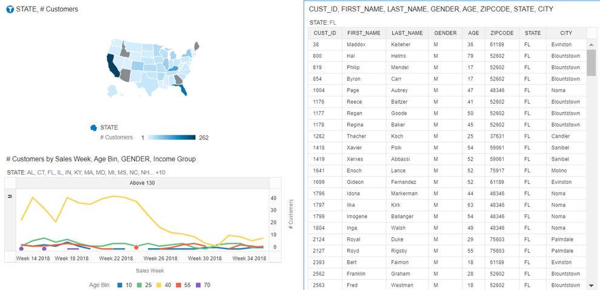

### Objectives

* Custom Binning
* Geo Maps

### Prerequisites

* An Oracle Cloud Free Tier or Paid account
* You should have completed  
    * Lab 1: Provisioning your Autonomous Database instance
    * Lab 2: Provisioning your Oracle Analytics Cloud instance
    * Lab 3: Connecting OAC to ADW and adjusting Data Set properties
    * Lab 5: Gaining Insights with Visual Data Dialog
    * Lab 6: Monitoring and Ad-hoc scaling up ADW activity for optimal OAC experience
    * Lab 7: Building simple Interactive Analysis
    * Lab 8: Mashing up additional Data Sets, Contextual Data Preparation

## Task 1: Custom Binning

Lets analyze the issue of losing customers further with the new Data Set.

1.  Delete Donut Visualization.  
Select second visualization 
Go to **Menu** and select **Delete** Visualization

    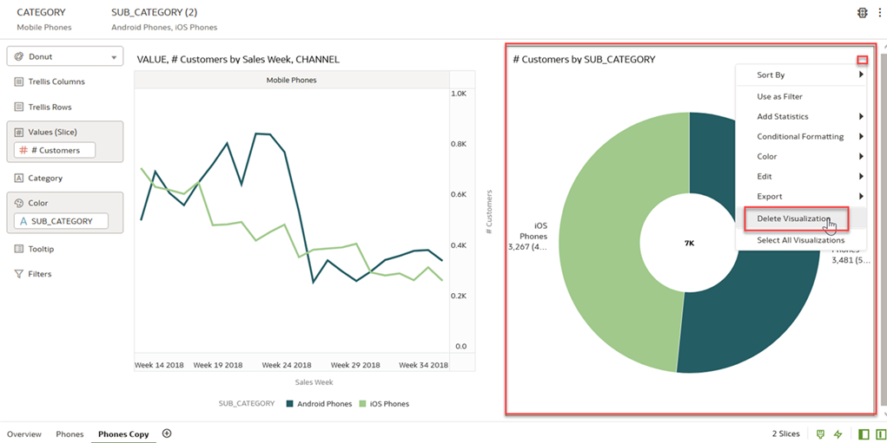

2.  Expand **Customers** Data Set.  
Select **MARITAL\_STATUS** and Drag and Drop it to **SUB\_CATEGORY**.

    

3.  Check the new visualization.  
Still difficult to interpret.

    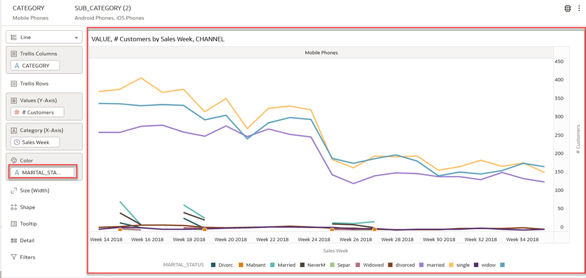

4.  Lets analyze by **Age**.  
Select **AGE** and Drag and Drop it on **MARITAL\_STATUS**. **MARITAL\_STATUS** will be replaced with **Age**.

    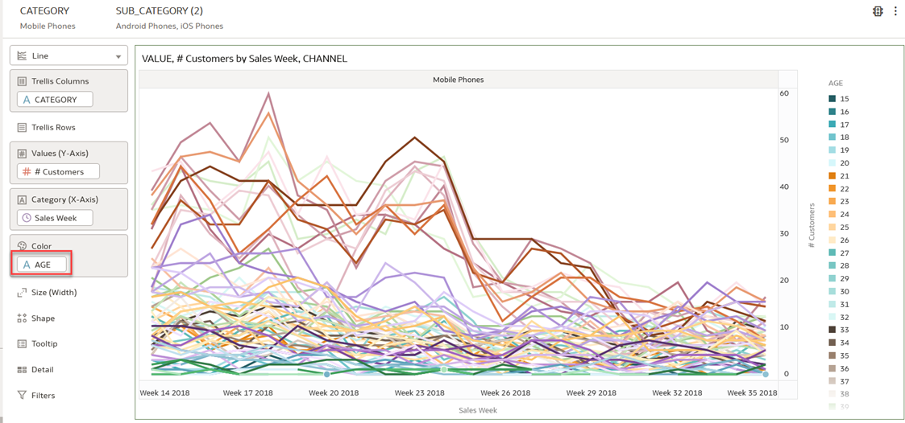

5.  It's better, but Age is too dense and we need to bin them into **age groups**.  
Creating a bin on Age column using _custom calculation_ is easy.  
In the Visualize canvas navigate to the bottom of the Data Panel, right-click **My Calculation**s, and click **Add Calculation** to open the New Calculation dialog.

    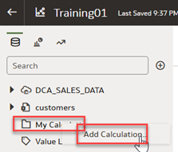

6.  **Add Calculation**.  
Enter Name **Age Bin**; In the expression builder pane, compose and edit an expression
'BIN (AGE INTO 6 BINS RETURNING RANGE_LOW)', Click **Validate**, Click **Save**.

    

7.  Replace **AGE** from Grammar Panel, Color section with the new calculated data element **Age Bin**.  
Select **Age Bin** from My Calculations Drag and Drop it to **AGE**.

    

8.  Using the new Age Bin column shows that we are losing customers in the older age group.

    

9.  Lets further analyze by **Gender** .  
Drag **GENDER** to the **Trellis Rows**.

    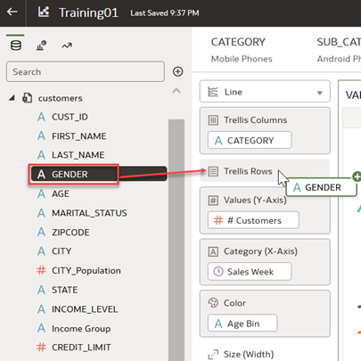

10.  Further analyzing by Gender shows that we are losing **Male** customers in the older age group.

     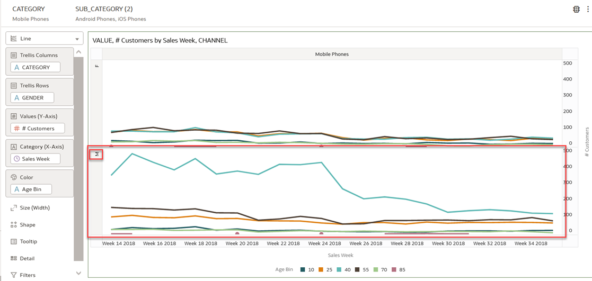

11.  Lets analyze by Income Group.  
Drag **Income Group** to **Trellis Columns**

     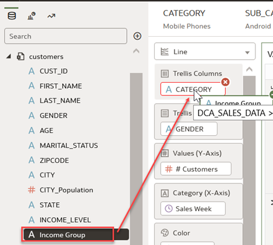

12.  You could find most of the customers from the higher Income Group.  

     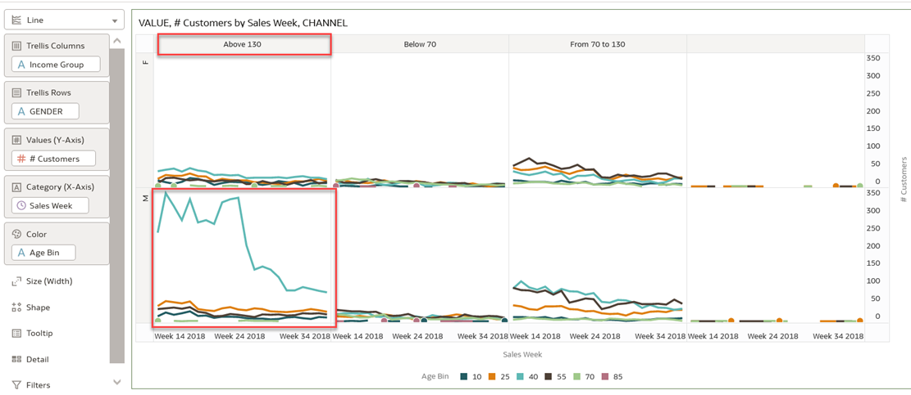

13.  Add Income Group **Filter**.  
Select **Income Group** from Data Elements Panel, Right-Click and Select **Filter**.

     

14. Select **Above 130**.  
Click **Above 130** to move to the Selections. Click anywhere in the Filter are.

     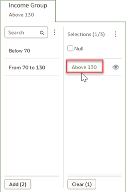

15. You could find most of the customers from the higher Income Group.

     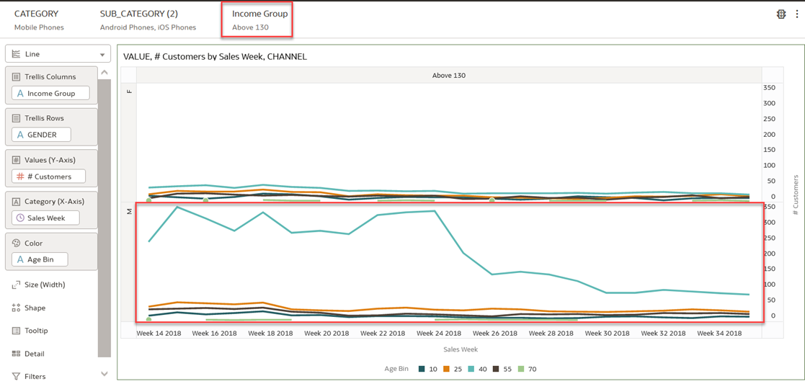

## Task 2: Geo Visual

You can use geographical information to enhance the analysis of your data
Lets create a geo visual using state and customers and use it as a filter for other visuals.

1.  Pick Visualization.  
Select **# Customers** and **STATE** from Data Elements Panel, Right Click and Select **Pick Visualization** 

    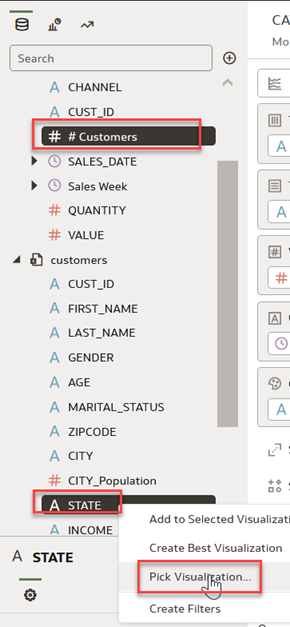

2.  Select **Map**.  

    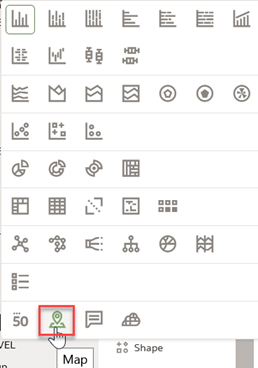

3.  Use Map Visualization as a Filter.  
Select **Map Visualization**, Right Click and Select **Use as Filter**.

    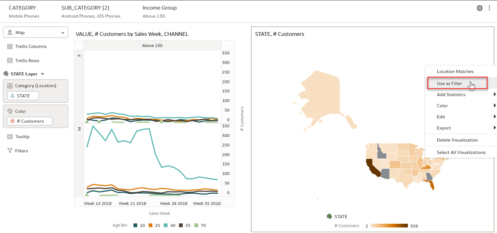

4.  Narrow down to California.  
Click on **California** State.

    

5.  Filter to **Kentucky**.  
Click on **KY** State.

    

6.  It's easy to create a custom filter by **drawing a polygon** on the map and select certain points.  
On the Visualization Toolbar, Click the **Polygon Selection** tool and drag a freehand border around the points or area you want to select on the map

    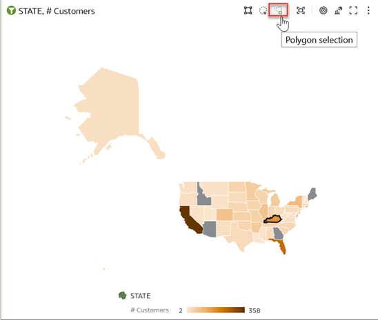

7.  Draw the Polygon as you see in the image below.

    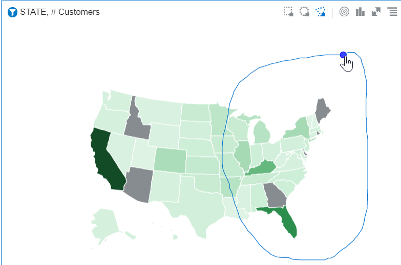

8.  Lets rename the canvas as **Demographics** and create a **Duplicate** of the canvas.  

     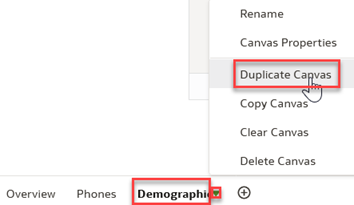

9. Add **Gender** to the **Filter**.  
Select **Gender** Drag and Drop to Filter Area.

    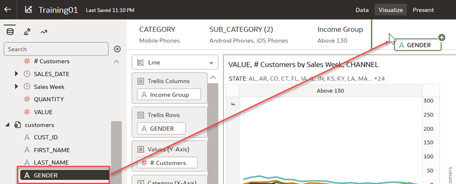

10. Select Male.  
Click **M** to move Male to the Selections and click anywhere in the Filter Area.

    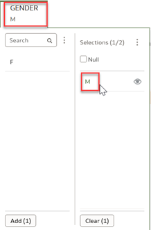

11. Move Map Visualization to the top.  
**Rearrange** a visualization on the canvas using drag and drop to a space between visualizations where you want to place it. The **target drop area** is displayed with a **blue outline**.
Select **STATE # Customers** visualization and Drag it to the top of the Canvas.

    

12. Lets create a detailed tabular report.  
Select: **CUST\_ID, FIRST\_NAME, LAST\_NAME, GENDER, AGE, ZIPCODE, CITY, STATE**, Right Click  and Select **Pick Visualization**.

    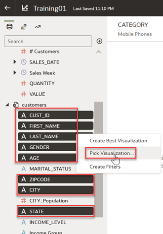

13. Select **Table**.

    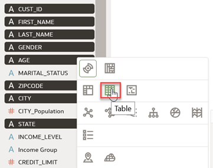

14. **Resize** viz to see all the columns.  
Resize a visualization by dragging its edges to the appropriate dimensions.

    
    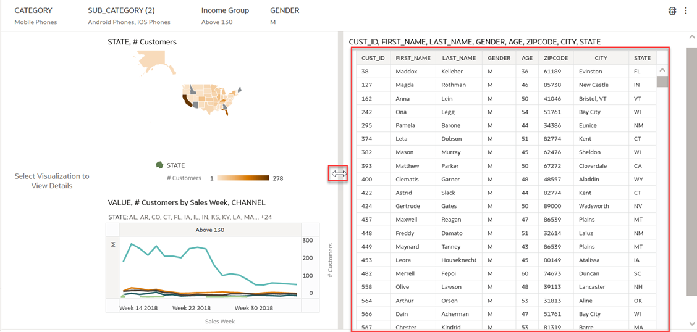

15. Switch **STATE** with **CITY**.  
Go to Grammar Panel Rows section click **STATE** and and dropping it over **CITY**.

    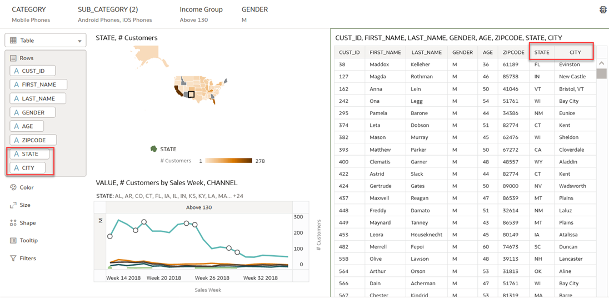

16. Use Map as a filter.  
Select the Map visualization, Right Click and Select **Use as Filter**.

    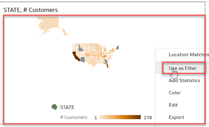

17. Filter for **Florida**.  
Click on **FL**.

    

18. Export the Table visualization.  
Select Table visualization, go to **Export** icon on top right and select **File**.

    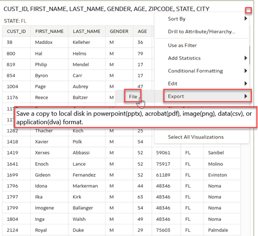

19. In the pop-up window Select **Format** as **Data (csv**).

    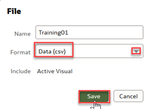

20. Check the downloaded csv file.  
Notice that it has exported the entire data from the filtered table (FL)

      
    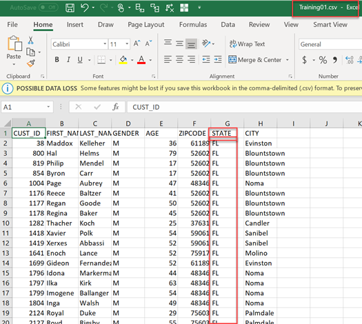

You have just finished learning about geo visualization, binning, filtering and download your data.

You may now [proceed to the next lab](#next)

## Want to Learn More?

* Free [Udemy: Modern Data Visualization with Oracle Analytics Cloud](https://www.udemy.com/augmented-analytics/), Section 5: Advanced Visualization to Generate Deeper Insights  
* [Visualize Data](https://docs.oracle.com/en/cloud/paas/analytics-cloud/acubi/visualize-data.html)

## **Acknowledgements**

- **Author** - Lucian Dinescu (Oracle Analytics Product Strategy)
- **Contributors** - 
- **Reviewed by** - Shiva Oleti (Oracle Analytics Product Strategy), Sebastien Demanche (Oracle Cloud Center of Excellence)
- **Last Updated By/Date** - Lucian Dinescu (Oracle Analytics Product Strategy), October 2021