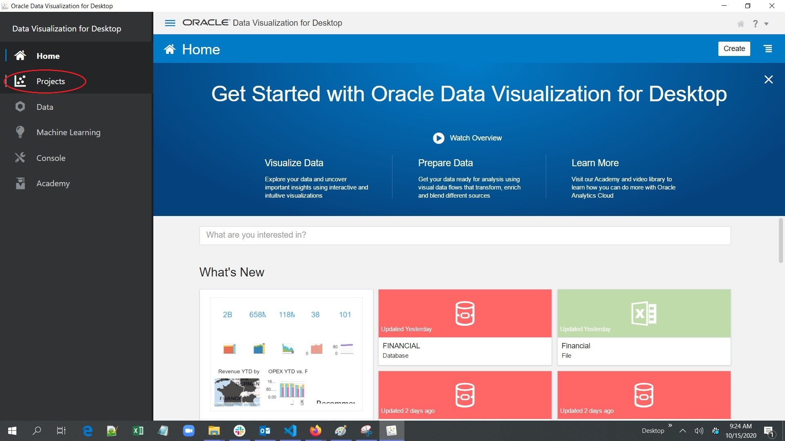
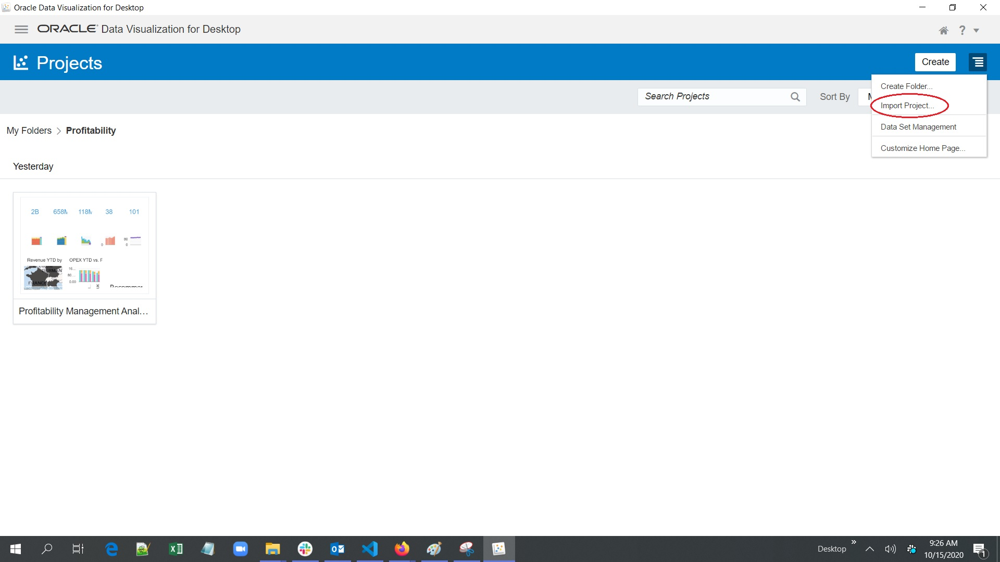
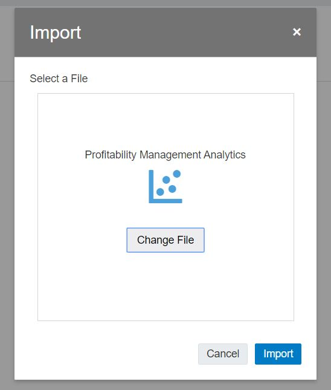
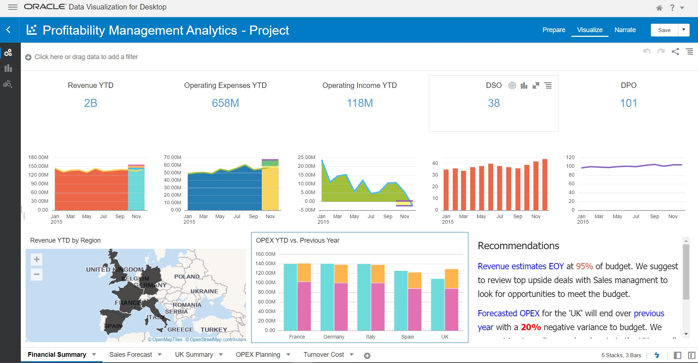
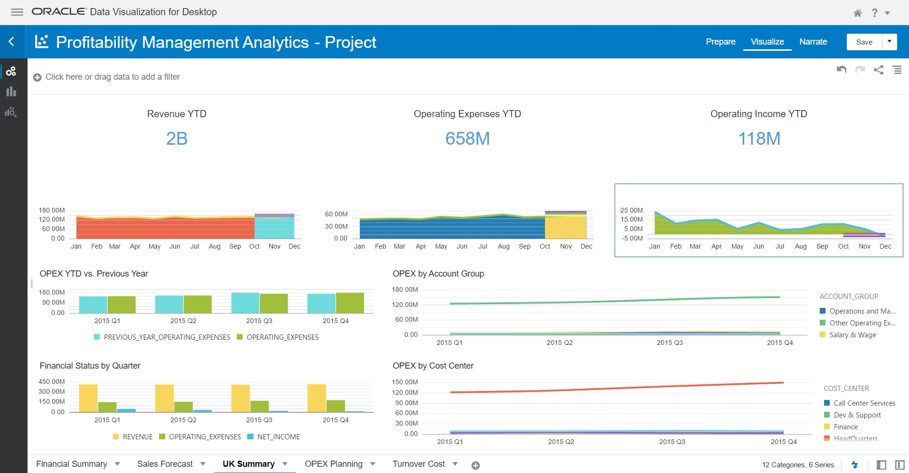
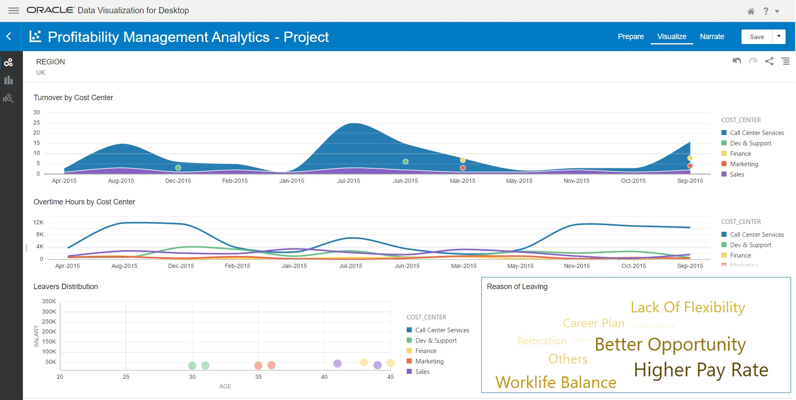

# Setup Oracle Analytics Desktop

## Introduction

In this lab, you will downlod the Oracle Analytic Desktop on local machine and connect with the Autonomous Datawarehouse. Import Project.

Estimated Lab Time: 30 minutes

### About Product/Technology
Oracle Autonomous Datawarehouse, Oracle Analytic Desktop.

### Objectives

* Learn Installation of Oracle Analytics Desktop, Create Connection to Autonomous Database and Import DV Project
 
In this lab, you will:
* Install Oracle Analytics Desktop on a Windows Desktop
* Create a Connection to Autonomous Database from Oracle Analytics Desktop
* Import Project in the Oracle Analytic Desktop

### Prerequisites

* The following lab requires an Oracle Cloud account. You may use your own cloud account, a cloud account that you obtained through a trial, a Free Tier account, a LiveLabs account or a training account whose details were given to you by an Oracle instructor. 
* Provisioning of Oracle Autonomous Database, Connecting Autonomous Database using Sql Developer

## Task 1: Install Oracle Analytics Desktop on a Windows Desktop

1.	Download the latest version of Oracle Analytics Desktop (formerly Data Visualization Desktop) from [here] (https://www.oracle.com/solutions/business-analytics/analytics-desktop/oracle-analytics-desktop.html).
2.	After saving the installer executable file, click on the installer and follow the guided steps.

## Task 2: Create a Connection to Autonomous Database from Oracle Analytics Desktop

1.	Double click on the Data Visualization Desktop icon on local desktop. You will be redirected to the following page, which is the Data Visualization welcome page:

2.	In the left hand side you will find the Analytics Cloud menu (click the hanburger menu) with the following options:

•	Home: easy access to manage your connections, view existing data sets, projects and data flows. 
•	Projects: you can manage folders and projects from this section. 
•	Data: displays all the datasets, connections, dataflows and sequences. 
•	Machine Learning: manage and inspect the models that you have created. 
•	Console: add/edit map layers, jobs, administer users and roles, manage snapshots, connections and configure mail settings. 
•	Academy: useful resources for getting started. 

3.	Connecting to the database and preparing the data. Begin by creating a new Data Set to retrieve our data. Let’s connect to the Data Warehouse. As this is a fresh instance, we do not have any Data Sets nor Data Connections available for now, so we will create them. Click Data Set

4.	To connect to a database, click Create Connection. 

5.	Next, select the Oracle Autonomous Data Warehouse Cloud connection from the list.

6.	For creating a connection to ADWC:

7.	Once the connection is created successfully, the tables that you have uploaded will be available in the ADMIN schema. 

8.	Select the ADMIN schema and first, select your Profitability related file.

## Task 3: Import Project in the Oracle Analytic Desktop

1. Download the project file. Download the [Project file](files/ProfitabilityManagementAnalytics.dva).
2. Open the Project and import the project in the Oracle Analytic Destop
   
   
   
3. In the About Step 2. The Database connection is created in points 6,7,8.
4. Open the project. 
5. View the visualizations
   
   
   
   
   
   
You may proceed to the next lab.

## Learn More

## Acknowledgements
* **Author** - <Name, Title, Group>
* **Adapted for Cloud by** -  <Name, Group> -- optional
* **Last Updated By/Date** - <Name, Group, Month Year>
* **Workshop (or Lab) Expiry Date** - <Month Year> -- optional, use this when you are using a Pre-Authorized Request (PAR) URL to an object in Oracle Object Store.

## See an issue?
Please submit feedback using this [form](https://apexapps.oracle.com/pls/apex/f?p=133:1:::::P1_FEEDBACK:1). Please include the *workshop name*, *lab* and *step* in your request.  If you don't see the workshop name listed, please enter it manually. If you would like for us to follow up with you, enter your email in the *Feedback Comments* section.
