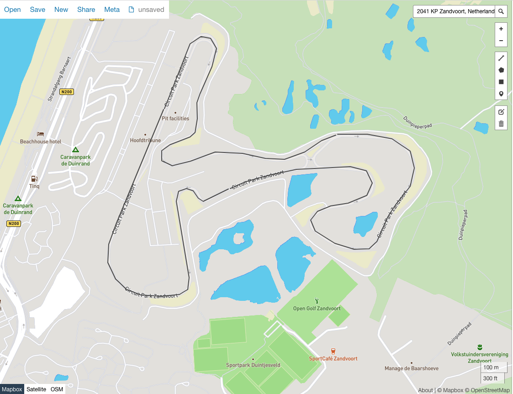
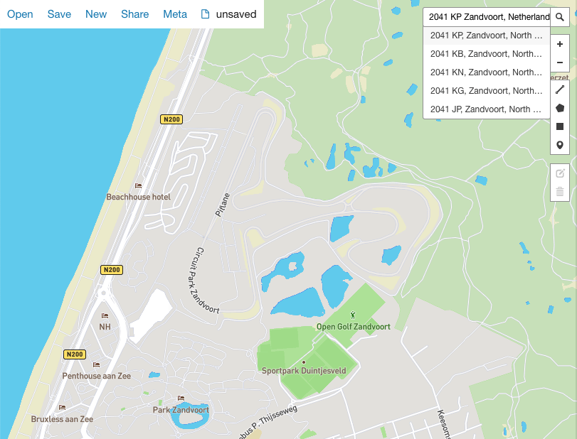
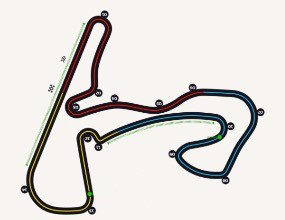
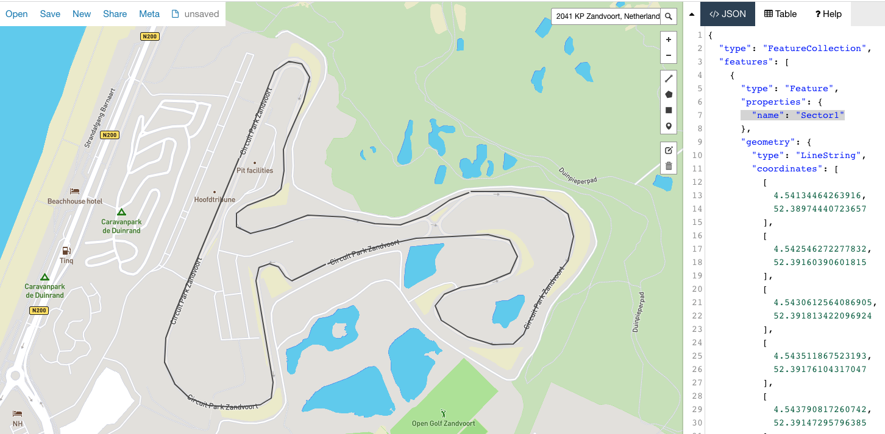
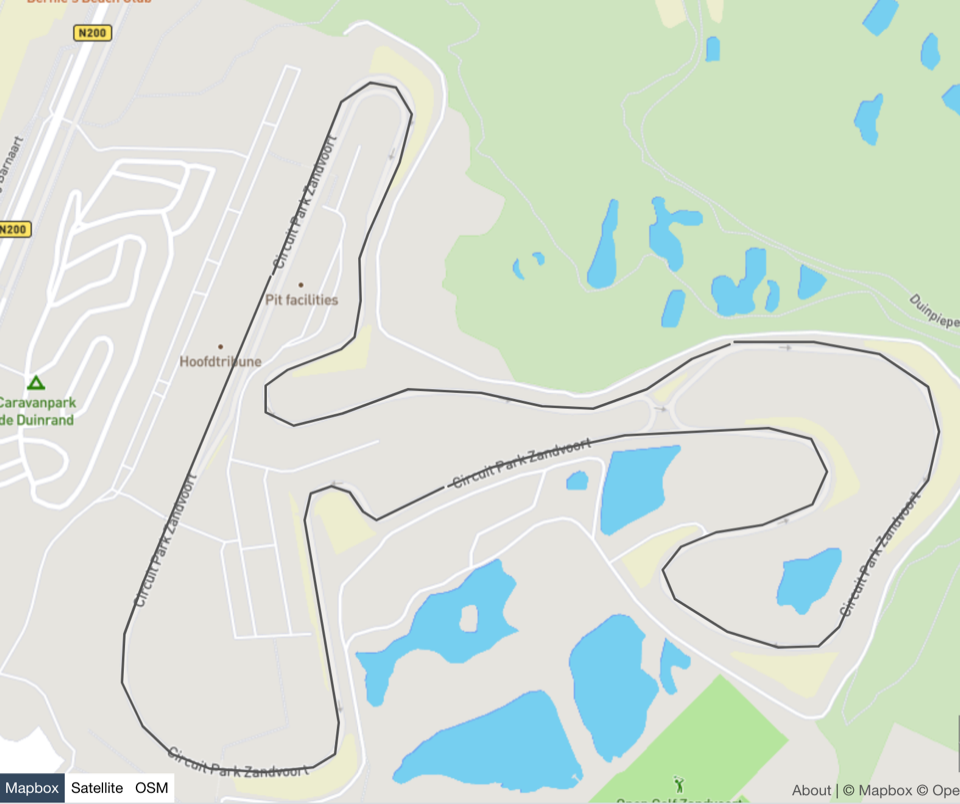
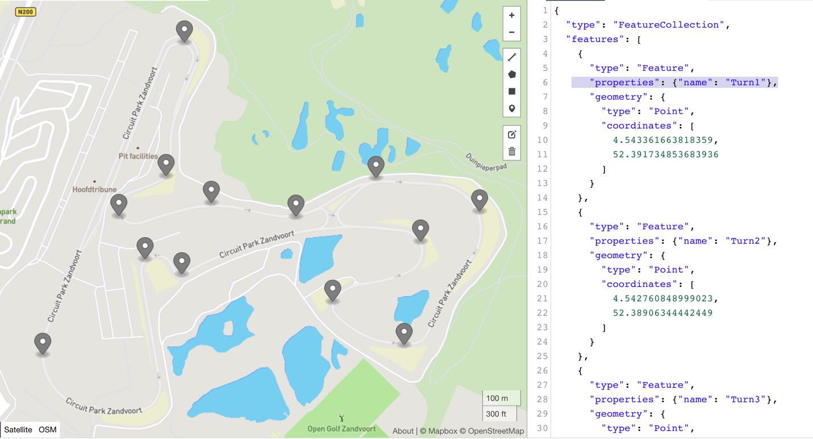

# Build your GeoJSON LineStrings and Points

## Introduction 

In this exercise, you will generate GeoJSON code and see how easy it is create map layers in OAC with it. There are many ways to generate GeoJSON code and https://geojson.io/ is just one open-source option.

_Estimated time:_ 20 minutes



### Objectives

In this lab, you will:

- Build LineString and Points using GeoJSON

- Modify the GeoJSON with properties needed in OAC

### Prerequisites

This lab assumes you have:

- Use of a GeoJSON code generation tool or can browse to https://geojson.io/

## Task 1: Create LineStrings that represent sectors of Circuit Zandvoort

1. Go to <https://geojson.io/>

2. Search for your location, in this instance we will search for “2041 KP Zandvoort, Netherlands”.

    

    > **Note:** Use the [Circuit
Zandvoort](https://www.formula1.com/en/racing/2021/Netherlands/Circuit.html) layout to find your three sectors, colored red (sector 1), blue (sector 2), and yellow (sector 3).

     You will use the line tool to draw each sector     
     

3. Start drawing your first LineString of sector 1, the red sector, by choosing the polyline option

      

    Your JSON code will contain a top level FeatureCollection and  multiple Features nested below it. Add a “name”:”\[unique name\]” to each “LineString” property.  

    **CODE SNIPPIT:**  
     **Before**
    ```
    <copy>
     {

     "type": "FeatureCollection",

      "features": \[

      {

     "type": "Feature",

     "properties": {},
 
     "geometry": {

     "type": "LineString",

     "coordinates": \[
    </copy>
    ```

    **After**
     ```
     <copy>
    {

     "type": "FeatureCollection",

     "features": \[

     {

     "type": "Feature",

     "properties": {"name": "Sector1"},

     "geometry": {

     "type": "LineString",

     "coordinates": \[
    </copy>
     ```

    


4. Draw the two remaining LineStrings for sector 2 and sector 3 to complete the circuit.

    

5. Choose **Save**, **GeoJSON** to export the file.

    > **Note:** properties cannot be empty. You must add a unique value for each property. Example: change the syntax of “properties": {} to “properties": {"name": "Sector1"} for each “LineString” for the file to successfully upload as a map layer in OAC.

    

6. Rename the file to the map layer name. example: _Circuit Zandvoort Sectors.geojson_

## Task 2: Create Points that represent turns on Circuit Zandvoort

1. Go to <https://geojson.io/>

2. Search for “2041 KP Zandvoort, Netherlands”  and start with a blank file.

    > **Note:** Use the [Circuit Zandvoort](https://www.formula1.com/en/racing/2021/Netherlands/Circuit.html) layout to find each turn. You will find turns labeled 1-14.

3. Create a GeoJSON file with Points using the “**Draw a Marker**” option. Add the 14 turns to your map.

      
    

4. Add unique values for each properties option. In this example you will have 14 lines you update.

5. Choose **Save**, **GeoJSON** to export the file.

    > **Note:** you must add a unique properties value to each “Point” for the
file to successfully upload as a map layer in OAC.

    

6. **Rename** the file to the map layer name.

7. Please find an example of the geojson files:
- [Zandvoort Sector LineString.geojson](https://objectstorage.us-ashburn-1.oraclecloud.com/p/a4JySgQvO_jUFX7Z9pOWPWKAgSs5BqweobA8kdxV3W_oqs-pAFiAJVOheNtAQ17x/n/idbwmyplhk4t/b/RedBullRacing-HondaWin/o/Zandvoort%20Sector%20LineString.geojson)
- [Zandvoort Sector Point.geojson](https://objectstorage.us-ashburn-1.oraclecloud.com/p/33Bt4LPdlJvJRtuLnHOAymQ8SitN46quzbHlFHOTgY9w_5YMUeEPY6npOXlaS_5C/n/idbwmyplhk4t/b/RedBullRacing-HondaWin/o/Zandvoort%20Sector%20Point.geojson)

Congratulations on completing this lab!

You may now *proceed to the next lab*.

## **Acknowledgements**

- **Author** - Carrie Nielsen (Oracle Analytics Product Strategy Director)
- **Contributors** - Lucian Dinescu (Oracle Analytics Product Strategy)
- **Last Updated By/Date** - Lucian Dinescu (Oracle Analytics Product Strategy), October 2021)
