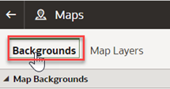
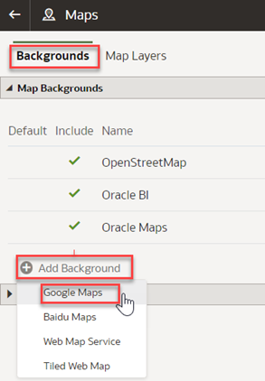
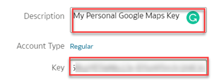
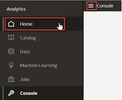
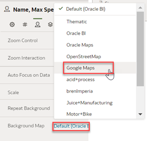
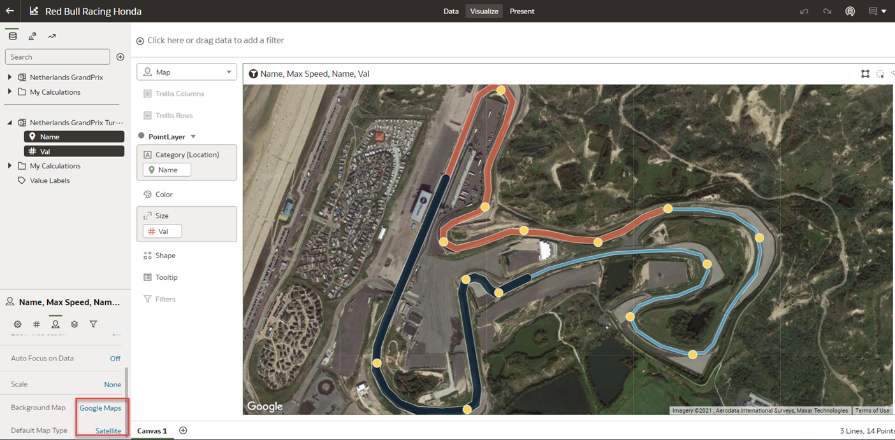

# Configure Google maps as a map background

## Introduction

Oracle Analytics Cloud supports a variety of different [map backgrounds](https://docs.oracle.com/en/cloud/paas/analytics-cloud/acubi/apply-map-backgrounds-and-map-layers-enhance-visualizations.html#GUID-C0851CD0-0DD4-45E7-B378-195796327370)
including Google, Baidu, WMS, and XYZ Tiled Web Maps.

To use Google Maps tiles, you must obtain a Google Maps API access key from Google. Google prompts you to enter your Maps API access key and, when applicable, your Google “Client ID”. Usage of the tiles must meet the terms of service specified by Google in the [Google Developers Site Terms of
Service](https://docs.oracle.com/pls/topic/lookup?ctx=en/cloud/paas/analytics-cloud/acubi&id=google-dev-terms).

_Estimated Time:_ 5 minutes

### Objectives

In this lab, you will:

- Configure and add Google Maps Background
###  Prerequisites

This lab assumes:

- An Oracle Free Tier, Always Free, Paid or Live Labs Cloud Account
- Provisioned Oracle Analytics Cloud
- All previous labs successfully complete
- You meet the terms of service specified by Google in the [Google Developers Site Terms of Service](https://docs.oracle.com/pls/topic/lookup?ctx=en/cloud/paas/analytics-cloud/acubi&id=google-dev-terms).
- Have a client ID or are able to generate a google
- Access to the console of OAC ("*BI Service Administrator Role*" Application Role)  

## Task 1: Google Developer API Key

1. Please find the [documentation](https://developers.google.com/maps/documentation/javascript/get-api-key) for API Keys 

## Task 2: Configure your Map background

1. Select the triple bar icon (**Navigator**)

    

2. Select **Console**  

    

3. Select **Maps**  

    

4. Select **Backgrounds**

    

5. **Add Background** and select **Google Maps**

    

6. Enter a **Description** for this Map Background. Including the map type in the description will ensure users know which type of background they
are selecting when creating maps.  
Enter your client **Key** or the generated one from Task 1.

    

7. Set the Default Map Type to **Satellite.** and click **Save** to add your Map Background to OAC

    

8. Click **Go Back** arrow from top left

    

9. Click **Navigator** and select **Home**

    

## Task 3: Change your map background to be a satellite view  
Let’s go change the background type to our **Background Map**.  
Open OAC to the workbook state where we ended in Lab 4.

1. Select the **Map** option and scroll down until you see the **Background Map** setting.

    

2. Choose the **Google Maps** background created from Task 2 above.

    

3. Your visualization should look like

    

Congratulations on completing this workshop!

## **Acknowledgements**

- **Author** - Carrie Nielsen (Oracle Analytics Product Strategy Director)
- **Contributors** - Lucian Dinescu (Oracle Analytics Product Strategy)
- **Last Updated By/Date** - Lucian Dinescu (Oracle Analytics Product Strategy), October 2021