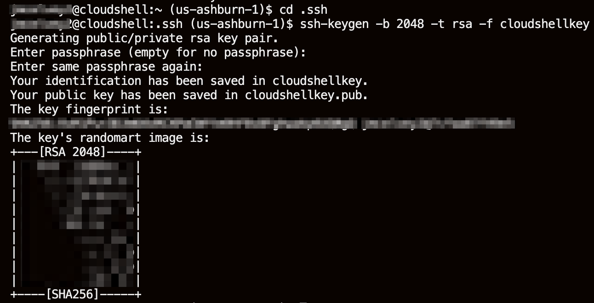

# Create SSH keys using Oracle Cloud shell

## Introduction

The SSH (Secure Shell) protocol is a method for secure remote login from one computer to another. SSH enables secure system administration and file transfers over insecure networks using encryption to secure the connections between endpoints. SSH keys are an important part of securely accessing Oracle Cloud Infrastructure compute instances in the cloud.

We recommend you use the *Oracle Cloud Shell* to interface with the OCI compute instance you will create. Oracle Cloud Shell is browser-based, does not require installation or configuration of software on your laptop, and works independently of your network setup.

*IMPORTANT:  If the SSH key is not created correctly, you will not be able to connect to your environment and will get errors.  Please ensure you create your key properly.*

Watch the video below for an overview of the lab.
[Lab overview](youtube:oq2Hk1Yy9Cg)

Estimated Time: 5 minutes

### Objectives
In this lab, you will:
- Generate SSH keys using Oracle cloud shell
- List content of the public key

### Prerequisites
* An Oracle Cloud Account - please view this workshop's LiveLabs landing page to see which environments are supported.

### About Oracle Cloud Shell

The Cloud Shell machine is a small virtual machine running a Bash shell which you access through the OCI Console (Homepage). Cloud Shell comes with a pre-authenticated OCI CLI (Command Line Interface), set to the Console tenancy home page region, as well as up-to-date tools and utilities. To use the Cloud Shell machine, your tenancy administrator must grant the required IAM (Identity and Access Management) policy.

## Task 1: Generate SSH Keys

1.  To start the Oracle Cloud shell, go to your Cloud console and click the cloud shell icon at the top right of the page.

    

    

    

2.  Once the cloud shell has started, enter the following commands. Choose the key name you can remember. This will be the keyname you will use to connect to any compute instances you create. Press Enter twice for no passphrase.

    ````
    <copy>mkdir .ssh</copy>
    ````
    

    ````
    <copy>cd .ssh
    ssh-keygen -b 2048 -t rsa -f cloudshellkey</copy>
    ````
    *We recommend using the name cloudshellkey for your keyname but feel free to use the name of choice.*

    

3.  Examine the two files that you just created.

    ````
    <copy>ls</copy>
    ````

    

    >**Note:** In the output, there are two files, a *private key:* `cloudshellkey` and a *public key:* `cloudshellkey.pub`. Keep the private key safe and don't share its content with anyone. The public key will be needed for various activities and can be uploaded to certain systems as well as copied and pasted to facilitate secure communications in the cloud.

4. To list the contents of the public key, use the cat command:
     ```
    <copy>cat cloudshellkey.pub</copy>
     ```

    >**Note:** The angle brackets <<>> should not appear in your code.

    

5.  Copy the contents of the public key and save it somewhere for later. When pasting the key into the compute instance in future labs, make sure that you remove any hard returns that may have been added when copying. *The .pub key should be one line.*

    

You may now **proceed to the next lab**.

## Acknowledgements
* **Author** - Dan Kingsley, Enablement Specialist, OSPA
* **Contributors** - Jaden McElvey, Kamryn Vinson, Arabella Yao
* **Last Updated By/Date** - Arabella Yao, Product Manager, Database Product Management, May 2022