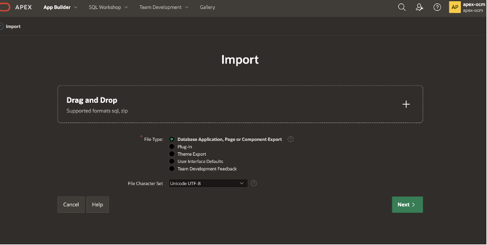
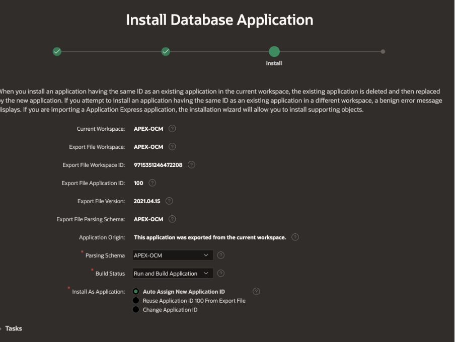
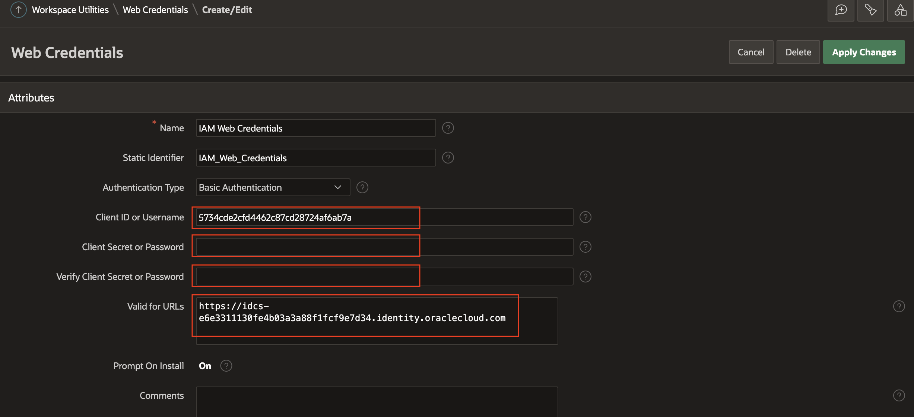
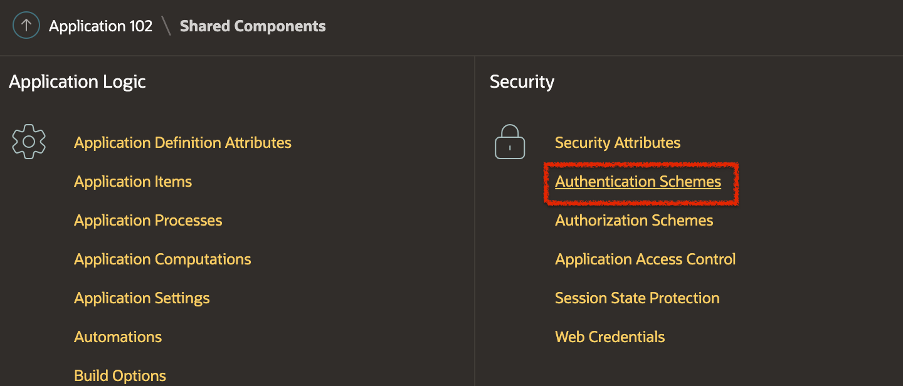
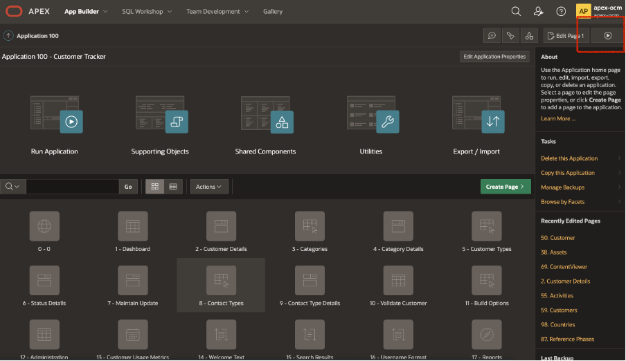
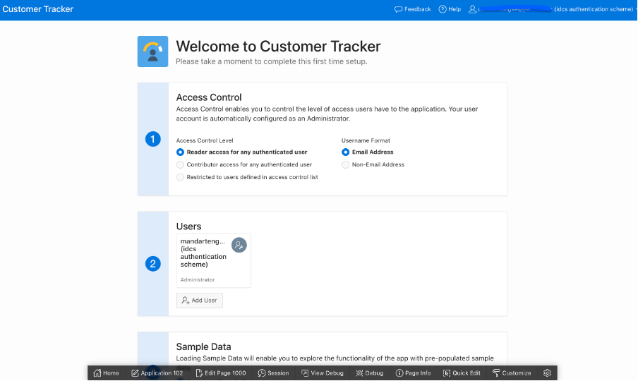
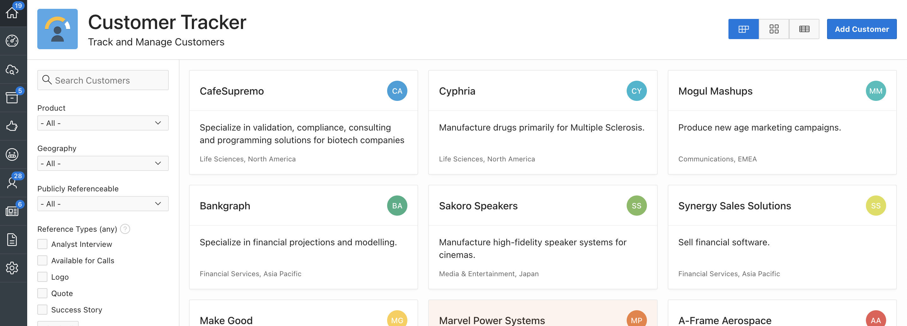

# Setup Oracle APEX application

## Introduction

In this lab we will import sample APEX application **Customer Tracker** and configure Single Sign-on using IAM.

Estimated Lab Time: 10 minutes

### Objectives

In this lab, you will:
* Import Sample APEX application
* Create IAM app for SSO
* Configure SSO Security
* Verify Sample Application

### Prerequisites

This lab assumes you have:
* An Oracle account
* All previous labs successfully completed

## Task 1: Import Customer Tracker sample application

1.	Select “Import” from the option available on home page after login

	

2. Drag & drop the Apex application file **CustomerTracker.zip**  and click **Next**. Choose file type as **Database Application, Page or Component Export**

  

3.	Screen will show you **File Import Confirmation** stage, just click **Next**

4.	In next stage of **Install Database Application** , choose **Reuse Application ID 100 from Export file** for Install as Application. (We are reusing application ID so that you can refer the application URL as is at other places in the document. If you already have application and you can choose “Auto Assign Application ID. In that case remember to change Application id in URL where it’s referred)
  
    

5.	Finally click **Install Application** and wait for next screen

6.	Keep Clicking **Next** till you get last button with **Install**
 
  

7. You will get below confirmation scree.
  
    

8. Click **Edit Application** to complete this lab
    

## Task 2: Create IAM application for SSO

1.	Naviage to IAM **Default** Domain page (Refer Lab 1 – Task 2.2)

2.	Navigate to **Applications** from left side menu
  
    

3.	Click  **Add application** to create new application

4.	Select **Confidential Application** from the list

5.	In the “App Detail” section, enter below details
    * **Name** : Apex Customer Tracker
    * **Description** : APEX Sign in for Customer Tracker App
    * **Application URL** : <paste your APEX application URL> like https://&lt;your-instance-specific-value&gt;.oraclecloudapps.com/ords/f?p=100

    *(**Note**: p=100 if you are assigning the same App ID while importing the app, otherwise provide the app if of your APEX application.)*

6.	Click **Next**

7.	Select **Configure this application as a client now**

8.	In the Authorization section complete the following:
    *	Allowed Grant Types: check "Authorization Code”
    * Redirect URL: https://&lt;your-instance-specific-value&gt;.oraclecloudapps.com/ords/apex_authentication.callback
    * Logout URL : Leave blank
    * Post Logout Redirect URL : https://&lt;your-instance-speicifc-value&gt;.oraclecloudapps.com/ords/f?p=100

9.	Click **Next**

10.	Click **Finish** 

11. Wait for page to redirect to application detail page, click **Activate** button at the top.

12. Click **Actiavte application** on confirmation popup

13.	Scroll to **General Information** to copy **Client ID** and **Client Secret** and save for later.

14.	This complete the creation of IAM application.

## Task 3: Configure APEX App security for SSO

1.	Login to APEX and click **App builder** icon . You will see the application (Customer Tracker) which was created in earlier lab. Click the application name.

2.	Click **Share Components**

  

3.	Click **Web Credentials** under **Security**

  

4.	Click **IAM Web Credentials**

  

5.	Provide Client ID & Client Secret which you got ing previous Task (step 13) and put the **Domain URL** in Valid for URLs *(do not include port number :443)*. You can refer to Lab1- Task 2.3 for **Domain URL**

6.	Click **Apply Change**

7.	Go back to **Share Component** by clicking 

8. Select **Authentication Schemes**

  

8.	Click **IAM Authentication Scheme – Current** and then click **Show All**

9.	Change below fields (You can refer to Lab1- Task 2.3 for **Domain URL**)
      * Settings > Discovery URL : https://&lt; Domain URL &gt;/.well-known/openid-configuration
      * Post-Logout URL > Go To URL : https://&lt;your-apex-url&gt;.oraclecloudapps.com/ords/f?p=100

10.	Click **Apply Changes**

## Task 4: Login & verify IAM integration

1.	Login to APEX application & click **App Builder** icon.

2.	Click **Customer Tracker** application from the list of applications

3.	Click  icon from the top right side of the page as shown below

  

4.	You will see page asking authorization, grant permission. 

5. You will see the dashboard without any data.
    
  

5. Click Home icon at top left corner and you will see below configuration page.

  

6.	Click **Complete Setup** button at the bottom of page. This should take you to Customer Tracker application’s dashboard page.

  

## Summary

This completes this lab. At this point, you know how to import sample application and configure Single Sign-on. Click on **Lab 7: Integrate OCM & APEX** to integrate both application & access content from APEX.

## Learn More

*(optional - include links to docs, white papers, blogs, etc)*

* [Oracle APEX Documentation](https://apex.oracle.com/en/learn/documentation/)

## Acknowledgements
* **Author** - Vinay Kumar, Director - Product Management, Oracle Content Management
* **Last Updated By/Date** - Vinay Kumar, Feb 2022
