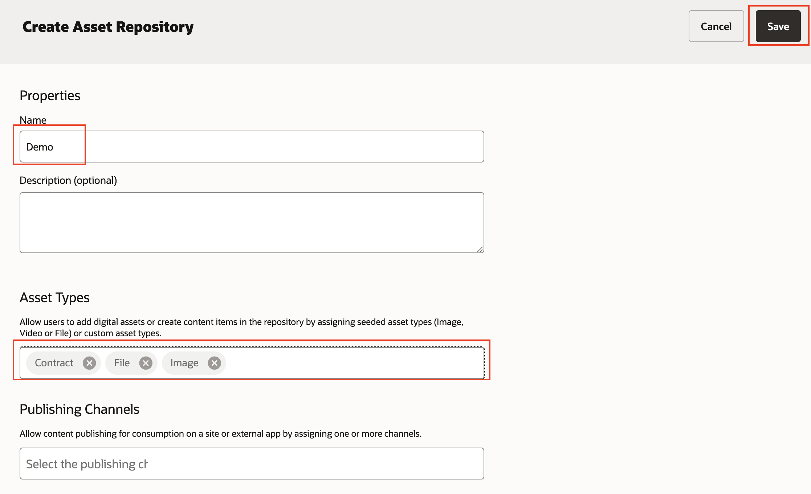

# Setup content repository

## Introduction
In this session we will setup Content repository where all content will be stored and managed. We will also define content structure with meta-data to store data along with file. At last we will provide access to IAM app which was create in *Lab 1*.

Estimated Time: 10 minutes

### Background

Oracle Content Management's content management structure starts with repositories. A repository is a storage location for assets that you need for building web, mobile, or other user experiences in your organization. An asset can be a content item that represents an individual piece of content, such as a blog post, case study, or product information; or a digital asset that represents an image, video, or other type of media that you need in your experiences.

### Objectives

In this lab, you will:

* Create Custom Digital Asset type
* Create Asset Repository
* Add members to Repository

## **Task 1**: Create Custom Digital Asset Type

We need to have Custom Digital Asset type “Contract” with meta-data to capture document & meta-data.

1. Login to your OCM instance. Refer to Task 1 – Step 9 to find instance URL.

2. Navigate to left side menu ADMINISTRATION and then click Content

      

3. Click the drop-down menu below the header and select **Asset Types** as shown below

      

4. Click **Create** button on right top area to create asset type
   
      

5. In the create Asset type form, enter below details
      * **Name**: Contract
      * **Display Name**: Contract
      * **Choose asset type**: Select “Create a Digital Asset Type”
      
      

6. Click **Create** ,this will open the form to provide more detail about asset type.

7. Under **Media Type** Tab:
   Search for “pdf” and select **pdf(application/pdf)**. Click **Add** button to add support for this file type. You can include more than one file types based on requirement so that your Asset type will only accept document of listed file types only.

   

8. Navigate to **Definition** Tab:
   Drag **Text** data field from left side to **Digital Asset Type** Definition region.
   Enter below details on **Text Settings** form
      * Name: Contract Name
      * Number of data fields value: Single Value \* This field is required to have content: Checked

      

9. Click **Next** and then **OK**

10. Repeat the above step by dragging another data field as below

  | Data Field  | Name | Required |
  | --- | --- | --- |
  | Text | Party Name | No  |
  | Date | Expiry Date | No |
  | Boolean | Auto Renewal | No |

11. Click **Save** from top right and we are done with creating Custom Digital Asset type.
   
   

## **Task 2**: Create Asset repository

   We will create Asset repository to manage all our content for this lab.

1. Navigate to vertical menu **ADMINISTRATION** and then click **Content**
   
      

2. Click **Create**

3. Enter below details into “Create Asset Repository” form
      * Name: Demo
      * Asset Type: Select Contract (which was created as part of Task 1), File & Image.
   

4. Click **Save** from top right corner and this will create the required repository.

## **Task 3**: Grant access on repository to IAM App

1. Select the Demo asset repository and click Member menu from top section as shown below

   

2. Search for Application name **OCM-APEX Integration**  which you created earlier in Lab 1 – Task 3. Select **Role** as **Manager** and click **ADD**
   
   

3.	Finally click **Done** to close window.

## Summary

This completes this lab. At this point, you know how to define Custom Digital Asset type, create Asset repository & assign member. You may now **proceed to the next lab**.

## Learn More

* [Content Management Key Concepts](https://docs.oracle.com/en/cloud/paas/content-cloud/managing-assets/key-concepts.html)

## Acknowledgements

* **Author** - Vinay Kumar, Director - Product Management, Oracle Content Management
* **Last Updated By/Date** - Vinay Kumar, Feb 2022
