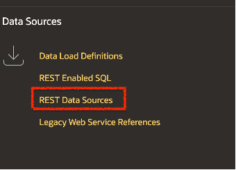
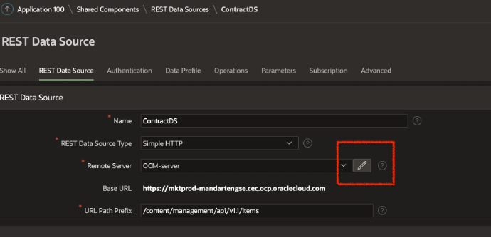
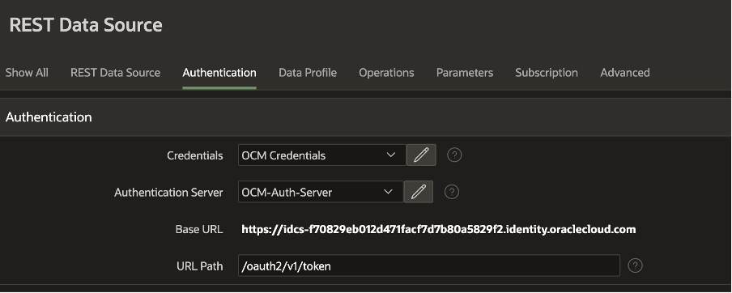
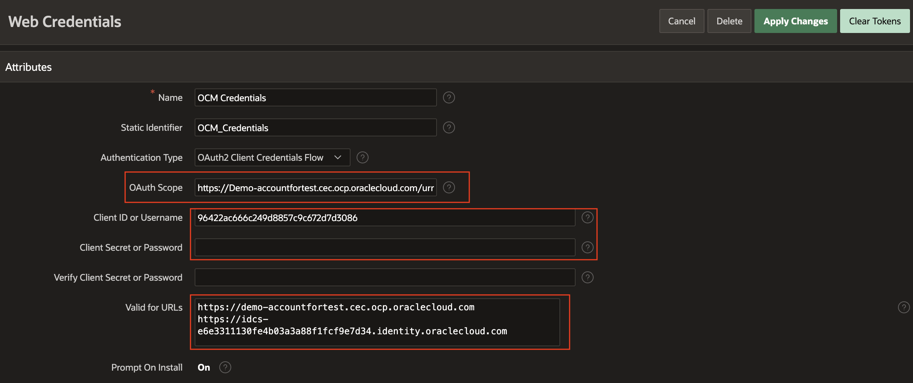
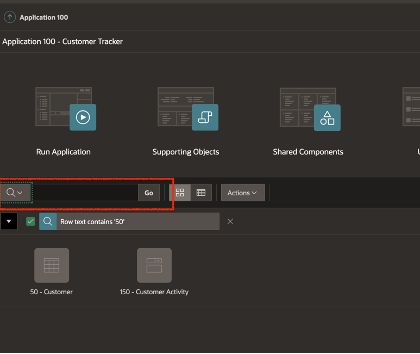
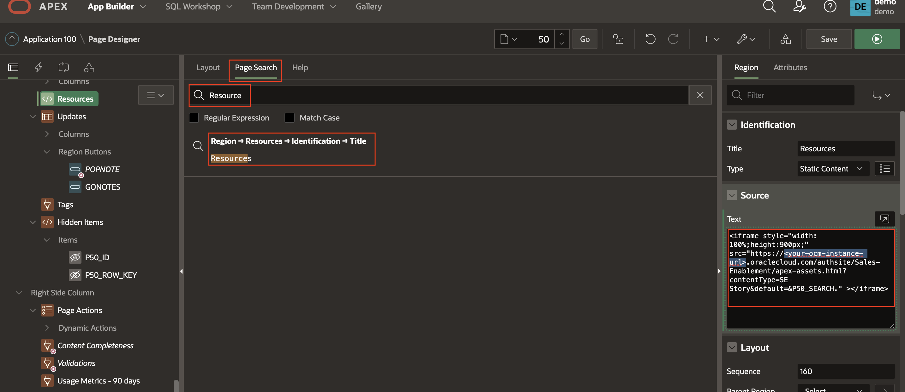
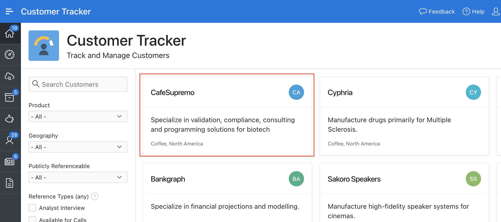
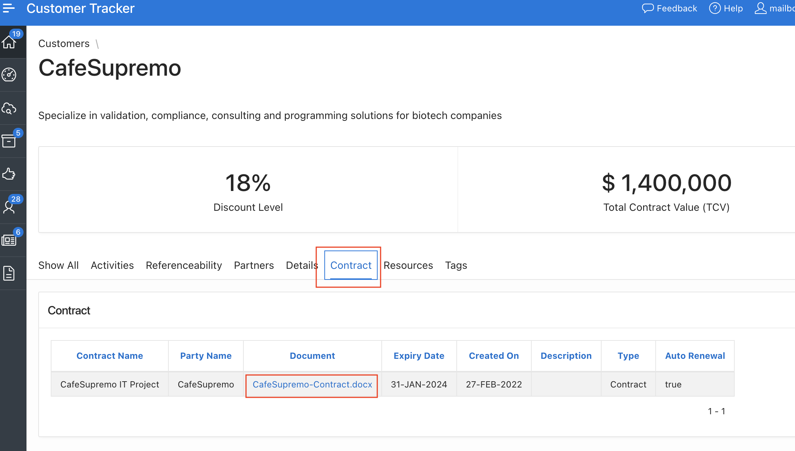
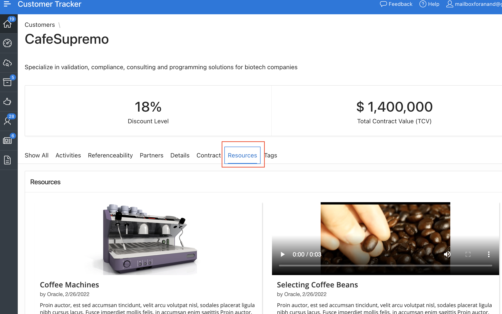

# Integrate OCM & APEX

## Introduction

By now you have both Oracle Content Management & Oracle APEX application running, in this lab you will change the configure to experience the integration between two system. There are two mode of integration explained,  one is using REST API and another is by embedding the OCM interface within APEX.

Estimated Time: 20 minutes

### Objectives

In this lab, you will:
* Configure Web Credentials
* Change OCM Endpoint URL
* Run end-to-end demonstration

## Task 1: Configure OCM REST API web credentials

(optional) Step 1 opening paragraph.

1.	Login to APEX and click **App Builder** Icon. Click **Customer Tracker** from the list of application.

2.	Click **Shared Components** icon and then click **Rest Data Source**s under Data source section as shown below

    

3.	Click **ContractDS** REST data source

4.	Click Edit pencil icon as highlighted in below screen

    

5.	Change value of **Endpoint URL** to your Oracle Content Management Instance URL. (Refer Lab 1 - Task 1.9 for OCM instance URL)

6.	Click **Apply Changes**

7.	Click **Authentication** tab
  
    

8. Click Edit pencil icon for **Credentials**
  Change below attributes
    * OAuth Scop: Refer Lab 1- Task 2.18
    * Client ID : Refer from Lab 1- Task 2.17
    * Client Secret : Refer from Lab 1- Task 2.17
    * Valid for URLS: Add your OCM Instance URL (Refer Lab 1 - Task 1.9) and Domain URL (Refer Lab 1 - Task 2.2)

    *Note: Add each url in new line, do not user comma or any other character as seperator*

    

9. Click **Apply Changes**

10. Click **Edit** pencil icon for **Authentication Server**
Change below attributes
    * Endpoint URL : Provide Domain url from Lab 1 -Task 2.2
    * HTTPS Host name : Provide domain URL again but do not prefix with http or https

11. Click **Apply Changes**

## Task 2: Change Embed content URL

1.	Login to APEX and click **App Builder** Icon. Click **Customer Tracker** from the list of application.

2.	Use search box and search for **50** as shown below
  
    

3.	Click “50-Customer” , this will open the page.

4.	Search for “Resource” within page search box as shown below
    
    

5.	Click the search result **Region->Resources->Identification->Title**

6.	Replace the above highlighted URL above under Source->Text with your Site URL which was created in Lab 5- Task 4.7

7.	Click “Save” and then run the application.

## Task 3 : Allow Cross Origin Resource Sharing (CORS)

1. Login to IAM and Navigate to **Session Settings** under **Settings** 

  

2. Navigate to **Session Settings** and scroll down to **Data sharing settings**

3. Provide APEX instance domain name within **Allowed CORS Domain Names**. For example https://&lt;your-instance-specific&gt;.**oraclecloudapps.com**

  

4. Click **Save changes**

## Task 4: Allow OCM embedding within APEX

1. Naviage to **Defaul** Domain and then **Settings**

  

2. Select Radio option **Enabled**

  

3. Add domain name of APEX application under **Allowed Domains** .For example https://&lt;your-instance-specific&gt;.**oraclecloudapps.com**

4. Click **Save**

## Task 5: Run end-to-end demonstration

1.	Login to Customer Tracker application go to dashboard page.

2.	Click the customer name **Cafe Supremo**

  

3.	Click the **Contract** tab, it will show you all the contract for customer coming from OCM using REST API

  

4. Click the Document name, it will allow you to preview document within browser.

5.	Click the **Resources** tab, it will show you the content from Site as Embedded content
 
   

   *Note: Content are filtered based on Customer Industry, for example Cafe Supremo belong to industry Coffee and that's why you will see the content with keyword Coffee. You can change the query criteria based on your requirement.*

5.	This complete end to end integration of OCM & APEX application.

## Learn More

* [OCM API Documentation](https://docs.oracle.com/en/cloud/paas/content-cloud/apisdk.html)
* [Embed User Interface](https://docs.oracle.com/en/cloud/paas/content-cloud/solutions/embed-web-user-interface-other-applications.html)

## Acknowledgements
* **Author** - Vinay Kumar, Director - Product Management, Oracle Content Management
* **Last Updated By/Date** - Vinay Kumar, Feb 2022
