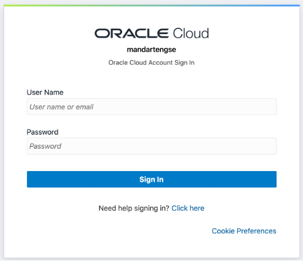

# Provision an Instance

## Introduction

This lab walks you through the process of provisioning an instance of Oracle Content Management & Oracle APEX, assuming you don't already have one available to you. If you do, you can skip this lab and move on to the next one.

Estimated Time: 10 minutes

### Objectives

In this lab, you will:
* Provision Oracle Content Management (Starter Edition)
* Create IDCS App for Integration(API Call)
* Associate IDCS App with OCM Instance

### Prerequisites

This lab assumes you have:
* This lab requires completion of the Getting Started section in the Contents menu on the left.

## Task 1: Create an instance of Oracle Content Management

1. Log into your Oracle Cloud account. From any browser go to [https://cloud.oracle.com/en_US/sign-in](https://cloud.oracle.com/en_US/sign-in)

  Enter Cloud **Account Name** in the input field and click the **Next** button
	
  

2. Select **oracleidentityservice** and click **Continue** button

  

3. Enter your **User Name** and **Password** in the input fields and click **Sign In** button

 

4. After successful login click the navigation menu icon from left upper corner. From the menu click **Developer services** and then **Content Management – Overview** 

5. Click **Create Instance** . If compartment is not selected by default for you then first you need to select **Compartment** <your tenancy>(root) from dropdown.

6. Enter following details and Click **Create Instance**
    * **Instance** name as Demo
    * select your **Compartment**
    * Enter your email address for **Notification Email**
    * Select **License Type** as **Starter Edition**

    

7. Wait till your instance provision is completed as shown below
  
  

8. Click **Demo** (Instance Name) and click **Open Instance**
  
  

9. Bookmark the URL (https://<your-tenancy-specific-id>.oraclecloud.com/   documents/home) as it’s your OCM instance URL for future login.

## Task 2: Create IDCS app for integrating OCM & APEX

1. Assuming you are already logged in to https://cloud.oracle.com , Click side navigation menu to select **Identity & Service** and then click **Federation**

2. Click **OracleIdentityService** as shown below

3. Click **Oracle Identity Cloud Service Console**  link

4. You will land on IDCS Dashboard page. Click side menu bar and then click Applications

5.	Click  to create new application

6.	Select **Confidential Application** from the list 

7.	In the **App Detail** section, enter below details

    * Name: OCM-APEX Integration
    * Description : App to call OCM API from APEX

8. Click **Next**

9. Select **Configure this application as a client now**

10. In the Authorization section choose **Allowed Grant** Types as **Client Credentials**

11.	Scroll to section **Token Issuance policy** and click **Add Scope**

12.	From the list select the OCM instance created by you, it will be named like **CECSAUTO_<Your InstanceName>CECSAUTO**. For example below is the instance created above with name **Demo** and highlighted row is corresponding to that

13.	Select the below highlighted scope ending with **urn:opc:cec:all** and click **Add**

14. Click **Next**

15.	Click **Next** to Skip for later (Expose APIs to Other Applications)

16.	Click **Next** to Skip for later (Web Tier Policy)

17.	Click **Finish** on Authorization (Do not check Enforce Grans as Authorization)

18.	Copy the **Client ID** and **Client Secret** to a text editor and save for later

19.	Click the **Close** button

20.	Click the **Activate** button on the top right

21.	Click the **Activate Application** button at the Activate Application prompt to confirm. 

### Summary
TBD

## Task 3: Assign OCM roles to IDCS App

1.	Click **Oracle Cloud Services** from side menu and then click your application name. The name of application will follow pattern **CECSAUTO_**\<Your InstanceName>**CECSAUTO**

2.	Click **Application Roles** as shown below

3.	Select the role **CECEnterpriseUser** and then click the icon on right side as shown below. Select **Assign Applications**

4.	Search for your IDCS application created in previous task **OCM-APEX Integration** and then click **OK**

5.	Repeat above step 3 & 4 for roles **CECContentAdministrator** & **CECRepositoryAdministrator**

*(Add 45min wait time tdetails)*
### Summary
TBD

## Learn
* [URL text 1](http://docs.oracle.com)
* [URL text 2](http://docs.oracle.com)

## Acknowledgements
* **Author** - <Name, Title, Group>
* **Contributors** -  <Name, Group> -- optional
* **Last Updated By/Date** - <Name, Month Year>
