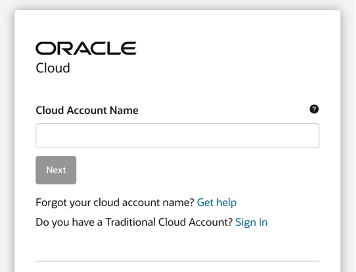

# Provision an Instance

## Introduction

This lab walks you through the process of provisioning an instance of Oracle Content Management & Oracle APEX, assuming you don't already have one available to you. If you do, you can skip this lab and move on to the next one.

Estimated Time: 10 minutes


### Objectives

In this lab, you will:
* Provision Oracle Content Management (Starter Edition)
* Provision Oracle APEX

### Prerequisites

This lab assumes you have:
* This lab requires completion of the Getting Started section in the Contents menu on the left.


## Task 1: Create an instance of Oracle Content Management


1. Log into your Oracle Cloud account. From any browser go to [https://cloud.oracle.com/en_US/sign-in](https://cloud.oracle.com/en_US/sign-in)

  Enter Cloud **Account Name** in the input field and click the **Next** button
	


2. Select **oracleidentityservice** and click **Continue** button

  

3. Enter your **User Name** and **Password** in the input fields and click **Sign In** button

 

5. Example with bold **text**.

   If you add another paragraph, add 3 spaces before the line.

## Task 2: Create an instance of Oracle APEX

1. Sub step 1 - tables sample

  Use tables sparingly:

  | Column 1 | Column 2 | Column 3 |
  | --- | --- | --- |
  | 1 | Some text or a link | More text  |
  | 2 |Some text or a link | More text |
  | 3 | Some text or a link | More text |

2. You can also include bulleted lists - make sure to indent 4 spaces:

    - List item 1
    - List item 2

3. Code examples

    ```
    Adding code examples
  	Indentation is important for the code example to appear inside the step
    Multiple lines of code
  	<copy>Enclose the text you want to copy in <copy></copy>.</copy>
    ```

4. Code examples that include variables

	```
  <copy>ssh -i <ssh-key-file></copy>
  ```
## Task 3: Assign OCM roles to IDCS App


## Learn More

*(optional - include links to docs, white papers, blogs, etc)*

* [URL text 1](http://docs.oracle.com)
* [URL text 2](http://docs.oracle.com)

## Acknowledgements
* **Author** - <Name, Title, Group>
* **Contributors** -  <Name, Group> -- optional
* **Last Updated By/Date** - <Name, Month Year>
