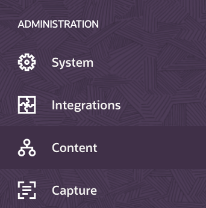
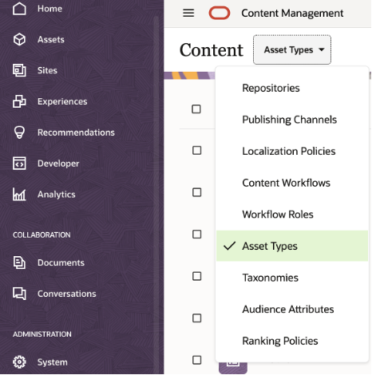
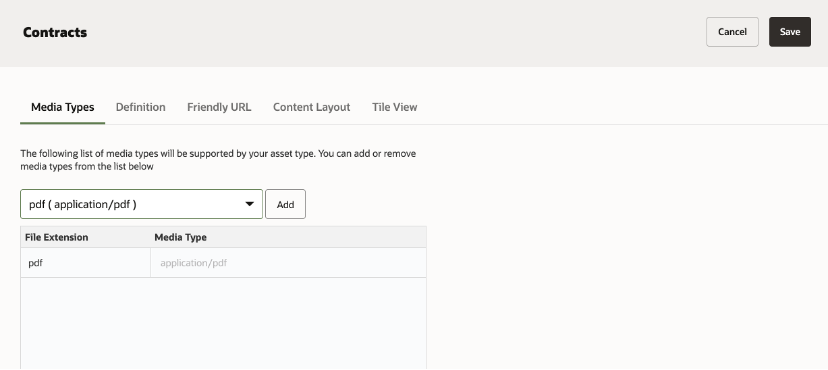
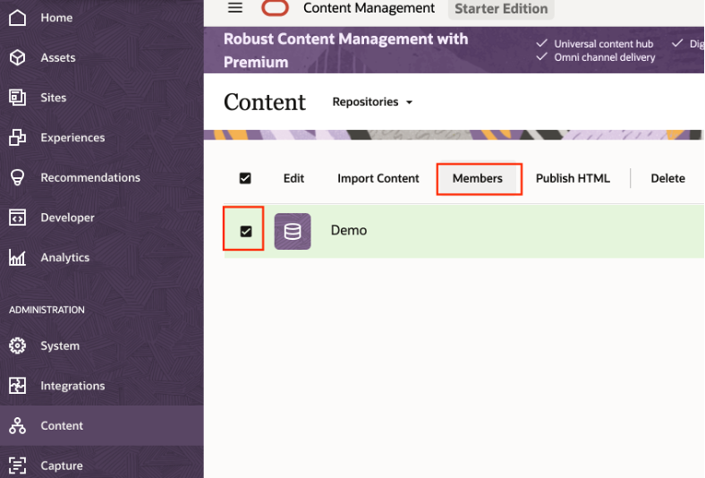

# Setup Content Repository

## Introduction

OCM allows you to manage different kind of content at one place, the content are logically organized within content “Repository”. From repository, you can define rule to make content accessible across different channels.

Estimated Lab Time: 10 minutes

### Background

_(Explain Content Repository, Custom Digital Asset type & their relation)_

### Objectives

In this lab, you will:

- Create Custom Digital Asset type
- Create Asset Repository
- Add members to Repository

### Prerequisites (Optional)

This lab assumes you have:

- An Oracle account
- All previous labs successfully completed

## Task 1: Create Custom Digital Asset Type

We need to have Custom Digital Asset type “Contract” with meta-data to capture document & meta-data.

1. Login to your OCM instance. Refer to Task 1 – Step 9 to find instance URL.

2. Navigate to left side menu ADMINISTRATION and then click Content

   

3. Click the drop-down menu below the header and select **Asset Types** as shown below

4. Click **Create** button on right top area to create asset type
   

5. In the create Asset type form, enter below details
   - **Name**: Contract
   - **Display Name**: Contract
   - **Choose asset type**: Select “Create a Digital Asset Type”

6. Click **Create**
   This will open the form to provide more detail about asset type.

7. Under **Media Type** Tab:
   Search for “pdf” and select **pdf(application/pdf)**. Click **Add** button to add support for this file type. You can include more than one file types based on requirement so that your Asset type will only accept document of listed file types only.

8. Navigate to **Definition** Tab:
   Drag **Text** data field from left side to **Digital Asset Type** Definition region.
   Enter below details on **Text Settings** form
   _ Name: Contract Name
   _ Number of data fields value: Single Value \* This field is required to have content: Checked

Click **Next** and then **OK**

9. Repeat the above step by dragging another **Text** data field and use below details in **Text Settings** form

   - Name: Party Name
   - Number of data fields value: Single Value
   - This field is required to have content: Unchecked

Click **Next** and then **OK**

10. Click **Save** from top right and we are done with creating Custom Digital Asset type.

## Task 2: Create Asset repository

We will create Asset repository to manage all our content for this workshop.

1. Navigate to vertical menu **ADMINISTRATION** and then click **Content**
   

2. Click **Create**

3. Enter below details into “Create Asset Repository” form
   _ Name: Demo
   _ Asset Type: Select Contract (which was created as part of Task 1), File & Image.
   

4. Click **Save** from top right corner and this will create the required repository.

## Task 3: Grant access on repository to IDCS App

1. Select the Demo asset repository and click Member menu from top section as shown below

2. Search for Application name **OCM-APEX Integration**  which you created earlier in LAB 1 – Task 3. Select **Role** as **Manager** and click **ADD**
   

3.	Finally click **Done** to close window.

## Acknowledgements

- **Author** - <Name, Title, Group>
- **Contributors** - <Name, Group> -- optional
- **Last Updated By/Date** - <Name, Month Year>
