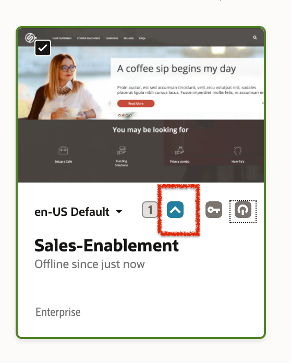
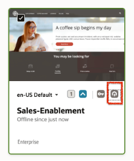
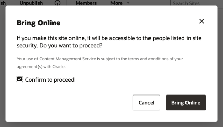

# Create Website based on site template

## Introduction

In this lab we will create Site in OCM using the site templated provided with workshop files.

Estimated Lab Time: 20 minutes

### Objectives

In this lab, you will:
* Import Sample Site Template
* Create New Site
* Change Site Security
* Publish Site

### Prerequisites

This lab assumes you have:
* An Oracle account
* All previous labs successfully completed

## Task 1: Import Sales Enablement Site Template

1.	Navigate to **Developer** for side vertical menu

	

2.	Select **View All Template** as show in above image in the **Templates** block

3.	Click **Create** button and then select **Import a template package**

  

4.	Click **Upload** button and then upload the site template zip file **CafeSupremoSalesEnablement.zip**
  

5.	Select the uploaded file and then click **Create**

6.	Wait for confirmation message for successful of template import and you will see the imported templated listed as below
  

## Task 2: Create new Site

1.	Navigate to **Sites** from side vertical menu

2.	Click **Create** to create new site based on site template imported in previous task.

3.	Click the Template to select and it will take you to next step

4.	Select the Asset repository as **Demo** which we created in previous labs

5.	Select **Localization Policy** as **SE2 Localization** and then click **Next**

6.	Click **Next** and then provide name to your site as shown below. Please select **Duplicate Assets** for **Assets in the target repository**

7.	Click **Finish** and wait for your site creation process to complete.	

## Task 3: Change site security from Public to Secure

1.	Select the site and then click **More** menu to select **Properties**

2.	Click **Security** tab and then change radio option from **No** to **Yes**. Select **Cloud Users** as shown below and finally click **Save**

## Task 4: Publish Site

1.	Select the site and click “Publish”, it will show you below screen

2.	Continue with default selected option and click **Ok**

3.	Click **Publish**

4.	Wait for publishing to complete and you will see “Published” icon as shown below

5.	Click the toggle icon as shown below to change status of site from offline to online.

6.	Select **Confirm** to proceed and click **Bring Online**

7.	Right click the Site and select **View**. This will open the site in new tab. Copy the URL of site which will be like **https://**\<your-instan-name>**/site/authsite/**\<site-name>

## Learn More

*(optional - include links to docs, white papers, blogs, etc)*

* [URL text 1](http://docs.oracle.com)
* [URL text 2](http://docs.oracle.com)

## Acknowledgements
* **Author** - <Name, Title, Group>
* **Contributors** -  <Name, Group> -- optional
* **Last Updated By/Date** - <Name, Month Year>
