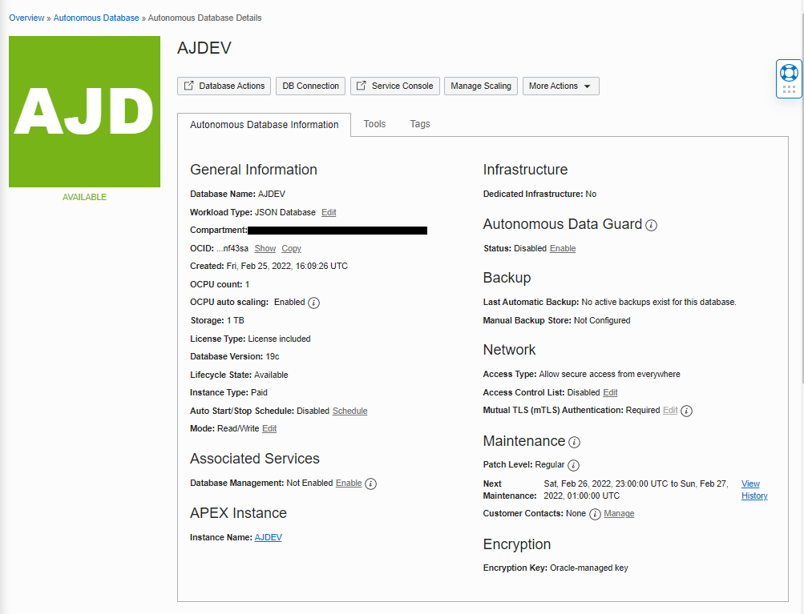
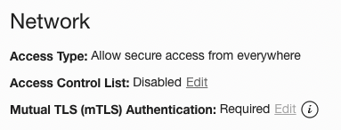
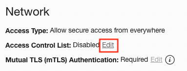
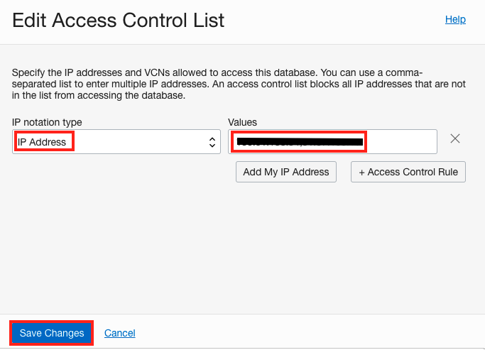
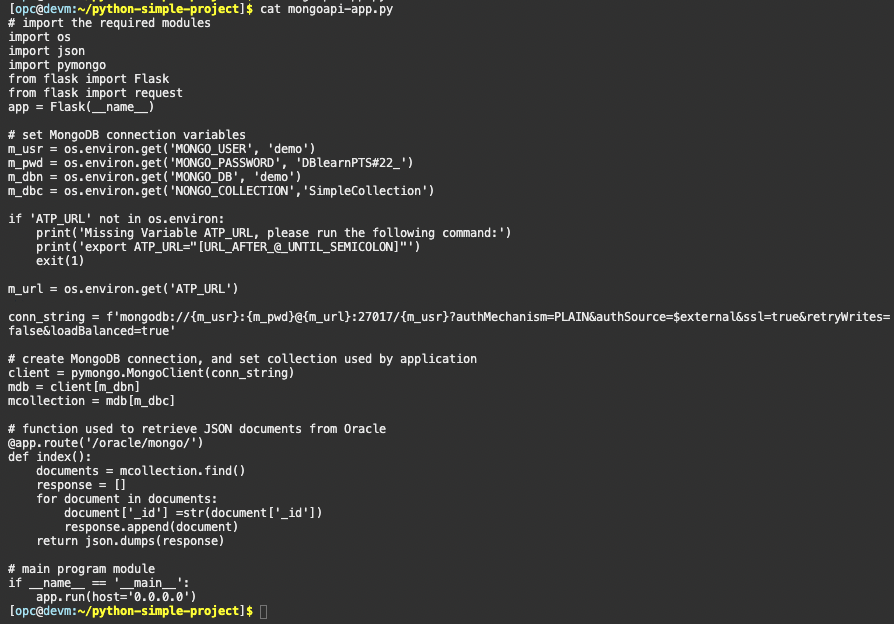
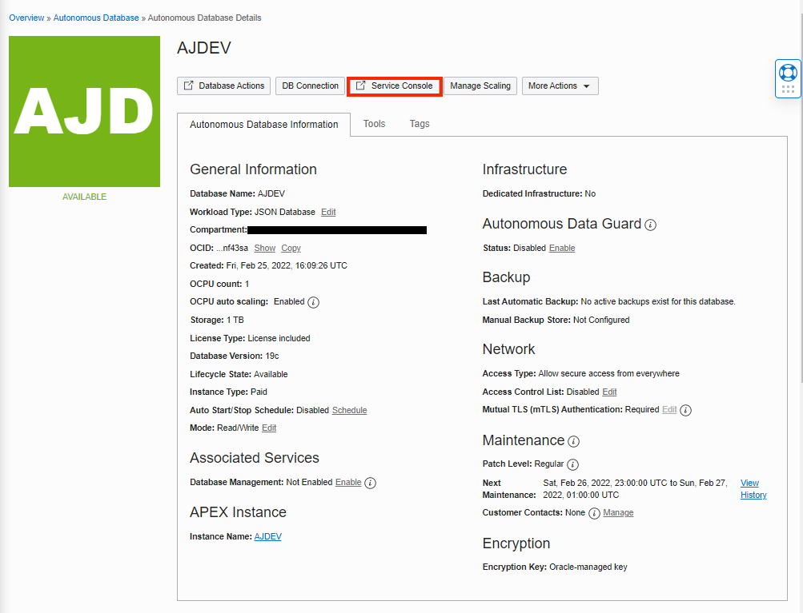
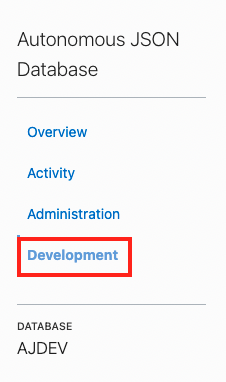
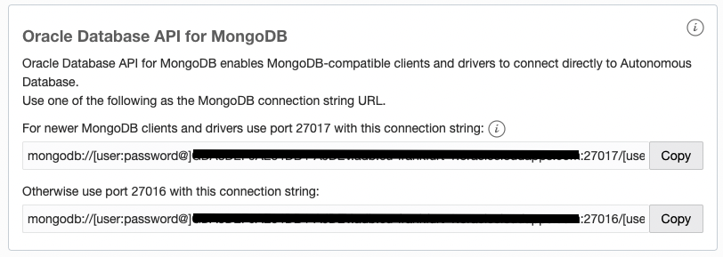

# Python micro-service with the new MongoAPI capability

## Introduction

Oracle Database API for MongoDB lets applications interact with collections of JSON documents in Oracle Database using MongoDB commands.

With the new API, developers can continue to use MongoDB's open-source tools and drivers connected to an Oracle Autonomous JSON Database while gaining access to Oracle’s multi-model capabilities and the benefits of a self-driving database. Customers can now run MongoDB workloads on Oracle Cloud Infrastructure (OCI).

Oracle Database understands Mongo-speak. That's the purpose of Oracle Database API for MongoDB.

You have one or more applications that interact with a MongoDB NoSQL database. You're used to using MongoDB commands, particularly for the business logic of your applications (query by example — QBE) but also for data definition (creating collections and indexes), data manipulation (CRUD operations), and some database administration (status information). You expect and depend on the flexibility of a JSON document store: no fixed data schemas, easy to use document-centric APIs.

On the other hand, you're looking to future-proof your applications and make them more robust. You want advanced security; fully ACID transactions (atomicity, consistency, isolation, durability); standardized, straightforward JOINs with all sorts of data; and state-of-the-art analytics, machine-learning, and reporting capabilities — all that and more, out of the box.

Oracle Database API for MongoDB, or Mongo API for short, provides all of that. It translates the MongoDB wire protocol into SQL statements that are executed by Oracle Database. This means you can continue to use the drivers, frameworks, and tools you're used to, to develop your JSON document-store applications.


To learn more about this capability go to he following content:
 - [Oracle Database API for MongoDB](https://docs.oracle.com/en/database/oracle/mongodb-api/mgapi/overview-oracle-database-api-mongodb.html#GUID-1CF44843-6294-45F0-8065-B9E8034D6CB1)
 - [Oracle Database API for MongoDB Blog from Roger Ford, Principal Product Manager] (https://blogs.oracle.com/database/post/mongodb-api)


**Estimated Lab Time: 20 minutes**.

### Objectives

In this lab, you will:

* Use MongoAPI capability for micro-service Python applicacion

### Prerequisites

* Lab 1, 2  and 3 from this content completed
* MongoDB Cloud account (or Google account)
* Deploy Atlas document store on MongoDB Cloud before the workshop (run Lab 3 Task 1)


## Task 1: Adapt Autonomous JSON Database (AJD)

We will change the network access to our Autonomous JSON Database. 
As part of the Provisioning Lab (Lab 1, Task 3), we created the database providing Network access from everywhere.
Now, we will change it to specifies IPs and VNs, using our Public IP Address.

1. **Click** on main menu ≡, then Oracle Database > **Autonomous JSON Database**. 

    


2. In the **Network** section you can see the configuration that we provisoned: `Allow secure access from everywhere`

    

3. Click **Edit** in the **Access Control List** Edit button. At the moment it is `Disabled`.

    

4. **Type** your **Public IP Address** in the **Values** field. In **IP notation type** field, you should have selected **IP Address**. **Add My IP Addreess** button too. Click **Save Changes**.

    


5. The **Network** configuration from your ADJ Database is **updating**.

    


    As soon as your database is **available** again, check the **Network** information again. Now, your **Access Type** has changed to `Allow secure access from specified IPs and VCNs`.  

    

    Now your Autonomous JSON Database is ready to start using MongoAPI capability.


## Task 2: Develop dual document store micro-service using MongoAPI capability

1. Access to **cloud shell** again. If you are not connected to **opc@devm**, **run** again the **ssh connections** using the **Public IP.** Replace <Public_IP> with your own one, removing < and > too. We copied the Public IP when we provisioned the compute instance few tasks back. Execute the following commands:

    ````
    <copy>
    ssh -i <private-key-file-name>.key opc@<Public_IP>
    </copy>
    ````

    

2. Lets have a look at **mongoapi-app.py**. In this file, we have the Python application code. Run the following command to see the code:

    ````
    <copy>
    cat mongoapi-app.py
    </copy>
    ````

    

3. **Verify** all connection **variables are correct**. This time we are using Oracle variables that we have used in previous labs and those will be use for connection variables that we will use. Following this method, you don't need to edit them.


    - For the Oracle Autonomous JSON database connection: We are using **demo** user and the **password** that we have recommended during the workshop **DBlearnPTS#22_**. The name of the Oracle Databases is **demo** too. And the Oracle schema **SimpleCollection**.

    > Note: If you have change the following variables to a different value, please run this commands providing the variable that you have changed. **Remember, we are using the Oracle connections under the MongoDB variables for nor editing the parameters. If you prefer, you can eddit them.  Following this method, it is cleaner for the application point of view.**
    >
    ````
    export MONGO_USER="demo"
    export MONGO_PASSWORD="DBlearnPTS#22_"
    export MONGO_CLUSTER="Cluster0"
    export MONGO_DB="demo"
    export MONGO_COLLECTION="SimpleCollection"
    ````

    The only variable that we need to define, if you haven't changed any variable from the recomended, is **ATP_URL**. A new URL that our AJD has created after adding our IPs in Task 1 of this Lab.


4. We will **copy** the **Oracle Database API for MongoDB connection string**. **Click** on main menu ≡, then Oracle Database > **Autonomous JSON Database**. **Click** on **Service Console**.

    

5. Under the **Development section**, find the **Oracle Database API for MongoDB** section. **Copy** the string string: `For newer MongoDB clients and drivers use port 27017 with this connection string`. We will use it shortly.

    
    

    It should be something like this:

    ````
    mongodb://[user:password@]<ATP_URL_including_tenancy_id.oraclecloudapp.com>:27017[user]authMechanism=PLAIN&authSource=$external&ssl=true&retryWrites=false&loadBalanced=true
    ````

    We need to copy the URL string after `@]` and until `:27017`. 

6. We will **export** the URL using the following command:


    ````
    <copy>
    export ATP_URL="[URL_AFTER_@_AND_]_UNTIL_SEMICOLON_27017]" 
    </copy>
    ````

     

7. **After checking if all variables are correct**. **Run** mongoapi-app application using the following command:

    ````
    <copy>
    python3 mongoapi-app.py
    </copy>
    ````

    


8. Use the **web browser** on your laptop to navigate to your micro-service to list JSON documents inserted into Oracle Autonomous Database using MongoAPI capability.

    http://[DEVM public-ip address]:5000/oracle/mongo/

     
    
    > This micro-service has 1 URL. We already had used previosly the Oracle one and the Mongo one. In this case we are using a new one / oracle/mongo. Here you have the others URLS too:
    >
        - http://[DEVM public-ip address]:5000/oracle/ -> for Oracle Autonomous Database
        - http://[DEVM public-ip address]:5000/mongo/ -> for MongoDB
        - http://[DEVM public-ip address]:5000/oracle/mongo/ -> for Oracle Autonomous Database using MongoAPI

9. Go to **cloud shell terminal.** We will **stop mongoapi-app.py**. for doing this, **press Control + C**.

    


*Congratulations! Well done!*

## Acknowledgements
* **Author** - Valentin Leonard Tabacaru, Database Product Management
* **Contributors** - Priscila Iruela, Technology Product Strategy Director and Victor Martin Alvarez, Technology Product Strategy Director
* **Last Updated By/Date** - Priscila Iruela, May 2022

## Need Help?
Please submit feedback or ask for help using our [LiveLabs Support Forum](https://community.oracle.com/tech/developers/categories/livelabsdiscussions). Please click the **Log In** button and login using your Oracle Account. Click the **Ask A Question** button to the left to start a *New Discussion* or *Ask a Question*.  Please include your workshop name and lab name.  You can also include screenshots and attach files.  Engage directly with the author of the workshop.

If you do not have an Oracle Account, click [here](https://profile.oracle.com/myprofile/account/create-account.jspx) to create one.