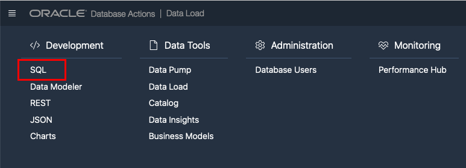
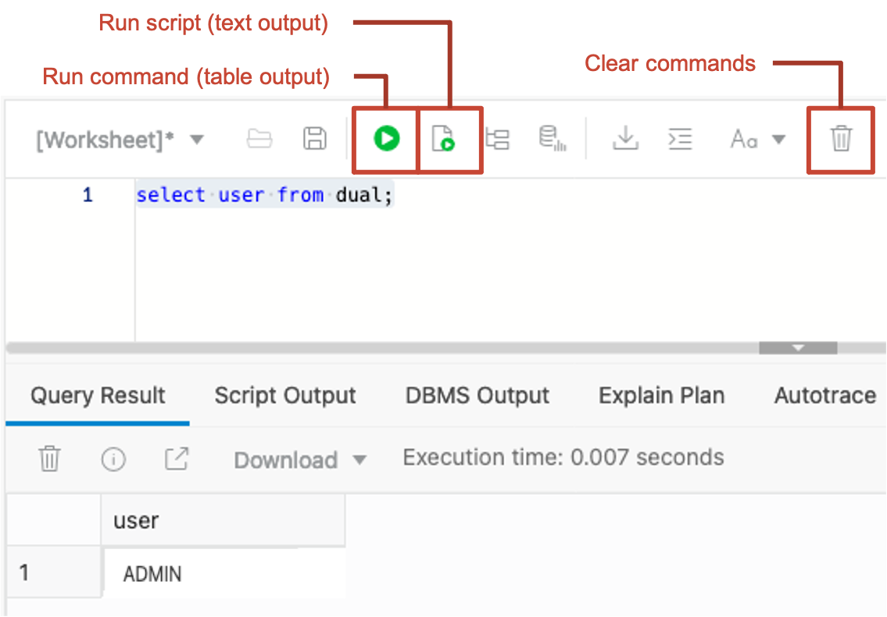
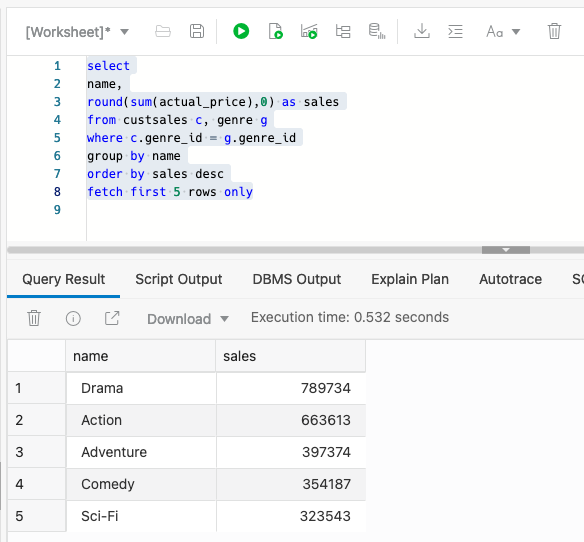

# Analyze movie sales data

## Introduction
In this lab, use Oracle analytic SQL to gain a better understanding of customers. 

Estimated Time: 5 minutes

### Objectives

- Understand how to use SQL Worksheet

- Bin customers by recency, frequency and monetary metrics


### Prerequisites
- This lab requires completion of Labs 1 and 2 in the Contents menu on the left.

## Task 1: Navigate to the SQL Worksheet
1. From the Data Load tool, navigate to the SQL Worksheet by clicking the top-left hamburger menu and then selecting **Development -> SQL**.

    

2. Learn more about the SQL Worksheet features using the help tips or simply click the **X** on the top left of a tip to dismiss it. You will run queries by entering your commands in the worksheet. You can use the shortcuts [Control-Enter] or [Command-Enter] to run the command and view the Query Result (tabular format). Clear your worksheet by clicking the trash:

    

You are now ready to start analyzing MovieStream's performance using SQL.


## Task 2: Explore sales data

1. Let's use a very simple query to look at sales for the top 5 movie genres.

    ```
    <copy>select
      name,
      round(sum(actual_price),0) as sales
    from custsales c, genre g
    where c.genre_id = g.genre_id
    group by name
    order by sales desc
    fetch first 5 rows only
    </copy>
    ```
   
    Copy this SQL statement into the worksheet, and press the **run command** button to start the query. This returns a result similar to the following:

    

    
    As you can see, the Drama and Action genres dominate MovieStream sales with Adventure, Comedy and Sci-Fi genres rounding out the top 5.


## Task 3: Finding our most important customers

### Overview
Let's pivot and look at customer behavior by utilizing an RFM analysis. RFM is a very commonly used method for analyzing customer value. It is often used in general customer marketing, direct marketing, and retail sectors.

In the following steps, the scripts will build a SQL query to identify:

- Recency: when was the last time the customer accessed the site?

- Frequency: what is the level of activity for that customer on the site?

- Monetary Value: how much money has the customer spent?

Customers will be categorized into 5 buckets measured (using the NTILE function) in increasing importance. For example, an RFM combined score of 551 indicates that the customer is in the highest tier of customers in terms of recent visits (R=5) and activity on the site (F=5), however the customer is in the lowest tier in terms of spend (M=1). Perhaps this is a customer that performs research on the site, but then decides to buy movies elsewhere!

1.  Binning customers based on behavior

    Use the following query to segment customer behavior into 5 distinct bins based on the recency, frequency and monetary metrics:

    ```
    <copy>SELECT
        cust_id,        
        NTILE (5) OVER (ORDER BY max(day_ID)) AS rfm_recency,
        NTILE (5) OVER (ORDER BY count(1)) AS rfm_frequency,
        NTILE (5) OVER (ORDER BY SUM(actual_price)) AS rfm_monetary
    FROM custsales
    GROUP BY cust_id
    ORDER BY cust_id
    FETCH FIRST 10 ROWS ONLY;</copy>
    ```
    Below is a snapshot of the result (and your result may differ):

    
    
    
    The rfm\_* columns in the report shows the "bin" values based on the 5 quintiles described above.
    
    For more information about using the `NTILE` function, see [the SQL documentation](https://docs.oracle.com/en/database/oracle/oracle-database/19/sqlrf/NTILE.html#GUID-FAD7A986-AEBD-4A03-B0D2-F7F2148BA5E9).


2.  Add customer information to the  RFM query

    Now we use the **`WITH`** clause to create an RFM query and then join that to attributes coming from the CUSTOMER table. In addition, the query will focus on important customers (based on spend) that are at risk:

    ```
    <copy>WITH rfm AS (
    SELECT
        m.cust_id,
        NTILE (5) OVER (ORDER BY max(day_id)) AS rfm_recency,
        NTILE (5) OVER (ORDER BY count(1)) AS rfm_frequency,
        NTILE (5) OVER (ORDER BY SUM(m.actual_price)) AS rfm_monetary
    FROM custsales m
    GROUP BY m.cust_id
    )
    SELECT
        r.cust_id,
        c.first_name||' '||c.last_name AS cust_name,
        r.rfm_recency,
        r.rfm_frequency,
        r.rfm_monetary,
        c.country,
        c.gender,
        c.age,
        c.income_level
    FROM rfm r
    INNER JOIN customer c ON c.cust_id = r.cust_id
    WHERE r.rfm_monetary >= 5
      AND r.rfm_recency = 1
    ORDER BY r.rfm_monetary desc, r.rfm_recency desc;</copy>
    ```
    The result only shows customers who historically had significant spend (equal to 5) but have not visited the site recently (equal to 1).  MovieStream does not want to lose these important customers!

    


## Recap
We accomplished alot in just 15 minutes! 

* Deployed an Autonomous Database instance that is optimized for data warehousing workloads
* Used Autonomous Database tools to load data lake sources
* Use advanced SQL to uncover issues and possibilities


## Learn more

* [Oracle Autonomous Data Warehouse Documentation](https://docs.oracle.com/en/cloud/paas/autonomous-data-warehouse-cloud/index.html)
* [Additional Autonomous Data Warehouse Tutorials](https://docs.oracle.com/en/cloud/paas/autonomous-data-warehouse-cloud/tutorials.html)

## **Acknowledgements**

- **Authors** - Marty Gubar, Oracle Autonomous Database Product Management
- **Last Updated By/Date** - Marty Gubar, November 2021
