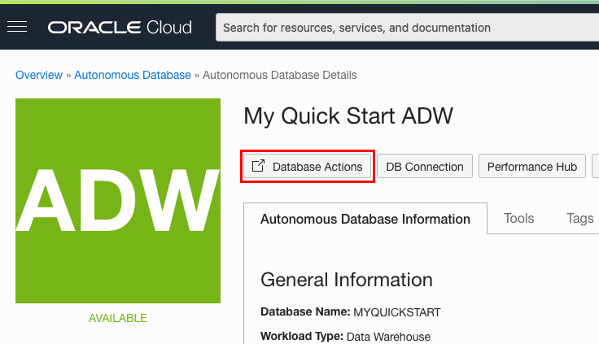
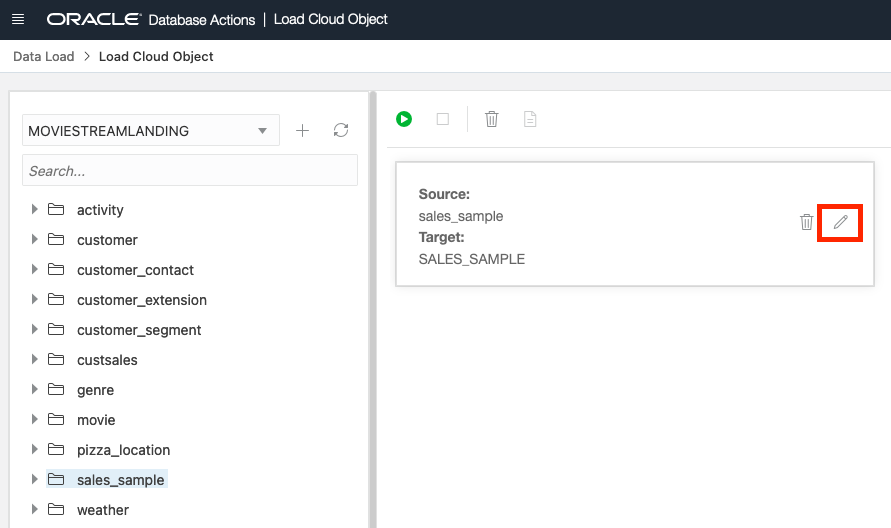
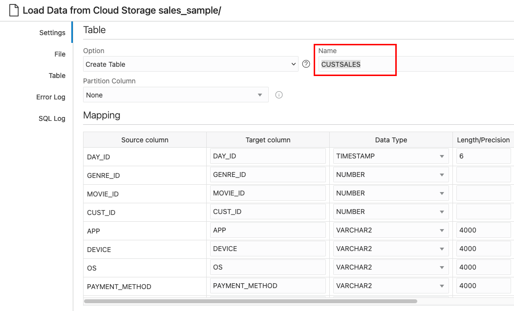
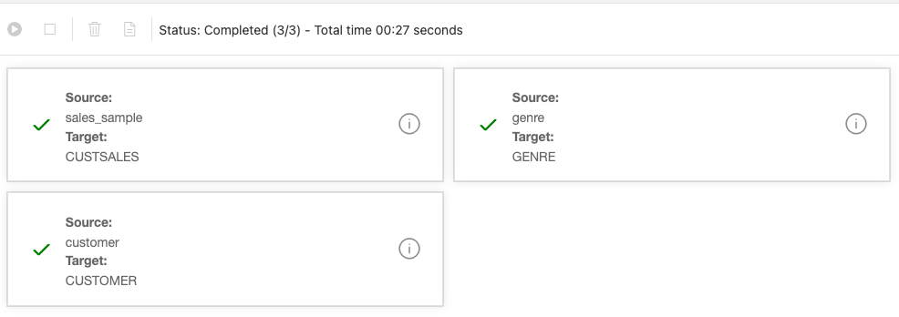
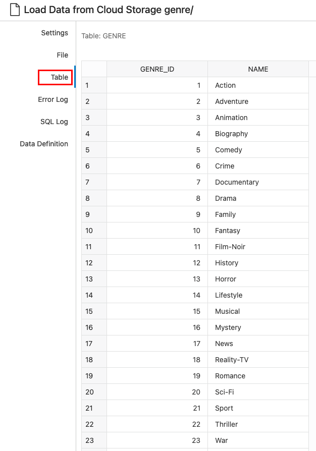

# Use Data Tools to load data

## Introduction

Load data from the MovieStream data lake on [Oracle Cloud Infrastructure Object Storage](https://www.oracle.com/cloud/storage/object-storage.html) into an Oracle Autonomous Database instance in preparation for exploration and analysis.

Estimated Time: 5 minutes

### Objectives

In this lab, you will:
* Learn how to define object storage credentials for your autonomous database
* Learn how to load data from object storage using Data Tools


### Prerequisites

- This lab requires completion of Lab 1, **Provision an ADB Instance**, in the Contents menu on the left.


## Task 1: Configure the Object Storage connections

In this step, you will set up access to a bucket on Oracle Cloud Infrastructure Object Storage that contain data that we want to load.

1. Navigate to the Details page of the Autonomous Database you provisioned in the "Provision an ADW Instance" lab. In this example, the database name is "My Quick Start ADW." Click **Database Actions** to go to the suite of Autonomous Database tools.

    

2. Enter ADMIN for the username and click **Next**. On the next form, enter the ADMIN password - which is the one you entered when creating your Autonomous Data Warehouse. Click **Sign in**.

    


1. On the Database Actions home page, under **Data Tools**, click **DATA LOAD**.

    

2. In the **Explore and Connect** section, click **CLOUD LOCATIONS** to set up the connection from your autonomous database to object storage.

    

3. To add access to the MovieStream landing area which contains newly added files for us to load, click **+Add Cloud Storage** in the top right of your screen.

    - In the **Name** field, enter 'MovieStreamLanding'.

    **Note:** Take care not to use spaces in the name.

    - Leave Cloud Store selected as **Oracle**.
    - Copy and paste the following URI into the URI + Bucket field:

    ```
    <copy>
    https://objectstorage.us-ashburn-1.oraclecloud.com/n/c4u04/b/moviestream_landing/o
    </copy>
    ```

    - Select **No Credential** as this is a public bucket.
    - Click on the **Test** button to test the connection. Then click **Create**.

4. The page now shows the newly created Cloud Location.

    

## Task 2: Load data from files in Object Storage using Data Tools

In this step we will perform some simple data loading tasks, loading both csv and partitioned parquet files from object storage into tables in our autonomous database.

1. To load or link data from our newly configured cloud storage, click on the **Data Load** link in the top left of your screen.

    

2. Under **What do you want to do with your data?** select **LOAD DATA**, and under **Where is your data?** select **CLOUD STORAGE**, then click **Next**

    

3. From the MOVIESTREAMLANDING location, drag the **sales_sample** folder over to the right hand pane. Note that a dialog box appears asking if we want to load all the files in this folder to a single target table. In this case, we have 24 parquet files that we want to load into a single table. Click **OK**.

4. Click on the pencil icon for the **sales_sample** task to view the settings for this load task.

    

5. The default action is to **Create Table** from the source. Notice the data loader derived the column names and data types from the parquet file. Update the name of the table from **SALES_SAMPLE** to **CUSTSALES**

    

5. We will load two more sources. Next, drag the **genre** folder over to the right hand pane. Again, click **OK** to load all files into a single table.

5. Finally, drag the **customer** folder over to the right hand pane. Again, click **OK** to load all files into a single table.

8. Now click on the Play button to run the data load job.

    

    The job should take less than a minute to run.

9. Check that all the data load cards have green tick marks in them, indicating that the data load tasks have completed successfully.

    

10. Review the results of the data load for genre. Click the **GENRE** tile and then select **Table** in the left hand side listing. You will see the list of movie genres that were loaded from its csv source. Then, click **Close** to dismiss the dialog.

    

This completes the Data Load lab. We now have a full set of structured tables loaded into the Autonomous Database from both csv and parquet files in the MovieStream data lake. We will be working with these tables in the next lab.

Please *proceed to the next lab*.

## Acknowledgements

* **Author** - Mike Matthews, Autonomous Database Product Management
* **Contributors** -  Marty Gubar, Autonomous Database Product Management
* **Last Updated By/Date** - Marty Gubar, Autonomous Database Product Management, November 2021
