# Creating an Autonomous JSON Database

## Introduction

In this lab, you will create an Autonomous JSON Database. 

Oracle Autonomous JSON Database is an Oracle Cloud service that is specialized for developing NoSQL-style applications that use JavaScript Object Notation (JSON) documents.

Like other Oracle Autonomous Database services, it delivers automated patching, upgrading, and tuning. It performs all routine database maintenance tasks while the system is running, without human intervention.

Oracle Autonomous JSON Database is a feature-scoped service for storing and retrieving JSON document collections using SQL or Document APIs. Development which requires a significant amount of non-JSON data must use Autonomous Database for Transaction Processing and Mixed Workloads on either Shared or Dedicated Infrastructure.

Development of NoSQL-style, document-centric applications is particularly flexible because the applications use schemaless data. This lets you quickly react to changing application requirements. There's no need to normalize the data into relational tables, and no impediment to changing data structure or organization at any time, in any way. A JSON document has internal structure, but no relation is imposed on separate JSON documents.

With Oracle Autonomous JSON Database your JSON document-centric applications typically use Simple Oracle Document Access (SODA), which is a set of NoSQL-style APIs for various application-development languages and for the representational state transfer (REST) architectural style. You can use any SODA API to access any SODA collection.

SODA document collections are backed by ordinary database tables and views. To use other kinds of data, subject to the 20 GB limit, you typically need some knowledge of Structured Query Language (SQL) and how that data is stored in the database.

With Oracle Autonomous JSON Database, a SODA collection can only contain JSON data. For example, you cannot have a collection of image documents or a collection that contains both JSON documents and image documents. This is a limitation relative to Autonomous Transaction Processing, where you can define such heterogeneous collections.

No matter what kind of data your applications use, whether JSON or something else, you can take advantage of all Oracle Database features. This is true regardless of the kind of Oracle Autonomous Database you use.

JSON data is stored natively in the database. In a SODA collection on an Autonomous Database JSON data is stored in Oracle's native binary format, OSON.

Estimated Time: 15-20 minutes

### Objectives

In this lab, you will:
* Create an **Autonomous JSON Database**
* Create a New `JSON` Collection
* Upload Sample `JSON` Documents Into **products** Collection
* Restrict Duplicate Values
* Work With `SQL` `JSON` Functions

### Prerequisites

This lab assumes you have:
* Access to an Oracle Cloud Free Tier Account
* Logged in to your Oracle CLoud Free Tier Account

## Task 1: Creating an Autonomous JSON Database

1. Select the hamburger menu in the top left of the OCI console. Under the **Features** section, Select **Autonomous Database**.

    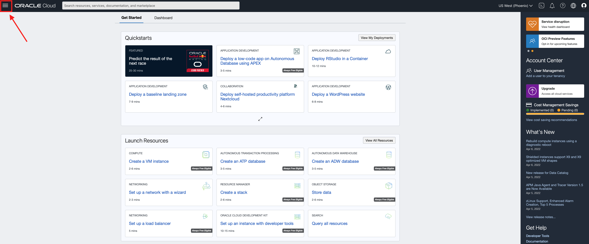

    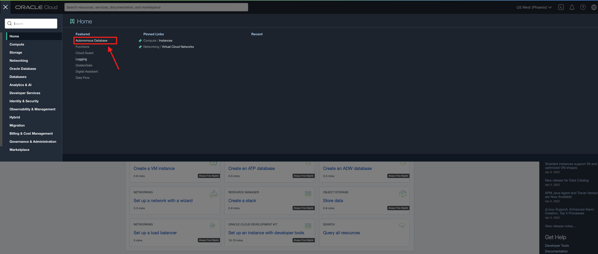

2. Select your desired **Compartment**, then click on **Create Autonomous Database**.

    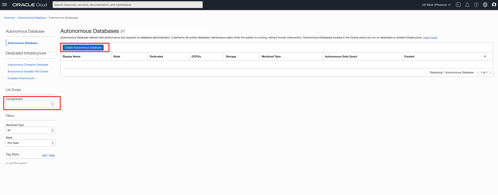

3. Referencing the images below, fill out the respective sections. When finished, select **Create Autonomous Database**. 

    *Note*: 
    * You may fill out the **Display Name** and **Database Name** as you see fit
    * Under **Create Administrator Credentials**, use a password of **your** choice.
    
    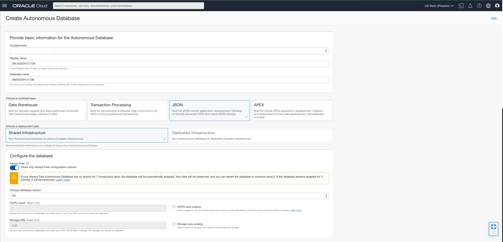

    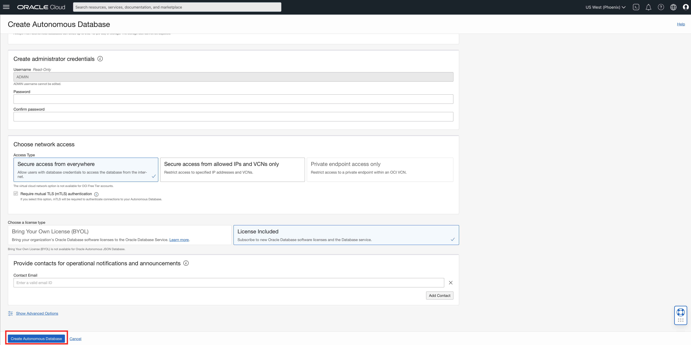

4. While your Autonomous JSON Database is provisioning, it will appear with an **orange** box. Once provisioned and fully ready for use, the box will turn **green**. 

    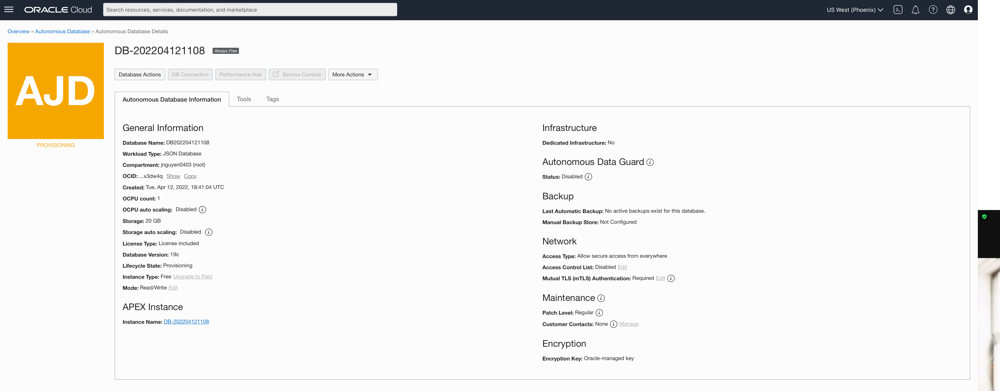

    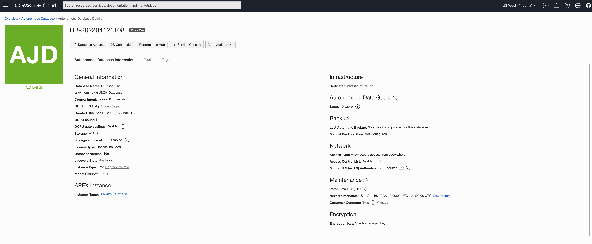   


## Task 2: Creating a New JSON Collection

1. Navigate to the **Tools** tab and under **Database Actions** select **Open Database Actions**.

    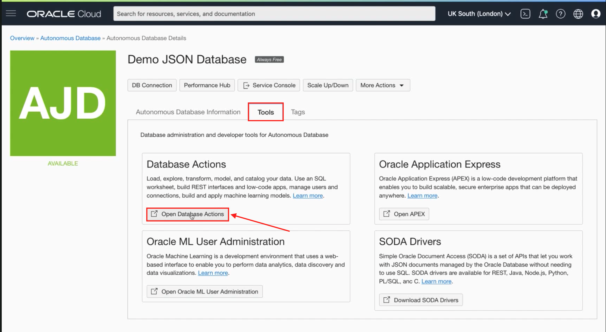

2. Use the Username and Password you created when intially provisioning your Autonomous JSON Database to log into the **Database Actions** page.

3. Once logged in, under Development, select **JSON**.

    

4. This takes you to the JSON portal in **Database Actions**. Exit out of the tutorial and select the **New Collection** button in the upper left of the portal.

    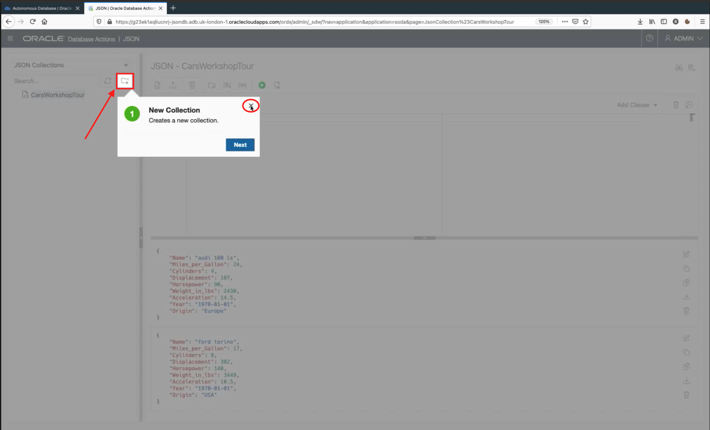

5. Name the new collecion **products** (case-sensitive) and select **Create** in the bottom right-hand side of the pop-up.

    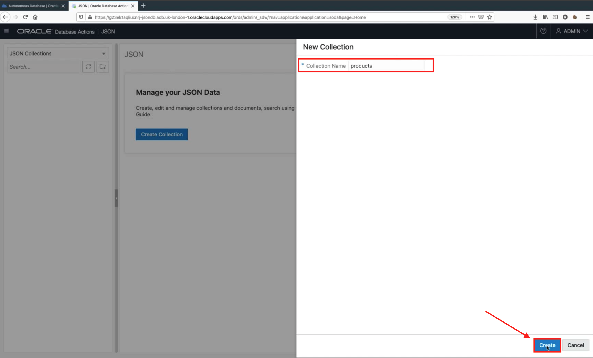

 We have now created our collection **products**. Here, we can create and manage JSON queries and scripts associated with the made collection.

## Task 3: Uploading Sample JSON Documents Into **products** Collection

1. Select the **New JSON Document** button in the top left of the main panel.

    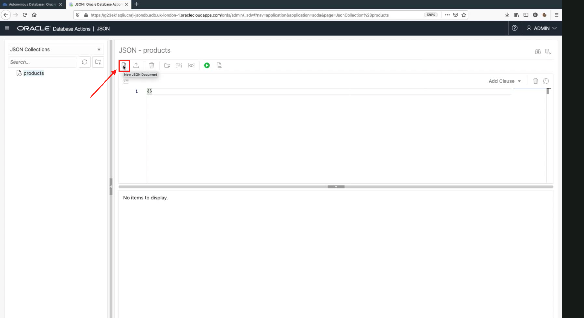

2. We will now add a new JSON document into our editor. Delete the sample brackets in the editor, then copy and paste the following JSON document into the editor and click **Create**.

    ``` 
    <copy>
    {
        "id": 100,
        "type": "movie",
        "title": "Coming to America",
        "format": "DVD",
        "condition": "acceptable",
        "price": 5,
        "comment": "DVD in excellent condition, cover is blurred",
        "starring": [
            "Eddie Murphy", 
            "Arsenio Hall", 
            "James Earl Jones", 
            "John Amos"
        ],
        "year": 1988,
        "decade": "80s"
    }
    </copy>
    ```
You will receive a notification with a green checkmark indicating a successful upload.

3. Create another **New JSON Document** and copy and paste the following JSON document and click **Create**. 

     ``` 
    <copy>
    {
        "id": 101,
        "title": "The Thing",
        "type": "movie",
        "format": "DVD",
        "condition": "like new",
        "price": 9.50,
        "genres": [
            "Sci-Fi",
            "Horror"
        ],
        "comment": "still sealed",
        "starring": [
            "Kurt Russel", 
            "Wilford Brimley", 
            "Keith David"
        ],
        "year": 1982,
        "decade": "80s"
    }
    </copy>
    ```

Take a closer look at this new JSON document. It has a new field called the Genres, which contains an array of movies genres.

This is an important distinction between JSON and relational table. In a relational table, everything is defined up front. Adding new data into like a column for example, requires the table to be modified to allow for that new column. In JSON, each document can have its own layout and doesn't need to follow a predefined schema.

4. Create one more **New JSON Document** and copy and paste the following JSON document and click **Create**.

    ``` 
    <copy>
    {
        "id": 102,
        "title": "Aliens",
        "type": "movie",
        "format": "VHS",
        "condition": "uknown, cassette looks ok",
        "price": 2.50,
        "starring": [
            "Sigourney Weaver", 
            "Michael Blenn", 
            "Carrie Henn", 
        ],
        "year": 1986,
        "decade": "80s"
    }
    </copy>
    ```

5. Refresh the **products** collection page by clicking the green play button to see all the inputed documents.

## Task 4: Restricting Duplicate Values

Notice that all the inputed documents have an ID field-- `ID 100`, `ID 101`, `ID 102`. Now we will see if there are any restrictions for adding a new document with a duplicate value. 

1. Create a **New JSON Document** to test whether you receive errors for uploading a document with the same field value. Copy and paste the following JSON document and click **Create**. This Document contains the same ID field as one of the previous entries.

    ```
    <copy>
    {
        "id": 100
        "fruit": "banana"
    }
    </copy>
    ```

We can see that the creation went through and the new JSON document is now uploaded, thus allowing users to upload JSON files with duplicate field values. In practice, however, we may want to restrict certain fields, like **ID** for example from being duplicated accross JSON documents.

2. Delete the previous `JSON` document made for the `fruit` *banana* so there is only one document with `"ID":100` 

    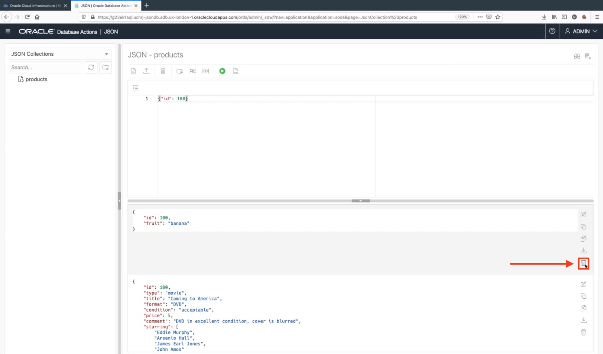

3. In order to prevent users from creating two documents with the same `ID`, there needs to be a unique index that is created through `SQL` on the **products** collection. Navigate to the hamburger menu in the top left. Under 'Development', select `SQL`.  

    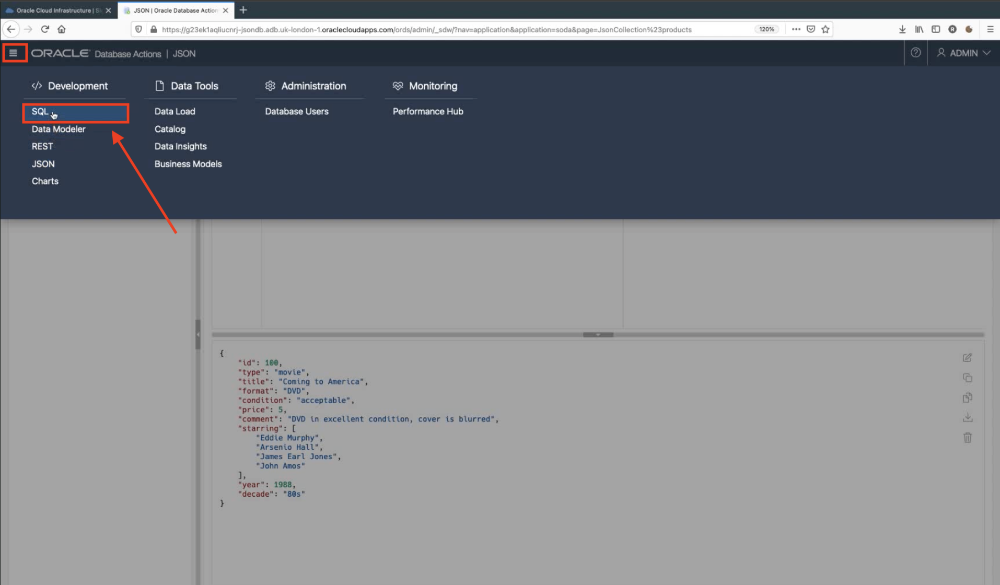

4. We are now in an `SQL` Worksheet. Copy and paste the following command in the worksheet editor and run the command by cliicking the green play button. This command uses the `JSON_VALUE` to extract the `ID` in number format from the **products** table. This will create a unique index that will prevent the creation of more than one document with the same `ID`.

    ```
    <copy>create unique index product_id_idx on products (JSON_VALUE(json_document, '$.id.number()' ERROR ON ERROR));</copy>
    ```

    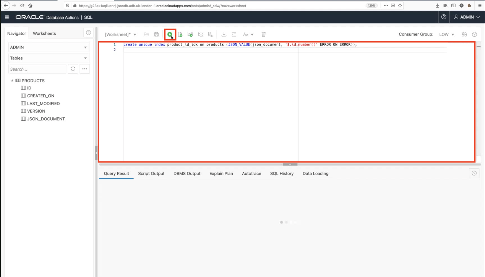

5. We will now validate that the index is working properly by reuploading the same `JSON` document. Using the hamburger menu, under **Development**, navigate back to `JSON`. In the worksheet space, copy and paste the follwing `JSON` document and click the green play button to run the document.

    ```
    <copy>
    {
        "id": 100
        "fruit": "banana"
    }
    </copy>
    ```

You should have received an error notification pop-up in the top right stating **Unable to add new JSON Document**. We have now validated the unique index and successfully restricted `JSON` documents with the same `ID` field.

## Task 5: Working With SQL JSON Functions

1. In the `JSON` worksheet, add one more record for the film *Top Gun* by copying and pasting the `JSON` document below. Input the document by clicking on the **Create** button. 

    ``` 
    <copy>
    {
        "id": 200,
        "title": "Top Gun",
        "format": "VHS",
        "condition": "like new",
        "price": 8,
        "starring": [
            "Tom Cruise", 
            "Kelly McGillis", 
            "Val Kilmer", 
        ],
        "year": 1986,
        "decade": "80s"
    }
    </copy>
    ```

2. Using the hamburger menu, under **Development**, navigate back to `SQL`. Once there, locate the table **PRODUCTS** on left hand side of the screen. 

3. Once located, right click on the table **PRODUCTS** and select *open* to see the full view of the table. On the left-hand side of the pop-up, select the *Data* tab. We can see that the `JSON` document column is a binary *JSON-type* column which contains the actual `JSON` document.

    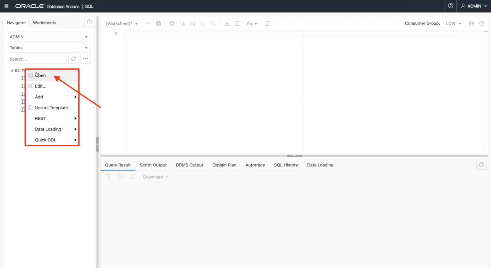

    

Because we are dealing with a binary data type, we need to create a `SQL` statement that allows a direct look into the `JSON` document. 

4. Close out of the table view. In the worksheet section, copy and paste the following command and click the green play button to run the command. This statement utilizes `JSON_Serialize` which looks at the binary `JSON` format and returns it back in a textual format.

    ```
    <copy>select JSON_Serialize(json_document) from products</copy>
    ```

5. Copy and paste the following command and click the green play button to run the command. This statement utilizes dot notation to look into the contents of a `JSON` document directly in a `SQL` statement.

    ```
    <copy>
    select JSON_serialize(json_document)
    from products p
    where p.json_document = 'VHS'
    </copy>
    ```

This statement returns two `JSON` documents where movie `format` is 'VHS'.

6. Clear the previous statement then copy and paste the following command and click the green play button to run the command. In this case, we are retrieving all `JSON` documents which contain the 'movie' `type`, DVD `format`, and `price` of less-than-or-equal-to 5 dollars.

    ```
    <copy>
    select JSON_serialize(json_document)
    from products p
    where p.json_document.type.string() = 'movie'
    and p.json_document.format.string() = 'DVD'
    and p.json_document.price.number() <= 5;
    </copy>
    ```

This statement returns one `JSON` document for the film 'Coming to America'.

7. Clear the previous statement then copy and paste the following command and click the green play button to run the command. This statement declares the `title` as a string, and `year` as a number in the select statement, thus converting the `JSON` output to a relational table format.

    ```
    <copy>
    select p.json_document.title.string(), p.json_document.year.number()
    from products p 
    where p.json_document.type.string() = 'movie'
    order by 2 DESC;
    </copy>
    ```
This statement returns three `JSON` documents for `type` movie in a descending order.

8. We can use the full power of `SQL` by adding aggregations to our statements as well. Clear the previous statement then copy and paste the following command and click the green play button to run the command. This statement will return the average price as well as the format for the `type` `movie`.

    ```
    <copy>
    select p.json_document.format, avg(p.json_document.price.number())
    from products p
    where p.json_document.type.string() = 'movie'
    group by p.json_document.format;
    </copy>
    ```
This statement returns two rown for `DVD` and `CHS` as well as the average price for each of those categories.

9. In order to work with arrays in a relational format in `SQL`, we need to involve the `json_table` command by joining the original **product** table with the **JSON table**, as well as defining a path for the statement to find the array. Clear the previous statement then copy and paste the following command and click the green play button to run the command.

    ```
    <copy>
    select p.json_document.title, jt.actor
    from products p,
        json_table(p.json_document,
                    '$.starring[*]'
                    COLUMNS
                        (actor varchar2(20) path '$')
                    ) jt
    </copy>
    ```
This statement returns every title and associated actor **in their own relational row**.
   

## Learn More

- [Using Oracle Autonomous JSON Database](https://docs.oracle.com/en/cloud/paas/autonomous-json-database/ajdug/autonomous-json-database.html)
- [Get Started With Oracle Autonomous JSON Database](https://docs.oracle.com/en/cloud/paas/autonomous-json-database/)

## Acknowledgements

- **Author**- Roger Ford, Principal Product Manager
- **Last Updated By/Date** - Ethan Shmargad, Santa Monica Specialists Hub, March 2022
