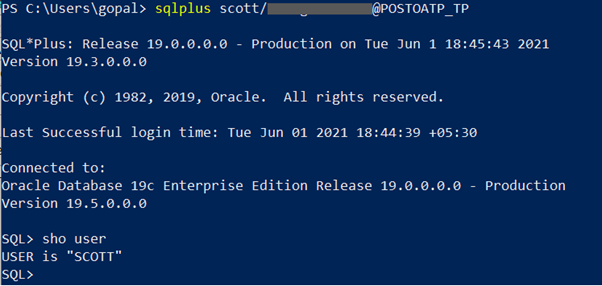

# Create Database Vault Policy in Autonomous Database

## Introduction

A Database Vault policy is made up of a few different components:
-	Rule – describe conditions that will be checked before an action is allowed or blocked
-	Rule set – a group of one or more rules that can be assigned to an action. You can associate the rule set with a realm authorization, factor assignment, command rule, or secure application role.
-	Command rule – connects a rule set to a specific action and object or schema. A command rule ALWAYS references a rule set. Command rules are commonly used to implement context-sensitive access policies 
-	Realm – a logical grouping of objects or schemas. Realms automatically override DBA and * ANY privileges. Realms are commonly used to block privileged user access to data
A simple example of these concepts working together might be:
-	Create a rule that checks the user session is connected using mapped consumer group service.
-	Create a rule set that includes the rule, and specified when Database Vault will create an audit records (success, failure, or both).
-	Create a command rule that enforces the user access restriction for non-mapped users upon CONNECT operation.

### Objectives

In this lab, you will:

-   Create Database Vault Policy in Autonomous Database
-   Validation

## Task 1: Create Database Vault Policy in ADB-S

For our scenario we want user “SCOTT” to be able to connect to database using only “TP” services and user “TOTO” to connect using “LOW” services.
In such case we will have to setup the below Database vault policy from ‘ADMIN’ account or 'ADV_OWNER' account

- Create Rule Set

---

    
    BEGIN

    DVSYS.DBMS_MACADM.CREATE_RULE_SET(
    rule_set_name => 'RULE_SET_USER_CONS',
    description => 'Rule Set enabled for Consumer Group User Mapping',
    enabled => DVSYS.DBMS_MACUTL.G_YES,
    eval_options => DBMS_MACUTL.G_RULESET_EVAL_ALL, -- all rules must be true,
    audit_options => DBMS_MACUTL.G_RULESET_AUDIT_FAIL, -- no audit
    fail_options => DBMS_MACUTL.G_RULESET_FAIL_SILENT,
    fail_message => '',
    fail_code => NULL,
    handler_options => DBMS_MACUTL.G_RULESET_HANDLER_OFF,
    handler => NULL
    );

    END;
    /

- Create Rule

---
    BEGIN
    DVSYS.DBMS_MACADM.CREATE_RULE(
    rule_name  => 'Check USER and Consumer group', 
    rule_expr  =>'ADMIN.USER_GRP_FN = 1');
    END;
    /

- Add Rule to Rule Set

---
    BEGIN
    DBMS_MACADM.ADD_RULE_TO_RULE_SET(
    rule_set_name     => ' RULE_SET_USER_CONS',
    rule_name         => 'Check USER and Consumer group'
    );
    END;
    /

- Create command rule for session connect

---
    BEGIN
    DBMS_MACADM.CREATE_COMMAND_RULE(
    command            => 'CONNECT',
    rule_set_name      => ‘RULE_SET_USER_CONS’,
    object_owner       => '%',
    object_name        => '%',
    enabled            => DBMS_MACUTL.G_YES);
    END;
    /
    COMMIT;

- Check the rule has been implemented

---
    SELECT * FROM DVSYS.DBA_DV_RULE where name like '%Cons%';

## Task 2:   Validation

Let’s connect to “SCOTT” schema using “TP” service and we see its connecting.

And when we will connect using any other service it will be denied.

Similarly for User “TOTO” access is allowed for “LOW” service.

And restricted for any other service.

**Congratulations!** You successfully completed the lab. 

## Learn more

* [Oracle Autonomous Database Documentation](https://docs.oracle.com/en/cloud/paas/autonomous-data-warehouse-cloud/index.html)
* [Additional Autonomous Database Tutorials](https://docs.oracle.com/en/cloud/paas/autonomous-data-warehouse-cloud/tutorials.html)

## Acknowledgements
* **Author** - Goutam Pal, Senior Cloud Engineer