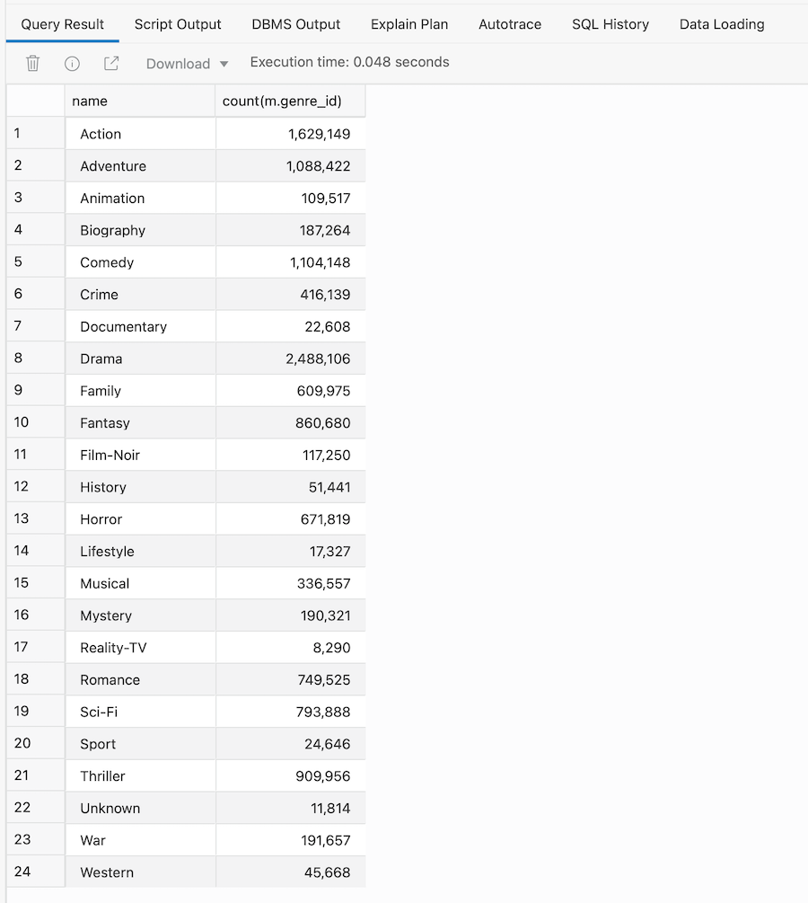
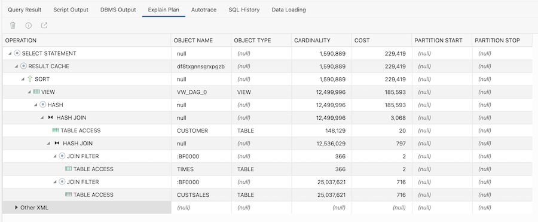
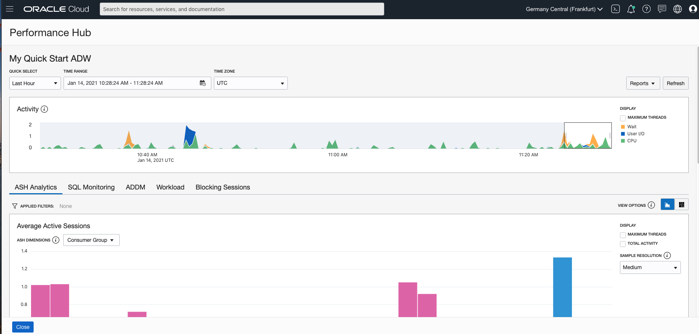
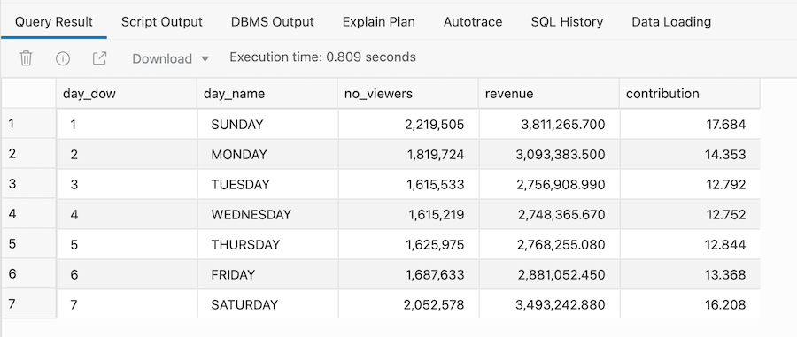
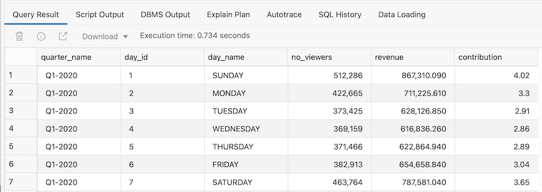
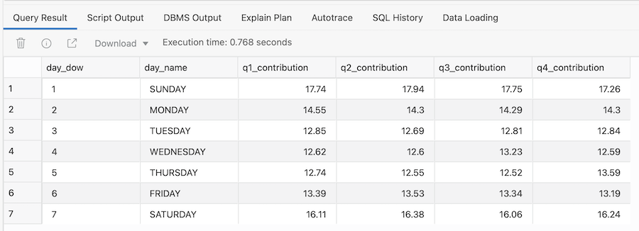

# Analyzing Movie Sales Data

## Introduction
This is the first in a series of SQL analytics labs.  You will learn many of the basics for analyzing data across multiple tables.  This includes using views to simplify sophisticated queries, performing time series analyses and more.

Estimated time: 15 minutes

### Objectives

- Understand how to use SQL Worksheet

- Learn how query caching improves performance

- Learn about the different types of built-in calculations

- Learn how to pivot data rows into columns to make analysis easier

### Prerequisites
- You will need to have completed the previous labs in this workshop
- Alternatively, run this script in the SQL Worksheet (TODO)
CODE GOES HERE?

## Task 1: Preparing The Data Warehouse Schema
The MovieStream data warehouse uses an design approach called a 'star schema'. A star schema is characterized by one or more very large fact tables that contain the primary information in the data warehouse and a number of much smaller dimension tables (or lookup tables), each of which contains information about the entries for a particular attribute in the fact table.


The main advantages of star schemas are that they:
<ul>
<li>Provide a direct and intuitive mapping between the business entities being analyzed by end users and the schema design.</li>
<li>Provides highly optimized performance for typical data warehouse queries.</li>
</ul>

One of the key dimensions in the MovieStream data warehouse is **TIME**. Currently the time dimension table has a single column containing just the ids for each day. When doing type data warehouse analysis there is a need to view data across different levels within the time dimension such as week, month, quarter and year. Therefore we need to expand the current time dimension to include these additional levels.

1. View the time dimension table.

    ```
    <copy>
    SELECT
    *  
    FROM times;</copy>
    ```

**NOTE** The TIMES dimension table has a typical calendar hierarchy where days aggregate to weeks, months, quarters and years.

Querying a data warehouse can involve working with a lot of repetitive SQL. This is where 'views' can be very helpful and very powerful. The code below is used to simplify the queries used throughout this workshop. The main focus here is to introduce the concept of joining tables together to returned a combined resultset.

The code below uses a technique called **INNER JOIN** to join the dimension tables to the fact table.

2. Creating a view that joins the GENRE, CUSTOMER and TIME dimension tables with the main fact table CUSTSALES.

    ```
    <copy>CREATE OR REPLACE VIEW vw_movie_sales_fact AS
    SELECT
    m.day_id,
    t.day_name,
    t.day_dow,
    t.day_dom,
    t.day_doy,
    t.week_wom,
    t.week_woy,
    t.month_moy,
    t.month_name,
    t.month_aname,  
    t.quarter_name,  
    t.year_name,  
    c.cust_id as customer_id,
    c.state_province,
    c.country,
    c.continent,
    g.name as genre,
    m.app,
    m.device,
    m.os,
    m.payment_method,
    m.list_price,
    m.discount_type,
    m.discount_percent,
    m.actual_price,
    m.genre_id,
    m.movie_id
    FROM custsales m
    INNER JOIN times t ON m.day_id = t.day_id
    INNER JOIN customer c ON m.cust_id = c.cust_id
    INNER JOIN genre g ON m.genre_id = g.genre_id;
    </copy>
    ```
There are lots of different types of joins that can be used within a SQL query to combine rows from one table with rows in another table. Typical examples are:

### A) INNER JOIN
An inner join, which is sometimes called a simple join, is a join of two or more tables that returns only those rows that satisfy the join condition. In the example above, only rows in the sales fact table will be returned where a corresponding row for day exists in the time dimension table and a corresponding row exists in the customer dimension table and a corresponding row exists in the genre dimension table.

### B) OUTER JOIN
An outer join extends the result of a simple join. An outer join returns all rows that satisfy the join condition and also returns some or all of those rows from one table for which no rows from the other satisfy the join condition. This join technique is often used with time dimension tables since you will typically want to see all months or all quarters within a given year even if there were no sales for a specific time period. There is an example of this type of join in the next step.


## Task 2: Learning More About Joins
In the previous SQL code we used an inner join to merge time, customer and genre dimensional data with the sales data. However, inner joins ignore rows in the dimension tables where there is no corresponding sales data. This means that some queries may need to use a different join method if you want to gain a deeper understanding of your sales data. Consider the following example:

1. How many news category films were viewed in 2020?

    ```
    <copy>SELECT
    g.name,
    count(m.genre_id)
    FROM (SELECT genre_id FROM vw_movie_sales_fact  WHERE year_name = '2020') m
    INNER JOIN genre g ON m.genre_id = g.genre_id
    GROUP BY g.name
    order by 1;</copy>
    ```

2. The result will look like this:


    

Unless you had a detailed knowledge of all the available genres you would probably miss the fact that there is no row shown for the genre "News" because there were no purchases of movies within this genre during 2020. This type of analysis requires a technique that is often called "densification". This means that all the rows in a dimension table are returned even when no corresponding rows exist in the fact table. To achieve data sensification we use an OUTER JOIN in the SQL query. Compare the above result with the following:

3. Modify the above SQL to use an outer join:

    ```
    <copy>SELECT
    g.name,
    count(m.genre_id)
    FROM (SELECT genre_id FROM vw_movie_sales_fact WHERE year_name = '2020') m
    FULL OUTER JOIN genre g ON m.genre_id = g.genre_id
    GROUP BY g.name
    order by 1;</copy>
    ```

4. The result will now look like this, where we can now see how many news category films were viewed in 2020:


    

**Note**: there is now a row for the genre "News" in the results table which shows that no news genre films were watched during 2020. When creating your own queries you will need to think carefully about the type of join needed to create the resultset you need. For the majority of examples in this workshop the JOIN requirements have been captured in the sales view created above. Now we have our time dimension defined as a view and a view to simplify SQL queries against the fact table we can move on to how SQL can help us explore the sales data.


## Task 3: Exploring Sales Data

1. To get started, let's use a very simple query to look at total movie sales by year and quarter, which extends the earlier simple SQL queries by adding a GROUP BY clause.

    **Note**: For copy/pasting, be sure to click the convenient Copy button in the upper right corner of the following code snippet, and all subsequent code snippets:

    ```
    <copy>SELECT
    year_name,
    quarter_name,
    SUM(actual_price)
    FROM vw_movie_sales_fact
    WHERE year_name = '2020'
    GROUP BY year_name, quarter_name
    ORDER BY 1,2;</copy>
    ```
    **Note**: In this query, we have returned a resultset where the data has been aggregated (or grouped by) year then, within year, by quarter. The ORDER BY clause sorts the resultset by year and then quarter. In addition there is a filter or WHERE clause that allows us to return only data for the year 2020.

2. The result should look something like this:

    

    Note the time taken to run your query. In the above example, this was 1.315 seconds to run (*when you run your query the timing may vary slightly*).

3. Now simply run the query again:


    

4. This time the query ran much faster, taking just 0.026 seconds! So what happened?

    When we executed the query the first time, Autonomous Data Warehouse executed the query against our movie sales table and scanned all the rows. It returned the result of our query to our worksheet and then it stored the result in something called a **result cache**. When we then ran the same query again, Autonomous Data Warehouse simply retrieved the result from its result cache! No need to scan all the rows again. This saved a lot of time and saved us money because we used hardly any compute resources.

    If you want to understand a little bit more about **result cache**, then continue with STEP 2; otherwise, just jump ahead to **STEP 3 - Analyzing Customer Viewing Habits**.

## Task 4: Learn How ADW's RESULT CACHE Means Faster Queries (Optional)

A result cache is an area of memory within our Autonomous Data Warehouse that stores the results of database queries for reuse. The **cached** rows are shared across queries and sessions. What this means is that when we run a query, the first thing the database does is to search its cache memory to determine whether the result already exists in the result cache. If it does, then the database retrieves the result from memory instead of executing the query. If the result is not cached, then the database executes the query, returns the result and stores the result in the result cache so the next time the query is run, the results can simply be returned from the cache.

But, how do you know if the results from a query are returned from the **result cache**?

1. Our Autonomous Data Warehouse console has a built-in performance monitoring tool called **Performance Hub**. This tool gives us both real-time and historical performance data for our Autonomous Data Warehouse. Performance Hub shows active session analytics along with SQL monitoring and workload information. Let's try running a query and then see how Autonomous Data Warehouse executes it.

2. To simplify the monitoring process, we will add some additional instructions to the database about how we want it to execute our query. These extra instructions are called **hints** and they are enclosed within special markers: **/*  */.** In the example below we have given our query a name (Query 1) and we have told Autonomous Data Warehouse to monitor the query during its execution:

    ```
    <copy>SELECT /* Query 1 */ /*+ monitor */
    year_name,
    quarter_name,
    continent,
    country,
    state_province,
    COUNT(customer_id) AS no_customers,
    COUNT(distinct movie_id) AS no_movies,
    SUM(actual_price) AS total_revenue,
    SUM(actual_price)/COUNT(customer_id) AS avg_revenue
    FROM vw_movie_sales_fact
    WHERE year_name = '2020'
    GROUP BY year_name, quarter_name, continent, country, state_province
    ORDER BY 1,2,3,4;</copy>
    ```

    **Note**: In this query, we added more calculations and assigned more meaningful names to each calculated column.

3. This query should return a result similar to this:

    

4. Click this icon at the top of the worksheet (the icon is in the menu bar just above your SQL statement):

    

5. This will run an Explain Plan. This shows, in a tree-form, how Autonomous Data Warehouse executed our query. You read the tree from bottom to top so the last step is to put the result set into the result cache:

    

    **Note**: The plan above shows a lot of information that can be very helpful in terms of understanding how your query has been run by Autonomous Data Warehouse. However, at this point the information shown is not the main focus area for this workshop.

6. Now simply run the query again:

    ```
    <copy>SELECT /* Query 1 */ /*+ monitor */
    year_name,
    quarter_name,
    continent,
    country,
    state_province,
    COUNT(customer_id) AS no_customers,
    COUNT(distinct movie_id) AS no_movies,
    SUM(actual_price) AS total_revenue,
    SUM(actual_price)/COUNT(customer_id) AS avg_revenue
    FROM vw_movie_sales_fact
    WHERE year_name = '2020'
    GROUP BY year_name, quarter_name, continent, country, state_province
    ORDER BY 1,2,3,4;</copy>
    ```

7. You can see that it runs significantly faster this time!

    

8. If you look at the explain plan again it will be the same explain plan as last time which is helpful in some ways but we want to dig a little deeper this time. To track the actual execution process, we need to switch over to the Autonomous Data Warehouse console. There should be a tab open in your browser which is labelled **Oracle Cloud Infrastructure**, or simply open a new tab and go to  **[cloud.oracle.com](http://cloud.oracle.com),**  then click on the card labeled **View all my resources **,  and find your data warehouse in the list of resources so that this page is now visible:

    

9. Click the **Performance Hub** button to open the monitoring window.

    **Note:** Your performance charts will look a little different because we have only just started using our new Autonomous Data Warehouse:

    

10. Now click the tab marked **SQL Monitoring** in the lower half of the screen:

    

    **Note:** The first two queries in the list will be the queries we just executed - (*you can identify them by looking at database times if the two queries are not grouped together*). The first execution of our query (row two in the table above) shows that we used 8 parallel execution servers to execute the query and this resulted in 2,470 I/O requests to retrieve data stored on disk. So it's clear that we had to use some database resources to run our query the first time. Now look at the performance monitoring data for the second execution (the first row in the table above) - no parallel resources were used, no I/O requests were made and the database time was insignificant. This tells us that the database was able to reuse the results from a previous execution of the same query. Essentially there was zero cost in running the same query a second time.

    This is a typical real-world scenario where users are viewing pre-built reports on dashboards and in their data visualization tools. Result cache is one of the many transparent performance features that helps Autonomous Data Warehouse efficiently and effectively run data warehouse workloads.

Now that we have some insight into how Autonomous Data Warehouse manages queries, let's expand our first query and begin to do some analysis of our sales data.

## Task 5: Analyzing Customer Viewing Habits

1. Switch back to the tab where SQL Worksheet is running.

2. Let's start by investigating the viewing habits of our MovieStream customers by seeing how many of them are buying movies on each day of the week and whether there are any specific patterns we can spot. Copy the following SQL into your worksheet and then press the green circle icon to execute the query:

    ```
    <copy>SELECT
    day_dow,
    day_name,
    COUNT(customer_id) AS no_viewers,
    SUM(actual_price) AS revenue
    FROM vw_movie_sales_fact
    WHERE  year_name = '2020'
    GROUP BY day_dow, day_name
    ORDER BY day_dow;</copy>
    ```
Here we are using a built-in function, TO_CHAR, to convert the column 'day', which is defined as a date and has values such as 01-01-2020, into a number between 1 and 7 and also the name of the day.

3. This should return something similar to the following:

    

    This shows that we have more customers buying movies on Fridays, Saturdays, Sundays and Mondays since these days show the highest revenue. The revenue for the days in the middle of week is still great, but definitely lower. But it's hard to see a clear pattern just by looking at the raw sales numbers.

## Task 6: Calculating Each Day's Contribution

### Overview

It would be helpful for our analysis if we could calculate the contribution that each day is providing to our overall sales. To do this, we need to use a special type of aggregation process within our query - we need a type of function that is called a **window** function. This type of function is very powerful since it allows us to calculate additional totals (or ratios, ranks, averages, maximum values, minimum values) as part of our query. In this case, we want to calculate the total revenue across all seven days and then divide each day's total by that aggregate total.

Let's start by defining the total for each day:   **```SUM(actual_price * quantity_sold)```**

Then we can add the total revenue for all days by using a standard SQL operation called a window function that extends the **SUM** function. This means adding an additional keyword **OVER** as follows:  **```SUM(actual_price * quantity_sold) OVER ()```**  to calculate a grand total for all rows.

  **NOTE:** If you want to read more about window functions, look at this topic in the [Oracle Data Warehouse Guide](https://docs.oracle.com/en/database/oracle/oracle-database/19/dwhsg/sql-analysis-reporting-data-warehouses.html#GUID-2877E1A5-9F11-47F1-A5ED-D7D5C7DED90A).

Now we can combine these two calculations to compute the contribution for each day: **SUM(actual\_price * quantity\_sold) / SUM(actual\_price * quantity\_sold) OVER ()** which is easy to understand having slowly built up the SQL, step-by-step. However, the calculation does look a little complicated!

**BUT WAIT!** There is actually a specific SQL function that can do this calculation. It's called [RATIO\_TO\_REPORT](https://docs.oracle.com/en/database/oracle/oracle-database/19/dwhsg/sql-analysis-reporting-data-warehouses.html#GUID-C545E24F-B162-45CC-8042-B2ACED4E1FD7) and the SQL looks like this:

**```RATIO_TO_REPORT(SUM(actual_price * quantity_sold)) OVER()```**

This approach looks much neater, easier to read, and much simpler!

**Note:**  the function **```RATIO_TO_REPORT```** returns results in the format where 1 equals 100%. Therefore, the code below multiplies the result by 100 to return a typical percentage value.

We are going to extend the **```RATIO_TO_REPORT```** function a little further on in this workshop so you will get some more insight regarding the flexibility and power of this type of calculation.

1. For now, let's extend our original query so that it now includes this new window function:

    ```
    <copy>SELECT
    day_dow,
    day_name,
    COUNT(customer_id) AS no_viewers,
    SUM(actual_price) AS revenue,
    RATIO_TO_REPORT(SUM(actual_price)) OVER()*100 AS contribution
    FROM vw_movie_sales_fact
    WHERE year_name = '2020'
    GROUP BY day_dow, day_name
    ORDER BY day_dow;</copy>
    ```

2. The output from this query is shown below and the last column containing the contribution calculation is definitely a little challenging to read:

    

3. In a spreadsheet, it's very easy to clean up this type of report by using the decimals button. SQL has a similar formatting option called **ROUND**, to manage the number of decimals displayed:

    ```
    <copy>SELECT
    day_dow,
    day_name,
    COUNT(customer_id) AS no_viewers,
    ROUND(SUM(actual_price),2) AS revenue,
    ROUND(RATIO_TO_REPORT(SUM(actual_price)) OVER()*100,2) AS contribution
    FROM vw_movie_sales_fact
    WHERE year_name = '2020'
    GROUP BY day_dow, day_name
    ORDER BY day_dow;</copy>
    ```
4. Now we can get a much clearer picture of the contribution each day is providing:

    

    We can see that Monday provides a significant contribution compared to the other weekdays, however, **Saturday**, **Sunday** and **Friday** are actually providing the highest levels of contribution across the whole week.  Now let's try to drill down and breakout the data across different dimensions to get some more insight.

## Task 7: Breaking Data Out By Specific Genre

Let's expand our focus and consider the types of movies that customers are watching each day. To do this, we can use the **SQL CASE** feature (which is similar to the IF() function in Excel) in conjunction with a count for each genre of movie as follows and examine the ratio of people streaming each genre on each day:

For each genre where we know how many movies of that type were watched, we include the following code:

<pre>CASE genre WHEN 'crime' THEN 1 ELSE null END</pre>

1. We can take this formula and wrap it within a contribution calculation (**```RATIO_TO_REPORT```**), applying the formatting technique we just used above. Let's focus on a specific range of genres: crime, documentary, news and reality-tv genres.

    ```
    <copy>SELECT
    day_dow,
    day_name,
    COUNT(customer_id) AS no_viewers,
    SUM(actual_price) as revenue,
    ROUND(RATIO_TO_REPORT(SUM(actual_price)) OVER() * 100, 2) AS contribution,
    ROUND(RATIO_TO_REPORT(SUM(CASE genre WHEN 'Crime' THEN 1 ELSE 0 END)) OVER() * 100, 2) AS crime,
    ROUND(RATIO_TO_REPORT(SUM(CASE genre WHEN 'Documentary' THEN 1 ELSE 0 END)) OVER() * 100, 2) AS documentary,
    ROUND(RATIO_TO_REPORT(SUM(CASE genre WHEN 'News' THEN 1 ELSE 0 END)) OVER() * 100, 2) AS news,
    ROUND(RATIO_TO_REPORT(SUM(CASE genre WHEN 'Reality-TV' THEN 1 ELSE 0 END)) OVER() * 100, 2) AS realitytv
    FROM vw_movie_sales_fact
    WHERE year_name = '2020'
    GROUP BY day_dow, day_name
    ORDER BY day_dow;</copy>
    ```
2. This should return something similar to the following:

    

From the data we can see that viewing of Reality-TV related movies is definitely more popular on Sundays compared to other days of the week. News is definitely more popular on Mondays, and Saturday is a good day to enjoy a crime movie!

We are starting to get an interesting picture of our customers' viewing habits during the week. The next stage is to drill into this daily analysis and look at how the daily contributions change within each of the four reporting quarters.

## Task 8: Breaking Data Out By Quarter

It's most likely that when you are doing this type of analysis on your own data set, the next most obvious step is to look at the same data over time to see if any other interesting patterns pop out.

1. Let's dig a little deeper into the numbers by breaking out the data by year. With SQL, all we need to do is add the additional column name into the **SELECT** clause, **GROUP BY** clause and most importantly the **ORDER BY** clause as well:

    ```
    <copy>SELECT
    quarter_name,
    day_dow AS day_id,
    day_name,
    COUNT(customer_id) AS no_viewers,
    SUM(actual_price) AS revenue,
    ROUND(RATIO_TO_REPORT(SUM(actual_price)) OVER()*100, 2) AS contribution
    FROM vw_movie_sales_fact
    WHERE year_name = '2020'
    GROUP BY quarter_name, day_dow, day_name
    ORDER BY quarter_name, day_dow;</copy>
    ```
2. The result should look similar to this:

    

3. Take a look at the contribution column; the values are very low. This is because we are comparing each day's revenue with the grand total for revenue across all four quarters. What we really need to do is compute the contribution within each quarter. This is a very easy change to make by simply adding a **PARTITION BY** clause to our window function.

    ```
    <copy>SELECT
    quarter_name,
    day_dow AS day_id,
    day_name,
    COUNT(customer_id) AS no_viewers,
    SUM(actual_price) AS revenue,
    ROUND(RATIO_TO_REPORT(SUM(actual_price)) OVER(PARTITION BY quarter_name)*100, 2) AS contribution
    FROM vw_movie_sales_fact
    WHERE year_name = '2020'
    GROUP BY quarter_name, day_dow, day_name
    ORDER BY quarter_name, day_dow;</copy>
    ```

4. Now it's much easier to see that we have a same familiar pattern across Monday, Friday, Saturday and Sunday:

    

## Task 9: Creating An Excel-Like Pivot Table

### Overview

However, the challenge here is: it would be much easier if we could have a spreadsheet-like view of our result set, where the quarters are across the top of the report. Spreadsheets (along with many BI/data visualization tools) make this very easy to achieve through the use of pivot tables. Fortunately, SQL provides an almost identical feature:  **[PIVOT](https://docs.oracle.com/en/database/oracle/oracle-database/19/dwhsg/sql-analysis-reporting-data-warehouses.html#GUID-05BB22CD-0F53-4C90-AE84-CE3F88DBD591)** function (you may need to scroll down to find the section on PIVOT). In the code snippet below, we are telling SQL to break out the contribution column into separate columns for each quarter (where each column will be named as Q1, Q2, Q3 and Q4):

**Note:** You don't need to run this block of code:

  ```
  PIVOT
  (
  SUM(CONTRIBUTION) contribution
  FOR QUARTER_NAME IN('Q1-2020' as "Q1", 'Q2-2020' as "Q2", 'Q3-2020' as "Q3", 'Q4-2020' as "Q4")
  )
  ```

1. If we wrap a **PIVOT** operation around our previous query, this will allow us to swap rows for each quarter into columns so we can focus more easily on the contribution data:

    ```
    <copy>SELECT * FROM
    (SELECT
    quarter_name,
    day_dow,
    day_name,
    ROUND(RATIO_TO_REPORT(SUM(actual_price)) OVER(PARTITION BY quarter_name)*100, 2) AS contribution
    FROM vw_movie_sales_fact
    WHERE year_name = '2020'
    GROUP BY quarter_name, day_dow, day_name
    ORDER BY quarter_name, day_dow)
    PIVOT
    (
    SUM(CONTRIBUTION) contribution
    FOR QUARTER_NAME IN('Q1-2020' as "Q1", 'Q2-2020' as "Q2", 'Q3-2020' as "Q3", 'Q4-2020' as "Q4")
    )
    ORDER BY 1;</copy>
    ```
2. This now looks more like a spreadsheet and it's now a lot easier to visually analyze the data over two time dimensions.

    

### Wrapping It All Up

From this result set, we can easily spot that Monday's contribution is declining over time whilst the contribution provided by Friday, Saturday and Sunday is increasing over time. This could have important knock-on effects for our networks and servers during those three days, so this trend will need to be watched closely to see how it develops further over time.

### Recap

In this section, you have looked at the following key features of your Autonomous Data Warehouse:

- Seeing how the result cache can transparently speed up queries

- Using built-in analytic functions to calculate contribution (**```RATIO_TO_REPORT```**)

- Applying formatting options to numeric results

- Transforming data from rows into columns to make comparisons easier by using **PIVOT**

Please *proceed to the next lab*.

## **Acknowledgements**

- **Author** - Keith Laker, ADB Product Management
- **Adapted for Cloud by** - Richard Green, Principal Developer, Database User Assistance
- **Last Updated By/Date** - Keith Laker, July 2021
