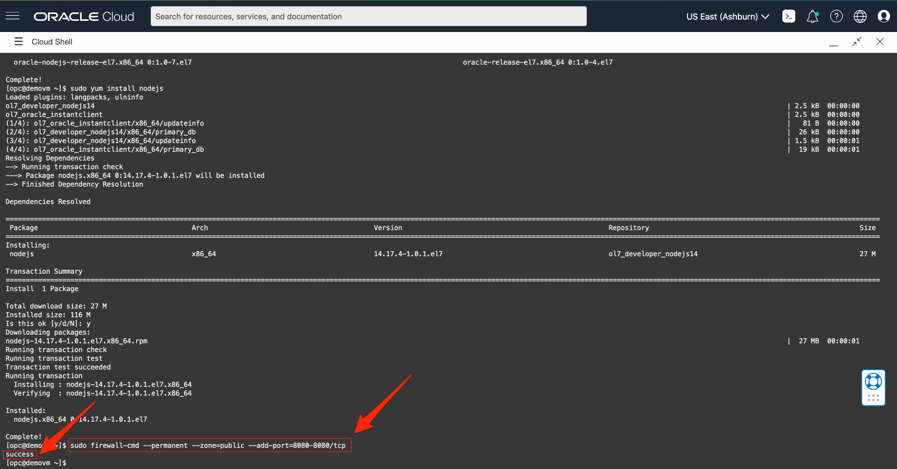
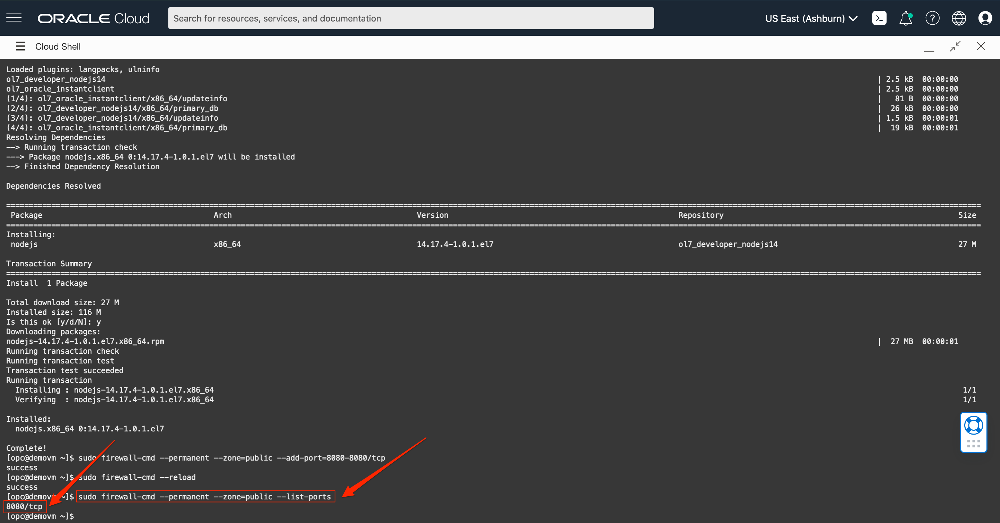
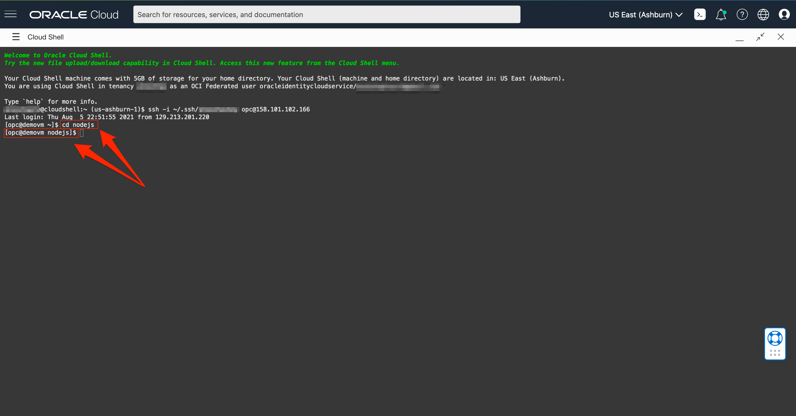
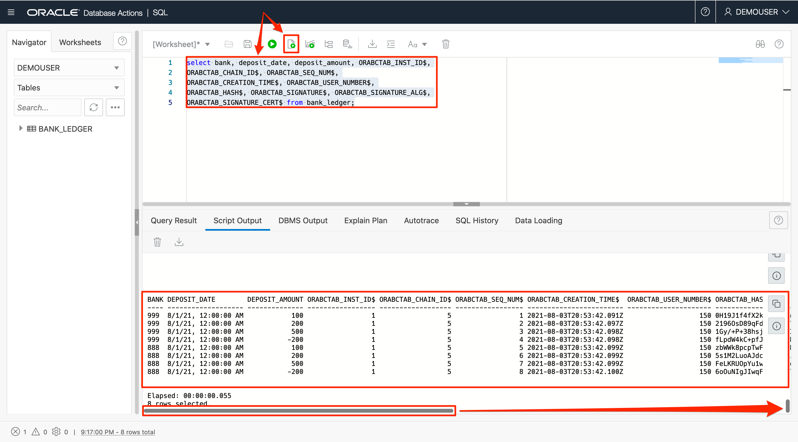

# Install Node.js in Compute Instance and Deploy the Application

## Introduction

In this lab, let's install Node.js in the compute instance, deploy the application and sign a row in the database from the cloud shell.

Estimated Time: 10 minutes

### Objectives

In this lab, you will:

- Install Node.js in the compute instance
- Open Firewall for Ports
- Download and deploy the application
- Sign the row

### Prerequisites

This workshop assumes you have:

- Have successfully completed all the previous labs

## Task 1: Install Node.js in the Compute Instance

Now that the virtual machine is provisioned, let us see how to install Node.js for the Node.js application to interact with the Autonomous database rest end points.

1. Navigate back to the tab with Oracle Cloud console. If you are logged out of cloud shell, click on the cloud shell icon at the top right of the page to start the Oracle Cloud shell and SSH into the instance using this command.

    ````
    ssh -i ~/.ssh/<sshkeyname> opc@<Your Compute Instance Public IP Address>
    ````

    

2. To install Node.js we need to have oracle-release-el7 repo added to the virtual machine via sudo. This will take about a minute and will say "Complete!" when finished.

    ```
    <copy>
    sudo yum install -y oracle-nodejs-release-el7 oracle-release-el7
    </copy>
    ```
    

3. Run this command to install Node.js to set up the run time environment. Type `y` when prompted. After installing, it will print "Complete!".

    ```
    <copy>
    sudo yum install nodejs
    </copy>
    ```
    

## Task 2: Open Firewall for Ports

To connect to the Autonomous Database instance from the virtual machine we need to open firewall ports. Oracle linux compute instance internal firewall do not have any port enabled by default. We need to enable a port.

1. Run this sudo command to permanently add port 8080 under the public zone.

    ```
    <copy>
    sudo firewall-cmd --permanent --zone=public --add-port=8080-8080/tcp
    </copy>
    ```
    

2.  Reload the firewall to make sure if the port is added.

    ```
    <copy>
    sudo firewall-cmd --reload
    </copy>
    ```
    

3.  List all the ports to see that port 8080 is available. If it displays 8080/tcp means that the virtual machine firewall that comes by default with Oracle linux has enabled the 8080 port on TCP protocol.

    ```
    <copy>
    sudo firewall-cmd --permanent --zone=public --list-ports
    </copy>
    ```
    

## Task 3: Deploy the Application

In the Oracle Linux virtual machine, since we have the Node.js installed and the ports are enabled, let's download and deploy the application.

1.  Navigate to nodejs folder.

    ```
    <copy>
    cd nodejs
    </copy>
    ```
    

2.  Now, let's modify the index.js file with your ATP instance URL and Certificate GUID. Copy and paste the below command in notepad, replace `<paste your atp url>` in the command below with your ATP URL and hit `Enter`.

    ```
    sed -i 's,atp-url,<paste your atp url>,g' index.js
    ```

    Your command should look like this:

    ```
    sed -i 's,atp-url,https://fw8mxn5ftposwuj-demoatp.adb.us-ashburn-1.oraclecloudapps.com,g' index.js
    ```

3.  Copy and paste the modified command in cloud shell and hit `Enter`. This command searches for the string `atp-url` in the index.js file and replaces with your ATP URL.

    

4.  Copy and paste the below command in notepad, replace `<paste your certificate guid>` in the command below with your Certificate GUID noted earlier.

    ```
    sed -i 's,cert-guid,<paste your certificate guid>,g' index.js
    ```

    Your command should look like this:

    ```
    sed -i 's,cert-guid,C8D2C1F00236AD7CE0533D11000AE2FC,g' index.js
    ```

5. Copy and paste the modified command in cloud shell and hit `Enter`. This command searches for the string `cert-guid` in the index.js file and replaces with your Certificate GUID.

    

6. Duplicate the current tab in the browser.

    

7. Let's reconnect into the compute instance. Click on the cloud shell icon at the top right of the page to start the Oracle Cloud shell and SSH into the instance using the command.

    ````
    ssh -i ~/.ssh/<sshkeyname> opc@<Your Compute Instance Public IP Address>
    ````

    

8.  Navigate to the nodejs folder and run the command to deploy the application. Once we run the `node bin/www` command the Node.js application will be running and will be listening on port 8080.

    ```
    <copy>
    cd nodejs
    node bin/www
    </copy>
    ```

    If the cursor is idle this means the nodejs application is running.

    

## Task 4: Sign the Row

Let's use the curl command to send a REST request to the node.js application we’ve just started. This will cause the application to:

    - Retrieve the content of the row using DBMS_BLOCKCHAIN_TABLE.GET_BYTES_FOR_ROW_SIGNATURE procedures
    - Invoke openssl command to generate a signature using your private key
    - Add the signature to the row using DBMS_BLOCKCHAIN_TABLE.SIGN_ROW procedure, at which point the database will use your certificate GUID to retrieve the certificate, extract the public key, and verify that the signature generated using your private key in the node.js application is valid based on the data present in the row and the public key in your X.509 certificate

If the signature and data are verified with the public key, the signature field is stored in the table and the application returns status 200 and a success message. If this fails, it returns error status 400.

1. Navigate back to the previous cloud shell window that does not have the Node.js application running.

2. Replace the number 1 for the instanceId, chainId and seqId and update with your noted instanceId, chainId and seqId values in the below command and hit enter.

    ```
    curl --location --request POST 'http://localhost:8080/transactions/row' --header 'Content-Type: application/json' --data '{"instanceId":1,"chainId":1,"seqId":1}'
    ```

    After replacing the instanceId, chainId and seqId values in the command, it should look like this:

    ```
    curl --location --request POST 'http://localhost:8080/transactions/row' --header 'Content-Type: application/json' --data '{"instanceId":1,"chainId":5,"seqId":1}'
    ```

3. Notice JSON message with status 200 and message displayed is `Signature has been added to the row successfully` which means that the row how has been signed successfully.

    

4. To verify, navigate back to the tab with Blockchain APEX application with the List of Transactions and refresh the tab. Notice that the row with the values Instance ID - , Chain ID - and Seq ID - `IS Signed` column should display a green tick from which indicates that the row is signed successfully.

    

5. Navigate back to SQL Developer Web and query all the columns in the `bank_ledger` table to view the actual values in the signature and GUID columns.

    Scroll to the output to the right and notice values in the orabctab_signature$, _signature_alg$, and _signature_cert$ columns.

	```
	<copy>
	select bank, deposit_date, deposit_amount, ORABCTAB_INST_ID$,
	ORABCTAB_CHAIN_ID$, ORABCTAB_SEQ_NUM$,
	ORABCTAB_CREATION_TIME$, ORABCTAB_USER_NUMBER$,
	ORABCTAB_HASH$, ORABCTAB_SIGNATURE$, ORABCTAB_SIGNATURE_ALG$,
	ORABCTAB_SIGNATURE_CERT$ from bank_ledger;
	</copy>
	```

	


## Acknowledgements

* **Author** - Mark Rakhmilevich, Anoosha Pilli
* **Contributors** - Anoosha Pilli, Salim Hlayel, Brianna Ambler, Product Manager, Oracle Database
* **Last Updated By/Date** - Anoosha Pilli, September 2021

