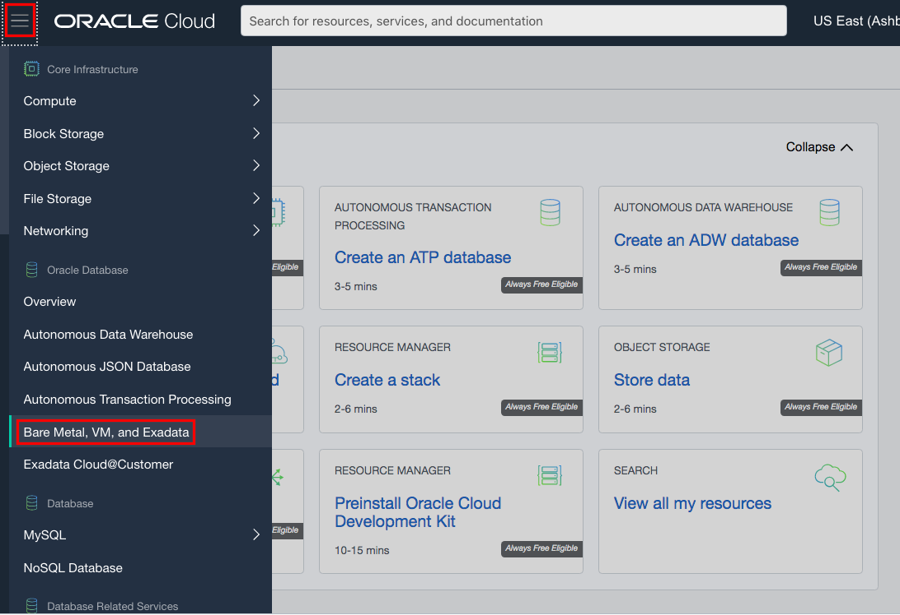
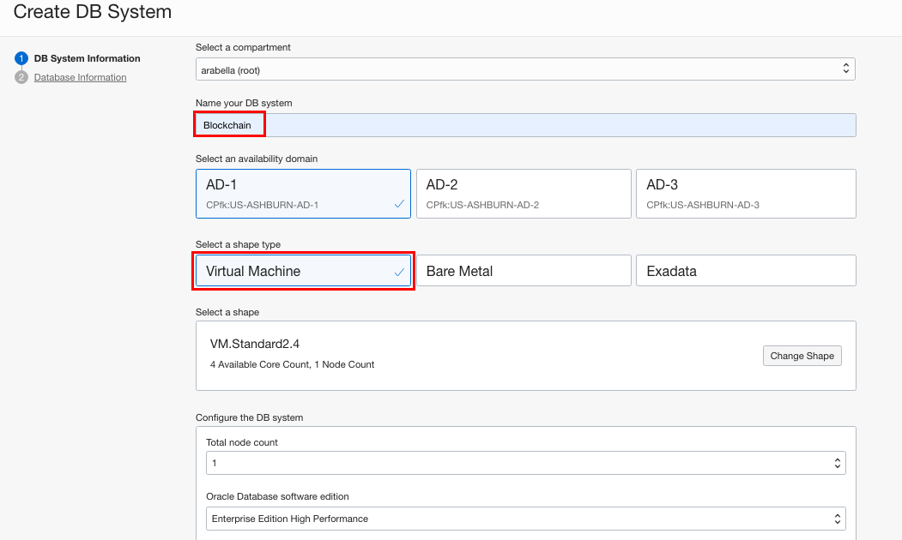
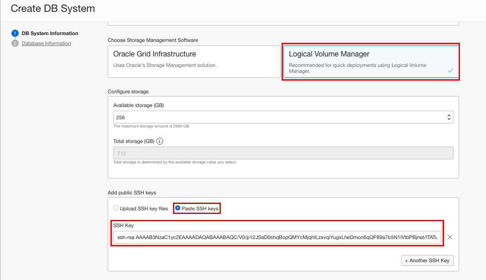
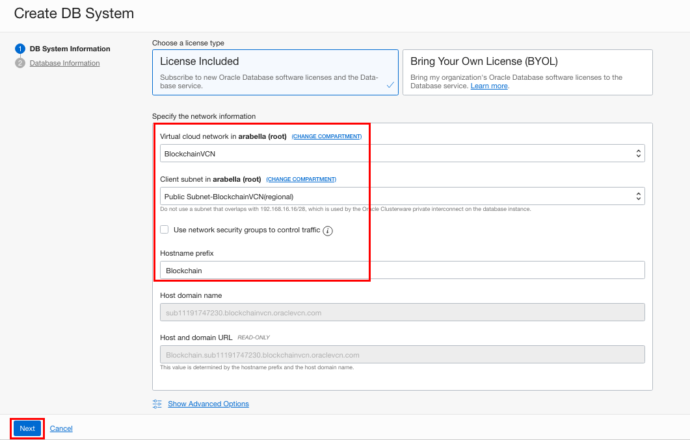
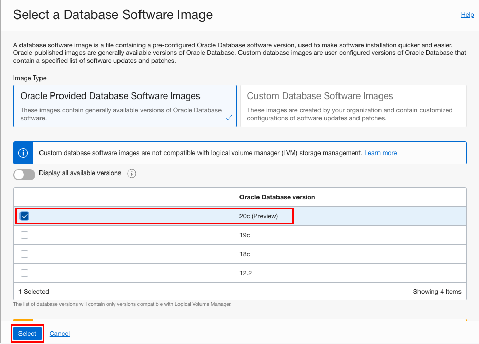
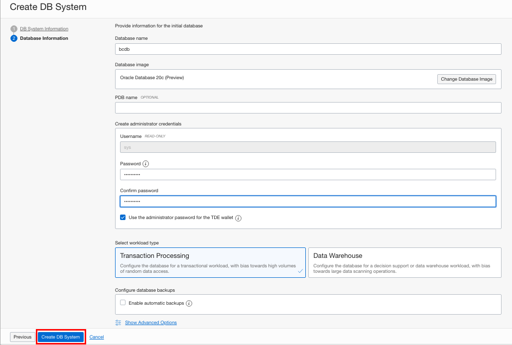
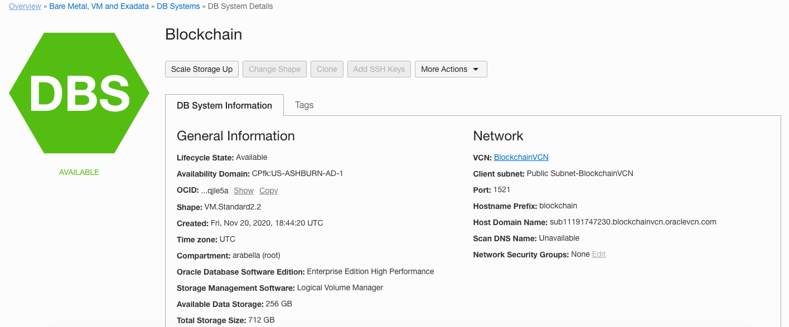
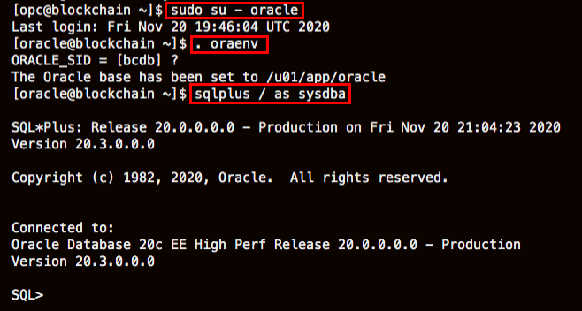

# Provision an Oracle Database 20c Instance
## Introduction

This lab walks you through the steps to create an instance of an Oracle 20c Preview Database running in Oracle Cloud Infrastructure. Oracle Cloud Infrastructure provides several options for rapidly creating a Database system for development and testing, including fast provisioning of 1-node virtual machine database systems.

### Prerequisites

* An Oracle Cloud paid account or free trial. To sign up for a trial account with $300 in credits for 30 days, click [here](http://oracle.com/cloud/free).
* SSH Keys
* A Virtual Cloud Network (VCN)

## Task 1: Create a Database Virtual Machine

1. From the Console menu, click on **Bare Metal, VM, and Exadata**.

  

2. Select the compartment you want to create the database in and click on **Create DB System**.

  

3. On the DB System Information form, enter the following information:

    * In the **Name your DB system** field, give your database a name.
    * Select an **Availability Domain**.
    * Select the **Virtual Machine** shape type.
  


    * Select **Logical Volume Manager** as the Storage Management Software.
    * In the **Add public SSH keys** section, select **Paste SSH keys** and paste in your SSH key copied earlier.
  


    * In the **Specify the Network information** section, select the VCN you created using the drop down list.
    * Select the public subnet using the drop down list.
    * Enter a hostname prefix.
    * Click **Next**.
  

4. On the Database Information form, enter the following information:

    * In the **Database name** field, change the default database name.
    * Select **Change Database Image** and select **20c**.
    

    * Enter a password for your sys user in the **Password** field and then repeat the password in the **Confirm password** field.
    * Click **Create DB System**.
    

5. After a few minutes, your Database System will change color from yellow (Provisioning) to green.
    
    

## Task 2: Connect to the Database using SSH

1. On the **DB System Details** page, scroll down and click **Nodes**.

  

   Note the IP address.

2. In a cloud shell, navigate to the folder where you created the SSH keys and enter this command, using your IP address:

    ```
    <copy>ssh -i <ssh_key_name> opc@<IP_address> </copy>
    ```
  

3. Once connected, you can switch to the "oracle" OS user and connect using SQL*Plus:

    ```
    <copy> sudo su - oracle </copy>
    ```

    ```
    <copy> . oraenv </copy>
    ```
    Press enter and copy the following:
    
    ```
    <copy> sqlplus / as sysdba </copy>
    ```
    

## Learn More

* [Oracle Cloud Infrastructure: Creating Bare Metal and Virtual Machine DB Systems](https://docs.cloud.oracle.com/en-us/iaas/Content/Database/Tasks/creatingDBsystem.htm)
* [Oracle Cloud Infrastructure: Connecting to a DB System](https://docs.cloud.oracle.com/en-us/iaas/Content/Database/Tasks/connectingDB.htm)

## Acknowledgements
* **Author** - Tom McGinn, Learning Architect, Database User Assistance
* **Contributors** - Kamryn Vinson, Database Product Management
* **Last Updated By/Date** - Kamryn Vinson, November 2020

