# Enrich Metadata

## Introduction

The technical metadata that you harvest from a data source has details such as the table name, column name, and datatype. As a data consumer, these details may not provide you enough information to understand the data and use it. To determine if a data source is the right data for you, you also need to understand the business aspect of the data. For example, what is the data about, what is its intended usage, who owns this data, how often is the data updated; and in general, the tribal knowledge about the data.

In this lab you will be a data provider and use the glossary and custom properties to enrich the harvested technical metadata from the previous labs.

Estimated Time: 45 minutes

### Objectives

In this lab, you will:
* Populate custom property for a catalog object
* Populate custom properties in bulk using Export/Import
* Tag Data Assets
* Tag Data Entities
* Link glossary terms

### Prerequisites

Complete Lab 0-4.

## Task 1: Populate Custom Property for a Catalog Object

You can set values of customer properties for each object of the associated type. In this task you will set value for the Data Owner customer property for a table.

1. Access the Data Entities tab by clicking **Data Entities** on the Home tab.

    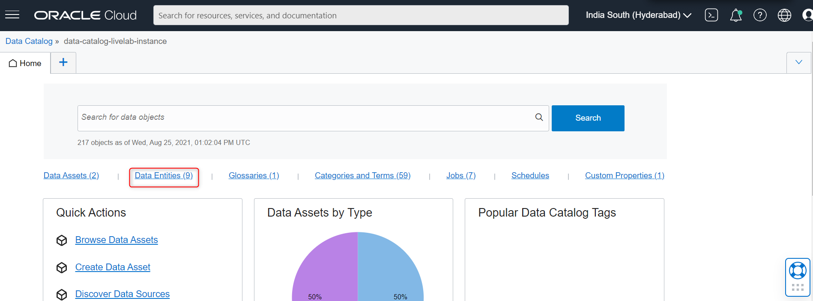

2. In the Data Entity list, select the **data entity** you want to edit. The data entity details tab opens.

    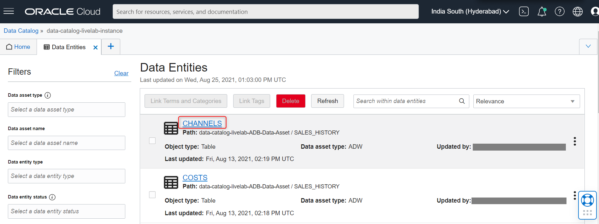

3. Click **Edit** link from the Custom Properties section. The Edit Custom Properties panel opens as an overlay.

    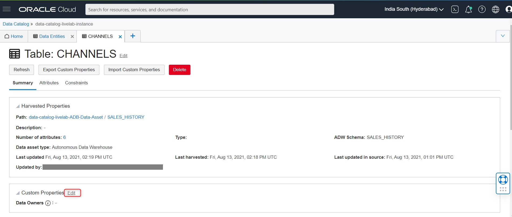

4. Make the required edits to the data entity **custom properties**.

5. Click **Save Changes**.

    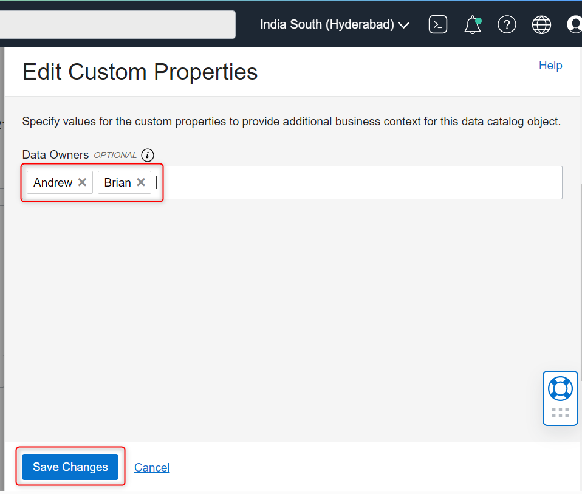

	You can now see the changes in **Custom Properties** on Data Entities Summary tab.

    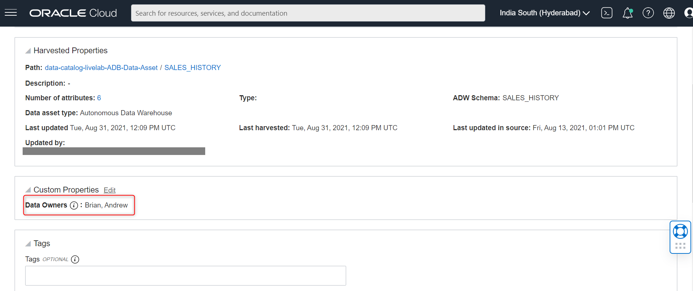

## Task 2: Populate Custom Properties in Bulk Using Export/Import

Populating the custom property values for objects in a catalog can be a tedious job given the volume of data in a catalog. To resolve this problem you can populate the values in bulk by using the export/import of custom properties.

In this task you will set values of the Data Owner custom property for multiple objects

1. Type ADW Schema name in the Search box and click **Search** on the Home tab.

    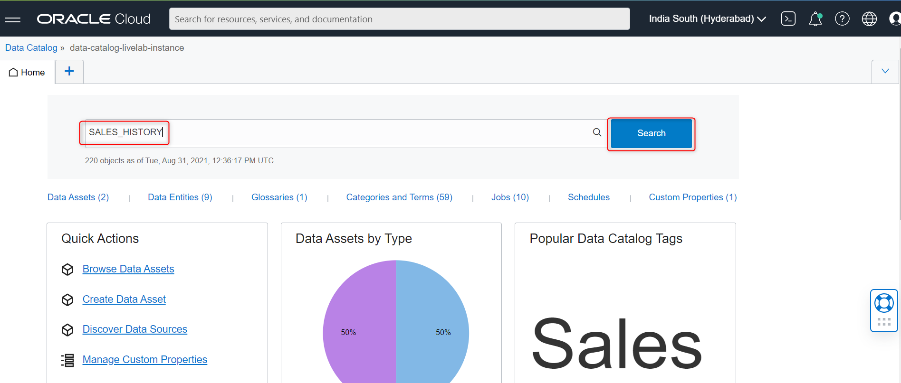

2. Then click on the ADW Schema

    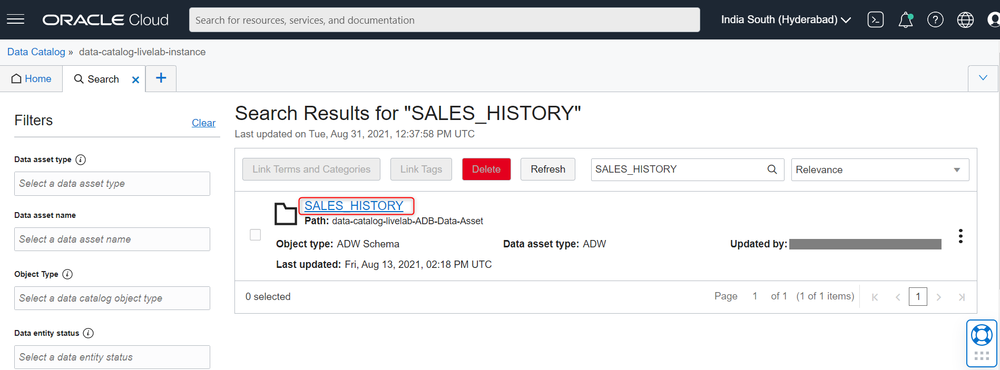

3. Click **Export Custom Properties** link.

    

4. Select the **object types** to export custom property values for and then click **Export**

    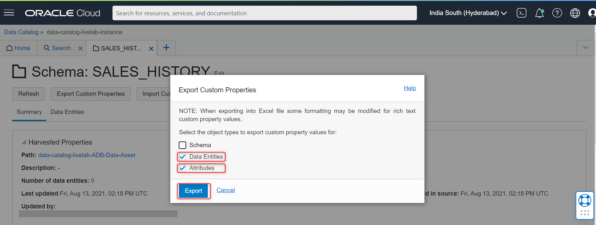

5. Open the **Data Entity** sheet from the exported file to see all the existing Custom Properties.

	**Note :** As none of the custom properties are associated with an attribute, the Excel file does not have an Attribute tab.

    

6. Enter the values (each value in the new line) from allowed set of values to Custom Properties for each Object and **Save** the file.

    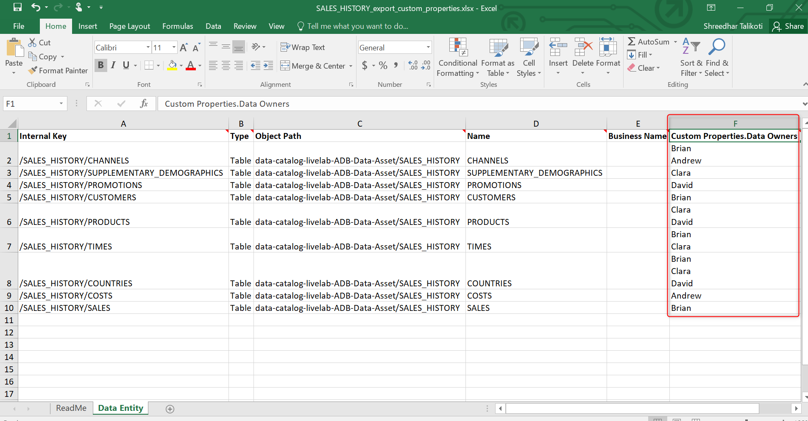

7. Click **Import Custom Properties** link.

    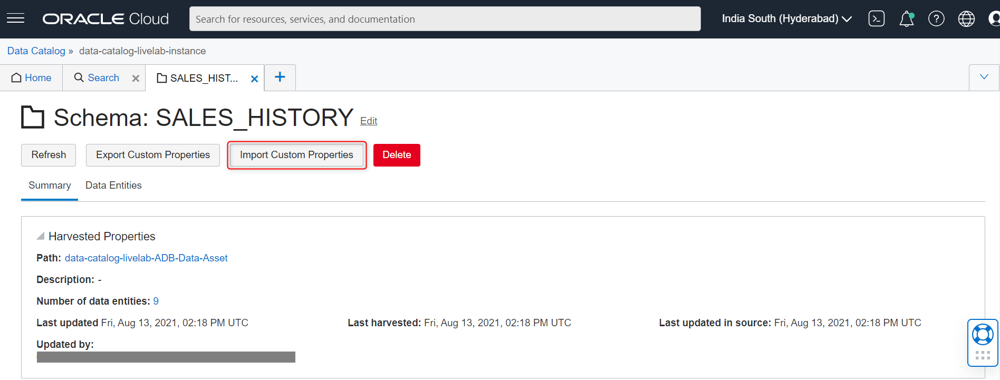

8. Select **Skip empty values in the excel file** and click **Import**.

    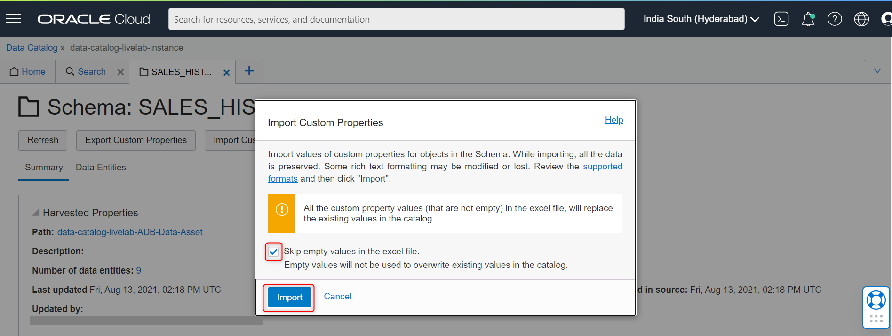

9. Choose the excel file that was updated and **Open**.

    

10. Access the **Data Entities** from Home tab.

    

11. From the Data Entities list, click **Entity** on which you want see the Custom Properties changes.

    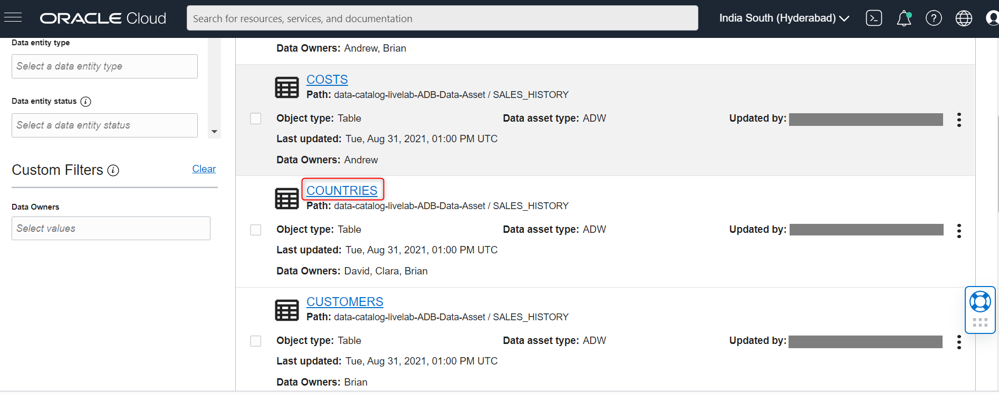

	You can observe the values updated in the excel reflect on the Custom Properties tab.

    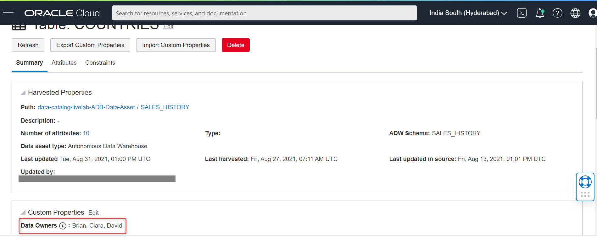

## Task 3: Link Tags 

Tags are free-form annotations that can be used to capture specific details at an object level without any predefined meaning. You can set Tags for objects that you want to classify in an informal manner. Tags are free-form annotations that can be used to capture specific details at an object level without any predefined meaning. You can set Tags for objects that you want to classify in an informal manner.

In this task you will set **Sales** tag for the data asset and a few entity type objects

### **Tag Data Assets**

You link data objects to tags so that you can locate it easily at a later point in time.

Here is how you tag assets:

1. Access the **Data Assets** tab.

    

2. Click **data asset name** you want to tag.

    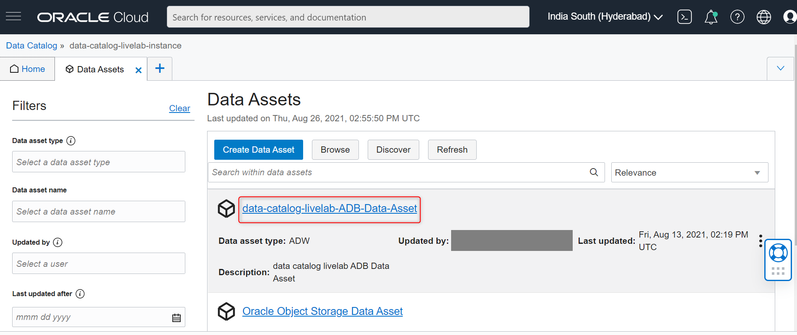

3. Click **Tags** in the Summary tab of the data asset details tab.

4. Enter one or more keywords you want to tag this data asset with and press **Enter**.

	The updates to the tags are automatically saved.

    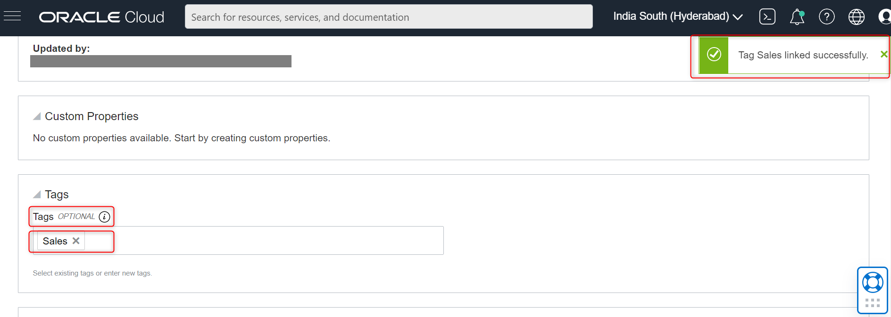

### **Tag Data Entities**

Here is how you tag data entities:

1. Access the **Data Entities** tab.

    

2. From the Data Entities list, select the **check box** for the data entities that you want to annotate.

    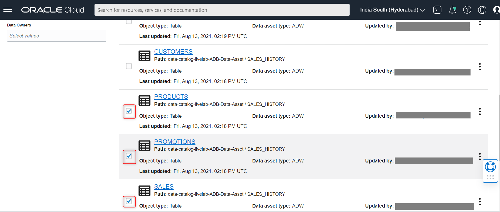

3. Click **Link Tags**.

    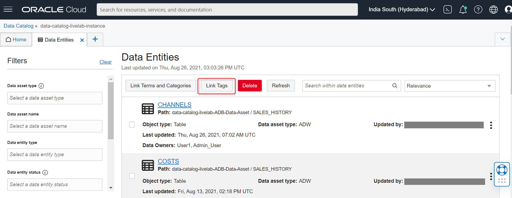

4.  A Link Tag panel opens as an overlay. From the Link Tag panel, **select** one or more tags that you want to use to annotate the data entities.

5. Click **Link**.

    

	A notification displays indicating that the tags are linked successfully and the Link Tag panel closes.

    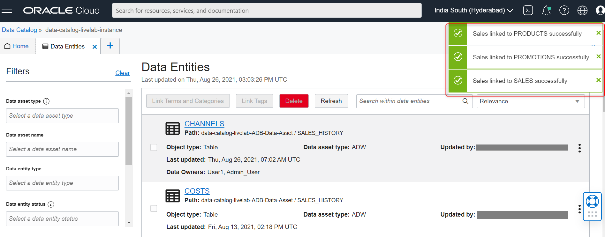

## Task 4: Link Glossary Terms 

Linking glossary terms to the techical objects in the catalog enables business users to better understand the data and its business aspect.
In this task you will link a glossary term to a Table object. You will then link the term to multiple objects from a recommended list of objects.

1. Access the **Data Entities** tab.

    

2. From the Data Entities list, click **Entity** on which you want to link the glossary term.

    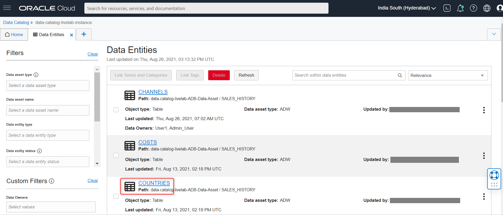

3. In the Summary tab, go to **Business Glossary Terms and Categories**, click **Link Terms and Categories**.

    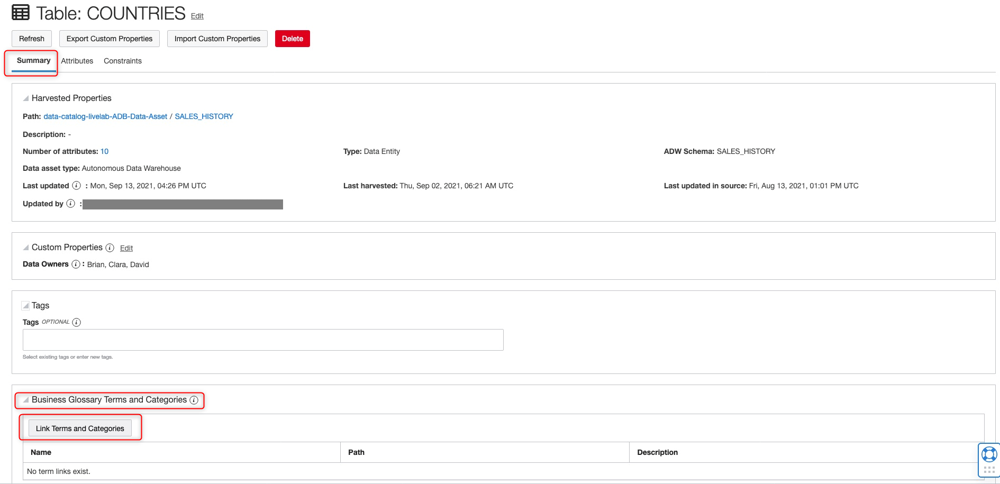

4.  A Link Terms and Categories panel opens as an overlay. In the **Search by name** box, enter the name of **Glossary Terms** that you want to link to the Data Entity. Click **Search** icon.

5. **Select** one or more Glossary Terms that you want to use to annotate the data entities.

6. Click **Link**.

    

	A notification appears indicating that the terms are linked successfully and the Link Tag panel closes. You can also view the recommendations for each term by the data catalog engine. To view and accept a recommendation, follow these steps:

7.	Click the specific **Term** for which you want to view recommendations.

    

8. Click **Linked Objects**.

    

9. Select the check box to accept all the recommendations in the particular page and click **Accept**.

    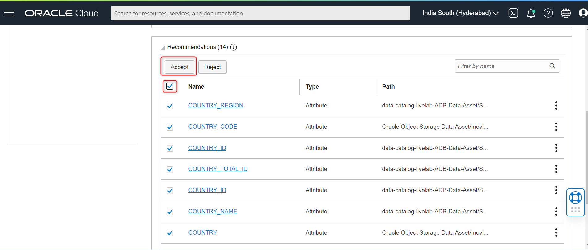

10. Repeat for the other objects.

    

11. You can now see all the **Objects** that are linked to the **Term**.

    

    **Congratulations!** You can now **proceed to the next lab**.

## Learn More

* [Get Started with Data Catalog](https://docs.oracle.com/en-us/iaas/data-catalog/using/index.htm)
* [Data Catalog Overview](https://docs.oracle.com/en-us/iaas/data-catalog/using/overview.htm)
* [Autonomous Data Warehouse](https://docs.oracle.com/en/cloud/paas/autonomous-data-warehouse-cloud/index.html)
* [Object Storage](https://docs.oracle.com/en-us/iaas/Content/Object/Concepts/objectstorageoverview.htm)
* [OCI Identity and Access Management](https://docs.oracle.com/en-us/iaas/Content/Identity/Concepts/overview.htm)
* [Managing Groups in OCI](https://docs.oracle.com/en-us/iaas/Content/Identity/Tasks/managinggroups.htm)
* [Overview of VCNs and Subnets](https://docs.oracle.com/en-us/iaas/Content/Network/Tasks/managingVCNs_topic-Overview_of_VCNs_and_Subnets.htm#Overview)
* [Managing Compartments in OCI](https://docs.oracle.com/en-us/iaas/Content/Identity/Tasks/managingcompartments.htm)

## Acknowledgements

* **Author** - Shreedhar Talikoti, Ramkumar Dhanasekaran
* **Contributors** -  Rashmi Badan, Sreekala Vyasan
* **Last Updated By/Date** - Shreedhar Talikoti, Aug 2021
