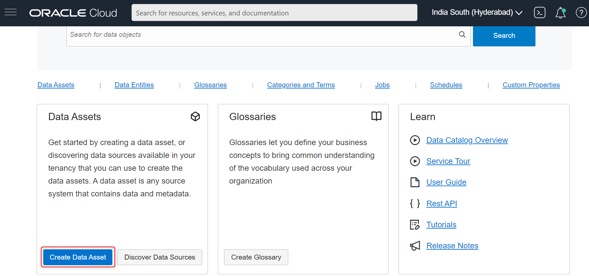
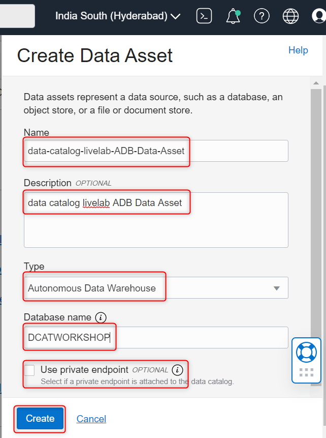
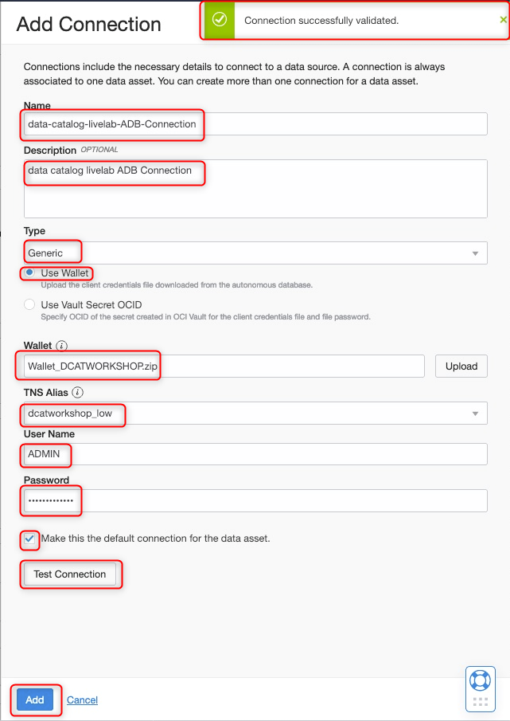
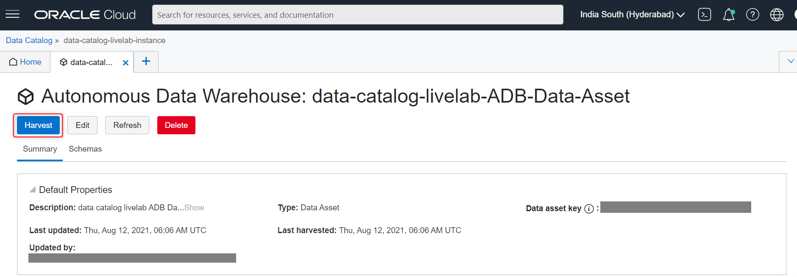
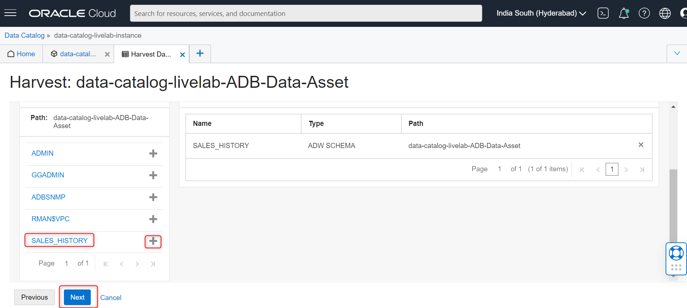
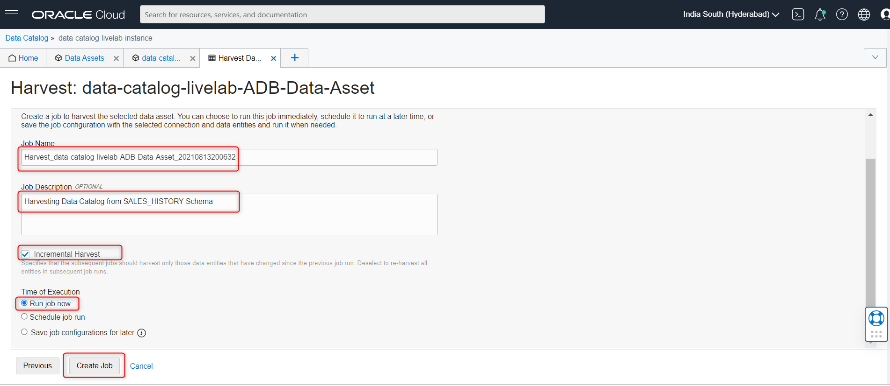
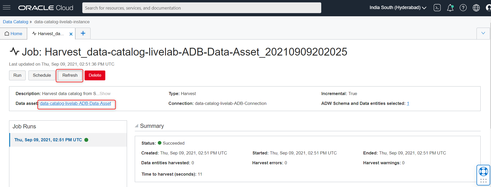

# Harvest Metadata from Autonomous Database

## Introduction

A data source is represented by a data asset in the catalog. In this lab you will create a data asset for the autonomous data warehouse that was created in a previous lab. You will then add a connection to the data asset and harvest metadata for the schema and tables from the database. Harvesting is the process of extracting technical metadata from your data assets to your data catalog repository.

Estimated Time: 45 minutes

### Objectives

In this lab, you will:
* Create an Autonomous Database Data Asset
* Harvest metadata from Autonomous Database

###Prerequisites

Complete Lab0 : Steps 1-5 and  Lab1

## Task 1: Create an Autonomous Database Data Asset

You create a data asset to register the data source you want to harvest with Data Catalog.

To create a data asset, you need to specify data source details required to register your data source. The details differ depending on the data source you use to create your data asset. Then, you add a connection for the data asset.

1. On your data catalog instance Home tab, click **Create Data Asset** from the Quick Actions tile. You can also click **Create Data Asset** on the Data Assets tab.

    

2. In the Create Data Asset panel, enter a **Name** to uniquely identify your data asset. You can edit the name later.

3. Optionally, enter a **Description** to specify the need or purpose for creating this data asset. Both **Description** and **Name** are searchable fields in the Data Catalog.

4. From the **Type** drop-down list, select one of the **Autonomous Data Warehouse** or **Autonomous Transaction Processing** databases that you want to use. Additional fields display.

5. In the **Database Name** field, enter the name of your Autonomous Data Warehouse or Autonomous Transaction Processing database.

6. Do not select **Use private endpoint** check box as the data asset is hosted in public network.

7. Click **Create**. A notification displays indicating that the data asset is created successfully and the Create Data Asset panel closes.

	

## Task 2: Add Connection

After you register a data source as a data asset in your data catalog, you create a connection to your data asset to be able to harvest it. You can create multiple connections to your data source. At least one connection is needed to be able to harvest a data asset.

1. To add a connection for an autonomous database data asset, in the Summary tab on the data asset details tab, under Connection Information, click **Add Connection**.

	

2. In the Add Connection panel, enter a unique **Name** for your connection.

3. (Optional) Enter a short **Description** for the connection.

4. From the Type drop-down list, select **Generic**.

5. Select the radio button **Use Wallet** to upload the client credentials file.

6. For **Wallet**, upload the client credentials file downloaded from your autonomous database.

7. From the **TNS Alias** drop-down list, select a TNS Alias. For better performance, select the <name>_low option.

8. In **User Name**, enter the admin user name that was set when the autonomous database was created.

9. In **Password**, enter the password for the autonomous database admin user name.

10. Specify if you want this connection to be the default connection for the data asset.

11. Click **Test Connection**. A notification displays indicating if the test connection was successful or failed.

12. Click **Add**. The connection details are saved successfully for the data asset.

	

You can now harvest the data asset, and annotate the harvested data entities and attributes with terms and tags.

## Task 3: Harvest Metadata from Autonomous Database                             

After you create a data asset in the Data Catalog repository, you harvest the data asset to extract the data structure information into the Data Catalog and view its data entities and attributes.

To harvest a data asset, you must have created at least one connection to the data asset.

Here is how you harvest data entities from a data asset:

1. Once the Connection is added, Click **Harvest** on the data asset **Summary** tab.

	

2. The **Select Connection** tab displays and the default connection is selected. Change it if required. Select the connection you want to use to harvest the data asset and click **Next**.

	

3. The **Select Data Entities** tab displays all the available Schema. View and add all the data entities you want to harvest from the Available Folders / Data Entities section. Click add icon for each data entity you want to include in the harvest job. Expand the data entity folders to view the nested data entities and include them. Select **SALES_HISTORY**, click **+** and then click **Next**.

	

4. The Create Job tab displays. In the **Job Name** field, enter a unique name to identify the harvest job. Optionally, enter a **Description**.

5. Select the **Incremental Harvest** check box if you want subsequent runs of this harvesting job to only harvest data entities that have changed since the first run of the harvesting job.

6. Select **Run job now** to specify the time of execution for the harvest job. Below are the three options.
	* **Run job now:** Creates a harvest job, runs it immediately.
	* **Schedule job run:** Displays more fields to schedule the harvest job. Enter a name and description for the schedule. Specify how frequently you want the job to run. Your choices are hourly, daily, weekly, and monthly. Finally, select the start and end time for the job.
	* **Save job configurations for later:** Creates a job to harvest the data asset, but the job is not run.

7. Click **Create Job**.

	

8. The harvest job is created successfully and the Jobs tab displays. On the Jobs tab, you track the status of your job and view job details. After your data asset harvest job is succeeded, click the Job Name.

	

9. Click **Refresh** on the job details page if required and then click **Data Asset**.

	

10. Click **Refresh** on the Data Asset details page if required and then click **Schemas** to see the harvested schema.

	

    **Congratulations!** You can now **proceed to the next lab**.

## Learn More

* [Get Started with Data Catalog](https://docs.oracle.com/en-us/iaas/data-catalog/using/index.htm)
* [Data Catalog Overview](https://docs.oracle.com/en-us/iaas/data-catalog/using/overview.htm)
* [Autonomous Data Warehouse](https://docs.oracle.com/en/cloud/paas/autonomous-data-warehouse-cloud/index.html)
* [Object Storage](https://docs.oracle.com/en-us/iaas/Content/Object/Concepts/objectstorageoverview.htm)
* [OCI Identity and Access Management](https://docs.oracle.com/en-us/iaas/Content/Identity/Concepts/overview.htm)
* [Managing Groups in OCI](https://docs.oracle.com/en-us/iaas/Content/Identity/Tasks/managinggroups.htm)
* [Overview of VCNs and Subnets](https://docs.oracle.com/en-us/iaas/Content/Network/Tasks/managingVCNs_topic-Overview_of_VCNs_and_Subnets.htm#Overview)
* [Managing Compartments in OCI](https://docs.oracle.com/en-us/iaas/Content/Identity/Tasks/managingcompartments.htm)

## Acknowledgements

* **Author** - Shreedhar Talikoti
* **Contributors** -  Rashmi Badan, Sreekala Vyasan
* **Last Updated By/Date** - Ramkumar, Aug 2021
