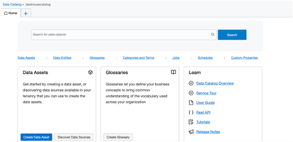

# OCI Data Catalog, OCI Data Integration and Data Assets

## Introduction

Here we will create our OCI Data Catalog and OCI Data Integration workspace first and create a couple of additional data assets along with discovering our ADW database as a data asset.

Estimated Time:15 minutes

### About Product

In this lab, we will learn more about the OCI Data Catalog which is used in enterprises to manage technical, business and operational metadata - see the [documentation](https://docs.oracle.com/en-us/iaas/data-catalog/home.htm) for more information.

We will also discuss OCI Data Integration as part of data asset ETL and you can learn more here - [documentation](https://docs.oracle.com/en-us/iaas/data-integration/home.htm).

### Objectives

- Learn how to create OCI Data Catalog
- Learn how to create OCI Data Integration Workspace
- Learn how to discover and create new data assets

## Task 1: Create the OCI Data Catalog

In this task, you will create the OCI Data Catalog. Review options for creating business term to sync with the metadata for the data assets

Click on Create Data Catalog. Create in Compartment, lakehouse1, and name the catalog, lakehousecatalog. Click on Create.

Explore the Data Catalog:
- Data Assets, some we will discover and others we will just create to use with this data lake.
- Data Entities, these come from the data assets as there can multiple entities in each data asset
- Glossaries, these are business terms for mappings of the data and definitions with columns and data assets.
- Catagories and Terms, more business terms can be defined here to maintain consistent groupings of data.
- Jobs, refresh and harvest data jobs that will be run and scheduled to keep data current.

## Task 2: Discover data assets and configure connections for new data assets

In this step, you will discover the data assets already available in the ADW and Object Storage. We will also create new data assets that we might get from another source or API.
From the Quick Menu on the Home tab, click Discover Data Sources.

As you can we have our data warehouse database available and our object storage buckets. Click the box and then click Create Data Asset. The name and description and type will automatically be filled in and you can adjust and make changes as needed. Do these steps for both the ADW Database and object storage buckets.

The data asset will then be added to this data catalog.

## Task 3: Create the OCI Data Integration workspace

Creation of the OCI Data Integration workspace required the VPN, groups and policies that we configured during the setup of the environment for the Lakehouse. Now it is a matter of navigating to the Data Integration space and creating the workspace which will in turn allow us to create ETL processes.

You may now [proceed to the next lab](#next).

## Acknowledgements

* **Author** - Michelle Malcher, Database Product Management
* **Contributors** -  
* **Last Updated By/Date** - Michelle Malcher, Database Product Management, September 2021
