# OCI Data Integration, OCI Data Catalog and Data Assets

## Introduction

Here we will create our OCI Data Catalog and OCI Data Integration workspace first and create a couple of additional data assets along with discovering our ADW database as a data asset.

Estimated Time: 15 minutes

Watch the video below for a quick walk through of the lab.

[](youtube:D0Y8chE7kJg)

### About Product

In this lab, we will learn more about the OCI Data Catalog which is used in enterprises to manage technical, business and operational metadata - see the [documentation](https://docs.oracle.com/en-us/iaas/data-catalog/home.htm) for more information.

We will also discuss OCI Data Integration as part of data asset ETL and you can learn more here - [documentation](https://docs.oracle.com/en-us/iaas/data-integration/home.htm).

### Objectives

- Learn how to create OCI Data Integration Workspace
- Learn how to create OCI Data Catalog
- Learn how to discover and create new data assets

## Task 1: Create the OCI Data Integration workspace

Creation of the OCI Data Integration workspace is needed for the data flow and other ETL procedures. Now it is a matter of navigating to the Data Integration space and creating the workspace which will in turn allow us to create ETL processes.

From the home navigation menu, click Analytics & AI and then click Data Integration.

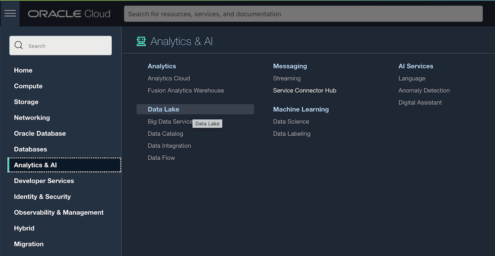

From the Data Integration Service we will create a Workspace which will allow for diagramming the data flows with filters and create execution plans for data into the data assets. First, we must create the workspace and a couple more policies for the workspace to access the object storage and use and update the data in the data lake.

Click on Create Workspace. Name it Workspace Lakehouse, uncheck the Enable the Private Network option and click the Create button.

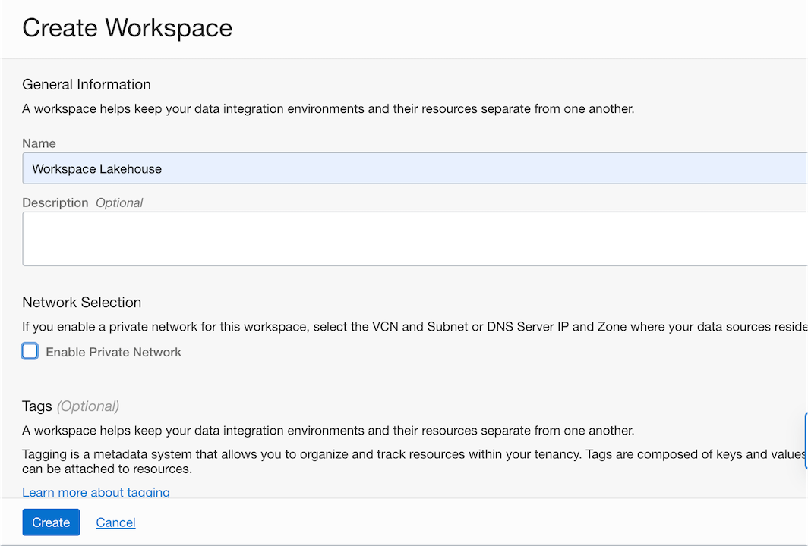

As the workspace is being created copy the OCID by clicking on the menu to the far right of the workspace, and from the pop-up menu click on Copy OCID. This is needed to create policies for access to this workspace.


Note: In another lab or configurations you will want to setup VPNs and a private network, but the focus is on these services for the Lakehouse and additional information on private networks can be

While that is creating, navigate back to Policies. Click on Identity & Security and then Policies.
Create a dataintegrationWS policy. Slide the Show Manual Editor to yes and then you can copy the statements and replace the text in request.principal.id with the copied OCID.

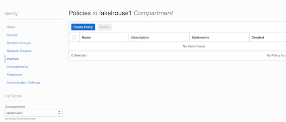

Use the following three allow statements to add into the existing policy, and then Save Changes.

```
<copy>
allow any-user to use buckets in compartment lakehouse1 where ALL {request.principal.type='disworkspace',request.principal.id='REPLACE WITH WORKSPACE OCID'}

allow any-user to manage objects in compartment lakehouse1 where ALL {request.principal.type='disworkspace',request.principal.id='REPLACE WITH WORKSPACE OCID'}

allow any-user {PAR_MANAGE} in compartment lakehouse1 where ALL {request.principal.type='disworkspace',requesst.principal.id='REPLACE WITH WORKSPACE OCID'
}

</copy>
```

Once the workspace has been created (a refresh of the screen might be needed to go from Processing to Active) move onto task 2.

## Task 2: Create the Data Assets in the workspace

Navigate back to the Workspace Lakehouse in Data Integration.
Under Quick Actions, you want to click on **Create Data Asset**


The first data asset is going to be our ADW database we already created. Fill in MOVIESTREAM_ADW and select type to Oracle Autonomous Data Warehouse.


Continue to fill with Select Database, regions, Tenancy OCID which can be found by clicking on your profile, then click on Tenancy and copy the OCID. Make sure the compartment is lakehouse1 and DB is lakehousedb.


Using the default connection you can put in User Name ADMIN and the password you configured for your database, and select the TNS Alias from the dropdown.


Test Connection to make sure you can connect to this data asset and then select create.

Now lets create the second data asset which will be the dataflow-warehouse bucket that you created for data flows. Click on Create Data Asset. Fill in the name **dataflow-warehouse-bucket** Choose **Oracle Object Storage** for **Type**.


Then copy in the Tenancy OCID. The Tenancy OCID you might have saved to the side, but if not, go to the user profile and click on Tenancy and copy the OCID.

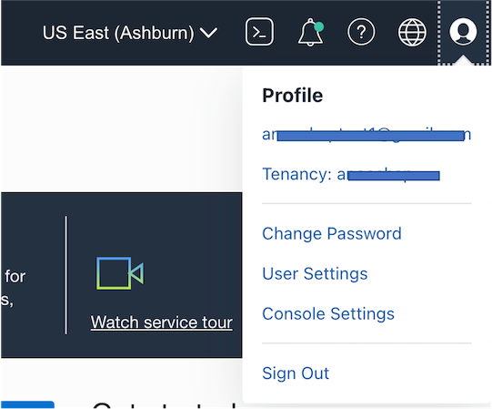

The Namespace will populate once the tenancy was entered and then enter the region ID. The region ID you can get from clicking the dropdown menu by regions and click on manage region. Your current region should be listed at the top of the list.

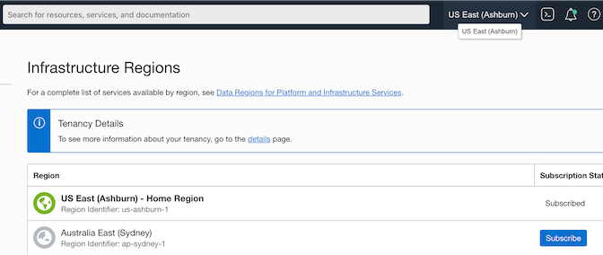

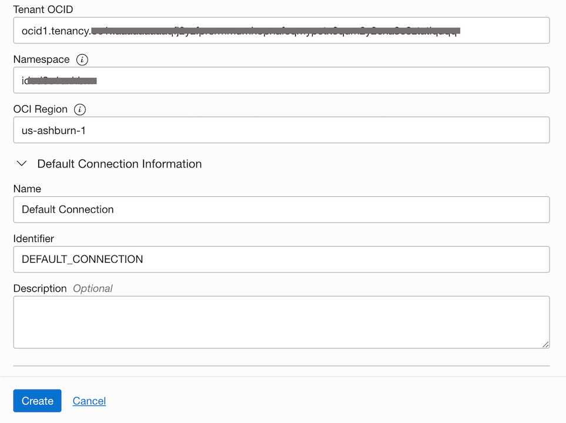

Test Connection to make sure you can connect to the this data asset. Click on 'data assets' to see both of the Data Assets that we have added.


## Task 3: Create a project in the workspace

- Click on the Workspace Lakehouse.
- Click on Projects, and then Create Project
- Enter Name Project_lakehouse
- Click Create


You have now configured this data lake by creating a database, data sources in object storage. Configuration is completed from access to services and are ready to use in this project.

## Task 4: Create the OCI Data Catalog

In this task, you will create the OCI Data Catalog. Review options for creating business term to sync with the metadata for the data assets.
Navigate to the Data Catalog by clicking on Analytics & AI, and then Data Catalog. Then click Data Catalogs.


Click on Create Data Catalog. Create in Compartment, lakehouse1, and name the catalog, lakehousecatalog. Click on Create.

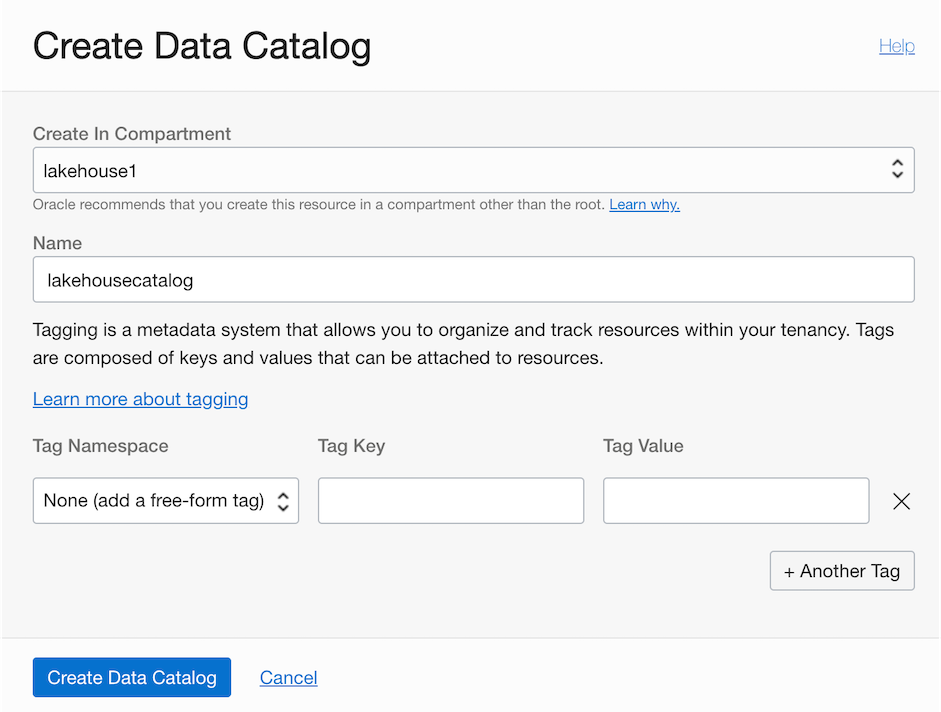

Explore the Data Catalog:

- Data Assets, some we will discover and others we will just create to use with this data lake.
- Data Entities, these come from the data assets as there can be multiple entities in each data asset
- Glossaries, these are business terms for mappings of the data and definitions with columns and data assets.
- Categories and Terms, more business terms can be defined here to maintain consistent groupings of data.
- Jobs, refresh and harvest data jobs that will be run and scheduled to keep data current.


## Task 5: Discover data assets and configure connections

In this step, you will discover the data assets already available in the ADW and Object Storage. We will also create new data assets that we might get from another source or API.
From the Quick Menu on the Home tab, click Discover Data Sources.

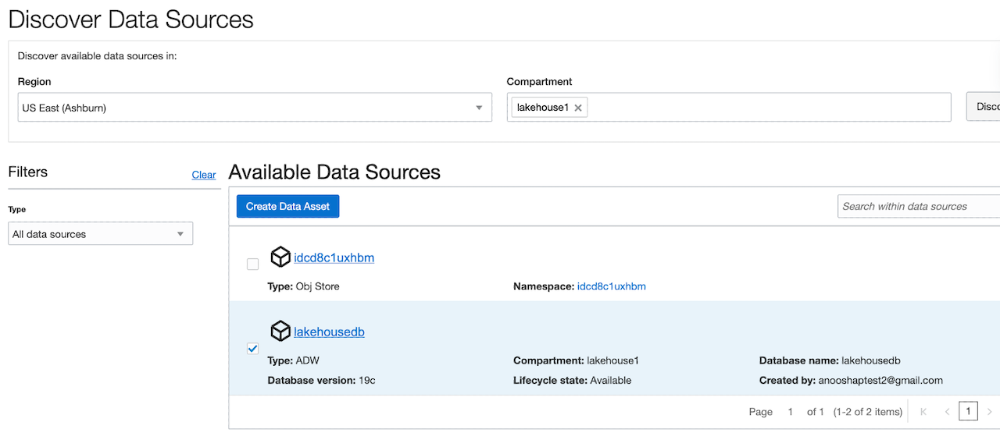

As you can there is the data warehouse database available and object storage buckets. Select the box for the ADW and then click Create Data Asset. The name and description and type will automatically be filled in and you can adjust and make changes as needed. Do these steps for both the ADW Database and the Object Store.

If you manually add the database outside of the discovery, you will need to provide the details that were automatically loaded. The wallet file would have to be copied from the database connection information. Data discovery is the simplest way to go, and you can actually put in other compartments for the catalog.


The connection still needs to be added to be able to harvest the data and any changes, such as new tables, views. The harvesting of the data can be scheduled to happen every hour. Click on Add Connection.

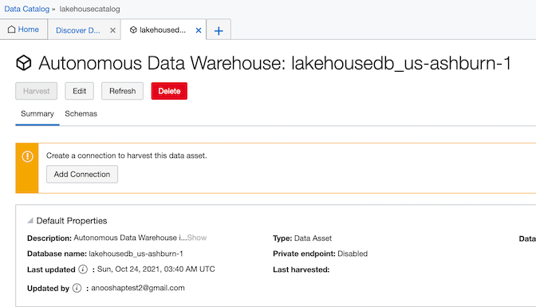

Because of all information coming in from discovery, the connection information is almost all there except for the user name and password. You should be using ADMIN and Password that you set up for the database at creation.

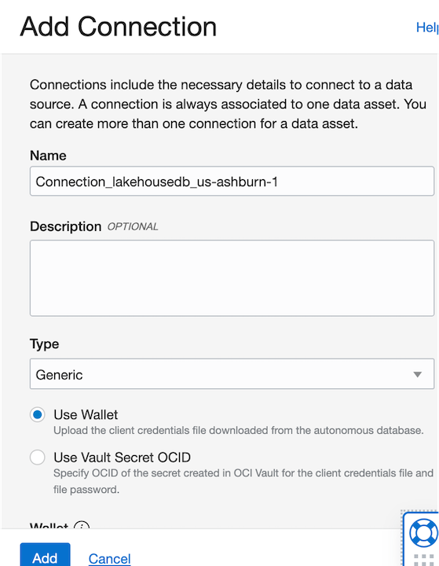

You can test the connection here before performing a harvest of the data asset.


In the next task you will harvest data again, but this would normally be scheduled, but here you can harvest the data now to see the initial tables and as more are added, you will see them appear after the refresh in the entities.


Next we are going to create a data asset for our json file that will be part of our application and scheduled load of files coming into the data lake.

Select Create Data Asset, and fill in the name genre_json and choose the Type to be Oracle Object Storage.

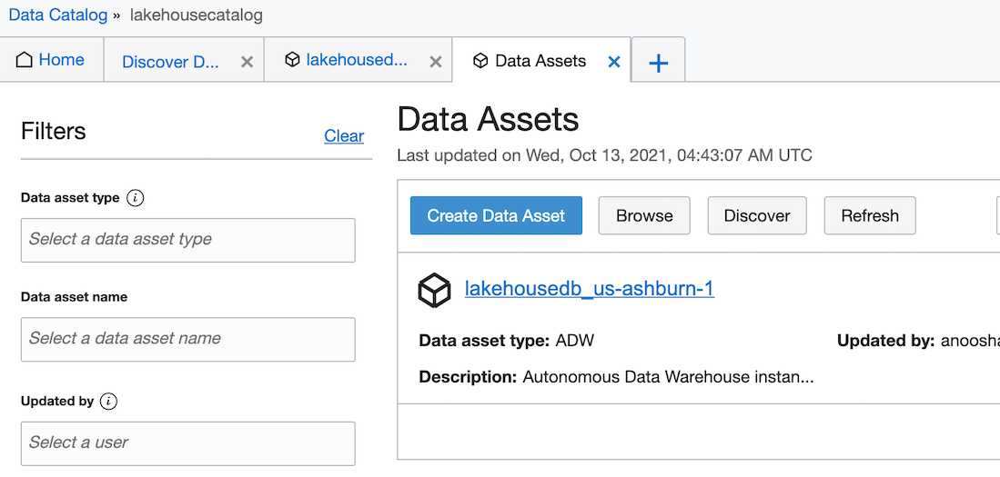

Continue to fill name of GENRE_JSON. Choose the type as Oracle Object Storage You need the object storage bucket Namespace, c4u04, and the OCI-Region.
URL for Oracle Object Storage:

```
<copy>
https://swiftobjectstorage.us-ashburn-1.oraclecloud.com
</copy>
```

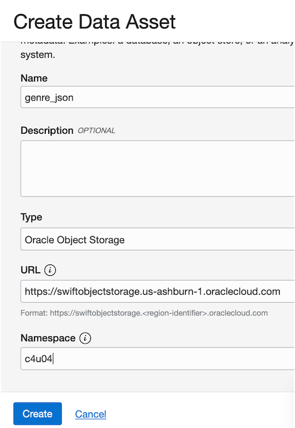

Then add the connection for the data asset. Create json_connection and select Pre-Authenticated Request for Type and put in the Pre-Authenticated Request URL.

```
<copy>
https://objectstorage.us-ashburn-1.oraclecloud.com/n/c4u04/b/data_lakehouse/o/
</copy>
```

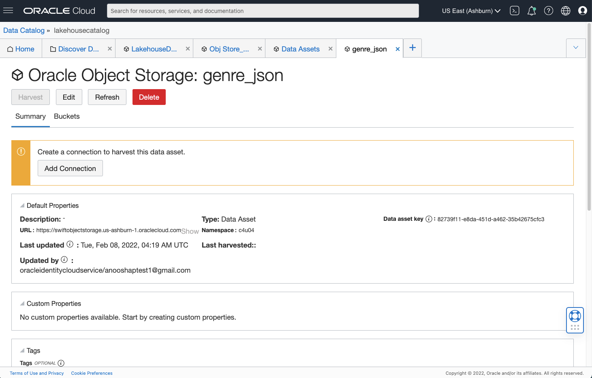

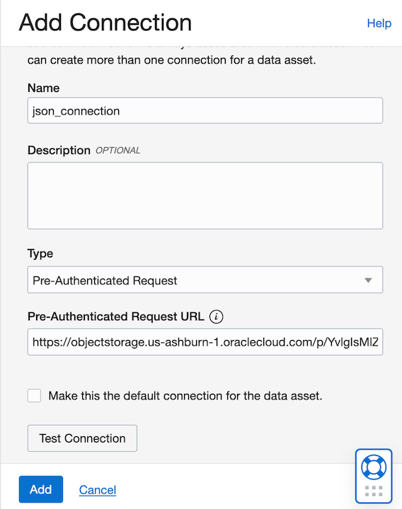

The data asset will then be added to this data catalog. Now we can use these data assets to set up processes for data loading and ETL with OCI Data Flow.

## Task 6: New table to demonstrate catalog discovery

In this step, you will simply be creating a new table to verify that the table is now part of the discovered entities in the OCI Data Catalog.

Navigate from the main menu to Autonomous Data Warehouse. Select the lakehousedb. If the database is not listed, double check the compartment is set to lakehouse1.

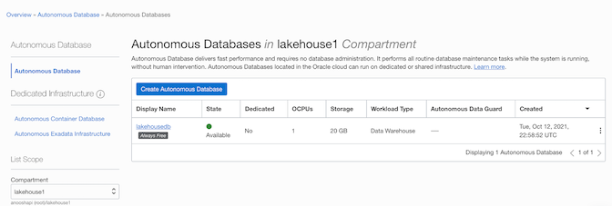

Click on the database and then proceed to click on the Tools Tab and click on Open Database Actions.


Click on SQL to execute the query to create the table.

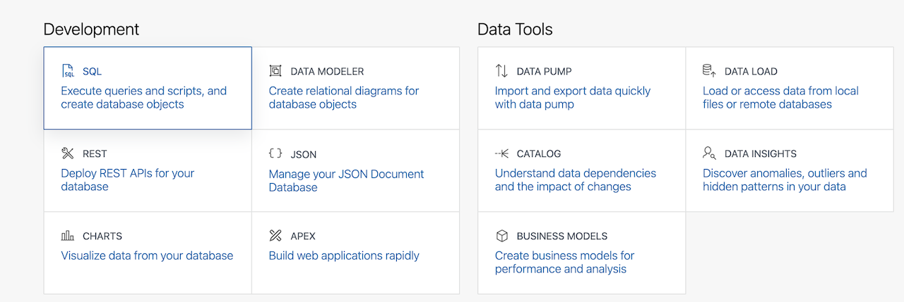

You are going to copy and paste the following code to build the MOVIE_GENRE table that we will use later in our data feed process and end queries.

```
<copy>
CREATE TABLE MOVIE_GENRE
(ENTERED_TIME       DATE,
PRICE               NUMBER,
CUSTID              NUMBER,
GENREID             NUMBER,
MOVIEID             NUMBER,
ACTIVITY            NUMBER,
RECOMMENDED         VARCHAR2(10));
</copy>
```

After the query executes, you can close Database Actions tab to get back to the Oracle Cloud menu.

Now you can verify that the entity is available as part of the OCI Data Catalog. Navigate to the Oracle Cloud Menu. Click on Analytics & AI and click on Data Catalog under the Data Lake header.

Click on lakehousecatalog from the Data Catalogs. Verify compartment if you do not see it listed.

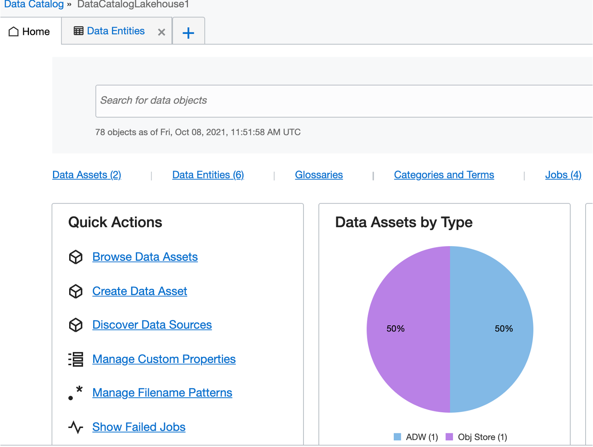

Click on Data Assets and click on Harvest using the dropdown menu for the database Data Asset. This harvesting for the Data Catalog should be scheduled to automatically pull the entity information into the Data Asset, but for now in the lab you can run this manually.
Select the ADMIN data entity and run the job now.


Now if you go back to the Home Tab from the Data Catalog, you will discover that there are now 7 Data Entities are being kept up to data in the Data Catalog.


Click on Entities just to verify that all of the tables are now here.

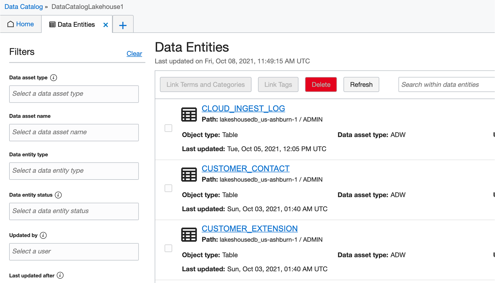

Now you are ready to work with the Data Flows and applications.

You may now proceed to the next lab.

## Acknowledgements

* **Author** - Michelle Malcher, Database Product Management, Massimo Castelli, Senior Director Product Management
* **Contributors** -  
* **Last Updated By/Date** - Michelle Malcher, Database Product Management, September 2021, Nagwang Gyamtso, Solution Engineering, February 2022
