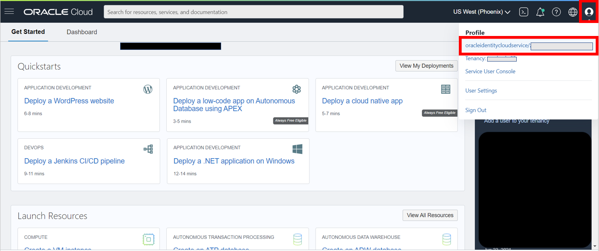
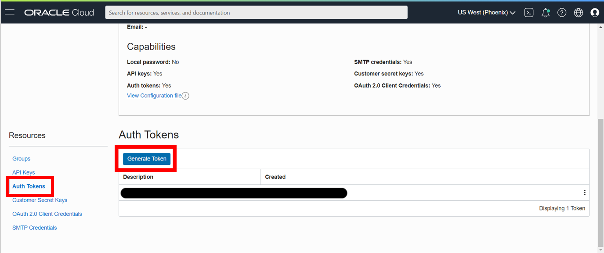
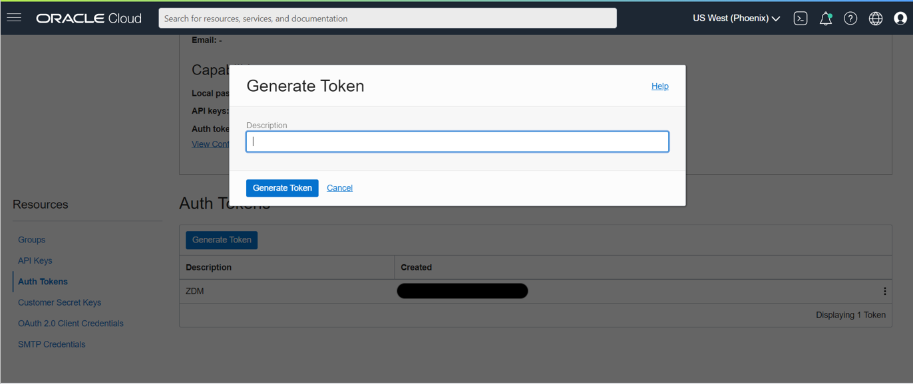
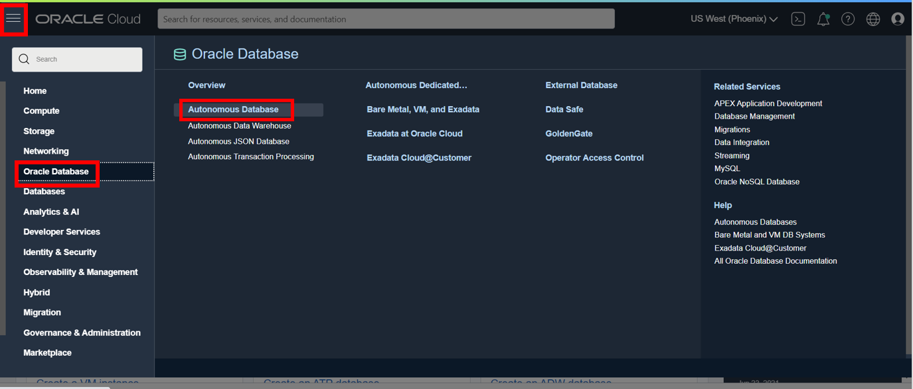
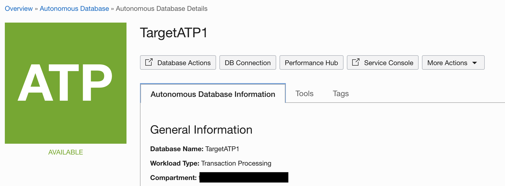
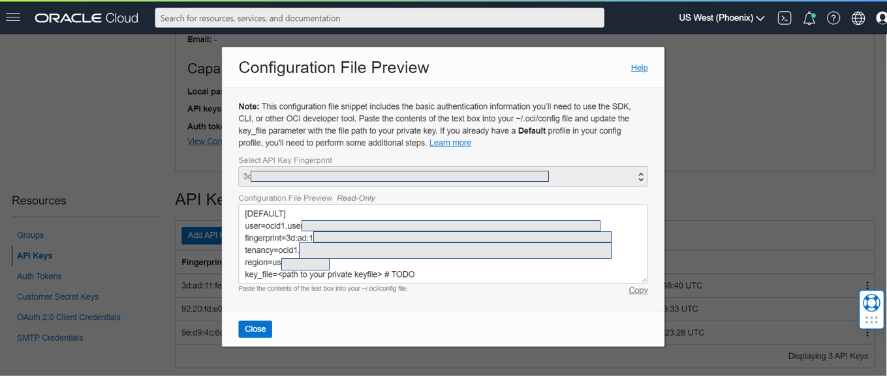

# Configure Token Authentication, Credentials and Object Storage

## Introduction
In this lab, you will be:
  * Creating an authentication token for your Oracle Cloud Infrastructure (Oracle Cloud Infrastructure) user profile.
  * Creating an object storage bucket.
  * Logging into your migration target autonomous database and creating the credential file you will need to connect to your Oracle Cloud Infrastructure user.
  * Creating movedata\_user in the autonomous database.

Estimate Lab Time: 15 minutes

### Workshop Objectives

In this lab, you will:
* Learn how to create an authentication Token, Create an Object Storage Bucket and run the require credential scripts in the Target Autonomous Database.

### Prerequisites
This workshop section requires having completed all previous sections.


## **Task 1: Create Authentication Token**
1. Go to your Oracle Cloud Infrastructure profile by selecting the icon in the top right and clicking user.
    

2. Under Resources in the bottom left select Auth Tokens and click generate token.
    

3. Set a description and click generate token and make sure to write down the token displayed as you cannot get access to it again. If you lose the token you will need to generate a new one.
    

## **Task 2: Create an Object Storage Bucket**

1. You will need an object storage bucket for your data during the migration as an intermediary point before being transferred to your target autonomous database. In your Oracle Cloud Infrastructure Dashboard: select the navigation menu, Storage, Buckets.
    

2. Select 'Create Bucket'.
    

3. Fill in the details. We will be using the name ZDMBucket. Make sure Default Storage Tier is 'Standard' and Encryption is 'Encrypt using Oracle managed keys'. Other than these 3 fields, leave the rest blank and click 'Create'.
    

4. On the Details page the two most important pieces of information for us are the bucket name and namespace which we will need later.
    

## **Task 3: Log Into SQL on the Autonomous Database**

1. In your Oracle Cloud Infrastructure Dashboard: select the navigation menu, Oracle Database, Autonomous Database.
    

2. Select the target database.
    

3. In the database menu go to __Database Actions__.
    

4. A new tab will open requesting for credentials. You may need to disable any pop-up blocker in your browser. Fill in ADMIN for the username and the password will be `WELcome##1234` unless you set it as something different.

5. Select SQL
    


## **Task 4: Run Credential Script**
1. In the script below replace `<oci_user>`, `<oci_tenancy>`, `<api_private_key>`, and `<fingerprint>` with their respective information and paste it into SQL.

    `<oci_user>`, `<oci_tenancy>`, and `<fingerprint>` are in the Configuration File Preview under API Keys in your Oracle Cloud Infrastructure user profile from the previous labs.

    

    

    `<api_private_key>` is your API private key from the Host Environment lab. To view it again, in CloudShell type the following as 'zdmuser':

    ```
    <copy>
    cd /u01/app/zdmhome/.oci
    cat oci_api_key.pem
    </copy>
    ```

    SQL Script. When pasting the API private key only paste the contents, don't include "Begin RSA Private Key" and "End RSA Private Key"

    ```
    <copy>
    begin
    DBMS_CLOUD.CREATE_CREDENTIAL (
    'CredentialZDM',
    '<oci_user>',
    '<oci_tenancy>',
    '<api_private_key>',
    '<fingerprint>');
    end;
    /
    </copy>
    ```

2. Select 'Run Script'.
    

## **Task 5: Unlock GG User**

1. Delete the existing script by clicking on the __Trash Can__ icon.
    

2. Paste the following script. When executed, this script will unlock the pre-created ggadmin user from the Target Autonomous Database.

    ```
    <copy>
    alter user ggadmin identified by WELcome##1234 account unlock;
    </copy>
    ```
    

3. Run the script by clicking on the __Run Script__ icon.
    


Please *proceed to the next lab*.

## Acknowledgements
* **Author** - Zachary Talke, Solutions Engineer, NA Tech Solution Engineering
- **Contributors** - Ricardo Gonzalez, Senior Principal Product Manager, Oracle Cloud Database Migration
* **Contributors** - LiveLabs Team, ZDM Development Team
* **Last Updated By/Date** - Ricardo Gonzalez, January 2022
