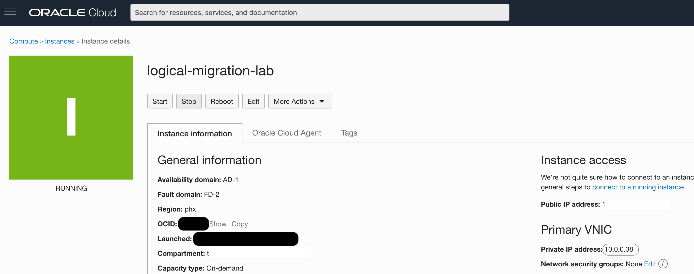
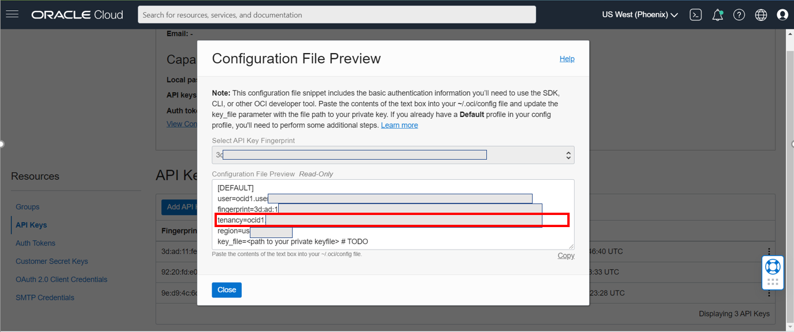
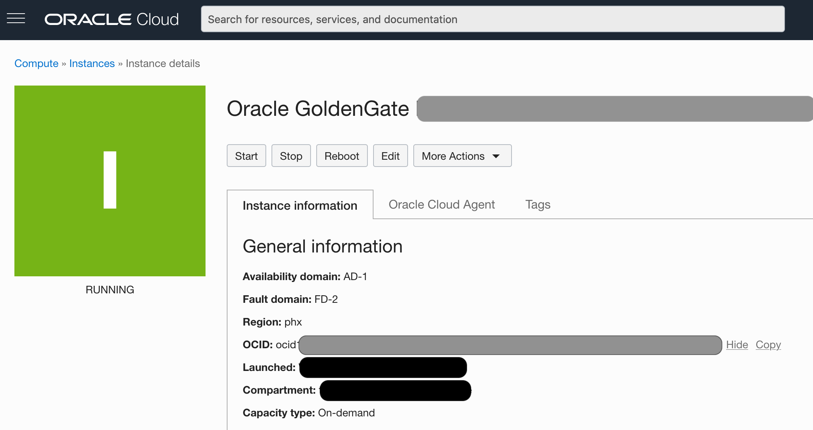
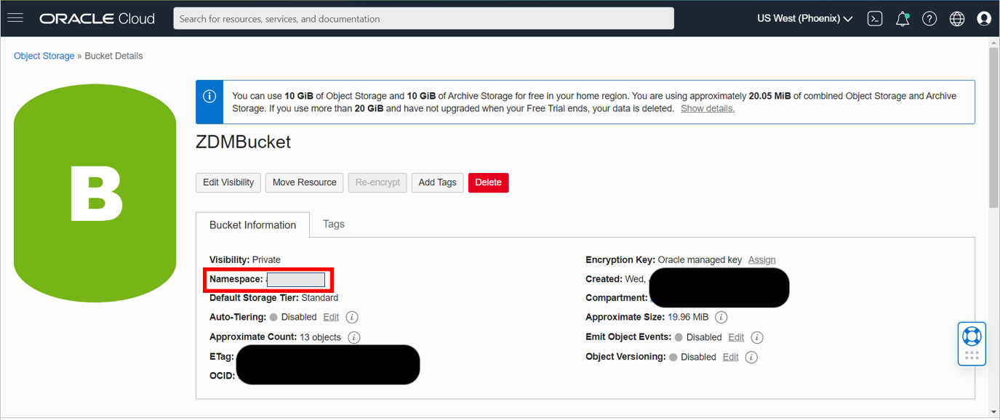

# Configure the Response File

## Introduction
In this lab you will:
* Learn About ZDM's Response File
* Create and Pre-fill a Response File for your Migration


Estimate Lab Time: 40 minutes


### Workshop Objectives

In this lab, you will:
* Learn about ZDM's response file and its parameters. You will also learn howto create and pre-fill a response file for your migration. 

### Prerequisites
This workshop section requires having completed all previous sections.


## Task 1: Learn About the Response File
Oracle Zero Downtime Migration uses a response file to parse information relevant for your migration. The response file contains an important number of parameters that are user defined, which will guide ZDM throughout the database migration process. In this Lab, you will learn the fundamentals of ZDM response file and also the basic parameters that will be used during this specific migration. Please bear in mind that Oracle Zero Downtime Migration's Response File is extense and provides ample options for flexibility and each specific use case, hence, for the purposes of this workshop only the fundamental parameters will be covered.

__Response File Parameters Required for this Migration__

```
MIGRATION_METHOD=ONLINE_LOGICAL
```

The __MIGRATION METHOD__ parameter specifies the type of migration to be performed, for this lab, we will be performing an __ONLINE LOGICAL__ migration

```
DATA_TRANSFER_MEDIUM=OSS
```

The __DATA TRANSFER MEDIUM__ parameter specifies the backup location of choice, for this lab, we will be using __OSS__ which is the Oracle Cloud Infrastructure Object Storage


&nbsp;

__Target Related Parameters__

```
TARGETDATABASE_OCID= target_database_ocid
```

The __TARGETDATABASE OCID__ parameter specifies the Oracle Cloud Resource Identifier for the Target Database. In the following task, when preparing the response file, instructions on where to find this parameter will be provided.


```
TARGETDATABASE_ADMINUSERNAME=ADMIN
```

The __TARGETDATABASE ADMINUSERNAME__ parameter specifies the Target Database Administrator username, in this case __ADMIN__ will be used.


&nbsp;

__Source Related Parameters__

```
SOURCEDATABASE_ADMINUSERNAME=SYSTEM
```

The __SOURCEDATABASE ADMINUSERNAME__ parameter specifies the Source Database Administrator username, in this case __ADMIN__ will be used.


```
SOURCEDATABASE_CONNECTIONDETAILS_HOST=IP or Host Name
```

The __SOURCEDATABASE CONNECTIONDETAILS HOST__ parameter specifies the connection details for the source database. In the following task, when preparing the response file, instructions on where to find this parameter will be provided.


```
SOURCEDATABASE_CONNECTIONDETAILS_PORT=1521
```

The __SOURCEDATABASE CONNECTIONDETAILS PORT__ parameter specifies the source database connection port. In this case we will use __1521__

```
SOURCEDATABASE_CONNECTIONDETAILS_SERVICENAME=ORCLPDB
```

The __SOURCEDATABASE CONNECTIONDETAILS SERVICENAME__ parameter specifies the source database fully qualified service name. In this case we will use __ORCLPDB__


&nbsp;

__API Related Parameters__
```
OCIAUTHENTICATIONDETAILS_USERPRINCIPAL_TENANTID= ocid.tenancy
```

The __OCIAUTHENTICATIONDETAILS USERPRINCIPAL TENANTID__ parameter specifies the Oracle Cloud Resource Identifier for the Oracle Cloud Infrastructure Tenancy. In the following task, when preparing the response file, instructions on where to find this parameter will be provided.


```
OCIAUTHENTICATIONDETAILS_USERPRINCIPAL_USERID=ocid1.user
```

The __OCIAUTHENTICATIONDETAILS USERPRINCIPAL USERID__ parameter specifies the User ID for the IAM User. In the following task, when preparing the response file, instructions on where to find this parameter will be provided.


```
OCIAUTHENTICATIONDETAILS_USERPRINCIPAL_FINGERPRINT=fingerprint
```

The __OCIAUTHENTICATIONDETAILS USERPRINCIPAL FINGERPRINT__ parameter specifies the fingerprint of the Public API Key. In the following task, when preparing the response file, instructions on where to find this parameter will be provided.


```
OCIAUTHENTICATIONDETAILS_USERPRINCIPAL_PRIVATEKEYFILE=/path/privatekey
```

The __OCIAUTHENTICATIONDETAILS USERPRINCIPAL PRIVATEKEYFILE__ parameter specifies the absolute path of the Private API Key. In the following task, when preparing the response file, instructions on where to find this parameter will be provided.

```
OCIAUTHENTICATIONDETAILS_REGIONID=us-phoenix-1
```
The __OCIAUTHENTICATIONDETAILS REGIONID__ parameter specifies the Oracle Cloud Infrastructure Region Identifier. In the following task, when preparing the response file, instructions on where to find this parameter will be provided.


&nbsp;

__GoldenGate Related Parameters__

```
TARGETDATABASE_GGADMINUSERNAME=GGADMIN
```

The __TARGETDATABASE GGADMINUSERNAME__ parameter specifies the GoldenGate Administrator username, in this case __GGADMIN__ will be used.


```
SOURCEDATABASE_GGADMINUSERNAME=GGADMIN
```

The __SOURCEDATABASE GGADMINUSERNAME__ parameter specifies the GoldenGate Administrator username, in this case __GGADMIN__ will be used.

```
SOURCECONTAINERDATABASE_ADMINUSERNAME=SYSTEM
```

The __SOURCECONTAINERDATABASE ADMINUSERNAME__ parameter specifies the Database Administrator username, in this case __SYSTEM__ will be used.

```
SOURCECONTAINERDATABASE_GGADMINUSERNAME=C##GGADMIN
```

The __SOURCECONTAINERDATABASE GGADMINUSERNAME__ parameter specifies the GoldenGate Administrator username, in this case __C##GGADMIN__ will be used.

```
SOURCECONTAINERDATABASE_CONNECTIONDETAILS_HOST=IP or Hostname
```

The __SOURCECONTAINERDATABASE CONNECTIONDETAILS HOST__ parameter specifies the connection details for the source database. In the following task, when preparing the response file, instructions on where to find this parameter will be provided.


```
SOURCECONTAINERDATABASE_CONNECTIONDETAILS_SERVICENAME=CDB Service Name
```

The __SOURCECONTAINERDATABASE CONNECTIONDETAILS SERVICENAME__ parameter specifies the source database fully qualified service name. In the following task, when preparing the response file, instructions on where to find this parameter will be provided.


```
SOURCECONTAINERDATABASE_CONNECTIONDETAILS_PORT=1521
```

The __SOURCECONTAINERDATABASE CONNECTIONDETAILS PORT__ parameter specifies the source database connection port. In this case we will use __1521__


```
GOLDENGATEHUB_ADMINUSERNAME=oggadmin
```

The __GOLDENGATEHUB GGADMINUSERNAME__ parameter specifies the GoldenGate Administrator username, in this case __oggadmin__ will be used.

```
GOLDENGATEHUB_URL=https://GGHUB
```

The __GOLDENGATEHUB URL__ parameter specifies the GoldenGate REST endpoint. In the following task, when preparing the response file, instructions on where to find this parameter will be provided.

```
GOLDENGATEHUB_SOURCEDEPLOYMENTNAME=Source
```

The __GOLDENGATEHUB SOURCEDEPLOYMENTNAME__ parameter specifies the name of GoldenGate Microservices deployment that operates on the source, in this case __Source__ will be used.

```
GOLDENGATEHUB_TARGETDEPLOYMENTNAME=Target
```

The __GOLDENGATEHUB TARGETDEPLOYMENTNAME__ parameter specifies the name of GoldenGate Microservices deployment that operates on the target, in this case __Target__ will be used.

```
GOLDENGATEHUB_COMPUTEID=ocid1.instance
```

The __GOLDENGATEHUB COMPUTEID__ parameter specifies the Oracle Cloud Identifier of the VM where the GoldenGate Microservices are deployed. In the following task, when preparing the response file, instructions on where to find this parameter will be provided.


&nbsp;

__Data Pump and OSS Related Parameters__

```
DATAPUMPSETTINGS_DATAPUMPPARAMETERS_IMPORTPARALLELISMDEGREE=1
```

The __DATAPUMPSETTINGS DATAPUMPPARAMETERS IMPORTPARALLELISMDEGREE__ parameter specifies the number of worker processes that can be used for a Data Pump Import Job, in this case __1__ will be used.

```
DATAPUMPSETTINGS_DATAPUMPPARAMETERS_EXPORTPARALLELISMDEGREE=1
```

The __DATAPUMPSETTINGS DATAPUMPPARAMETERS EXPORTPARALLELISMDEGREE__ parameter specifies the number of worker processes that can be used for a Data Pump Export Job, in this case __1__ will be used.

```
DATAPUMPSETTINGS_METADATAREMAPS-1=type:REMAP_TABLESPACE,oldValue:USERS,newValue:DATA
```

The __DATAPUMPSETTINGS METADATAREMAPS__ parameter specifies remapping to be applied to objects as they are processed, in this case __type:REMAP TABLESPACE,oldValue:USERS,newValue:DATA__ will be used.

```
DATAPUMPSETTINGS_DATABUCKET_NAMESPACENAME=namespace
```

The __DATAPUMPSETTINGS DATABUCKET NAMESPACENAME__ parameter specifies the Object Storage Namespace. In the following task, when preparing the response file, instructions on where to find this parameter will be provided.

```
DATAPUMPSETTINGS_DATABUCKET_BUCKETNAME=name
```

The __DATAPUMPSETTINGS DATABUCKET NAMESPACENAME__ parameter specifies the Object Storage Name. In the following task, when preparing the response file, instructions on where to find this parameter will be provided.

```
DATAPUMPSETTINGS_EXPORTDIRECTORYOBJECT_NAME=DATA_PUMP_DIR
```

The __DATAPUMPSETTINGS EXPORTDIRECTORYOBJECT NAME__ parameter specifies the directory name on the server file system of the source database that is used to store Data Pump Export dump files, in this case __DATA PUMP DIR__ will be used.


```
DATAPUMPSETTINGS_EXPORTDIRECTORYOBJECT_PATH=/u01/app/oracle/product/19c/dbhome_1/rdbms/log/
```

The __DATAPUMPSETTINGS EXPORTDIRECTORYOBJECT PATH__ parameter specifies the directory path on the server file system of the source database that is used to store Data Pump Export dump files, in this case __/u01/app/oracle/product/19c/dbhome_1/rdbms/log/__ will be used.

&nbsp;


## Task 2: Create an empty Response File for your migration

1. Return to the Cloud Shell as 'zdmuser'.


2. If you need to reconnect you can do so with the following command. Replace < sshkeyname > and < Your Compute Instance Public IP Address > with the key file name and IP address of your source compute instance:

    ```
    <copy>
    ssh -i ~/.ssh/<sshkeyname> opc@<Your Compute Instance Public IP Address>
    </copy>
    ```

3. If you need to return to 'zdmuser' and are currently user 'oracle' type the command `exit` to switch to 'opc'. To go from 'opc' to 'zdmuser' run the following command:

    ```
    <copy>
    sudo su - zdmuser
    </copy>
    ```

4. As 'zdmuser' in your compute instance command prompt run the following commands:

    ```
    <copy>
    cd ~
    mkdir livelab
    cp /u01/app/zdmhome/rhp/zdm/template/zdm_logical_template.rsp ~/livelab
    cd livelab
    cp zdm_logical_template.rsp zdm_logical_online.rsp
    </copy>
    ```

## Task 3: Prepare Out the Template File
1. Go into the migration file and delete all of the existing lines.

    ```
    <copy>
    vi zdm_logical_online.rsp
    </copy>
    ```

    In vi editor the following command deletes all of the existing lines. You will need to type it in manually.

    ```
    <copy>
    :%d
    </copy>
    ```

2. Paste the below contents into the empty file.

    ```
    <copy>
    MIGRATION_METHOD=ONLINE_LOGICAL
    DATA_TRANSFER_MEDIUM=OSS

    TARGETDATABASE_OCID=<UPDATE>
    TARGETDATABASE_ADMINUSERNAME=ADMIN

    SOURCEDATABASE_ADMINUSERNAME=SYSTEM
    SOURCEDATABASE_CONNECTIONDETAILS_HOST=<UPDATE>
    SOURCEDATABASE_CONNECTIONDETAILS_PORT=1521
    SOURCEDATABASE_CONNECTIONDETAILS_SERVICENAME=ORCLPDB

    OCIAUTHENTICATIONDETAILS_USERPRINCIPAL_TENANTID=<UPDATE>
    OCIAUTHENTICATIONDETAILS_USERPRINCIPAL_USERID=<UPDATE>
    OCIAUTHENTICATIONDETAILS_USERPRINCIPAL_FINGERPRINT=<UPDATE>
    OCIAUTHENTICATIONDETAILS_USERPRINCIPAL_PRIVATEKEYFILE=/u01/app/zdmhome/.oci/oci_api_key.pem
    OCIAUTHENTICATIONDETAILS_REGIONID=<UPDATE>

    TARGETDATABASE_GGADMINUSERNAME=GGADMIN
    SOURCEDATABASE_GGADMINUSERNAME=GGADMIN

    SOURCECONTAINERDATABASE_ADMINUSERNAME=SYSTEM
    SOURCECONTAINERDATABASE_GGADMINUSERNAME=C##GGADMIN
    SOURCECONTAINERDATABASE_CONNECTIONDETAILS_HOST=<UPDATE>
    SOURCECONTAINERDATABASE_CONNECTIONDETAILS_PORT=1521
    SOURCECONTAINERDATABASE_CONNECTIONDETAILS_SERVICENAME=ORCL


    GOLDENGATEHUB_ADMINUSERNAME=oggadmin
    GOLDENGATEHUB_URL=<UPDATE>
    GOLDENGATEHUB_SOURCEDEPLOYMENTNAME=Source
    GOLDENGATEHUB_TARGETDEPLOYMENTNAME=Target
    GOLDENGATEHUB_COMPUTEID=<UPDATE>


    DATAPUMPSETTINGS_DATAPUMPPARAMETERS_IMPORTPARALLELISMDEGREE=1
    DATAPUMPSETTINGS_DATAPUMPPARAMETERS_EXPORTPARALLELISMDEGREE=1
    DATAPUMPSETTINGS_METADATAREMAPS-1=type:REMAP_TABLESPACE,oldValue:USERS,newValue:DATA
    DATAPUMPSETTINGS_DATABUCKET_NAMESPACENAME=<UPDATE>
    DATAPUMPSETTINGS_DATABUCKET_BUCKETNAME=<UPDATE>
    DATAPUMPSETTINGS_EXPORTDIRECTORYOBJECT_NAME=DATA_PUMP_DIR
    DATAPUMPSETTINGS_IMPORTDIRECTORYOBJECT_NAME=DATA_PUMP_DIR
    DATAPUMPSETTINGS_EXPORTDIRECTORYOBJECT_PATH=/u01/app/oracle/product/19c/dbhome_1/rdbms/log/

    DATAPUMPSETTINGS_JOBMODE=SCHEMA
    DATAPUMPSETTINGS_DELETEDUMPSINOSS=TRUE
    DATAPUMPSETTINGS_FIXINVALIDOBJECTS=TRUE

    DATAPUMPSETTINGS_OMITENCRYPTIONCLAUSE=TRUE
    DATAPUMPSETTINGS_SECUREFILELOB=TRUE
    DATAPUMPSETTINGS_SKIPDEFAULTTRANSFORM=FALSE
    DATAPUMPSETTINGS_CREATEAUTHTOKEN=false

    DUMPTRANSFERDETAILS_PARALLELCOUNT=3
    DUMPTRANSFERDETAILS_RETRYCOUNT=3
    </copy>
    ```

3. Update the following lines in the file. Replace `<Update>` with the information. Be careful and make sure the entire text is pasted as there is a tendency for the first character to sometimes get cut off:
    * TARGETDATABASE\_OCID: On your Autonomous Database home page.
    
    * SOURCEDATABASE\_CONNECTIONDETAILS\_HOST: On your Compute Instance home page. For the purpose of this lab you can use the Private IP address provided.
    
    * OCIAUTHENTICATIONDETAILS\_USERPRINCIPAL\_TENANTID: On your API key configuration file preview.
    
    * OCIAUTHENTICATIONDETAILS\_USERPRINCIPAL\_USERID: On your API key configuration file preview.
    
    * OCIAUTHENTICATIONDETAILS\_USERPRINCIPAL\_FINGERPRINT: On your API key configuration file preview.
    
    * OCIAUTHENTICATIONDETAILS\_REGIONID: On your API key configuration file preview.
    
    * SOURCECONTAINERDATABASE\_CONNECTIONDETAILS\_HOST: On your Compute Instance home page. For the purpose of this lab you can use the Private IP address provided.
    
    * GOLDENGATEHUB\_URL: On your GG Hub Compute Instance home page copy the Internal FQDN, as an example, it should look something like this: __https://oggzdm.subnet1.labvcn.oraclevcn.com__
    
    * GOLDENGATEHUB\_COMPUTEID: On your GG Hub Compute Instance home page. Copy the OCID value.
    
    * DATAPUMPSETTINGS_DATABUCKET\_NAMESPACENAME: On your object storage bucket homepage.
    
    * DATAPUMPSETTINGS_DATABUCKET\_BUCKETNAME: On your object storage bucket homepage.
    


4. After the lines are updated save and quit vi editor.

Please *proceed to the next lab*.

## Acknowledgements
* **Author** - Ricardo Gonzalez, Senior Principal Product Manager, Oracle Cloud Database Migration
- **Contributors** - Zachary Talke, Solutions Engineer, NA Tech Solution Engineering
* **Contributors** - LiveLabs Team, ZDM Development Team
* **Last Updated By/Date** - Ricardo Gonzalez, January 2022
