# Access Container Home Page

## Introduction

This lab walks you through the steps to access the container home page from Oracle Enterprise Manager Cloud Control (Oracle EMCC). You will also learn how to switch between containers and manage your favorites.

*Estimated Time:* 15 minutes

### Objectives

- Access the container home page from Oracle EMCC.
- Switch between the Container Database (CDB) home page and the Pluggable Database (PDB) home page.
- Add pages to and remove pages from the favorites.

### Prerequisites
This lab assumes you have -
- A Free Tier, Paid or LiveLabs Oracle Cloud account
- You have completed -
    - Lab: Prepare Setup (*Free-tier* and *Paid Tenants* only)
    - Lab: Setup Compute Instance
    - Lab: Initialize Environment
    - Lab: Log in to Oracle EMCC
    - Lab: Manage Targets - Oracle Database and Listener (Please re-add the Oracle Database 21c and the listener managed targets removed at the end of this lab before proceeding).

## Task 1: Access Container Home page

1.  From the **Targets** menu, select **Databases** to open the Databases page.

    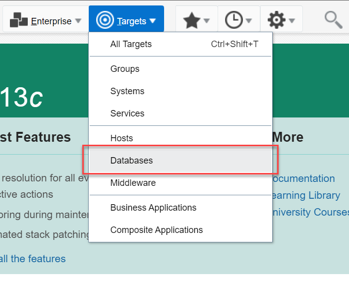

    The Databases page displays a list of Oracle Databases added to Oracle EMCC as managed targets. The values may differ depending on the system you are using. Note that the **View** type selected is **Search list**.

    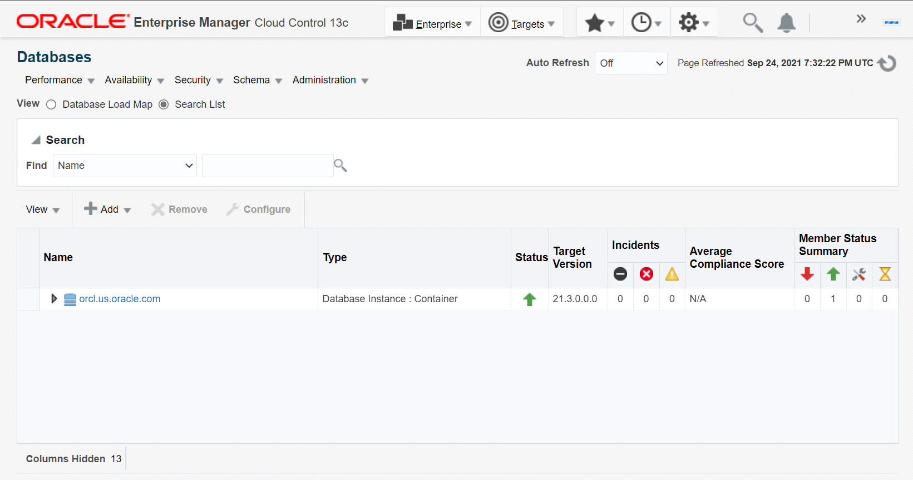

2.  On the Databases page, select the Database Instance name, for example *orcl.us.oracle.com*, and click **View** > **Expand All Below**. 

    

    Alternatively, click on the expand/collapse arrow next to the Oracle Database. The list displays the target Database Instance and the PDBs for each Oracle Database on the host. The values may differ depending on the system you are using.  

    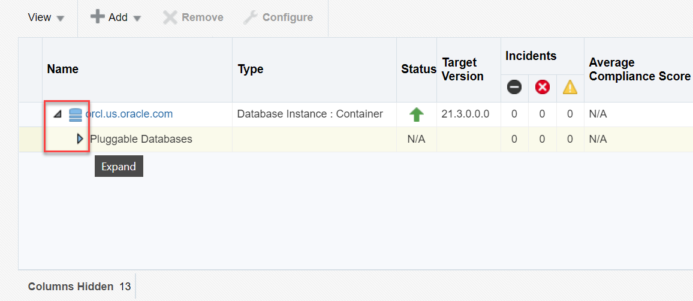

3.  Click on the container name, for example *orcl.us.oracle.com*, to access the container home page.   
	The values may differ depending on the system you are using.  

    

	Follow the same steps to open the PDB home page.

4.  From the **Targets** menu, select **Databases**. Select the Oracle Database, and click **View** > **Expand All Below** to view the PDBs.

5.  Click on the PDB name, for example *ORCLPDB*, to access the PDB home page.   
	The values may differ depending on the system you are using.  

    

You can perform various tasks depending on which home page you access. For example, from the Database Instance home page, you can monitor and administer your Oracle Database, such as start up and shut down the Database Instance, open and close PDBs, manage the memory, modify initialization parameters, and so on.

From the CDB and the PDB home page, you can perform tasks on the CDB and the PDB respectively.

## Task 2: Switch between Containers

You can alter the session and switch between containers in Oracle EMCC within a single login.

That is, from the Database Instance home page, you can switch to the CDB or the PDB home page without logging out of Oracle EMCC. Similarly, from the PDB home page, you can switch to the CDB or to another PDB home page, if you have more than one PDBs on your host.

1.  Open the container home page, if you are on some other page.   
	From the **Targets** menu, select **Databases** to open the Databases page. Click on the container name, for example *orcl.us.oracle.com*, to access the container home page as explained in *Task 1* of this lab.   
	The values may differ depending on the system you are using.  

    

2.  Click the down arrow next to the container and select **All Containers**.   
	The values may differ depending on the system you are using.  

    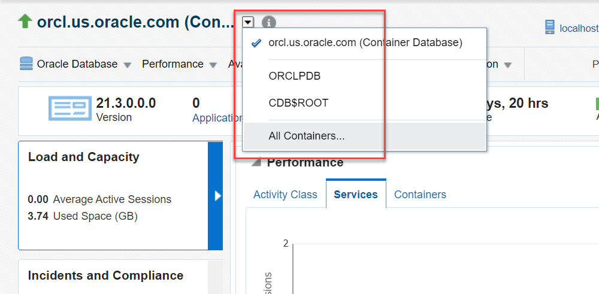

3.  In the Switch Container dialog box, select the CDB, *CDB$ROOT*, from the containers list and click **OK**.   
	The values may differ depending on the system you are using.  

    

	It brings up the CDB homepage. The values may differ depending on the system you are using.  

    

	Similarly, follow the same steps to open the PDB home page.

4.  Click the down arrow next to the CDB and select **All Containers**.   
	The values may differ depending on the system you are using.  

    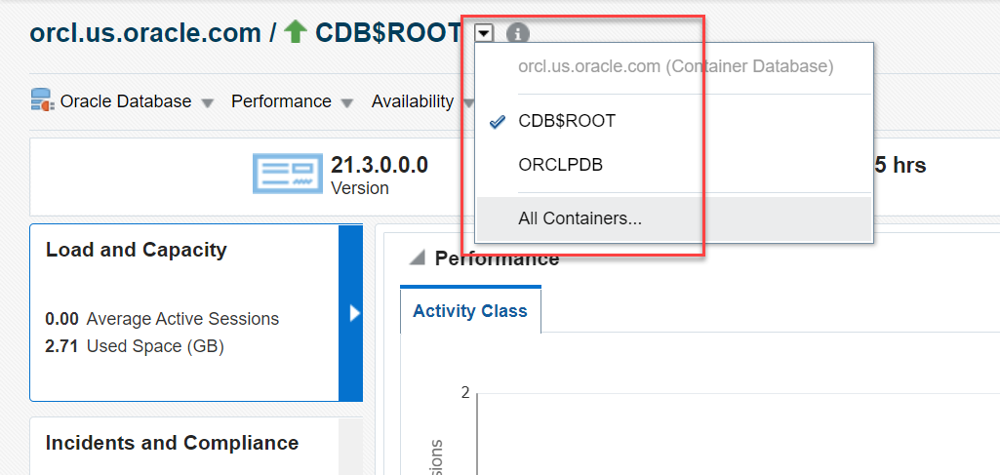

5. 	 In the Switch Container dialog box, select the PDB, for example *ORCLPDB*, from the containers list and click **OK**. The values may differ depending on the system you are using.  

    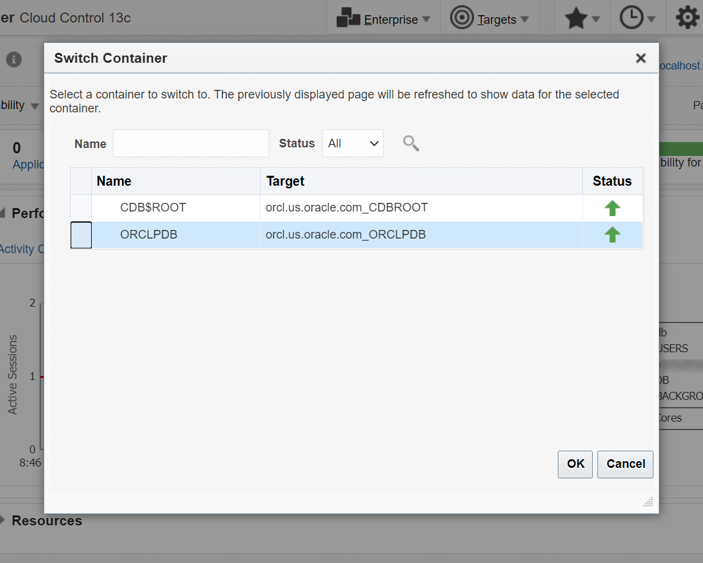

	It brings up the PDB homepage. The values may differ depending on the system you are using.  

    

	You can quickly jump from one container to another in Oracle EMCC. To open the CDB from the PDB home page, click the down arrow next to the PDB and select the CDB, *CDB$ROOT*.   
	The values may differ depending on the system you are using.  

    

	> **Note:** You cannot open the Database Instance home page from the CDB or the PDB home page. To open the Database Instance home page, from the **Targets** menu select **Databases**. On the Databases page, click on the Database Instance name, for example *orcl.us.oracle.com*, as explained in *Task 1* of this lab. 

## Task 3: View Target Information

To view information about a target or to monitor a target, open the target home page. For this lab, view the target information for the Database Instance, the PDB, and the CDB.

1.  Open the container home page, if you are on some other page.   
	From the **Targets** menu, select **Databases** to open the Databases page. Click on the container name, for example *orcl.us.oracle.com*, to open the container home page as explained in *Task 1* of this lab.   
	The values may differ depending on the system you are using.  

    

2.  From the **Oracle Database** menu, select **Target Information** to view details of the target Database Instance. 

    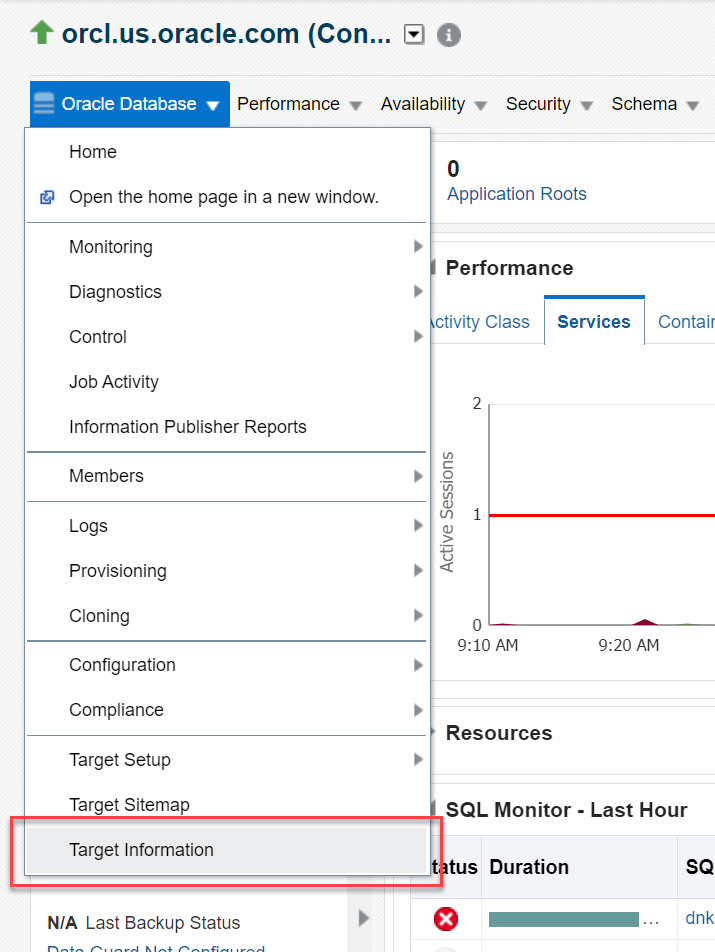

    Alternatively, you can also click on the target information icon (the circle with an 'i' in it) next to the container.   
	The window displays the details of the Database Instance. The values may differ depending on the system you are using.

    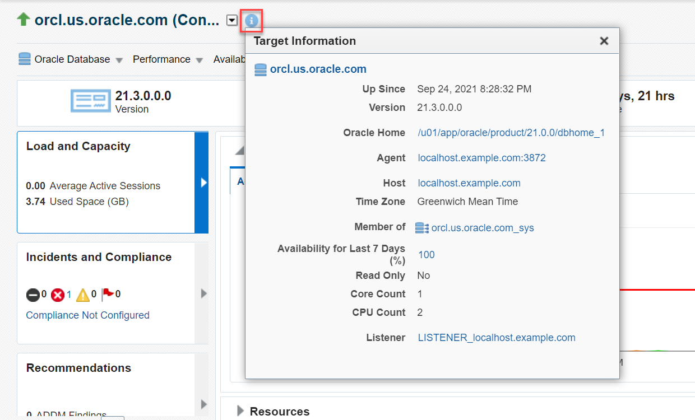

3.  Switch the container to PDB and view PDB details. Click the down arrow next to the container and select the PDB, *ORCLPDB*. The values may differ depending on the system you are using.

    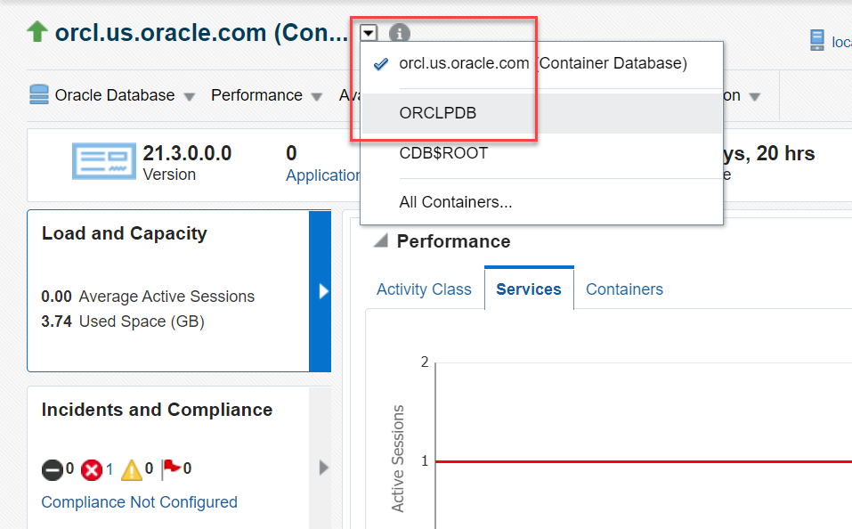

    It opens the PDB home page.  

4.  From the **Oracle Database** menu, select **Target Information** to view details of the target PDB.  

    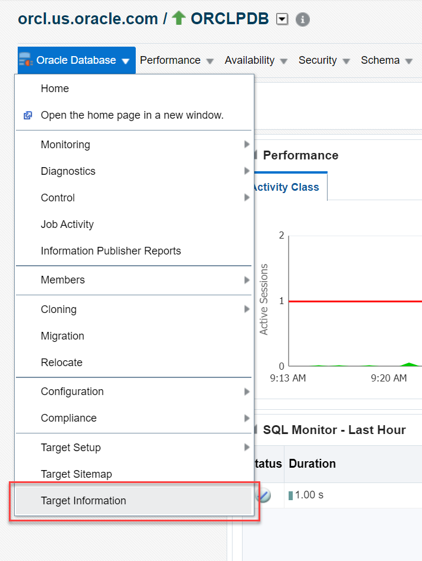

    Alternatively, you can click on the target information icon (the circle with an 'i' in it) next to the PDB, *ORCLPDB*. The window displays the details of the PDB. The values may differ depending on the system you are using.

    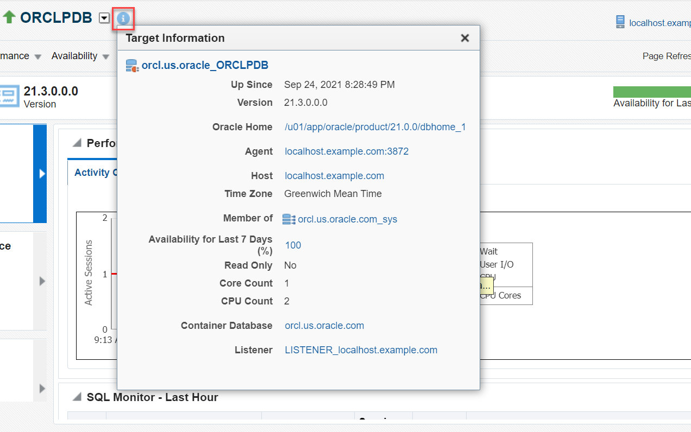

5.  Switch the container to CDB and view CDB details. Click the down arrow next to the PDB and select the CDB, *CDB$ROOT*. The values may differ depending on the system you are using.

    

    It opens the CDB home page.  

6.  From the **Oracle Database** menu, select **Target Information** to view details of the target CDB.  

    

    Alternatively, you can click on the target information icon (the circle with an 'i' in it) next to the CDB, *CDB$ROOT*. The window displays the details of the CDB. The values may differ depending on the system you are using.  

    

## Task 4: Manage Your Favorites

You can add pages to favorites and bookmark them in Oracle EMCC for easy access. Similarly, you can remove pages from favorites.

 - To add a page to favorites, open that page, and use the **Favorites** menu (star icon).
 - To remove a page from favorites, open that page, and use the **Favorites** menu (star icon).
 - To remove one or more pages from favorites, use the **Manage Favorites** menu.

For this lab, add the CDB home page to favorites and remove it from favorites. Ensure that you have the CDB home page open. Otherwise, follow the steps as explained in *Task 1* of this lab to open the CDB home page.

1.  Add the CDB home page to favorites. Click the **Favorites** menu (star icon) and select **Add Page to Favorites**.

    

    The window displays a confirmation message indicating that you have added the current page to favorites.   

2.  Remove the CDB home page from favorites. Click the **Favorites** menu (star icon) and select **Remove Page from Favorites**. The values may differ depending on the system you are using.  

    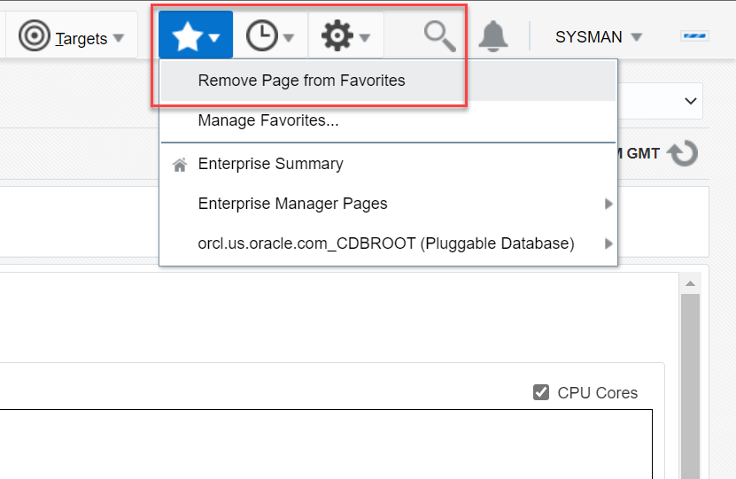

    The window displays a confirmation message indicating that you have removed the page from favorites.   

3.  You can remove multiple pages together from favorites. To do that, add the CDB home page to favorites once again. Select **Favorites** > **Add Page to Favorites**. The window displays a confirmation message indicating that you have added the current page to favorites.

4.	Click the **Favorites** menu (star icon) and select **Manage Favorites**.   
	The values may differ depending on the system you are using.  

    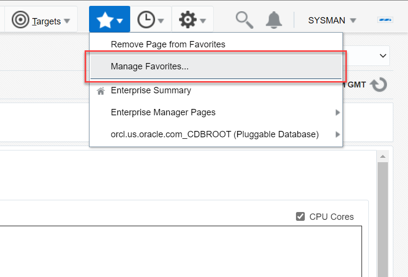

5.  In the **Manage Favorites** dialog box, select the page that you want to remove, for example *CDBROOT*, and click **Remove Selected**. The values may differ depending on the system you are using.  

    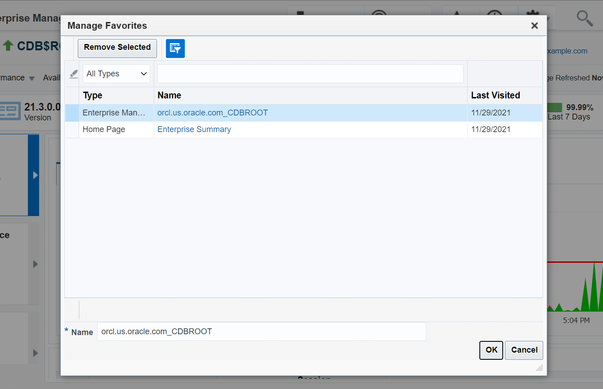

	You can select the pages one-by-one and click **Remove Selected**. Finally, click **OK** to remove the selected pages from favorites.

    Moreover, you can open a recently visited page from any location in Oracle EMCC using the **History** menu.    
	The values may differ depending on the system you are using.  

    

This brings you towards the successful completion of this workshop on *Oracle EM Database Administration (DBA)*.

In this workshop, you have learned how to use Oracle EMCC with an Oracle multitenant container database, manage target databases and listeners, and access the container home page.

## Acknowledgements

-   **Author** - Manish Garodia, Principal User Assistance Developer, Database Technologies

-   **Contributors** - Suresh Rajan, Kurt Engeleiter, Steven Lemme, Ashwini R

-   **Last Updated By/Date** - Manish Garodia, December 2021
