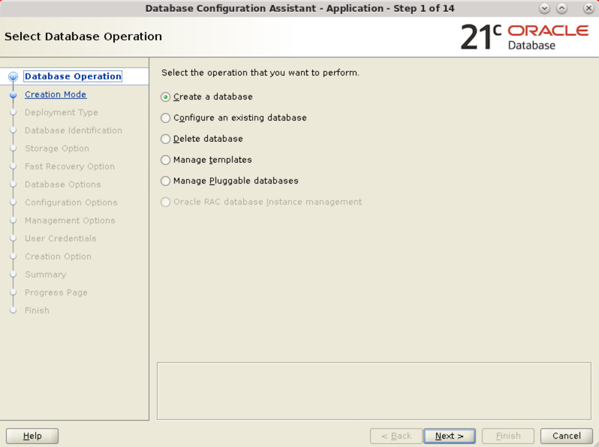

# Create Container Database (Typical Mode)

## Introduction

This lab shows how to create a container database with typical configuration. It does not install the Oracle Database software.

Estimated Lab Time: 20 minutes

### Objective

Create an additional Oracle Database using Oracle Database Configuration Assistant (Oracle DBCA).

### Assumptions

<!-- 
[](include:assumptions-dbca.md)

Add to manifest:
“include”: {“shortname”: “file_path_from_manifest”}
-->

- The Oracle Database software is installed and a starter database may already be created.

- You logged in as *oracle*, the user who is authorized to install the Oracle Database software and create Oracle Database.  

- In the terminal window you changed the current working directory to `$ORACLE_HOME/bin`, the directory where Oracle DBCA is located.

	```
	$ <copy>cd /u01/app/oracle/product/21.0.0/dbhome_1/bin</copy>
	```

- From `$ORACLE_HOME/bin`, you launched Oracle DBCA with this command.

	```
	$ <copy>./dbca</copy>
	```

## Task 1: Create a Container Database

<!-- 
[](include:run-dbca.md)

Add to manifest:
“include”: {“shortname”: “file_path_from_manifest”}
-->

The `dbca` command from `$ORACLE_HOME/bin` starts Oracle DBCA with the Database Operation window.

<!-- 
[](include:cmd-buttons-dbca.md)

Add to manifest:
“include”: {“shortname”: “file_path_from_manifest”}
-->

At any point, you can go **Back** to the previous window or **Cancel** database creation. You can click **Help** to view more information on the current window.

1. The Database Operation window opens with the default option **Create a database** selected. Click **Next**.

    

	<!-- 
	[](include:dbca-admin.md)

	Add to manifest:
	“include”: {“shortname”: “file_path_from_manifest”}
	-->
	
	> With Oracle DBCA, you can perform other administrative tasks, such as configure or delete an existing Oracle Database and manage PDBs and templates. 

2. Oracle DBCA displays the default creation mode, **Typical configuration**, selected with the pre-filled configuration parameters.  

	For this lab, specify the **Administrative password** and enter the following.  

	**Global database name** - *orcl1.us.oracle.com*  
	**Pluggable database name** - *orclpdb1*  

	For the remaining fields, leave the defaults and click **Next**.

   

	You cannot create multiple Oracle Databases with the same Global database name. If an Oracle Database with the specified name already exists, enter a different name.  
	
	<!-- 
	[](include:admin-pwd.md)

	Add to manifest:
	“include”: {“shortname”: “file_path_from_manifest”}
	-->

	The password created in this window is associated with admin user accounts, namely SYS, SYSTEM, and PDBADMIN. After you create Oracle Database, enter the admin username and use this password to connect to the database. 
	
	**Note**: The password must conform to the Oracle recommended standards.

	The default **Database Character set** for Oracle Database is *AL32UTF8 - Unicode UTF-8 Universal character set*. AL32UTF8 is Oracle's name for the standard Unicode encoding UTF-8, which enables universal support for virtually all languages of the world. 

3. Review the summary and click **Finish** to create your Oracle Database.

   

	The Progress Page window displays the status of Oracle Database creation process.

   

	The confirmation message in the Finish window indicates that you created an Oracle Database successfully. 
	
	<!-- 
	[](include:pwd-mgmt.md)

	Add to manifest:
	“include”: {“shortname”: “file_path_from_manifest”}
	-->

	> In the Finish window, click **Password Management** to view the status of Oracle Database user accounts. Except SYS and SYSTEM, all other users are initially in locked state.  

	> To unlock a user, click the **Lock Account** column. You can also change the default password for the users in this window. However, you can do these tasks at a later time. Click **OK** to close the Password Management window.
  
    

Click **Close** to exit Oracle Database Configuration Assistant.

You may now [proceed to the next lab](#next).

## Acknowledgements

<!-- 
[](include:acknowledgements.md)

Add to manifest:
“include”: {“shortname”: “file_path_from_manifest”}
-->

- **Author**: Manish Garodia, Principal User Assistance Developer, Database Technologies

- **Contributors**: Suresh Rajan (Senior Manager, User Assistance Development), Prakash Jashnani (Manager, User Assistance Development), Subhash Chandra (Principal User Assistance Developer), Subrahmanyam Kodavaluru (Principal Member Technical Staff), Dharma Sirnapalli (Principal Member Technical Staff)

- **Last Updated By/Date**: Manish Garodia, August 2021

