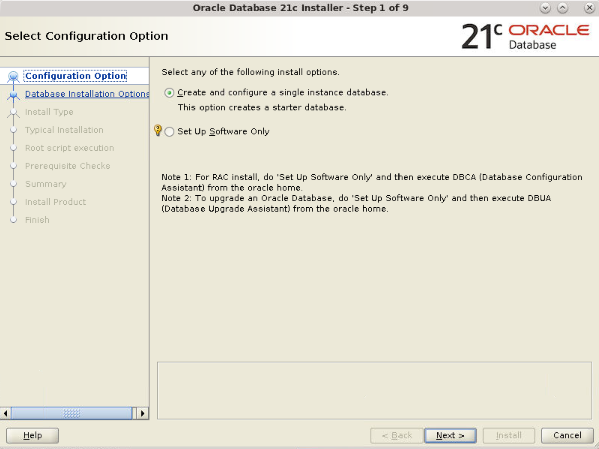
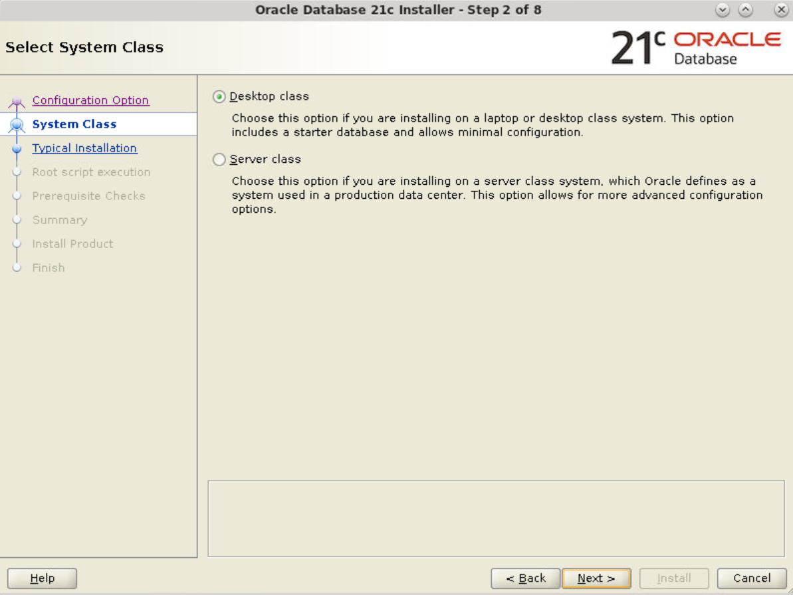
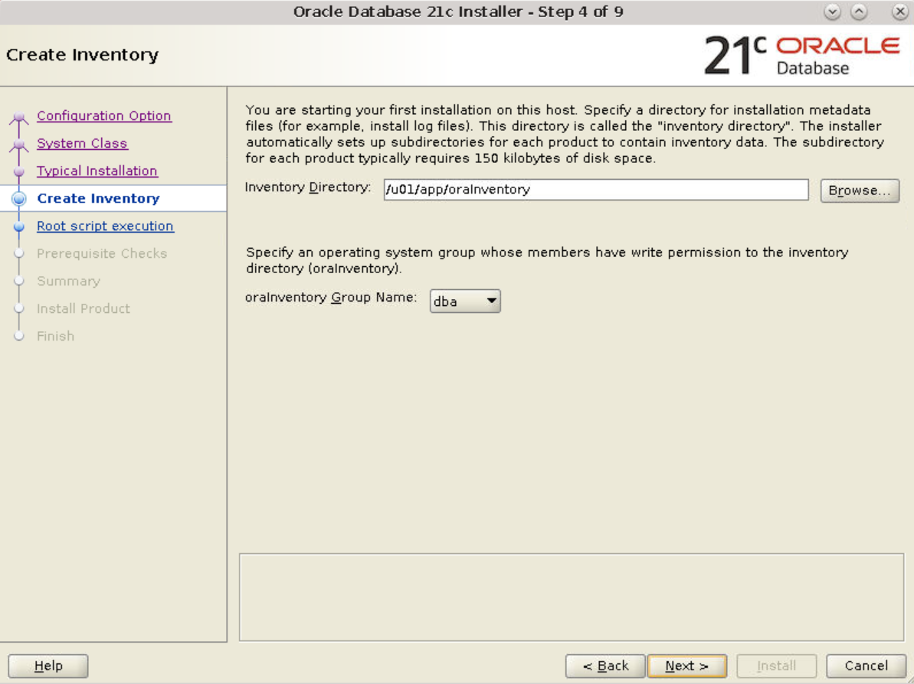
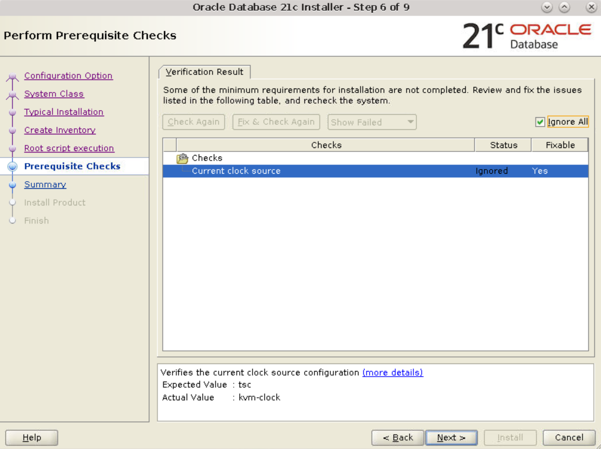
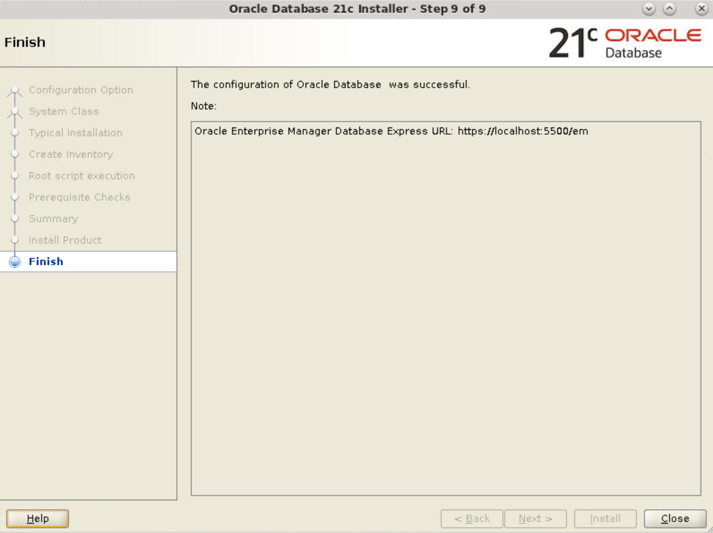

# Install Oracle Database (Desktop Class)

## Introduction

This lab walks you through the steps for installing Oracle Database 21c with minimal configuration. 

Estimated Lab Time: 20 minutes

### Objective

Install the Oracle Database software and create a container database using Oracle Database Setup Wizard (Installer).

### Assumptions

<!-- 
[](include:assumptions-installer.md)

Add to manifest:
“include”: {“shortname”: “file_path_from_manifest”}
-->

- You logged in as *oracle*, the user who is authorized to install the Oracle Database software and create Oracle Database.  

- In the terminal window the current working directory is Oracle home, the directory where the database installer is located.

	```
	$ <copy>cd /u01/app/oracle/product/21.0.0/dbhome_1</copy>
	```

- From Oracle home, you launched Oracle Database Setup Wizard with this command.

	```
	$ <copy>./runInstaller</copy>
	```

## Task 1: Install Oracle Database

<!-- 
[](include:runinstaller.md)

Add to manifest:
“include”: {“shortname”: “file_path_from_manifest”}
-->

The `runInstaller` command from Oracle home starts the database installer with the Configuration Option window.

<!-- 
[](include:cmd-buttons-installer.md)

Add to manifest:
“include”: {“shortname”: “file_path_from_manifest”}
-->

At any point, you can go **Back** to the previous window or **Cancel** the installation. You can click **Help** to view more information on the current window. 

1. The Configuration Option window opens with the default option **Create and configure a single instance database** selected. This option helps you create a starter database. Click **Next**.

   

	<!-- 
	[](include:acknowledgements.md)

	Add to manifest:
	“include”: {“shortname”: “file_path_from_manifest”}
	-->

	> If you select *Set Up Software Only*, the setup wizard installs only the Oracle Database software but does not create a database. To create a container database, run Oracle DBCA after you complete the software installation.  
	> For this lab, do not select this option.

2. The System Class window displays the default option **Desktop Class** selected. Using this option, you can perform the installation with minimal configuration. Click **Next**.

   

	The *Server Class* option is used for advanced installation with detailed configuration. 

3. The Typical Install Configuration window displays the pre-filled names and values for configuration parameters. Specify the password for Oracle Database.  

  

	<!-- 
	[](include:admin-pwd.md)

	Add to manifest:
	“include”: {“shortname”: “file_path_from_manifest”}
	-->

	The password created in this window is associated with admin user accounts, namely SYS, SYSTEM, and PDBADMIN. After you install Oracle Database, enter the admin username and use this password to connect to the database. 

	<!-- 
	[](include:std-pwd.md)

	Add to manifest:
	“include”: {“shortname”: “file_path_from_manifest”}
	-->

	**Note**: The password must conform to the Oracle recommended standards. 
	
	> You cannot create multiple Oracle Databases on a host with the same **Global database name**. If an Oracle Database with the specified name already exists, enter a different name, for example, *orcl1.us.oracle.com*. Along with CDB, Oracle DBCA also creates a PDB as per the **Pluggable database name** field. Click **Next**.

4. The first time you install Oracle Database on your host, the installer prompts you to specify the location of `oraInventory`, the directory for Oracle Database inventory. This directory provides a centralized inventory for all Oracle software products installed on the host. The default operating system group for Oracle inventory is *dba*.  

<!-- 
[](include:orainventory-step.md)

Add to manifest:
“include”: {“shortname”: “file_path_from_manifest”}
-->

	For this lab, leave the defaults and click **Next**. 

   

<!-- 
[](include:orainventory-note.md)

Add to manifest:
“include”: {“shortname”: “file_path_from_manifest”}
-->

	**Note**: If you have installed Oracle Database earlier, the next time you run the database installer, it does not display the Create Inventory window. The inventory location for Oracle Database is already set. 

5. You need to run root scripts to configure your Oracle Database.  
  
	For this lab, do not select the checkbox and run the scripts manually as explained in step 8. Click **Next**.

   

6. The database installer performs prerequisite checks to verify the installation and configuration requirements on the target environment.  

<!-- 
[](include:prereq-check.md)

Add to manifest:
“include”: {“shortname”: “file_path_from_manifest”}
-->

	If the verification result shows failure to meet a requirement, click **Fix & Check Again**.  
	If the issues are minor in nature, you may **Ignore All** and proceed with the installation.

   
 
7. Review the summary and click **Install** to start the installation.

   

8. 	The Install Product window displays the status of Oracle Database installation process.	Run the scripts displayed in the Execute Configuration Scripts window as the root user. Do not close this window.

<!-- 
[](include:root-script-step.md)

Add to manifest:
“include”: {“shortname”: “file_path_from_manifest”}
-->

   

<!-- 
[](include:root-script-command.md)

Add to manifest:
“include”: {“shortname”: “file_path_from_manifest”}
-->

    A. Open a new terminal window and log in as the root user.
	
	 ```
	 $ <copy>sudo su -</copy>
	 (Requires no password)
	 ```
	 
    B. Run the script `orainstRoot.sh` located in the `oraInventory` folder.
	
	 ```
	 $ <copy>/u01/app/oraInventory/orainstRoot.sh</copy>
	 ```

	 It returns the following output. 

	 ```
	 Changing permissions of /u01/app/oraInventory.
	 Adding read,write permissions for group.
	 Removing read,write,execute permissions for world.

	 Changing groupname of /u01/app/oraInventory to dba.
	 The execution of the script is complete.
	 ```

    C. Run the script `root.sh` from Oracle home.

	 ```
	 $ <copy>/u01/app/oracle/product/21.0.0/dbhome_1/root.sh</copy>
	 ```
	 
	 It returns the following output. 

	 ```
     The following environment variables are set as:
	 ORACLE_OWNER= oracle
     ORACLE_HOME=  /u01/app/oracle/product/21.0.0/dbhome_1

	 Enter the full pathname of the local bin directory: [/usr/local/bin]: Enter
	 
	 /usr/local/bin is read only.  Continue without copy (y/n) or retry (r)? [y]: y

     Warning: /usr/local/bin is read only. No files will be copied.

	 Entries will be added to the /etc/oratab file as needed by
	 Database Configuration Assistant when a database is created
	 Finished running generic part of root script.
	 Now product-specific root actions will be performed.
	 ```
	 
	Close the terminal window.  
	
<!-- 
[](include:root-script-note.md)

Add to manifest:
“include”: {“shortname”: “file_path_from_manifest”}
-->

	> This step is applicable for Linux and UNIX operating systems only. If you have installed Oracle Database earlier, the next time you run the database installer, it displays only one script `root.sh`.

	<!--D. If you provided the privileged user credentials in step 4, click **Yes** in the dialog box to run the configuration script automatically.  
		-->
      

9. Return to the Execute Configuration Scripts window and click **OK** to continue. The installer proceeds with creating Oracle Database as per your configuration.
	
   

	The confirmation message in the Finish window indicates that you installed the Oracle Database software and configured the database successfully.

Click **Close** to exit Oracle Database Setup Wizard. 

You may now [proceed to the next lab](#next).

## Acknowledgements

<!-- 
[](include:acknowledgements.md)

Add to manifest:
“include”: {“shortname”: “file_path_from_manifest”}
-->

- **Author**: Manish Garodia, Principal User Assistance Developer, Database Technologies

- **Contributors**: Suresh Rajan (Senior Manager, User Assistance Development), Prakash Jashnani (Manager, User Assistance Development), Subhash Chandra (Principal User Assistance Developer), Subrahmanyam Kodavaluru (Principal Member Technical Staff), Dharma Sirnapalli (Principal Member Technical Staff)

- **Last Updated By/Date**: Manish Garodia, August 2021

