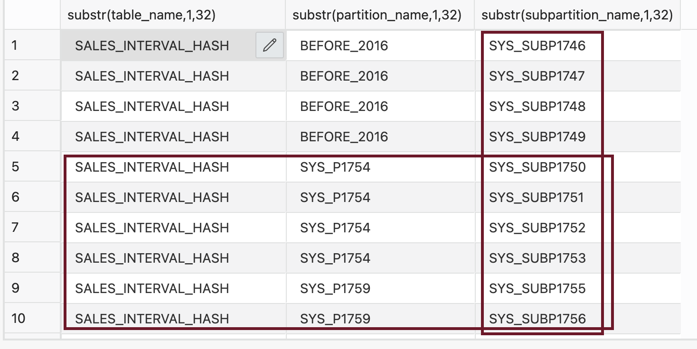

# Hash Partitioning - PENDING VERIFICATION

## Introduction

Draft version 1.1 

Composite hash-* partitioning enables hash partitioning along two dimensions.

The composite hash-hash partitioning strategy has the most business value of the composite hash-* partitioned tables. This technique is beneficial to enable partition-wise joins along two dimensions.


### Features

* Introduced with Oracle 8.1
* Hash Partition Is a single level partition along with List and Range
* Data is placed based on hash value of partition key
* Ideal for equal data distribution
* Number of partitions should be a power of 2 for equal data distribution


In the following example, the number of subpartitions is specified when creating a composite hash-hash partitioned table; however, names are not specified. System generated names are assigned to partitions and subpartitions, which are stored in the default tablespace of the table.

### Business Challenges 

TBD 
 
### Objectives


 
In this lab, you will:
* create Interval Hash Partitioned Table

### Prerequisites
This lab assumes you have completed the following lab:

- Provision an ADB Instance (19c, Always Free)

## Task 1: Cleanup

Let us remove all the objects that we will create. Execute the following code snippet. You can safely ignore any 'table does not exist' error message. If a table does not exist, there is nothing wrong with not being able to drop it  .

```
<copy>
rem cleanup of all objects
drop table mc purge;
drop table alp purge;
drop table soon2bpart purge;
drop table part4filter purge;
drop table ropt purge;
drop table part4xchange purge;
drop table np4xchange purge;
drop table compart4xchange purge;
drop table p4xchange purge;
</copy>
```
 
## Task 2: Create Interval Hash Partitions

Let's Create Interval Hash Partitions Table:

The table is created with composite hash-hash partitioning. For this example, the table has four hash partitions for department\_id and each of those four partitions has eight subpartitions for course\_id.
 
```
<copy>
CREATE TABLE sales_interval_hash   
  ( prod_id       NUMBER(6)    
  , cust_id       NUMBER    
  , time_id       DATE    
  , channel_id    CHAR(1)    
  , promo_id      NUMBER(6)    
  , quantity_sold NUMBER(3)    
  , amount_sold   NUMBER(10,2)    
  )    
 PARTITION BY RANGE (time_id) INTERVAL (NUMTOYMINTERVAL(1,'MONTH'))    
 SUBPARTITION BY HASH (cust_id) SUBPARTITIONS 4    
 (
         PARTITION before_2016 VALUES LESS THAN (TO_DATE('01-JAN-2016','dd-MON-yyyy'))    
 );
</copy>
```
Display the partitions/subpartitions in the table with this SQL query. System generated names have been assigned to the partitions and subpartitions. Note that there are 32 subpartitions (4 x 8 = 32).
 
```
<copy>
SELECT SUBSTR(TABLE_NAME,1,32), SUBSTR(PARTITION_NAME,1,32), SUBSTR(SUBPARTITION_NAME,1,32) FROM USER_TAB_SUBPARTITIONS WHERE TABLE_NAME ='SALES_INTERVAL_HASH';
</copy>
``` 


## Task 3: Insert Data and View Partitioned Data

```
<copy>
INSERT INTO sales_interval_hash VALUES (2105, 101, '15-FEB-16', 'B', 19, 10, 300.00) ;
INSERT INTO sales_interval_hash VALUES (2105, 102, '21-APR-16', 'C', 12, 100, 2000.00) ;
INSERT INTO sales_interval_hash values (1200, 155, '31-MAY-16', 'D', 20, 300, 3600.00);
INSERT INTO sales_interval_hash values (1400, 165, '31-MAY-16', 'E', 15, 100, 4000.00);
INSERT INTO sales_interval_hash VALUES (2105, 125, '05-AUG-16', 'B', 16, 40, 8500.00);
INSERT INTO sales_interval_hash VALUES (2105, 302, '15-OCT-16', 'A', 11, 75, 4350.00); 
</copy>
``` 

The highlighted rows and columns are system generated Partitions and Sub Partitions

Display the data in the table

```
<copy>
select * from sales_interval_hash;
</copy>
```


Display the partitions and subpartitions in the table with this SQL query. Note that the structure of the table changed when data was added. Each unique time_id for 2016 generates a new partition with four subpartitions.

```
<copy>
SELECT SUBSTR(TABLE_NAME,1,32), SUBSTR(PARTITION_NAME,1,32), SUBSTR(SUBPARTITION_NAME,1,32) FROM USER_TAB_SUBPARTITIONS WHERE TABLE_NAME ='SALES_INTERVAL_HASH';
</copy>
```



insert a new record for year 2012 

```
<copy> 
INSERT INTO sales_interval_hash VALUES (2199, 302, '10-OCT-12', 'A', 11, 75, 4350.00);
</copy>
``` 

```
<copy> 
select * from SALES_INTERVAL_HASH PARTITION(BEFORE_2016); 
</copy>
```


```
<copy> 
select * from SALES_INTERVAL_HASH PARTITION(SYS_P1754); 
</copy>
```


 
cleanup table

```
<copy>
rem drop everything 
drop table sales_interval_hash purge;
</copy>
```

Semantically you are not violating any data immutability when you remove a complete object. If you want to preserve this case you should address this with proper privilege management or, under some circumstances, by disabling the table level lock. The latter one prevents a drop table, but also all other operations that require an exclusive table level lock.

You successfully made it to the end of module 'read only partitions and subpartitions'.    

You successfully made it to the end this lab Interval Partitions.    

## Learn More

* [Interval Hash Partitioning](https://livesql.oracle.com/apex/livesql/file/content_D08SNCFK262QXWD210YL8JLA0.html)
* [Database VLDB and Partitioning Guide](https://docs.oracle.com/en/database/oracle/oracle-database/21/vldbg/create-composite-partition-table.html#GUID-9ECF0F94-57BB-45F8-824F-48B320F23D9C)

## Acknowledgements
- **Author** - Madhusudhan Rao, Principal Product Manager, Database
* **Contributors** -  <Name, Group> -- optional
* **Last Updated By/Date** - <Name, Month Year>
