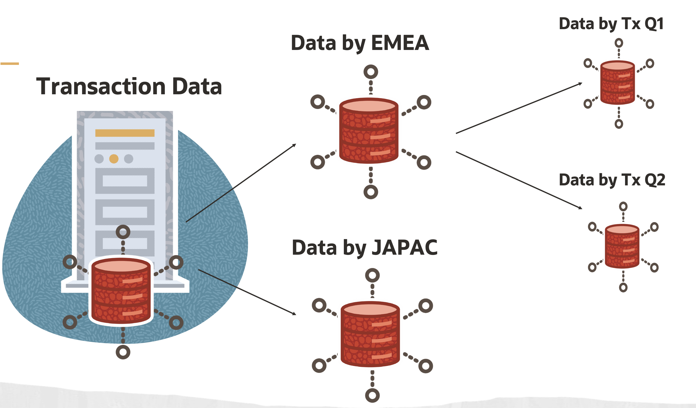

# Introduction

### About Oracle Partitioning
 
Oracle Partitioning enhances the manageability, performance and availability of large databases. It offers comprehensive partitioning methods to address different business requirements. We can apply Database partitioning on transactional, data warehousing, and mixed workload applications without changing any code. We can use partitioning on large tables and indexes to make them smaller objects that can be managed and accessed at a more advanced level of granularity.   

Partitioning large tables and indexes in Oracle Database ensure that an optimal method is available for every business requirement and can enhance the manageability, performance and availability of almost any database application. Partitioning allows the breakdown of tables and indexes into smaller physical pieces while keeping the logical view of a single object.

### Objectives
 
In this workshop, you will learn how to create the following partitions. 

* Range Partitioning
* Interval Partitioning
* List Partitioning
* Hash Partitioning
* Auto-List Partitioning
* Read Only Partitions
* Multi-Column List Partitioning
* Convert Non-partitioned Table to Partitioned Table

### Prerequisites
This lab assumes you have the following:

* Access to Oracle Database Standard or Enterprise Edition or Autonomous Database.
* You have access to Paid or Free Tier cloud tenancy. 

## About this Workshop
Oracle provides a comprehensive range of partitioning schemes to address every business requirement. Moreover, since it is entirely transparent in SQL statements, partitioning can be used with any application, from packaged OLTP applications to data warehouses. in this workshop, we will explore various partition types and their corresponding use cases.

Estimated Workshop Time:  2 hour 40 minutes

### Challenges with growing Data Volume

Let us consider the financial services sector, particularly retail banking, every time we do a transaction like debit, credit, fixed deposit, recurring deposit, auto EMI payment, utility bill payments etc. It makes an entry into the transaction master table, and the data is growing exponentially, as per the business standard report of December 31, 2021. The volume of digital transactions in India rose to 55.54 billion in FY21 from 10.85 billion in FY17, at a compounded annual growth rate of 50.42 per cent. So, with the growing volume of data, we can archive a significant portion of historical data into archival storage for on-demand retrieval; however, even if we consider data for the current financial year, it is in millions of records at a bank level. To run a query at this level would take a considerable amount of time and impacts the overall performance. It would be best to partition the data into smaller units per the business requirements.

 
Large tables are difficult to manage, So large databases and indexes can be split into smaller, more manageable pieces. For example, if we have too many events in our database, we can easily partition that table into events based on region and months.  
 

Benefits of Partitioning
*  Increases performance by only working on the relevant data. 
*  Decreases cost by storing data most appropriately.
*  It is easy to implement, requiring no changes to applications and queries.
*  It is a mature, well-proven feature used by thousands of Oracle customers.
*  Partitioning reduces the amount of data retrieved from storage
*  It Performs operations only on relevant partitions
*  Transparently improves query performance and optimizes resource utilization

Partitioning enables data management operations such as.
*  Data loads, joins and pruning,
*  Index creation and rebuilding,
*  Optimizer statistics management,
*  Backup and recovery
 
## Learn More

* [Partitioning whitepaper ](https://www.oracle.com/technetwork/database/options/partitioning/partitioning-wp-12c-1896137.pdf)   
* [Oracle Database Editions ](https://docs.oracle.com/cd/E11882_01/license.112/e47877/editions.htm#DBLIC109)

 
## Acknowledgements

- **Author** - Madhusudhan Rao, Principal Product Manager, Database
* **Contributors** - Kevin Lazarz, Senior Principal Product Manager, Database  
* **Last Updated By/Date** -  Madhusudhan Rao, Feb 2022 