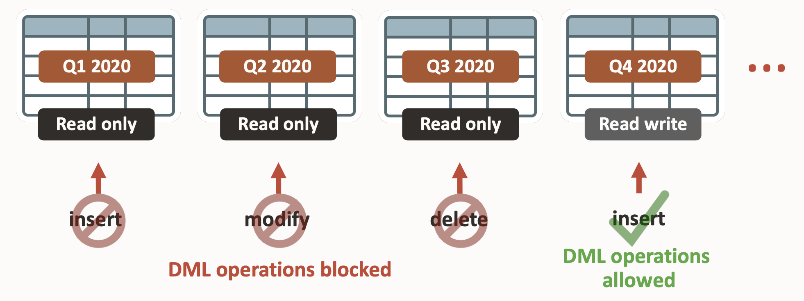
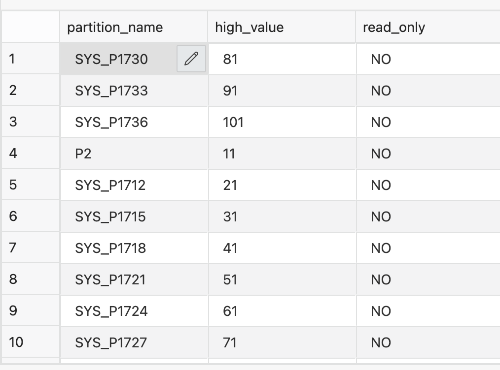
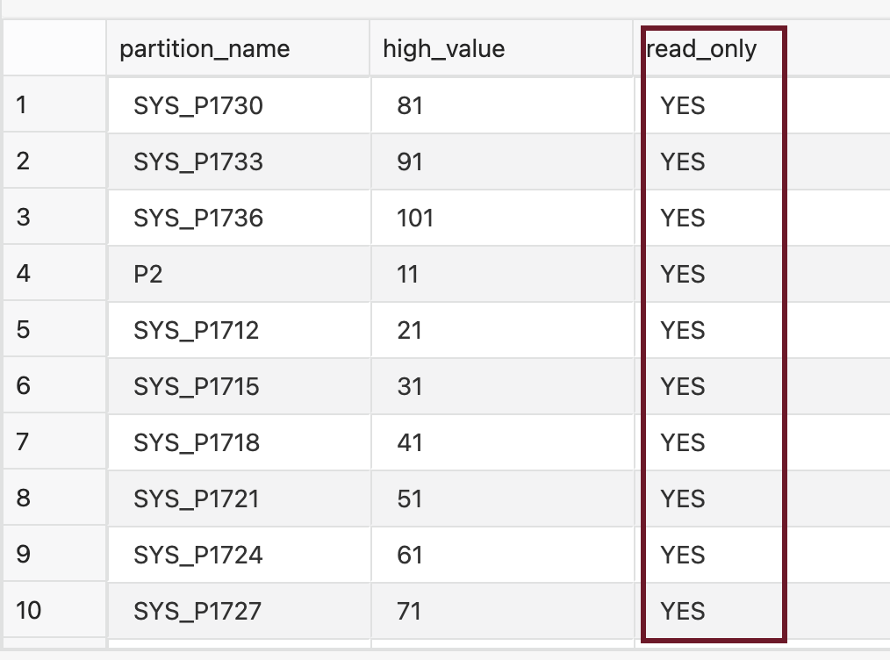

# Read Only Partitions 

## Introduction

We can set tables, partitions, and subpartitions to read-only status to protect data from unintentional DML operations by any user or trigger. Updating data in the partition that has the partition set to read-only will result in an error. The partition that is set to read-write will be successfully updated. 

 

### Making Previous quarter sales data as read-only 

In the financial services or retail sector, you can set the last quarter's sales data as read-only, and the rest of the data can allow read and write DML operations. 

### Features

* Read-only attribute guarantees data immutability. 
* If not specified, each partition and subpartition will inherit read-only property from top-level parent 
* ADD and MODIFY COLUMN are allowed and do not violate data immutability of existing data 
* DROP/RENAME/SET UNUSED COLUMN are forbidden 
* DROP [read only] PARTITION forbidden 
 
### Objectives
 
In this lab, you will:
* create Read Only Partitions

### Prerequisites
This lab assumes you have completed the following lab:

- Provision an Oracle Autonomous Database and ADW Instance has been created

## Task 1: Create Read Only Partitions

Let's Create Read Only Partitions Table: 
```
<copy>
rem simple interval partitioned table with one read only partition
create table ropt (col1, col2, col3) nocompress
partition by range (col1) interval (10)
(partition p1 values less than (1) read only,
 partition p2 values less than (11))
as select rownum, rownum*10, rpad('a',rownum,'b') 
from dual connect by level <= 100;
</copy>
```
    
As you can see, we did specify read-only for partition P1 but nowhere else, neither on table nor partition level. Let's see what we ended up with:

```
<copy>
rem metadata
select table_name, def_read_only from user_part_tables where table_name='ROPT';
rem currently existent partitions;
</copy>
```


```
<copy> 
select partition_name, high_value, read_only
from user_tab_partitions
where table_name='ROPT';
</copy>
```



As expected, we only have one partition set to read-only in this example. That means that: The table-level default is (and will stay) read-write. Only partition p1 is defined as read-only where it was explicitly defined. You can change the read-only/read-write attribute for existing partitions.

```
<copy>
rem change the status of a partition to read only
alter table ropt modify partition for (5) read only;
</copy>
```

```
<copy> 
select partition_name, high_value, read_only
from user_tab_partitions
where table_name='ROPT';
</copy>
```


As partition level attribute, read-only can be used in conjunction with other partition maintenance operations.

```
<copy>
rem online PMOP will not work when one of the target partitions is read only
alter table ropt split partition for (5) into 
(partition pa values less than (7), partition pb read only) online;
</copy>
```

Read-only is considered a guaranteed state when a PMOP (partition maintenance operation) is started. It would also be ambiguous when to change the state if a change from read-write to read-only  

```
<copy>
rem offline PMOP
alter table ropt split partition for (5) into 
(partition pa values less than (7), partition pb read only);
</copy>
```

You can also set a whole table to read-only. This will change the state for all existing partitions as well as the default of the table. Note that this is in line with other attributes.

```
<copy>
rem set everything read only, including the default property
alter table ropt read only;
</copy>
```

```
<copy> 
select partition_name, high_value, read_only
from user_tab_partitions
where table_name='ROPT';
</copy>
```



```
<copy>
rem partition pb
select partition_name, high_value, read_only, compression
from user_tab_partitions
where table_name='ROPT' and partition_name='PB';
</copy>
```

Let's move and compress this partition:
```
<copy>
rem do the move and compress
alter table ropt move partition pb compress for oltp;
</copy>
```

The partition move on the read only partition succeeded without raising any error. Checking the partition attributes again you now will see that the partition is compressed.

```
<copy>
rem partition pb
select partition_name, high_value, read_only, compression
from user_tab_partitions
where table_name='ROPT' and partition_name='PB';
</copy>
```

Another operation that works on a table with read-only partitions is adding a column. Such an operation works irrespective of whether the new column is nullable or not and whether the column has a default value.

```
<copy>
rem add a column to the table
alter table ropt add (newcol number default 99);
</copy>
```
 
Any form of DML on a read only partition:

```
<copy>
rem no DML on read only partitions
update ropt set col2=col2 where col1=88;
</copy>
```

Dropping or truncating a read only partition - since this is semantically equivalent to a DELETE FROM  table WHERE  partitioning criteria :

```
<copy>
rem no drop or truncate partition
alter table ropt drop partition for (56);
Dropping a column (or setting a column to unused):
</copy>
```

```
<copy>
rem drop column is not allowed
alter table ropt drop column col2;
Last but not least, and this is no different to existing read only tables, you can drop a table with one, multiple or all partitions in a read only state:
</copy>
```


```
<copy>
rem drop everything succeeds
drop table ropt purge;
</copy>
```
 
## Task 2: Another example of readonly partitioned table

```
<copy>
create table RDPT2
(oid    number,
odate   date,
amount  number
)read only
partition by range(odate)
(partition q1_2016 values less than (to_date('2016-04-01','yyyy-mm-dd')),
partition q2_2016 values less than (to_date('2016-07-01','yyyy-mm-dd')),
partition q3_2016 values less than (to_date('2016-10-01','yyyy-mm-dd'))read write,
partition q4_2016 values less than (to_date('2017-01-01','yyyy-mm-dd'))read write);
</copy>
```

Data in a read-only partition or subpartition cannot be modified.

```
<copy>
insert into RDPT2 values(1,to_date('2016-01-20','yyyy-mm-dd'),100); 
</copy>
```


```
<copy>
insert into RDPT2 values(1,to_date('2016-10-20','yyyy-mm-dd'),100);
insert into RDPT2 values(1,to_date('2016-12-20','yyyy-mm-dd'),100);
</copy>
```

```
<copy>
select * from RDPT2;
</copy>
```


## Task 3: Cleanup

```
<copy>
rem drop everything succeeds
drop table RDPT2 purge;
</copy>
```
 
You successfully made it to the end of module 'read only partitions and subpartitions'.    

## Learn More
 
* [Readonly Partition](https://livesql.oracle.com/apex/livesql/file/content_ED7LSLT4HREACY60G0K23CO9J.html)
* [Database VLDB and Partitioning Guide](https://docs.oracle.com/en/database/oracle/oracle-database/21/vldbg/partition-create-tables-indexes.html)

## Acknowledgements

- **Author** - Madhusudhan Rao, Principal Product Manager, Database
* **Contributors** - Kevin Lazarz, Senior Principal Product Manager, Database  
* **Last Updated By/Date** -  Madhusudhan Rao, Feb 2022 
