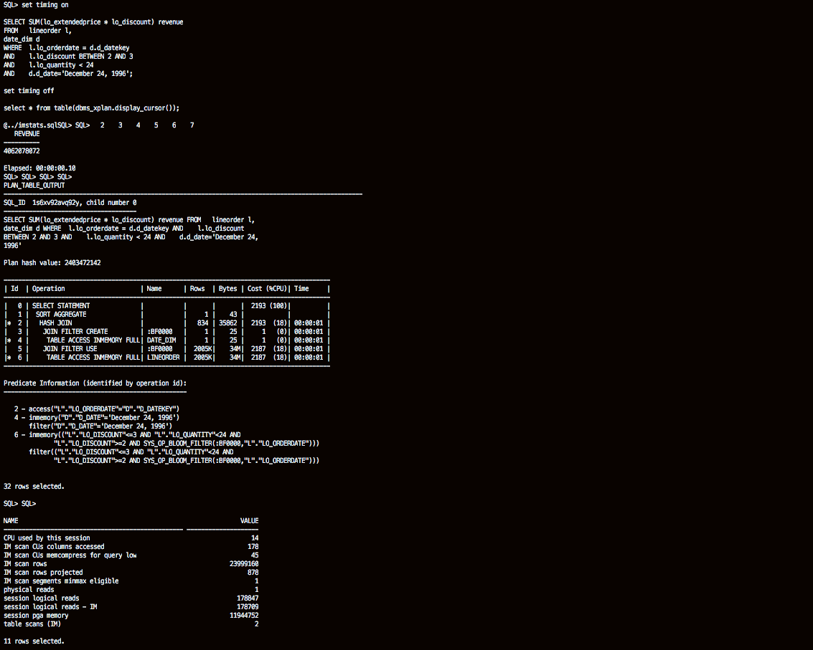
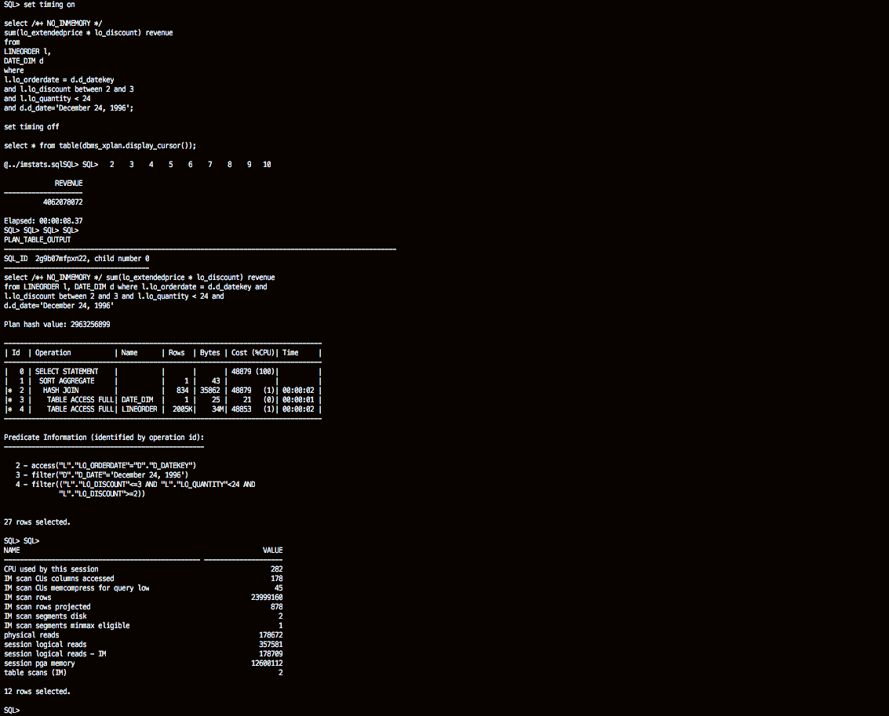
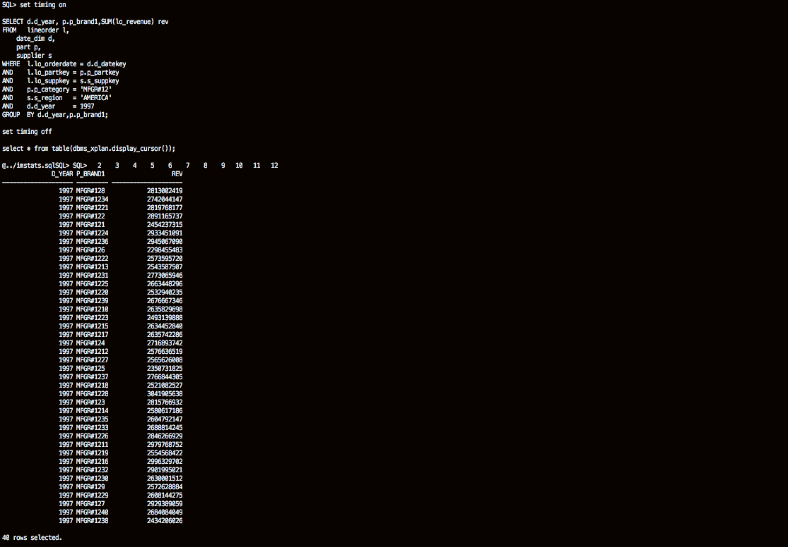
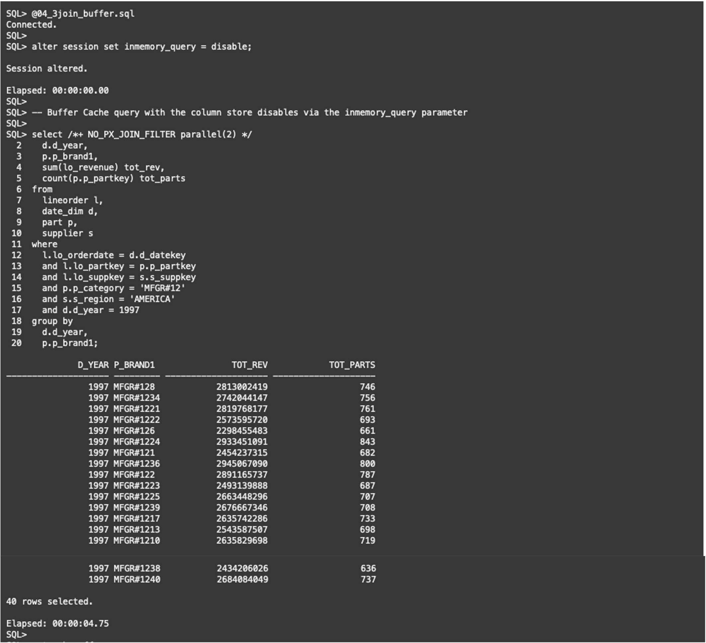
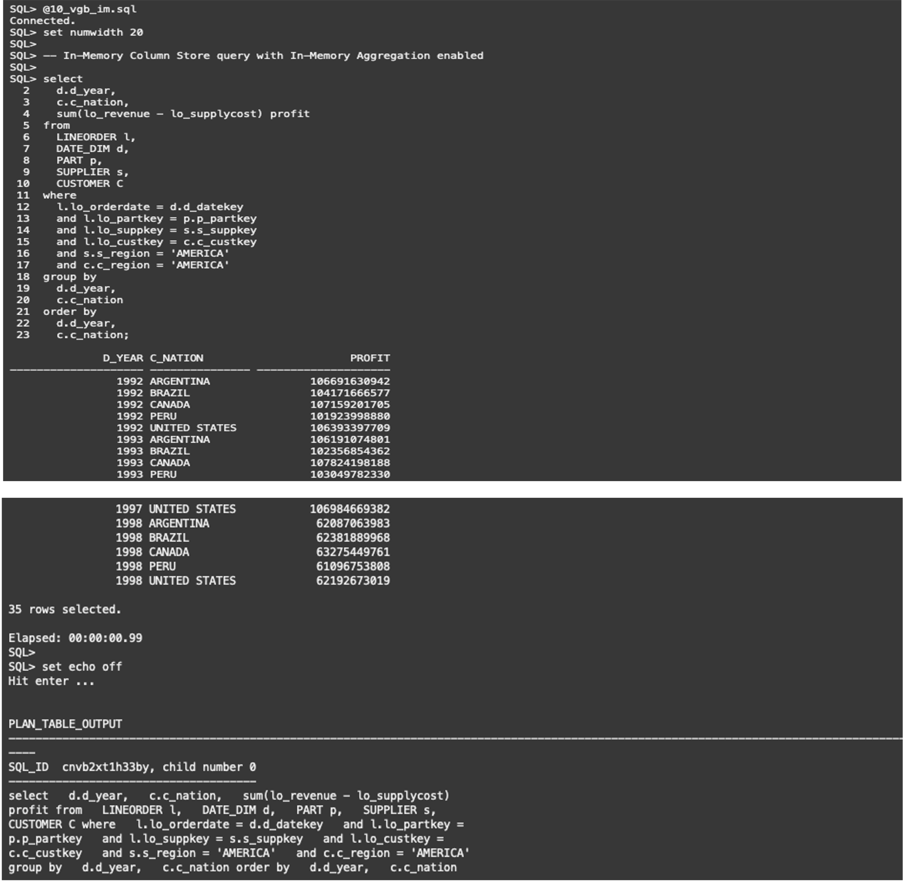
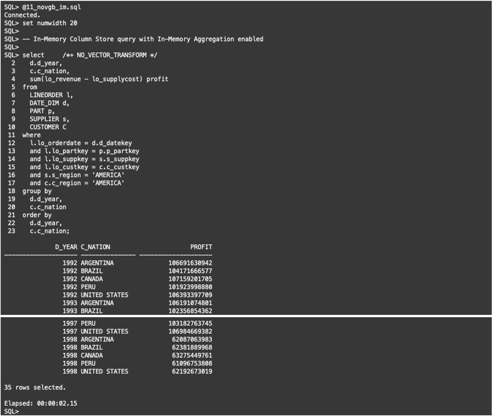
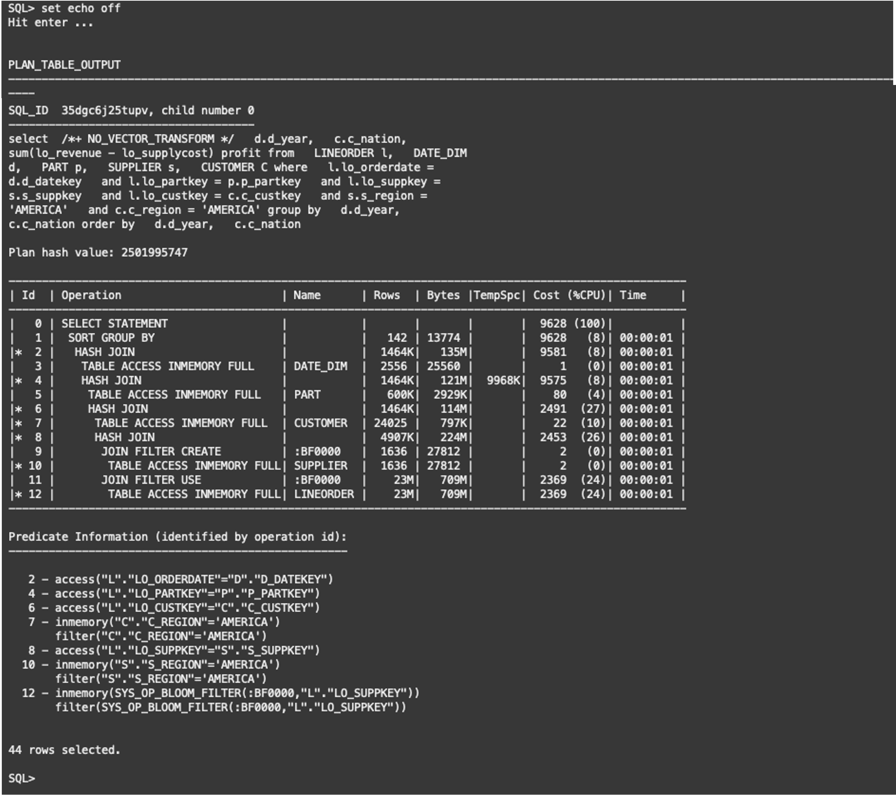
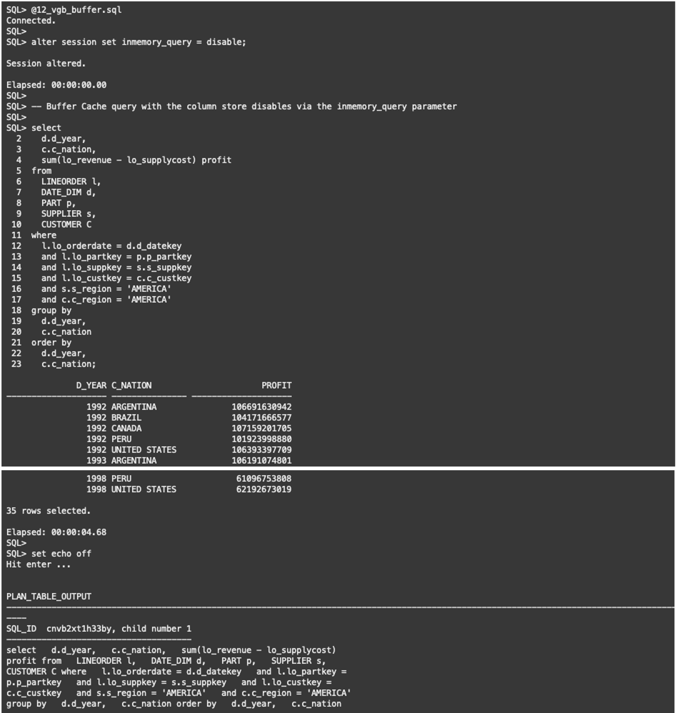
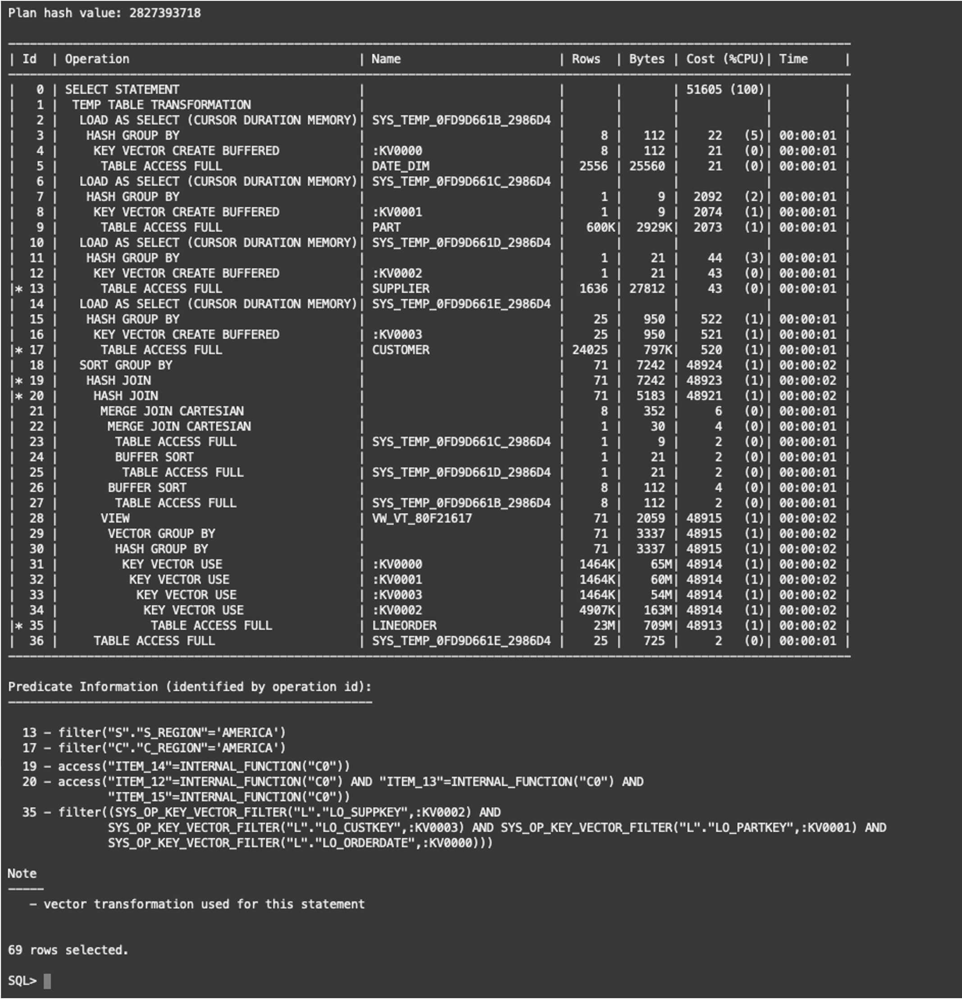

# In-Memory Joins and Aggregations

## Introduction
Watch the video below to get an overview of joins using Database In-Memory.

[](youtube:y3tQeVGuo6g)

Watch the video below for a walk through of the In-memory Joins and Aggregations lab.
[](youtube:w62wQ5pkBMA)

### Objectives

-   Learn how to enable In-Memory on the Oracle Database
-   Perform various queries on the In-Memory Column Store

### Prerequisites
This lab assumes you have:
- A Free Tier, Paid or LiveLabs Oracle Cloud account
- You have completed:
    - Lab: Prepare Setup (*Free-tier* and *Paid Tenants* only)
    - Lab: Environment Setup
    - Lab: Initialize Environment
    - Lab: Querying the In-Memory Column Store

## Task 1: In-Memory Joins and Aggregation

Up until now we have been focused on queries that scan only one table, the LINEORDER table. Let’s broaden the scope of our investigation to include joins and parallel execution. This section executes a series of queries that begin with a single join between the fact table, LINEORDER, and one of more dimension tables and works up to a 5 table join. The queries will be executed in both the buffer cache and the column store, to demonstrate the different ways the column store can improve query performance above and beyond just the basic performance benefits of scanning data in a columnar format.

1.  Let's switch to the Part3 folder and log back in to the PDB.

    ````
    <copy>
    cd /home/oracle/labs/inmemory/Part3
    sqlplus ssb/Ora_DB4U@localhost:1521/pdb1
    </copy>
    ````

    And adjust sqlplus display.

    ````
    <copy>
    set pages 9999
    set lines 100
    </copy>
    ````

    

2.  Join the LINEORDER and DATE\_DIM tables in a "What If" style query that calculates the amount of revenue increase that would have resulted from eliminating certain company-wide discounts in a given percentage range for products shipped on a given day (Christmas eve 1996).  

    Run the script *01\_join\_im.sql*

    ```
    <copy>
    @01_join_im.sql
    </copy>    
    ```

    or run the queries below.  

    ```
    <copy>
    set timing on

    SELECT SUM(lo_extendedprice * lo_discount) revenue
    FROM   lineorder l,
    date_dim d
    WHERE  l.lo_orderdate = d.d_datekey
    AND    l.lo_discount BETWEEN 2 AND 3
    AND    l.lo_quantity < 24
    AND    d.d_date='December 24, 1996';

    set timing off

    select * from table(dbms_xplan.display_cursor());

    @../imstats.sql
    </copy>
    ```

    

    The IM column store has no problem executing a query with a join because it is able to take advantage of Bloom filters.  It’s easy to identify Bloom filters in the execution plan. They will appear in two places, at creation time and again when it is applied. Look at the highlighted areas in the plan above. You can also see what join condition was used to build the Bloom filter by looking at the predicate information under the plan.

3.  Let's run against the buffer cache now.

    Run the script *`02_join_buffer.sql`*

    ```
    <copy>
    @02_join_buffer.sql
    </copy>    
    ```

    or run the queries below.

    ```
    <copy>
    set timing on

    select /*+ NO_INMEMORY */
    sum(lo_extendedprice * lo_discount) revenue
    from
    LINEORDER l,
    DATE_DIM d
    where
    l.lo_orderdate = d.d_datekey
    and l.lo_discount between 2 and 3
    and l.lo_quantity < 24
    and d.d_date='December 24, 1996';

    set timing off

    select * from table(dbms_xplan.display_cursor());

    @../imstats.sql
    </copy>
    ```
    

4. Let’s try a more complex query that encompasses three joins and an aggregation to our query. This time our query will compare the revenue for different product classes, from suppliers in a certain region for the year 1997. This query returns more data than the others we have looked at so far so we will use parallel execution to speed up the elapsed times so we don’t need to wait too long for the results.

    Run the script *03\_3join\_im.sql*

    ```
    <copy>
    @03_3join_im.sql
    </copy>    
    ```

    or run the queries below.

    ```
    <copy>
    set timing on

    SELECT /*+ parallel(2) */
      d.d_year, p.p_brand1,SUM(lo_revenue) rev
    FROM   lineorder l,
        date_dim d,
        part p,
        supplier s
    WHERE  l.lo_orderdate = d.d_datekey
    AND    l.lo_partkey = p.p_partkey
    AND    l.lo_suppkey = s.s_suppkey
    AND    p.p_category = 'MFGR#12'
    AND    s.s_region   = 'AMERICA'
    AND    d.d_year     = 1997
    GROUP  BY d.d_year,p.p_brand1;

    set timing off

    select * from table(dbms_xplan.display_cursor());

    @../imstats.sql
    </copy>
    ```

    

    


    In this query, three Bloom filters have been created and applied to the scan of the LINEORDER table, one for the join to DATE\_DIM table, one for the join to the PART table, and one for the join to the SUPPLIER table. How is Oracle able to apply three Bloom filters when the join order would imply that the LINEORDER is accessed before the SUPPLER table?

    This is where Oracle’s 30 plus years of database innovation kick in. By embedding the column store into Oracle Database we can take advantage of all of the optimizations that have been added to the database. In this case, the Optimizer has switched from its typical left deep tree execution to a right deep tree execution plan using an optimization called ‘swap\_join\_inputs’. What this means for the IM column store is that we are able to generate multiple Bloom filters before we scan the necessary columns for the fact table, meaning we are able to benefit by eliminating rows during the scan rather than waiting for the join to do it.

5. Now let’s execute the query against the buffer cache.

    Run the script *04\_3join\_buffer.sql*

    ```
    <copy>
    @04_3join_buffer.sql
    </copy>    
    ```

    or run the queries below.

    ```
    <copy>
    set timing on
    alter session set inmemory_query = disable;

    SELECT /*+ NO_PX_JOIN_FILTER parallel(2) */
      d.d_year, p.p_brand1,SUM(lo_revenue) rev
    FROM   lineorder l,
        date_dim d,
        part p,
        supplier s
    WHERE  l.lo_orderdate = d.d_datekey
    AND    l.lo_partkey = p.p_partkey
    AND    l.lo_suppkey = s.s_suppkey
    AND    p.p_category = 'MFGR#12'
    AND    s.s_region   = 'AMERICA'
    AND    d.d_year     = 1997
    GROUP  BY d.d_year,p.p_brand1;

    set timing off

    select * from table(dbms_xplan.display_cursor());

    @../imstats.sql
    </copy>
    ```

    

    


    As you can see, the IM column store continues to out-perform the buffer cache query.

6.  Up until this point we have been focused on joins and how the IM column store can execute them incredibly efficiently. Let’s now turn our attention to more OLAP style “What If” queries.  In this case our query examines the yearly profits from a specific region and manufacturer over our complete data set.
Oracle has introduced a new Optimizer transformation, called Vector Group By. This transformation is a two-part process not dissimilar to that of star transformation.  First, the dimension tables are scanned and any WHERE clause predicates are applied. A new data structure called a key vector is created based on the results of these scans. The key vector is similar to a Bloom filter as it allows the join predicates to be applied as additional filter predicates during the scan of the fact table, but it also enables us to conduct the group by or aggregation during the scan of the fact table instead of having to do it afterwards. The second part of the execution plan sees the results of the fact table scan being joined back to the temporary tables created as part of the scan of the dimension tables, that is defined by the lines that start with LOAD AS SELECT. These temporary tables contain the payload columns (columns needed in the select list) from the dimension table(s). In 12.2 these tables are now pure in-memory tables as evidenced by the addition of the (CURSOR DURATION MEMORY) phrase that is appended to the LOAD AS SELECT phrases. The combination of these two phases dramatically improves the efficiency of a multiple table join with complex aggregations. Both phases are visible in the execution plan of our queries.

    To see this in action execute the query *10\_vgb\_im.sql*

    ```
    <copy>
    @10_vgb_im.sql
    </copy>    
    ```

    or run the queries below.     

    ```
    <copy>
    set timing on

    SELECT
      d.d_year, c.c_nation, sum(lo_revenue - lo_supplycost) profit
    from
      LINEORDER l, DATE_DIM d, PART p, SUPPLIER s, CUSTOMER C
    where
      l.lo_orderdate = d.d_datekey
      and l.lo_partkey = p.p_partkey
      and l.lo_suppkey = s.s_suppkey
      and l.lo_custkey = c.c_custkey
      and s.s_region = 'AMERICA'
      and c.c_region = 'AMERICA'
    group by
      d.d_year, c.c_nation
    order by
      d.d_year, c.c_nation;

    set timing off

    select * from table(dbms_xplan.display_cursor());

    @../imstats.sql
    </copy>
    ```

    

    


  Our query is more complex now and if you look closely at the execution plan you will see the creation and use of :KV000n structures which are the Key Vectors along with the Vector Group By operation.

7. To see how dramatic the difference really is we can run the same query but we will disable vector group by operation.

    Run the *script 11\_novgb\_im.sql*

    ```
    <copy>
    @11_novgb_im.sql
    </copy>    
    ```

    or run the queries below.

    ```
    <copy>
    set timing on

    SELECT /*+ NO_VECTOR_TRANSFORM */
      d.d_year, c.c_nation, sum(lo_revenue - lo_supplycost) profit
    from
      LINEORDER l, DATE_DIM d, PART p, SUPPLIER s, CUSTOMER C
    where
      l.lo_orderdate = d.d_datekey
      and l.lo_partkey = p.p_partkey
      and l.lo_suppkey = s.s_suppkey
      and l.lo_custkey = c.c_custkey
      and s.s_region = 'AMERICA'
      and c.c_region = 'AMERICA'
    group by
      d.d_year, c.c_nation
    order by
      d.d_year, c.c_nation;

    set timing off

    select * from table(dbms_xplan.display_cursor());

    @../imstats.sql
    </copy>
    ```

    

    

    We went from 0.99 seconds to 2.15 seconds. Note that the second query still ran in-memory and even took advantage of Bloom filters, but it ran twice as slow as the vector group by plan.

8. To execute the query against the buffer cache

    Run the script *12\_vgb\_buffer.sql*

    ```
    <copy>
    @12_vgb_buffer.sql
    </copy>    
    ```

    or run the queries below.

    ```
    <copy>
    set timing on
    alter session set inmemory_query = disable;

    SELECT
      d.d_year, c.c_nation, sum(lo_revenue - lo_supplycost) profit
    from
      LINEORDER l, DATE_DIM d, PART p, SUPPLIER s, CUSTOMER C
    where
      l.lo_orderdate = d.d_datekey
      and l.lo_partkey = p.p_partkey
      and l.lo_suppkey = s.s_suppkey
      and l.lo_custkey = c.c_custkey
      and s.s_region = 'AMERICA'
      and c.c_region = 'AMERICA'
    group by
      d.d_year, c.c_nation
    order by
      d.d_year, c.c_nation;

    set timing off

    select * from table(dbms_xplan.display_cursor());

    @../imstats.sql
    </copy>
    ```

   

   


    Note that like hash joins with Bloom filters, vector group by with key vectors can be performed on row-store objects. This only requires that Database In-Memory be enabled and shows just how flexible Database In-Memory is. You don't have to have all objects populated in the IM column store. Of course, the row store objects cannot be accessed as fast as column-store objects and cannot take advantage of all of the performance features available to IM column store scans.

9. And finally let's take a look at how our query runs in the row-store with no Database In-Memory optimizations.

    Run the script *13\_novgb\_buffer.sql*

    ```
    <copy>
    @13_novgb_buffer.sql
    </copy>    
    ```

    or run the queries below.

    ```
    <copy>
    set timing on
    alter session set inmemory_query = disable;

    SELECT /*+ NO_VECTOR_TRANSFORM */
      d.d_year, c.c_nation, sum(lo_revenue - lo_supplycost) profit
    from
      LINEORDER l, DATE_DIM d, PART p, SUPPLIER s, CUSTOMER C
    where
      l.lo_orderdate = d.d_datekey
      and l.lo_partkey = p.p_partkey
      and l.lo_suppkey = s.s_suppkey
      and l.lo_custkey = c.c_custkey
      and s.s_region = 'AMERICA'
      and c.c_region = 'AMERICA'
    group by
      d.d_year, c.c_nation
    order by
      d.d_year, c.c_nation;

    set timing off

    select * from table(dbms_xplan.display_cursor());

    @../imstats.sql
    </copy>
    ```

   

   


   Compare the time from Step 6 at 0.99 seconds to the time running the query in the row-store of 7.17 seconds. Quite a dramatic difference. This is why we say that you can expect a 3-8x performance improvement with In-Memory Aggregation.


## Conclusion

This lab saw our performance comparison expanded to queries with both joins and aggregations. You had an opportunity to see just how efficiently a join, that is automatically converted to a Bloom filter, can be executed in the IM column store.

You also got to see just how sophisticated the Oracle Optimizer has become over the last 30 plus years, when it used a combination of complex query transformations to find the optimal execution plan for a star query.

Oracle Database adds In-Memory database functionality to existing databases, and transparently accelerates analytics by orders of magnitude while simultaneously speeding up mixed-workload OLTP. With Oracle Database In-Memory, users get immediate answers to business questions that previously took hours.

## Acknowledgements

- **Author** - Andy Rivenes, Product Manager,  Database In-Memory
- **Contributors** - Kay Malcolm, Anoosha Pilli, Rene Fontcha
- **Last Updated By/Date** - Rene Fontcha, LiveLabs Platform Lead, NA Technology, October 2021
