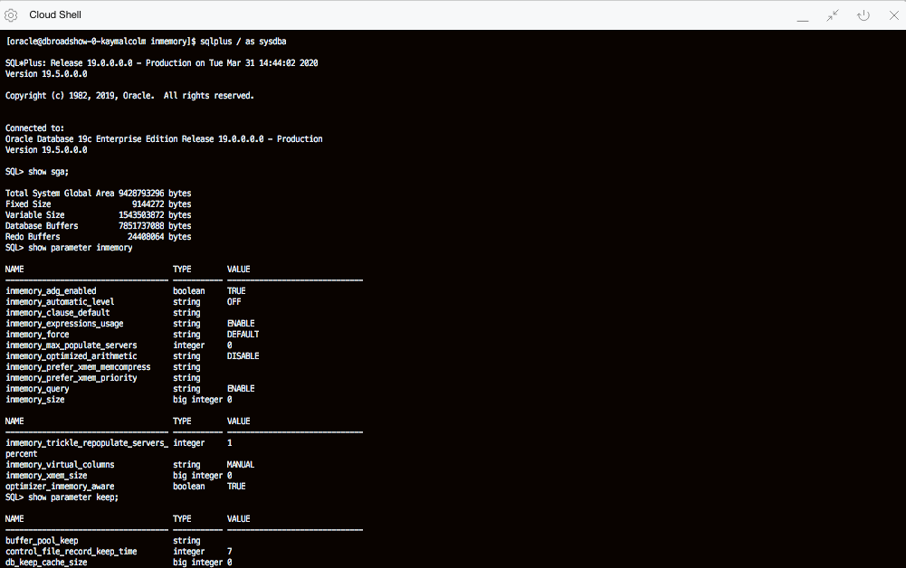
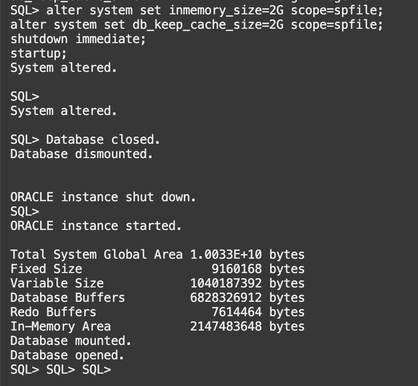
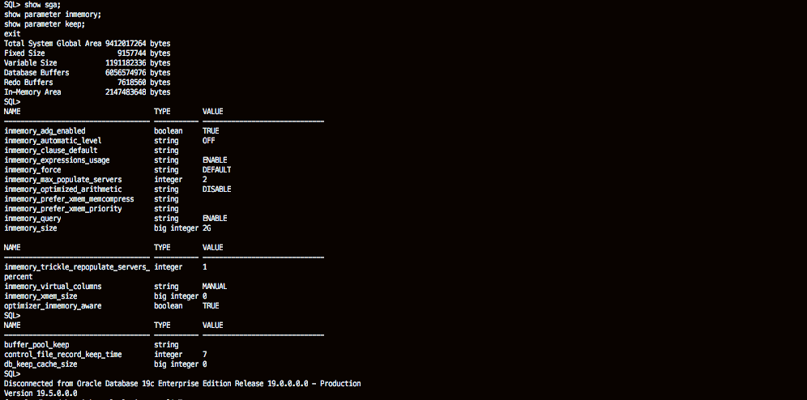
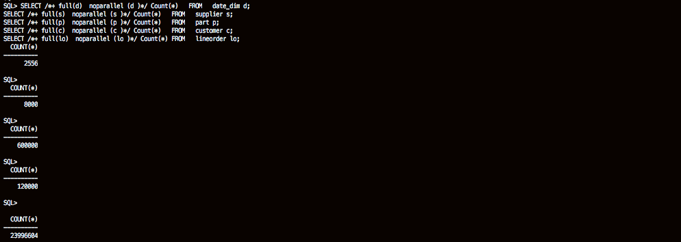

# Enable In-Memory

## Introduction

In this lab, you will explore how to enable In-Memory on the Oracle Database and various views to monitor In-Memory.

Watch the video below to get an explanation of enabling the In-Memory column store.

[](youtube:dZ9cnIL6KKw)

Quick walk through on how to enable In-Memory.

[](youtube:oCES149OPeE)

Estimated Lab Time: 30 minutes

### Objectives

-   Learn how to enable In-Memory on the Oracle Database
-   Explore various views to monitor In-Memory

### Prerequisites

This lab assumes you have completed the following labs:
* Lab: Generate SSH Key (FreeTier and Paid accounts)
* Lab: Environment Setup or Verify Setup

## Task 0: Download the Lab Files

1.  Open up the Oracle Cloud Shell or terminal of your choice and login to the compute instance you created in the previous lab.


2.  Copy the following commands into your terminal.  These commands download the files needed to run the lab.

    Note: If you are running in windows using putty, ensure your Session Timeout is set to greater than 0

    ````
    <copy>
    cd /home/opc/
    wget https://objectstorage.us-ashburn-1.oraclecloud.com/p/4JXw4Xlu8tLKn5iypGCV3QqEvxGyoslHuwwlKrnyJqMety5g_ImRuE-yZY0f27CA/n/c4u04/b/labfiles/o/multiscripts.zip
    unzip multiscripts.zip; chmod +x *.sh
    /home/opc/setupenv.sh
    </copy>
    ````

## Task 1: Run the In-Memory Setup Scripts
1.  Run this command to setup the schema, SSB, you will use for this lab.   This script takes about 15 minutes to complete.   It downloads the ssb.dmp file and then imports it.


    ````
    <copy>
    cd /home/opc/
    wget https://objectstorage.us-ashburn-1.oraclecloud.com/p/Zc0z9ZcPnNK8U_VrmtwKkfs1s-3fkkLY_8y39YCtk9cNGARAC1leX9xF2cIe0_6o/n/c4u04/b/labfiles/o/inmemoryscript.sh
    chmod +x /home/opc/inmemoryscript.sh
    nohup /home/opc/inmemoryscript.sh &> setupinmem.out&
    </copy>
    ````
     

2.  To check the status of the script above run the command below.   You can also use the unix **jobs** command to see if the script is still running.  *Note:  Ignore the error that the SSB User exists, that is expected.  The script should finish with 1 error*

    ````
    <copy>
    tail -f /home/opc/setupinmem.out
    </copy>
    ````
     

## Task 2: Logging In and Enabling In-Memory

1.  All scripts for this lab are stored in the labs/inmemory folder and are run as the oracle user.  Let's navigate there now.  We recommend you type the commands to get a feel for working with In-Memory. But we will also allow you to copy the commands via the COPY button.

    ````
    <copy>
    sudo su - oracle
    cd ~/labs/inmemory
    ls
    </copy>
    ````

2. In-Memory is integrated into Oracle Database 12c and higher.  The IM column store is not enabled by default, but can be easily enabled via a few steps.  Before you enable it, let's take a look at the default configuration. Set your oracle environment

    ````
    <copy>. oraenv</copy>
    ORCL
    ````
      

    ````
    <copy>
    sqlplus / as sysdba
    show sga;
    show parameter inmemory; 
    show parameter keep;
    </copy>
    ````

      

    Notice that the SGA is made up of Fixed Size, Variable Size, Database Buffers and Redo.  There is no In-Memory in the SGA.  Let's enable it.

3.  Enter the commands to enable In-Memory.  The database will need to be restarted for the changes to take effect.
   
    ````
    <copy>
    alter system set inmemory_size=2G scope=spfile;
    alter system set db_keep_cache_size=2G scope=spfile;
    shutdown immediate;
    startup;
    </copy>
    ````
      


4.  Now let's take a look at the parameters.
   
    ````
    <copy>
    show sga;
    show parameter inmemory; 
    show parameter keep;
    exit
    </copy>
    ````
      

## Task 3: Enabling In-Memory

The Oracle environment is already set up so sqlplus can be invoked directly from the shell environment. Since the lab is being run in a pdb called orclpdb you must supply this alias when connecting to the ssb account. 

1.  Login to the pdb as the SSB user.  
    ````
    <copy>
    sqlplus ssb/Ora_DB4U@localhost:1521/orclpdb
    set pages 9999
    set lines 200
    </copy>
    ````
      

2.  The In-Memory area is sub-divided into two pools:  a 1MB pool used to store actual column formatted data populated into memory and a 64K pool to store metadata about the objects populated into the IM columns store.  V$INMEMORY_AREA shows the total IM column store.  The COLUMN command in these scripts identifies the column you want to format and the model you want to use.  

    ````
    <copy>
    column alloc_bytes format 999,999,999,999;
    column used_bytes format 999,999,999,999;
    column populate_status format a15;
    --QUERY

    select * from v$inmemory_area;
    </copy>
    ````
      

3.  To check if the IM column store is populated with object, run the query below.

    ````
    <copy>
    column name format a30
    column owner format a20
    --QUERY

    select v.owner, v.segment_name name, v.populate_status status from v$im_segments v; 
    </copy>
    ````
        

4.  To add objects to the IM column store the inmemory attribute needs to be set.  This tells the Oracle DB these tables should be populated into the IM column store.   

    ````
    <copy>
    ALTER TABLE lineorder INMEMORY;
    ALTER TABLE part INMEMORY;
    ALTER TABLE customer INMEMORY;
    ALTER TABLE supplier INMEMORY;
    ALTER TABLE date_dim INMEMORY;
    </copy>
    ````
        

5.  This looks at the USER_TABLES view and queries attributes of tables in the SSB schema.  

    ````
    <copy>
    set pages 999
    column table_name format a12
    column cache format a5;
    column buffer_pool format a11;
    column compression heading 'DISK|COMPRESSION' format a11;
    column compress_for format a12;
    column INMEMORY_PRIORITY heading 'INMEMORY|PRIORITY' format a10;
    column INMEMORY_DISTRIBUTE heading 'INMEMORY|DISTRIBUTE' format a12;
    column INMEMORY_COMPRESSION heading 'INMEMORY|COMPRESSION' format a14;
    --QUERY    

    SELECT table_name, cache, buffer_pool, compression, compress_for, inmemory,
        inmemory_priority, inmemory_distribute, inmemory_compression 
    FROM   user_tables; 
    </copy>
    ````
        

    By default the IM column store is only populated when the object is accessed.

6.  Let's populate the store with some simple queries.

    ````
    <copy>
    SELECT /*+ full(d)  noparallel (d )*/ Count(*)   FROM   date_dim d; 
    SELECT /*+ full(s)  noparallel (s )*/ Count(*)   FROM   supplier s; 
    SELECT /*+ full(p)  noparallel (p )*/ Count(*)   FROM   part p; 
    SELECT /*+ full(c)  noparallel (c )*/ Count(*)   FROM   customer c; 
    SELECT /*+ full(lo)  noparallel (lo )*/ Count(*) FROM   lineorder lo; 
    </copy>
    ````
      

7. Background processes are populating these segments into the IM column store.  To monitor this, you could query the V\$IM\_SEGMENTS.  Once the data population is complete, the BYTES\_NOT\_POPULATED should be 0 for each segment.  

    ````
    <copy>
    column name format a20
    column owner format a15
    column segment_name format a30
    column populate_status format a20
    column bytes_in_mem format 999,999,999,999,999
    column bytes_not_populated format 999,999,999,999,999
    --QUERY

    SELECT v.owner, v.segment_name name, v.populate_status status, v.bytes bytes_in_mem, v.bytes_not_populated 
    FROM v$im_segments v;
    </copy>
    ````

      

8.  Now let's check the total space usage. 

    ````
    <copy>
    column alloc_bytes format 999,999,999,999;
    column used_bytes      format 999,999,999,999;
    column populate_status format a15;
    select * from v$inmemory_area;
    exit
    </copy>
    ````

     

     

In this Step you saw that the IM column store is configured by setting the initialization parameter INMEMORY_SIZE. The IM column store is a new static pool in the SGA, and once allocated it can be resized dynamically, but it is not managed by either of the automatic SGA memory features. 

You also had an opportunity to populate and view objects in the IM column store and to see how much memory they use. In this lab we populated about 1471 MB of compressed data into the  IM column store, and the LINEORDER table is the largest of the tables populated with over 23 million rows.  Remember that the population speed depends on the CPU capacity of the system as the in-memory data compression is a CPU intensive operation. The more CPU and processes you allocate the faster the populations will occur.

Finally you got to see how to determine if the objects were fully populated and how much space was being consumed in the IM column store.

You may now [proceed to the next lab](#next).

## Acknowledgements

- **Author** - Andy Rivenes, Sr. Principal Product Manager, Oracle Database In-Memory
- **Contributors** - Kay Malcolm, Director, DB Product Management
- **Last Updated By/Date** - Didi Han, DB Product Management, May 2021

