# Interacting with JSON Documents through Database Actions

## Introduction

This lab will use JSON and SQL in Database Actions from the Autonomous JSON Database page.

### Objectives

In this lab, you will:

* Open Database Actions from the Autonomous JSON Database Menu
* Use the JSON and SQL tools in Database Actions to view the data you created from Mongo Shell

### Prerequisites

* Be logged into your Oracle Cloud Account

## Task 1: Open Database Actions

1. Login to the Oracle Cloud.

<if type="freetier">

2. If you are using a Free Trial or Always Free account, and you want to use Always Free Resources, you need to be in a region where Always Free Resources are available. You can see your current default **Region** in the top, right hand corner of the page.

    

</if>
<if type="livelabs">

2. If you are using a LiveLabs account, you need to be in the region your account was provisioned in. You can see your current default **Region** in the top, right hand corner of the page. Make sure that it matches the region on the LiveLabs Launch page.

    

</if>

3. Click the navigation menu in the upper left to show top level navigation choices.

    

4. Click on **Oracle Database** and choose **Autonomous JSON Database**.

    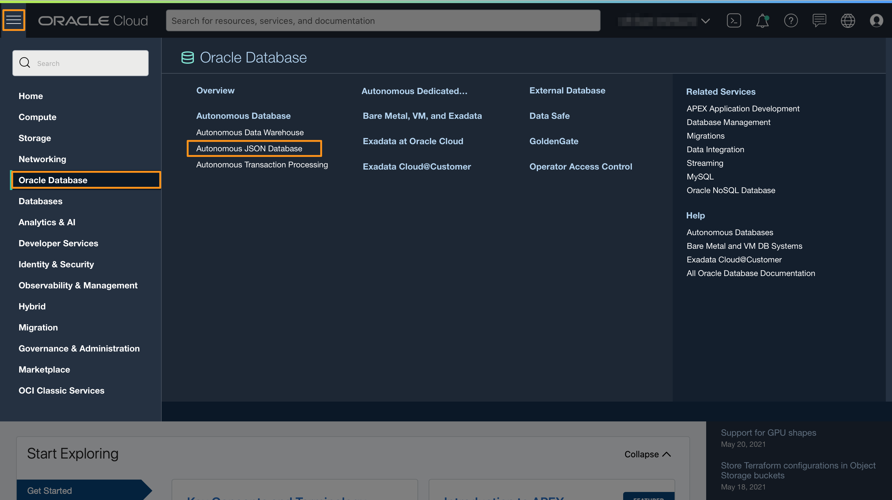

5. Use the __List Scope__ drop-down menu on the left to select the same compartment where you created your Autonomous JSON Databae in Lab 2. Make sure your workload type is __JSON Database__. <if type="livelabs">Enter the first part of your user name, for example `LL185` in the Search Compartments field to quickly locate your compartment.

    

</if>
<if type="freetier">
    
</if>
    

<if type="freetier">
   > **Note:** Avoid the use of the ManagedCompartmentforPaaS compartment as this is an Oracle default used for Oracle Platform Services.
</if>

6. You should see your database **JSONDB** listed in the center. Click on the database name "JSONDB".

    


7.  On the database page, choose __Database Actions__.

    

8.  You are now in Database Actions.

    Database Actions allows you to connect to your Autonomous Database through various browser-based tools. We will be using three of those tools:
    
    * JSON - allows you to work with a **document database** view of your data
    * SQL - allows you to work with a relational, **SQL-based** view of your data
    * Charts - generate charts over data in Autonomous Database

    


## Task 2: JSON in Database Actions

1. You should be in the Database Actions panel. Click on the **JSON** card

    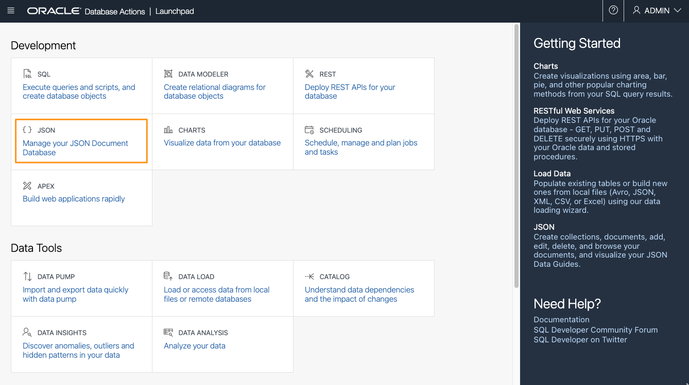

    When you first enter JSON, you will get a tour of the features. We recommend you step through it, but you can skip the tour by clicking on the "X". The tour is available at any time by clicking the tour button.

    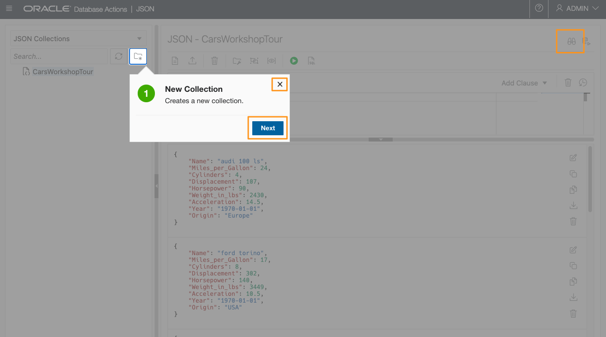

    After the tour, you should see the 'emp' collection you created in Mongo Shell on the left. If it's not shown, click the refresh circle.

    The left hand side shows collections. The upper right allows us to run queries, and the lower right shows the documents found by that query. An empty search - {} - will show all documents, which is what you should be looking at now. You can confirm using the scroll bar that there are three documents for Blake (Intern), Smith and Miller (Programmers).

2. Let's go ahead and do a search. Enter {"job": "Programmer"} in the search box and press the Run Query button. Case **is** significant, so be careful, or copy the query below:

    ```
    <copy>
    {"job": "Programmer"}
    </copy>
    ```

    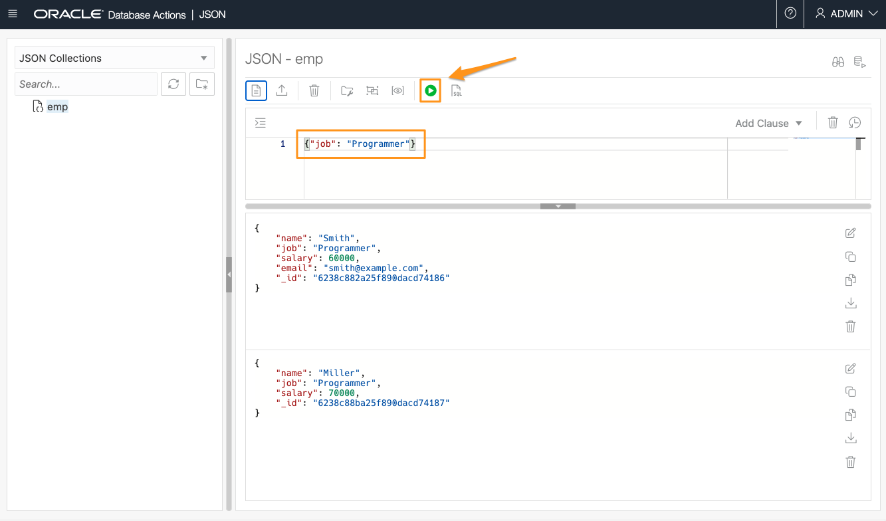

    We can see only two records are fetched as a result of that search. Let's give Miller a pay rise. Click on the "Edit" button to the right of the Miller document:

    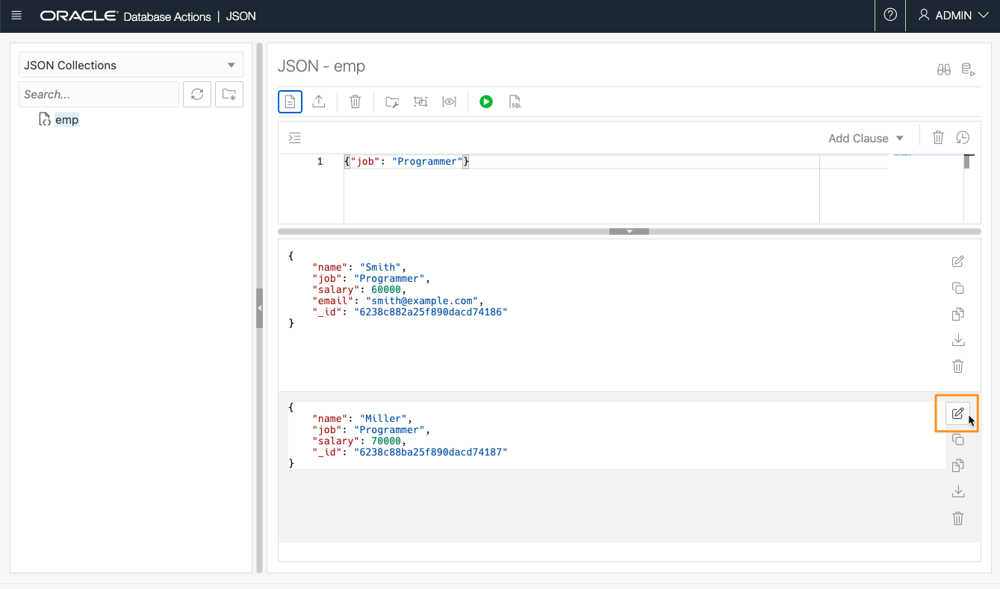

    That drops us into a JSON editor. In the JSON Document Content, change Miller's salary to 80000 and click the "Save" button. If you make an error which would produce invalid JSON, the editor will not let you save the content.

    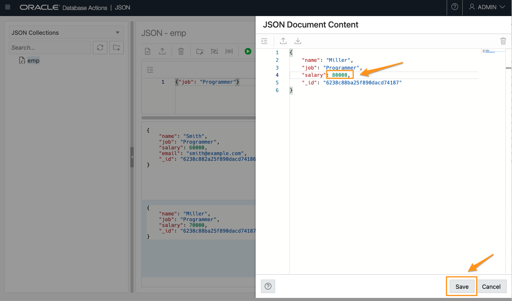

    We can now see that Miller's salary is 80000. Let's add another document to the collection. Click on the "New JSON Document" button immediately below the the collection name on the top panel.

    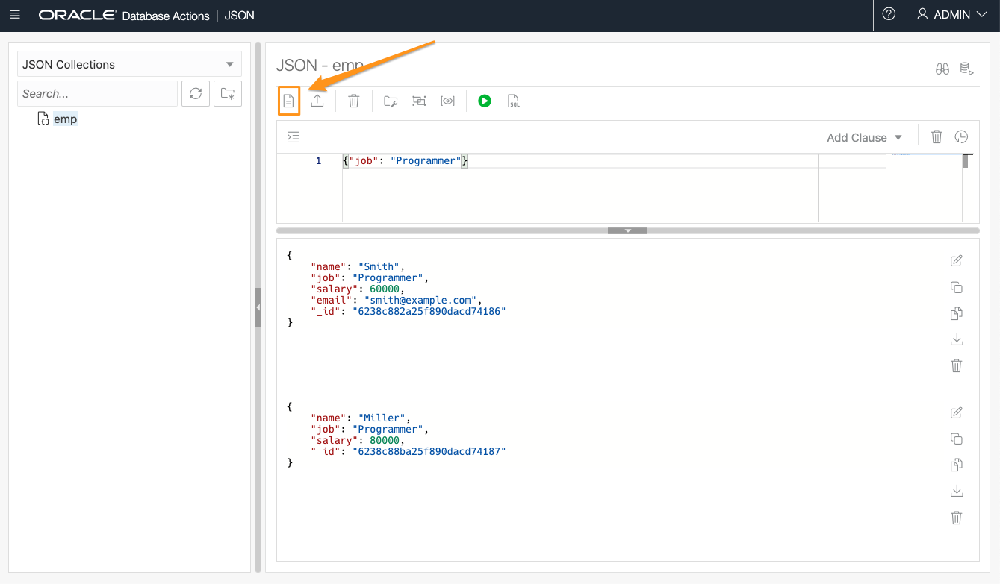


    That will bring up the JSON editor again, this time with an empty document. Copy the following document in:

    ```
    <copy>
    {
        "name": "Jones",
        "job": "Manager",
        "salary": 50000
    }
    </copy>
    ```

    Since there's already an empty document in there, make sure you don't end up with two sets of braces (curly brackets) around the JSON. Click "Create" when done.

    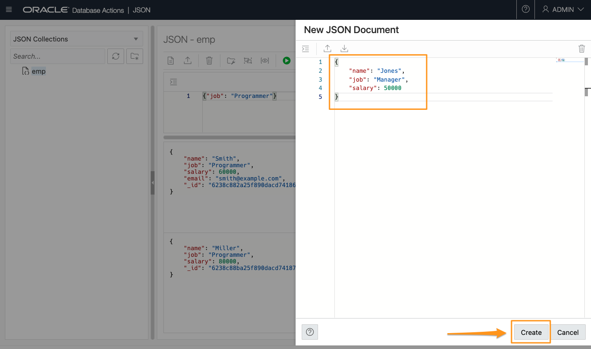

    Click the "Clear" button for the existing search, then run another empty search to see all documents.

    **Caution:** the same "trashcan" icon is used in two place in the JSON workshop. To the right of "add clause" it means "Clear the current search". On the top row, it means "Delete all documents found by the current query". Don't delete your documents by accident!

    Finally, let's sort the results of our query, in descending order of salary (so highest first).

    On the right, click "Add Clause" and choose "$orderby". This will guide us through adding an order-by clause to our (currently empty) query.

    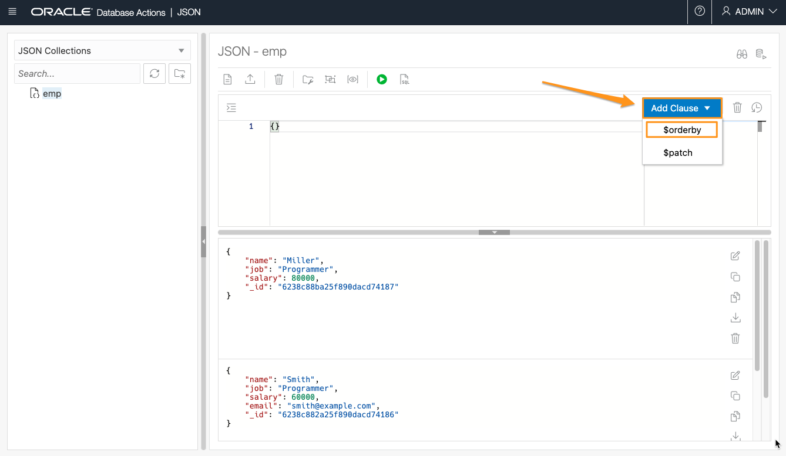

    That will change our query to have two parts - a $query part and a $orderby part. The $query part is the default if neither are specified.

    $query still contains our empty search - {}.

    We need to complete some details for the $orderby. We want to sort by salary, so change the path to "salary". It's a number, so change datatype from "varchar2" to "number". And finally change the order from "asc" (ascending) to "desc" (descending), so we get largest first. 

    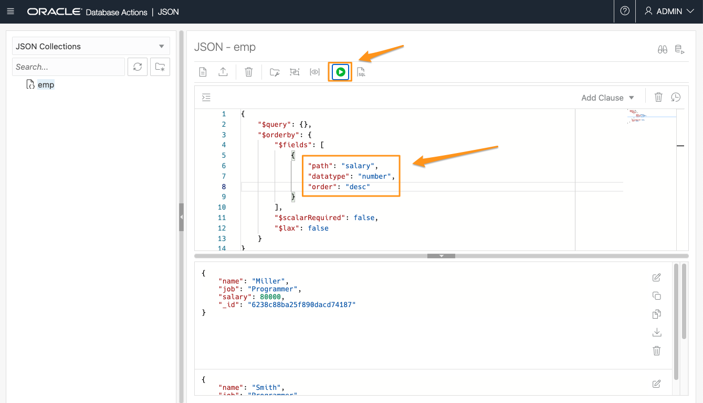

    Use the scrollbar to confirm that we have fetched back the records in descending order of salary.

    Before we leave JSON, let's just create a new collection. On the left side, click the "New Collection" button. 

    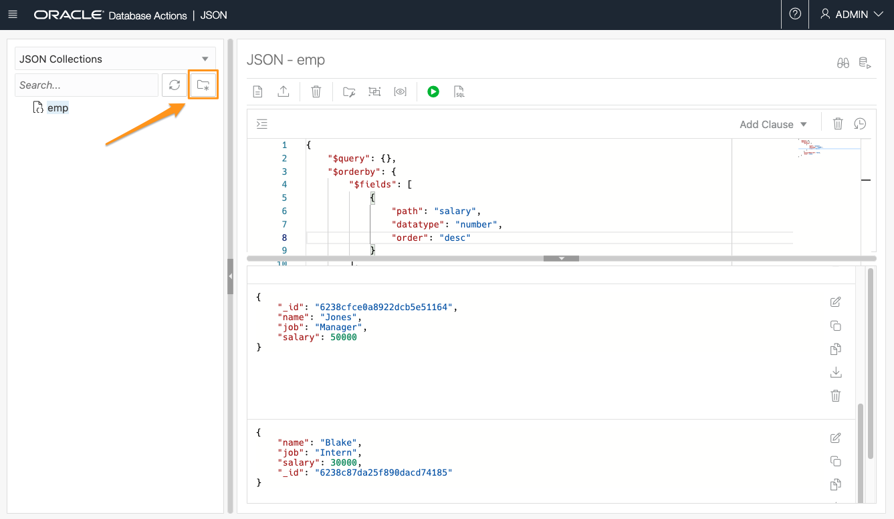

    On the right, give our collection the name "newcollection" and check the "MongoDB Compatible" box. 
    
    If you're interested, the main effect of the MongoDB compatibility is to include the allocated ID field within the document itself, as a field called "_id". This is a requirement for MongoDB utilities, but if you are only going to use Oracle SODA (Simple Oracle Document Access) then the ID field can be external to the document. You can see the difference in the sample JSON document if you check and uncheck the box.

    When done, click "Create".  We won't do anything else with this collection, but it illustrates a point in the next section.

    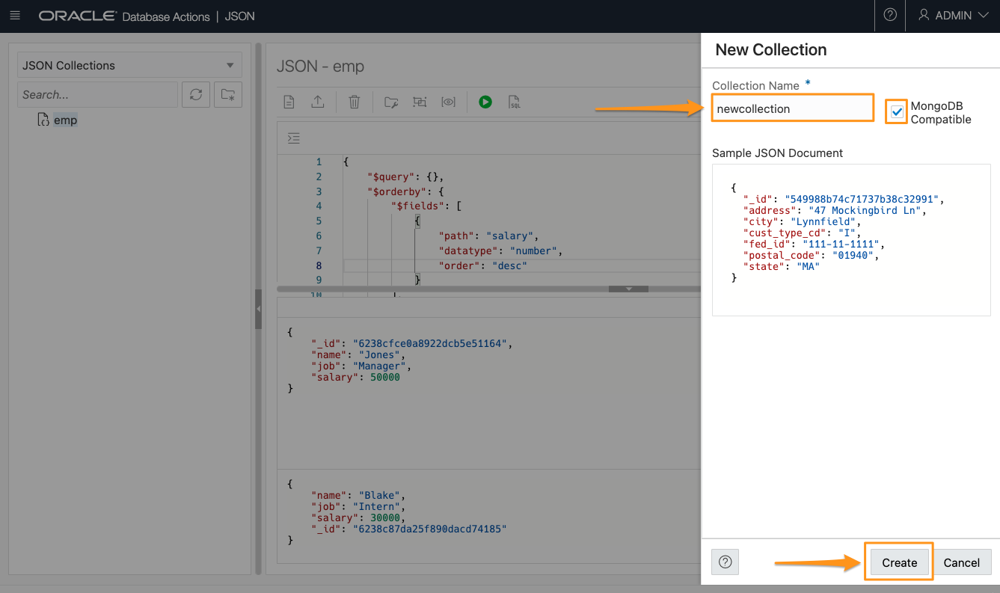

    You can refresh the collection list on the left hand side to check the new collection is there.

    After that, we're ready to move on to the next task.

## Task 3: SQL in Database Actions


## Learn More

## Acknowledgements

- **Author** - Roger Ford, Principal Product Managerda
- **Last Updated By/Date** - Anoosha Pilli, Brianna Ambler June 2021
