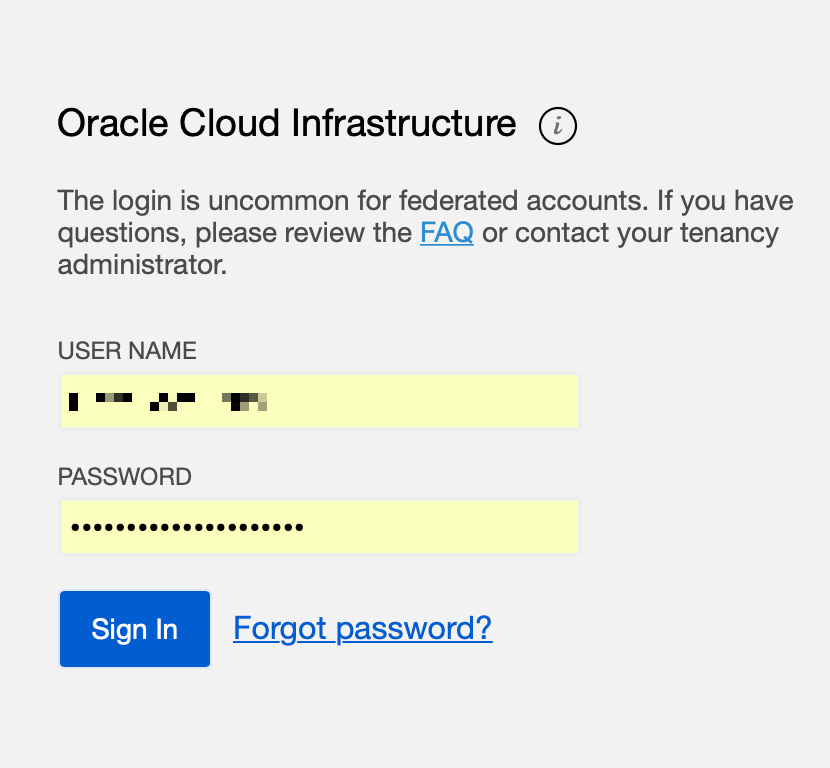
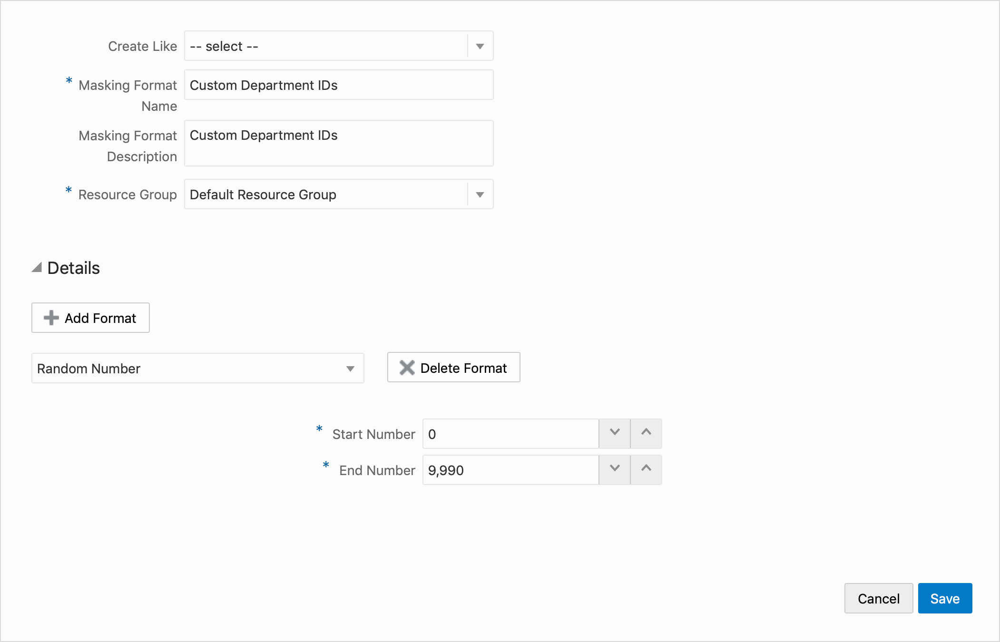

# Create a Masking Format in Oracle Data Safe

## Introduction
Using Data Safe, create a masking format and assign a default masking format to a user-defined sensitive type.

### Need Help?
Please submit feedback or ask for help using our [LiveLabs Support Forum](https://community.oracle.com/tech/developers/categories/livelabsdiscussions). Please click the **Log In** button and login using your Oracle Account. Click the **Ask A Question** button to the left to start a *New Discussion* or *Ask a Question*.  Please include your workshop name and lab name.  You can also include screenshots and attach files.  Engage directly with the author of the workshop.

If you do not have an Oracle Account, click [here](https://profile.oracle.com/myprofile/account/create-account.jspx) to create one.
Watch the video below for an overview on how to create a Masking Format in Oracle Data Safe

<div style="max-width:768px"><div style="position:relative;padding-bottom:56.25%"><iframe id="kaltura_player" src="https://cdnapisec.kaltura.com/p/2171811/sp/217181100/embedIframeJs/uiconf_id/35965902/partner_id/2171811?iframeembed=true&playerId=kaltura_player&entry_id=1_9ddkvp4s&flashvars[streamerType]=auto&amp;flashvars[localizationCode]=en&amp;flashvars[leadWithHTML5]=true&amp;flashvars[sideBarContainer.plugin]=true&amp;flashvars[sideBarContainer.position]=left&amp;flashvars[sideBarContainer.clickToClose]=true&amp;flashvars[chapters.plugin]=true&amp;flashvars[chapters.layout]=vertical&amp;flashvars[chapters.thumbnailRotator]=false&amp;flashvars[streamSelector.plugin]=true&amp;flashvars[EmbedPlayer.SpinnerTarget]=videoHolder&amp;flashvars[dualScreen.plugin]=true&amp;flashvars[hotspots.plugin]=1&amp;flashvars[Kaltura.addCrossoriginToIframe]=true&amp;&wid=1_6o1o4jh3" width="768" height="432" allowfullscreen webkitallowfullscreen mozAllowFullScreen allow="autoplay *; fullscreen *; encrypted-media *" sandbox="allow-forms allow-same-origin allow-scripts allow-top-navigation allow-pointer-lock allow-popups allow-modals allow-orientation-lock allow-popups-to-escape-sandbox allow-presentation allow-top-navigation-by-user-activation" frameborder="0" title="Kaltura Player" style="position:absolute;top:0;left:0;width:100%;height:100%"></iframe></div></div>


## Objectives

In this lab, you learn how to do the following:
- Create a masking format.
- Assign a default masking format to a user-defined sensitive type.

## Challenge

You have department IDs in your target database that you need to mask. You decide to create a masking format in Oracle Data Safe to mask the data.

Follow these general steps:
1. Sign in to your ExaCS database as the SYS user with SQL Developer.
2. In SQL Developer, research the `DEPARTMENT_ID` column in your target database to help you figure out how to create a masking format for it.
3. Sign in to the Oracle Data Safe Console for your region.
4. In the Oracle Data Safe Console, create a masking format to mask the `HCM1.DEPARTMENT_ID` column in your target database.
5. Select your masking format as the default masking format for the sensitive type that you created in [Discovery Lab 4 - Create a Sensitive Type and Sensitive Category with Oracle Data Safe](?lab=lab-7-7-create-sensitive-type-sensitive) (<username> **Custom Department ID Number)**.

## Steps

### Task 1: Connect to your ExaCS database as the SYS user with SQL Developer

Please visit [Lab 4: Configuring a development system for use with your EXACS database](?lab=lab-4-configure-development-system-for-use) for instructions to securely configure ExaCS to connect using Oracle SQL Developer, SQLXL and SQL*Plus.

### Task 2: In SQL Developer Web, research the `DEPARTMENT_ID` column in your target database to help you figure out how to create a masking format for it

- Run the following command:

```
<copy>ALTER SESSION SET CONTAINER=PDB1;</copy>
```

- Next run a select on the `DEPARTMENTS` table

```
<copy>SELECT * FROM HCM1.DEPARTMENTS;</copy>
```
- Notice that the department ID values are 10, 20, 30, up to 270.
- Click the **Data Modeler** tab.
- In the first drop-down list, select `HCM1`.
- In the second drop-down list, select **Tables**.
- Drag the `DEPARTMENTS` table to the worksheet.
- Notice that the `DEPARTMENT_ID` column has the data-type `NUMBER(4)`, which means it can take up to four digits (no decimals). It is also a primary key column.

### Task 3: Sign in to the Oracle Data Safe Console for your region

- From the navigation menu, click **Data Safe**


- You are taken to the **Registered Databases** Page.
- Click on **Service Console**


- You are taken to the Data Safe login page. Sign into Data Safe using your credentials.



### Task 4: In the Oracle Data Safe Console, create a masking format to mask department IDs

- In the Oracle Data Safe Console, click the **Library** tab.
- Click **Masking Formats**, and then click **Add**.


- The **Create Masking Format** dialog box is displayed.
- Leave the **Create Like** drop-down list as is.
- In the **Masking Format Name** field, enter **<username> Custom Department IDs**.
- In the **Masking Format Description** field, enter **Custom Department IDs**.
- Select your resource group.
- From the Format drop-down list, select **Random Number**.
- In the **Start Number** field, enter **10**.
- In the **End Number** field, enter **9990**.



- Click **Save**.<br>
A confirmation message states that you successfully created the masking format.
- Move the **Hide Oracle Predefined** slider to the right and verify that your masking format is listed.


### All Done!
