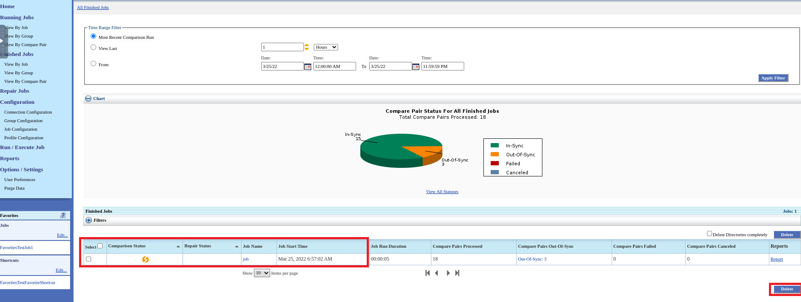
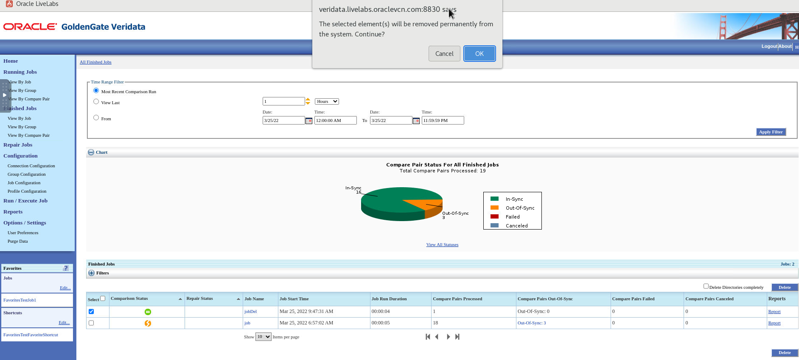
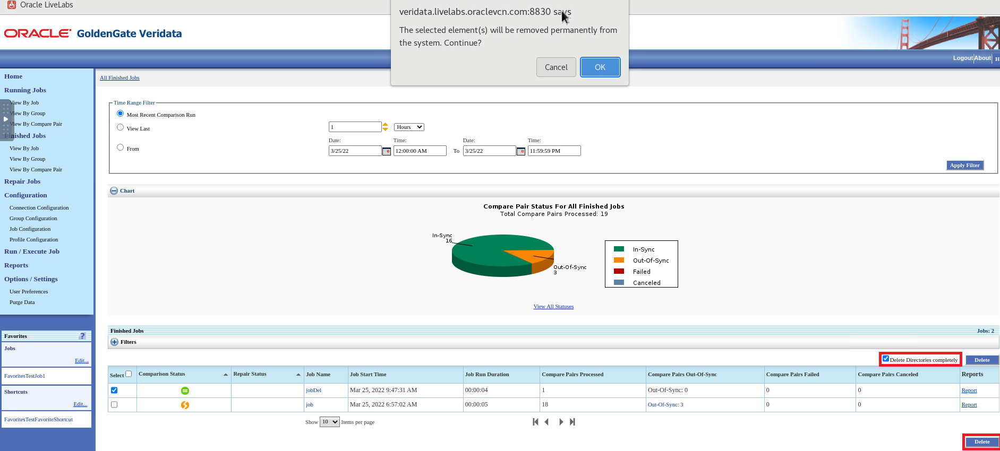
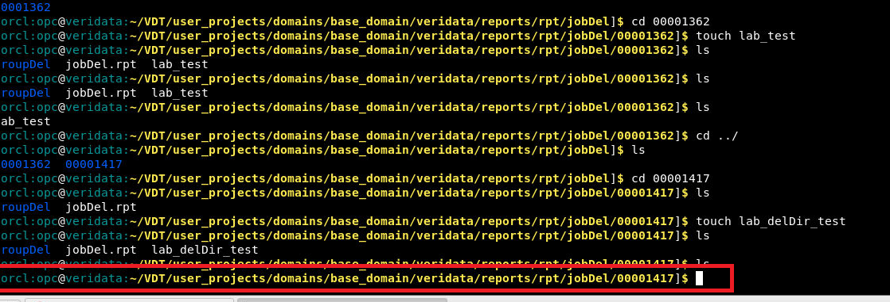

# Purge Data and Delete Directories

## Introduction
This lab describes how to purge data and delete directories in the Oracle GoldenGate Veridata UI.

The Purge Data option allows you to delete old Oracle GoldenGate Veridata stats from the product repository.

The Delete Directories option allows you to purge old reports, compare results, and obsolete data from the Oracle GoldenGate Veridata server. Use the Delete Directories completely check box to delete the entire reports directory content, including files, and directories created by the user.

*Estimated Lab Time*: 30 minutes

### Objectives
In this lab, you will:
* Purge data
* Delete directories
* Delete directories completely

### Prerequisites
This lab assumes you have:
- A Free Tier, Paid or LiveLabs Oracle Cloud account
- You have completed:
    * Lab: Prepare Setup (*Free-tier* and *Paid Tenants* only)
    * Lab: Environment Setup
    * Lab: Initialize Environment
    * Lab: Create Datasource Connections
    * Lab: Create Groups and Compare Pairs


## Task 1: Purge Data

Ensure to execute a Job by following the steps in **Lab: Create and Execute Jobs**.

Watch this short video on how to create datasource connections, groups, compare pairs, jobs:

[](youtube:DiAapnWt0No)

To purge data:

1. Click **Purge Data** from the Left Navigation pane.

    

2. Select the Date and Time until which you want the data to be purged and click **Purge**.

    

    Data has been purged for the selected Date and time.

    

3. Click **Reports** and notice that there are no reports under **Existing Reports**.

    

The metadata of the Reports get deleted from the repository. However, the reports are available on Oracle GoldenGate Veridata server.

## Task 2: Delete Directories (Delete Directories Completely Check Box is Unchecked)

The generated report files are stored in this location:
`/home/opc/VDT/user_projects/domains/base_domain/veridata/reports`.

Ensure to execute a Job by following the steps in **Lab: Create and Execute Jobs**.

To delete directories:

1. Create user-defined files in the generated report file location:
`/home/opc/VDT/user_projects/domains/base_domain/veridata/reports`.

    ```
    <copy>
    cd /home/opc/VDT/user_projects/domains/base_domain/veridata/reports/rpt/<*JobName*>/<*directory for the latest job*>
    <copy>
    ```
    ```
    <copy>
    touch lab_test
    <copy>
    ```


2. In the UI, select **Finished Jobs**, and select the Job you want to delete and click **Delete**.

    

3. Click **OK** in the displayed popup.

    

4. In the terminal, verify that except for the user-defined file (`lab_test`), the other files are deleted.

      

  User-defined files created within the reports directories will not be deleted.

## Task 3: Delete Directories (Delete Directories Completely Check Box is Selected)

The generated report files are stored in this location:
`/home/opc/VDT/user_projects/domains/base_domain/veridata/reports`.

Ensure to execute a Job by following the steps in **Lab: Create and Execute Jobs**.

To delete directories:
1. Create user-defined files in the generated report file location:
  `/home/opc/VDT/user_projects/domains/base_domain/veridata/reports`.

      ```
      <copy>
      cd /home/opc/VDT/user_projects/domains/base_domain/veridata/reports/rpt/JobName/directory for the latest job
      <copy>

      ```
      ```
      <copy>
      touch lab_test
      <copy>
      ```

    

2. In the UI, select **Finished Jobs**, select the Job you want to delete, select the **Delete Directories Completely** check box, and then click **Delete**.

  

3. Click **OK** in the displayed popup.

4. In the terminal, verify that the entire directory has been deleted.

    

5. Click **Reports** and notice that there are no reports under **Existing Reports**.

    

You may now **proceed to the next lab**.

## Learn More
* [Get Started with Oracle GoldenGate Veridata Workshop](https://apexapps.oracle.com/pls/apex/dbpm/r/livelabs/view-workshop?wid=833&clear=180&session=4555570607052)
* [Master Oracle GoldenGate Veridata Advanced Features Workshop](https://apexapps.oracle.com/pls/apex/dbpm/r/livelabs/view-workshop?wid=913&clear=180&session=4555570607052)
* [Oracle GoldenGate Veridata Documentation](https://docs.oracle.com/en/middleware/goldengate/veridata/12.2.1.4/index.html)
* [Purging Data](https://docs.oracle.com/en/middleware/goldengate/veridata/12.2.1.4/gvdug/customizing-your-workspace.html#GUID-66262202-CEE1-410D-9D73-3FCB3FC4753B)
* [Compare Pairs](https://docs.oracle.com/en/middleware/goldengate/veridata/12.2.1.4/gvdug/configure-workflow-objects.html#GUID-055CE119-0307-4826-98C7-A51F53E28763)
* [Jobs](https://docs.oracle.com/en/middleware/goldengate/veridata/12.2.1.4/gvdug/working-jobs.html#GUID-EE434517-18EB-4827-A05F-D420D9E5B0DD)


## Acknowledgements
* **Author** - Anuradha Chepuri, Principal UA Developer, Oracle GoldenGate User Assistance
* **Contributors** -  Sukin Varghese, Jonathan Fu, Meghana Banka
* **Last Updated By/Date** - Anuradha Chepuri, May 2022
