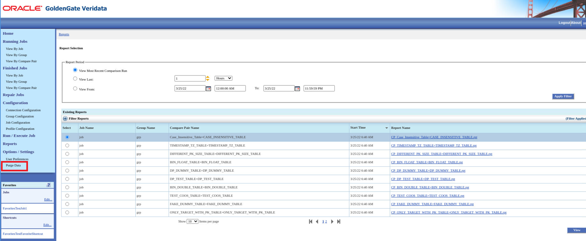
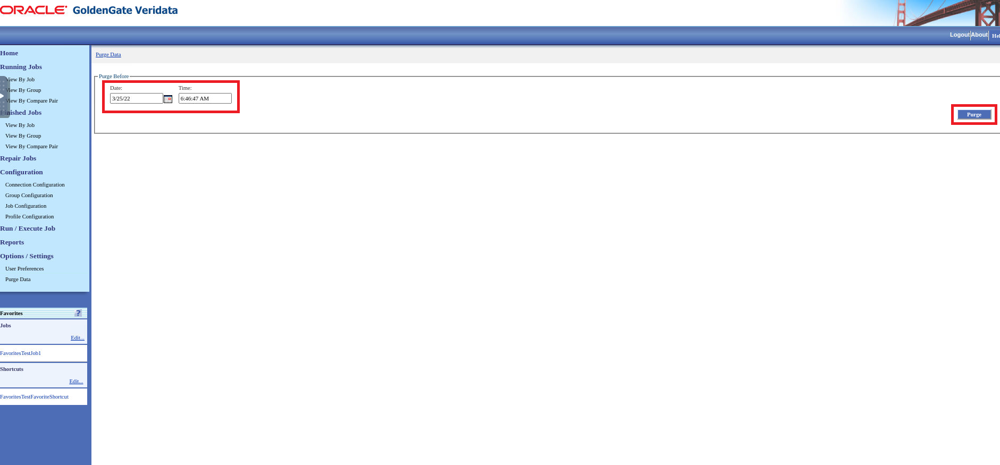

# Purge Data and Delete Directories

## Introduction
This lab describes how to purge data and delete directories in the Oracle GoldenGate Veridata UI.

To purge old reports, compare results, and obsolete data, use the **Delete** option in the **Finished Jobs** page.

When you purge job reports, select the optional **Delete Directories Completely** check box to delete the entire reports directory content, including files and directories created by the user.

By default, the **Delete Directories** completely check box is not selected and therefore only the files created by Oracle GoldenGate Veridata are purged. The directories are purged only if they are empty after the Oracle GoldenGate Veridata files are purged. User-defined files created within the reports directories will not be deleted. 

*Estimated Lab Time*: 30 minutes

### Objectives
In this lab, you will:
* Purge Data
* Delete Directories

### Prerequisites
This lab assumes you have:
- A Free Tier, Paid or LiveLabs Oracle Cloud account
- You have completed:
    * Lab: Prepare Setup (*Free-tier* and *Paid Tenants* only)
    * Lab: Environment Setup
    * Lab: Initialize Environment
    * Lab: Create Datasource Connections
    * Lab: Create Groups and Compare Pairs

## Task 1: Purge Data
To purge data:

1. From the left navigation pane, click **Configuration** and **Job configuration** to display the **Job Configuration** page, select the job from the **Job** drop-down list, click **Retrieve Compare Pair List** to display the list of Compare Pairs, and then click **Run Job**.

2. Click **Home** to display the details of the Jobs executed. The repository has the metadata of all the UI configurations.

  

3. Click **Purge Data** to display the **Reports** page.

    

4. Select the Date and Time until which you want the data to be purged and click **Purge**.

    

    Data has been purged for the selected Date and time.

    

5. Click **Reports**. Previously available data is not displayed now.

    

6. Similarly, click **Home**. Previously available data is not displayed on the **Home** page as well.

## Task 2: Delete Directories

The generated report files are stored in this location:
`home/opc/VDT/user_projects/domains/base_domain/veridata/reports`.

To delete directories:

1. Create a Group called **groupDel**. From the left navigation pane, click **Configuration** and then click **Group Configuration** to display the **Group configuration** page. Follow the steps in the **Lab: Create Groups and Compare Pairs** to create a new Group.

2. From the left navigation pane, click **Configuration** and **Job configuration** to display the **Job Configuration** page, select the job from the **Job** drop-down list, click **Retrieve Compare Pair List** to display the list of Compare Pairs, and then click **Run Job**.

3. From the left navigation pane, click **Finished Jobs** to display the completed job and the details of the compare pairs.

4. Select the Job you want to delete.

  

5. In the Terminnal, delete the reports from the Veridata UI under the following server directory: `home/opc/VDT/user_projects/domains/base_domain/veridata/reports/rtp/jobDel/<directory for latest job>`.

6. In the Terminal, create a user-defined file under this location `home/opc/VDT/user_projects/domains/base_domain/veridata/reports/rtp/jobDel/<directory for latest job>` using the following command:

    ```
    <copy>touch lab_test</copy>
    ```
    

7. In the UI, select **Finished Jobs**, and select the Job **jobDel** you want to delete and click **Delete**

    

8. Click **OK** in the displayed popup.

9. Run the Job.
10. Click **Finished Jobs**.
11. Select **jobDel**, and select the **Delete Directories** completely check box and click **Delete**.
      

12. In the terminal, verify that the entire directory has been deleted.

      

You may now [proceed to the next lab](#next).

## Learn More
* [Oracle GoldenGate Veridata Documentation](https://docs.oracle.com/en/middleware/goldengate/veridata/12.2.1.4/index.html)
* [Configuring Groups](https://docs.oracle.com/en/middleware/goldengate/veridata/12.2.1.4/gvdug/configure-workflow-objects.html#GUID-70B42ABB-EA8E-4ADF-8414-7EA1752CA7E6)
* [Compare Pairs](https://docs.oracle.com/en/middleware/goldengate/veridata/12.2.1.4/gvdug/configure-workflow-objects.html#GUID-055CE119-0307-4826-98C7-A51F53E28763)
* [Jobs](https://docs.oracle.com/en/middleware/goldengate/veridata/12.2.1.4/gvdug/working-jobs.html#GUID-EE434517-18EB-4827-A05F-D420D9E5B0DD)


## Acknowledgements
* **Author** - Anuradha Chepuri, Principal UA Developer, Oracle GoldenGate User Assistance
* **Contributors** -  Nisharahmed Soneji, Sukin Varghese, Rene Fontcha
* **Last Updated By/Date** - Rene Fontcha, LiveLabs Platform Lead, NA Technology, November 2021
