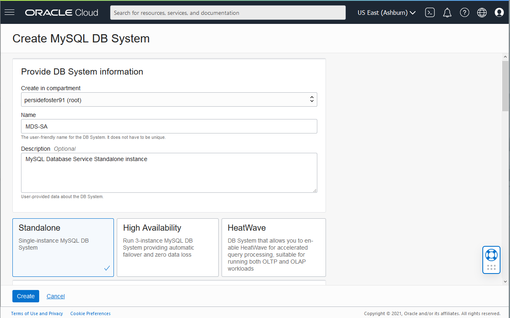
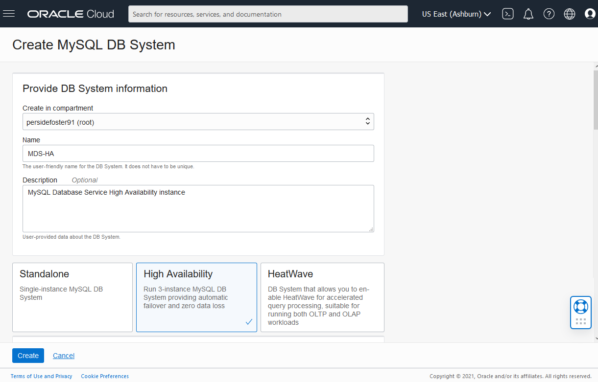
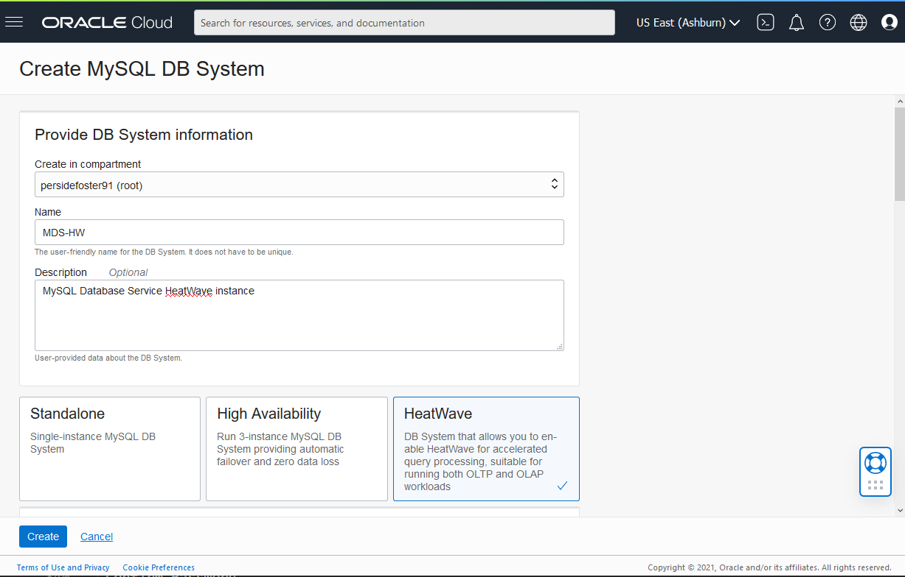
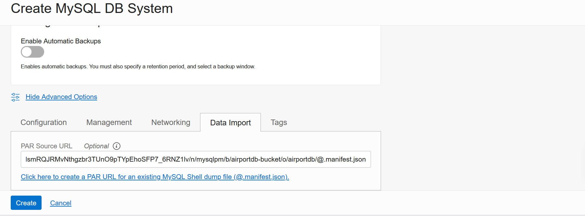
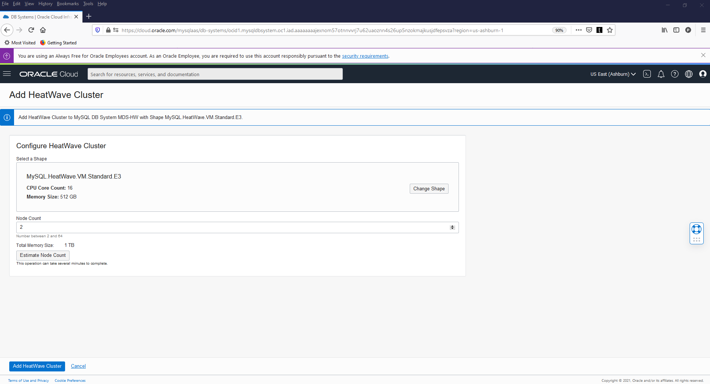

# Create MySQL Database System and HeatWave Cluster

## Introduction

In this lab, you will create and configure the three MySQL HeatWave DB Systems. 

_Estimated Time:_ 20 minutes

### Objectives

In this lab, you will be guided through the following tasks:

- Create all three MySQL Database instances 
- Loa sample data (airportdb) into the HeatWave BD system
- Add a HeatWave Cluster to MySQL Database System

### Prerequisites

- An Oracle Trial or Paid Cloud Account
- Some Experience with MySQL Shell
- Must complete Lab1


## Task 1: Create a MySQL DB System - Standalone.

In this Task, you will create and configure a MySQL Standalone DB System.

1. Open the navigation menu. Under Databases ->MySQL, click DB Systems
    

2. Click Create MySQL DB System
    

3. Create MySQL DB System dialog complete the fields in each section

    - Provide basic information for the DB System
    - Setup your required DB System
    - Create Administrator credentials
    - Configure Networking
    - Configure placement
    - Configure hardware
    - Exclude Backups


4. Provide basic information for the DB System:


 Select Compartment **(root)**

 Enter Name
     ````
    <copy>MDS-SA</copy>
    ````
 Enter Description
    ````
    <copy>MySQL Database Service Standalone instance</copy>
    ````

 Select **Standalone** to specify a Standalone DB System
    

6. Create Administrator credentials

 Enter Username
    ````
    <copy>admin</copy>
    ````
 Enter Password
    ````
    <copy>Welcome#12345</copy>
    ````   
 Confirm Password
    ````
    <copy>Welcome#12345</copy>
    ````
    

7. Configure networking Keep default values

    Virtual Cloud Network: **MDS-VCN**

    Subnet: **Private Subnet-MDS-VCN (Regional)**

    

8. Configure placement  keep checked  "Availability Domain"

    Do not check "Choose a Fault Domain" for this DB System. Oracle will chooses the best placement for you.
    

9. Configure hardware keep default shape  **MySQL.VM.Standard.E3.1.8GB**

    Data Storage Size (GB) keep default value **50**
    

19. Configure Backups, "Enable Automatic Backups"

    Turn off button to disable automatic backup

    

    Click the **Create button**
    

11. The New MySQL DB System will be ready to use after a few minutes.

    The state will be shown as Creating during the creation
    

12. The state Active indicates that the DB System is ready to use.

    Check the MySQL endpoint (Address) under Instances in the MySQL DB System Details page.

    

## Task 2: Create a MySQL DB System - High Availability.

In this Task, you will create and configure a MySQL High Availability DB System.

1. Open the navigation menu. Under Databases ->MySQL, click DB Systems
    

2. Click Create MySQL DB System
    

3. Create MySQL DB System dialog complete the fields in each section

    - Provide basic information for the DB System
    - Setup your required DB System
    - Create Administrator credentials
    - Configure Networking
    - Configure placement
    - Configure hardware
    - Exlude Backups


4. Provide basic information for the DB System:


 Select Compartment **(root)**

 Enter Name
     ````
    <copy>MDS-HA</copy>
    ````
 Enter Description
    ````
    <copy>MySQL Database Service High Availability instance</copy>
    ````

 Select **High Availability** to specify a High Availability DB System
    

6. Create Administrator credentials

 Enter Username
    ````
    <copy>admin</copy>
    ````
 Enter Password
    ````
    <copy>Welcome#12345</copy>
    ````   
 Confirm Password
    ````
    <copy>Welcome#12345</copy>
    ````
    

7. Configure networking Keep default values

    Virtual Cloud Network: **MDS-VCN**

    Subnet: **Private Subnet-MDS-VCN (Regional)**

    

8. Configure placement  "Availability Domain"

    Select AD-2

    Do not check "Choose a Fault Domain" for this DB System. Oracle will chooses the best placement for you.
    

9. Configure hardware keep default shape  **MySQL.VM.Standard.E3.1.8GB**

    Data Storage Size (GB) keep default value **50**
    

19. Configure Backups, "Enable Automatic Backups"

    Turn off button to disable automatic backup

    

    Click the **Create button**
    

11. The New MySQL DB System will be ready to use after a few minutes.

    The state will be shown as Creating during the creation
    

12. The state Active indicates that the DB System is ready to use.

    Check the MySQL endpoint (Address) under Instances in the MySQL DB System Details page.

    


## Task 3: Create a MySQL DB System - HeatWave  with sample data (airportdb)

In this Task, you will create and configure a MySQL HeatWave DB System. The creation process will use a provided object storage link to create the airportdb schema and load data into the DB system.

1. Go to Navigation Menu
         Databases
         MySQL
         DB Systems
    

2. Click 'Create MySQL DB System'
    

3. Create MySQL DB System dialog complete the fields in each section

    - Provide basic information for the DB System
    - Setup your required DB System
    - Create Administrator credentials
    - Configure Networking
    - Configure placement
    - Configure hardware
    - Exclude Backups
    - Advanced Options - Data Import

4. Provide basic information for the DB System:

 Select Compartment **(root)**

 Enter Name
    ```
    <copy>MDS-HW</copy>
    ```
 Enter Description
    ```
    <copy>MySQL Database Service HeatWave instance</copy>
    ```

 Select **HeatWave** to specify a HeatWave DB System
    

5. Create Administrator credentials

 Enter Username
    ````
    <copy>admin</copy>
    ````
 Enter Password
    ````
    <copy>Welcome#12345</copy>
    ````   
 Confirm Password
    ````
    <copy>Welcome#12345</copy>
    ````

    

6. On Configure networking, keep the default values

    Virtual Cloud Network: **MDS-VCN**

    Subnet: **Private Subnet-MDS-VCN (Regional)**

    

7. On Configure placement under 'Availability Domain'

    Select AD-3

    Do not check 'Choose a Fault Domain' for this DB System.

    

8. On Configure hardware, keep default shape as **MySQL.HeatWave.VM.Standard.E3**

    Data Storage Size (GB) Set value to:  **1024**

    ```
    <copy>1024</copy>
    ```
    

9. On Configure Backups, disable 'Enable Automatic Backup'

    

10. Click on Show Advanced Options

11. Go to the Networking tab, in the Hostname field enter (same as DB System Name):

	```
	<copy>mdshw</copy> 
	```
12. Select Data Import tab.

13. Use the Image below to identify your OCI Region.

    

14. Click on your localized geographic area

    ## North America (NA)  
    **Tenancy Regions** Please select the same region that you are creating MDS in  

    <details>
    <summary>US East (Ashburn) Region - Copy and paste to PAR Source URL</summary>
    <br>
    ```
    <copy>
    https://objectstorage.us-ashburn-1.oraclecloud.com/p/zRBSs7nKURyZRcIoV4QlYhascC5gkZcJeQoBS8c2ssyEPID3PSDAnh73OMClQQH4/n/idazzjlcjqzj/b/airportdb-bucket-10282022/o/airportdb/@.manifest.json
    </copy>
    ```
    </details>

    <details>
    <summary>US West (Phoenix) Region - Copy and paste to PAR Source URL</summary>
    <br>
    ```
    <copy>
    https://objectstorage.us-phoenix-1.oraclecloud.com/p/bbL6aZuTtFkEg4oTSjGxkFl2ni7UqG8J9uCX-5WHHd67qG_yV2fUpfJVr6mAASOb/n/idazzjlcjqzj/b/airportdb-bucket-10282022/o/airportdb/@.manifest.json
    </copy>
    ```
    </details>

    <details>
    <summary>US West (San Jose) Region - Copy and paste to PAR Source URL</summary>
    <br>
    ```
    <copy>
    https://objectstorage.us-sanjose-1.oraclecloud.com/p/gTwIFjGxs__5dy8RzqKHgaz6JjgBpqcIGiodRWgPCwBsyacNOjoLsybXkijCRJkh/n/idazzjlcjqzj/b/airportdb-bucket-10282022/o/airportdb/@.manifest.json
    </copy>
    ```
    </details>

    <details>
    <summary>Canada Southeast (Montreal) Region - Copy and paste to PAR Source URL</summary>
    <br>
    ```
    <copy>
    https://objectstorage.ca-montreal-1.oraclecloud.com/p/Hi5OuQEaIUoRIiVpXxectQOG602Ie0Clb-tXRFKZjaCadeAVcBbZ7RulKyy5WHkK/n/idazzjlcjqzj/b/airportdb-bucket-10282022/o/airportdb/@.manifest.json
    </copy>
    ```
    </details>

    <details>
    <summary>Canada Southeast (Toronto) Region - Copy and paste to PAR Source URL</summary>
    <br>
    ```
    <copy>
    https://objectstorage.ca-toronto-1.oraclecloud.com/p/SA-hZy48_NjzM420pGYNEE2Q5XE9sneGHy1CNVMekt-zwhfF89yo9f318ClFdWKF/n/idazzjlcjqzj/b/airportdb-bucket-10282022/o/airportdb/@.manifest.json
    </copy>
    ```
    </details>

    ## Latin America (LAD)
    **Tenancy Regions** Please select the same region that you are creating MDS in
    <details>
    <summary>Brazil East (Sao Paulo) Region - Copy and paste to PAR Source URL</summary>
    <br>
    ```
    <copy>
    https://objectstorage.sa-saopaulo-1.oraclecloud.com/p/qzYmRurVINK-VXQQTBcoBqNGU8WxNk_0FvfU0_T1piBK1kioslc9-_8P8IVMVVjX/n/idazzjlcjqzj/b/airportdb-bucket-10282022/o/airportdb/@.manifest.json
    </copy>
    ```
    </details>

    <details>
    <summary>Chile (Santiago) Region - Copy and paste to PAR Source URL</summary>
    <br>
    ```
    <copy>
    https://objectstorage.sa-santiago-1.oraclecloud.com/p/_mjwJMQ2mWe5HVUeYgvGYRF2NGybIml2_M4lOveooEgN6r1-chjg5ItlufU24dZT/n/idazzjlcjqzj/b/airportdb-bucket-10282022/o/airportdb/@.manifest.json
    </copy>
    ```
    </details>

    <details>
    <summary>Brazil Southeast (Vinhedo) Region - Copy and paste to PAR Source URL</summary>
    <br>
    ```
    <copy>
    https://objectstorage.sa-vinhedo-1.oraclecloud.com/p/pyD-ME06UHxjY7Agy19cxbwytY1nchmu7sI_yt7wpe_axSIJMvft1zCe7BQzmO2d/n/idazzjlcjqzj/b/airportdb-bucket-10282022/o/airportdb/@.manifest.json
    </copy>
    ```
    </details>

    ## Europe, Middle East and Africa (EMEA)
    **Tenancy Regions** Please select the same region that you are creating MDS in

    <details>
    <summary>UK South(London) Region - Copy and paste to PAR Source URL</summary>
    <br>
    ```
    <copy>
    https://objectstorage.uk-london-1.oraclecloud.com/p/l0jITzinEWEiAQmFNorC8s-4PAv-jwAMU97aEDjmTSfzlte-VUhJ7zPIYGXJMZh9/n/idazzjlcjqzj/b/airportdb-bucket-10282022/o/airportdb/@.manifest.json
    </copy>
    ```
    </details>

    <details>
    <summary>UK West (Newport) Region - Copy and paste to PAR Source URL</summary>
    <br>
    ```
    <copy>
    https://objectstorage.uk-cardiff-1.oraclecloud.com/p/hV2VaYxhcRGU1efgjnmwK_zY5hBL4tuT5UBo-RPYCyHXbFvQkDGzfTx2d_Vfqnsy/n/idazzjlcjqzj/b/airportdb-bucket-10282022/o/airportdb/@.manifest.json

    </copy>
    ```
    </details>

    <details>
    <summary>Germany Central (Frankfurt) Region - Copy and paste to PAR Source URL</summary>
    <br>
    ```
    <copy>
    https://objectstorage.eu-frankfurt-1.oraclecloud.com/p/kTZVWyDV2Rry4pLBxbf5Yjn87pC3dEAUuFE8JRJb2Nbv1FoDWNtuAfDChzQey2H0/n/idazzjlcjqzj/b/airportdb-bucket-10282022/o/airportdb/@.manifest.json
    </copy>
    ```
    </details>

    <details>
    <summary>Switzerland North(Zurich) Region - Copy and paste to PAR Source URL</summary>
    <br>
    ```
    <copy>
    https://objectstorage.eu-zurich-1.oraclecloud.com/p/3w2UjDyli22Jr4ymrLuo80wV0_Qp3fG144WjNedYPZ4w6OHbIMKQuwnXdDPgsV-x/n/idazzjlcjqzj/b/airportdb-bucket-10282022/o/airportdb/@.manifest.json
    </copy>
    ```
    </details>

    <details>
    <summary>Netherlands Northwest(Amsterdam) Region - Copy and paste to PAR Source URL</summary>
    <br>
    ```
    <copy>
    https://objectstorage.eu-amsterdam-1.oraclecloud.com/p/3_Ez8iA8SCTn4AGRfs3m3PJBtBpl3MyZSn869_nDaIOFAiXB-fWJEjh2ta0tS8N-/n/idazzjlcjqzj/b/airportdb-bucket-10282022/o/airportdb/@.manifest.json   
    </copy>
    ```
    </details>

    <details>
    <summary>Saudi Arabia West(Jeddah)  Region - Copy and paste to PAR Source URL</summary>
    <br>
    ```
    <copy>
    https://objectstorage.me-jeddah-1.oraclecloud.com/p/cqBq_4AhY4zX7Sq_v4ziwR3ojeonM6l8JzknXMOUNov-HRcKqwmpTKOk-QCJgxln/n/idazzjlcjqzj/b/airportdb-bucket-10282022/o/airportdb/@.manifest.json
    </copy>
    ```
    </details>

    <details>
    <summary>Israel 1 (Jerusalem) Region - Copy and paste to PAR Source URL</summary>
    <br>
    ```
    <copy>
    https://objectstorage.il-jerusalem-1.oraclecloud.com/p/0OhJRlazP__cAgFoNTHPw2KSyVg6BlMP1NLxbHBDp7ZsI7X_7XyHimMJyLR4lQt3/n/idazzjlcjqzj/b/airportdb-bucket-10282022/o/airportdb/@.manifest.json
    </copy>
    ```
    </details>

    <details>
    <summary>France South (Marseille)  - Copy and paste to PAR Source URL</summary>
    <br>
    ```
    <copy>
    https://objectstorage.eu-marseille-1.oraclecloud.com/p/TCunSmwaRpBFR6Vft8bhddlX3lEy7fw2unoIkCjCCZ1JscMtHqPF4jxFiayOCGj_/n/idazzjlcjqzj/b/airportdb-bucket-10282022/o/airportdb/@.manifest.json
    </copy>
    ```
    </details>

    ## Asia Pacific (APAC)
    **Tenancy Regions** Please select the same region that you are creating MDS in

    <details>
    <summary>Japan East(Tokyo) Region - Copy and paste to PAR Source URL</summary>
    <br>
    ```
    <copy>
    https://objectstorage.ap-tokyo-1.oraclecloud.com/p/BiO_UJkmKGkQpjh5dZNSe6CdCpMGx1himhTvHzBaoebm16JvETigjy2VZsW6hqdC/n/idazzjlcjqzj/b/airportdb-bucket-10282022/o/airportdb/@.manifest.json
    </copy>
    ```
    </details>

    <details>
    <summary> Japan Central (Osaka) Region - Copy and paste to PAR Source URL</summary>
    <br>
    ```
    <copy>
    https://objectstorage.ap-osaka-1.oraclecloud.com/p/nSqONNKWXkzjNFsGEYH5aZ-W-jv1zVuzz1AtLuOwIPHL8mvGvjV09Je9OoD_o-Sp/n/idazzjlcjqzj/b/airportdb-bucket-10282022/o/airportdb/@.manifest.json
    </copy>
    ```
    </details>

    <details>
    <summary>South Korea Central(Seoul) Region - Copy and paste to PAR Source URL</summary>
    <br>
    ```
    <copy>
    https://objectstorage.ap-seoul-1.oraclecloud.com/p/oKjZnACJpb6_WpL6u0T0f3YRe_SGXFMP3dOGRf-TbUO-h62dl_iJPyXcVkI6iBpA/n/idazzjlcjqzj/b/airportdb-bucket-10282022/o/airportdb/@.manifest.json
    </copy>
    ```
    </details>

    <details>
    <summary> South Korea North (Chuncheon) Region - Copy and paste to PAR Source URL</summary>
    <br>
    ```
    <copy>
    https://objectstorage.ap-chuncheon-1.oraclecloud.com/p/eEUcaUsaAErg11FhPaC1iAA6v4g-UO-bWdmR-V11TZ0rzJfSn7nXSYSAmvLrm7L2/n/idazzjlcjqzj/b/airportdb-bucket-10282022/o/airportdb/@.manifest.json
    </copy>
    ```
    </details>

    <details>
    <summary> Australia East (Sydney) Region - Copy and paste to PAR Source URL</summary>
    <br>
    ```
    <copy>
    https://objectstorage.ap-sydney-1.oraclecloud.com/p/NKIaOmREA4Wo_OTK98Po1UkQKKh7ioiZhflIWhgqYEc7nsM9VopYJjiDlHG8lS6q/n/idazzjlcjqzj/b/airportdb-bucket-10282022/o/airportdb/@.manifest.json
    </copy>
    ```
    </details>

    <details>
    <summary> Australia Southeast (Melbourne) Region - Copy and paste to PAR Source URL</summary>
    <br>
    ```
    <copy>
    https://objectstorage.ap-melbourne-1.oraclecloud.com/p/3XjNGFSL5f5cbj6qavA4Nq7qHLpPW3FUMCC0MTmg3QdL2TkBXPzXy6n9rrVHl4X8/n/idazzjlcjqzj/b/airportdb-bucket-10282022/o/airportdb/@.manifest.json
    </copy>
    ```
    </details>

    <details>
    <summary> India West (Mumbai) Region - Copy and paste to PAR Source URL</summary>
    <br>
    ```
    <copy>
    https://objectstorage.ap-mumbai-1.oraclecloud.com/p/qKJpoQUAPn1ccZxtKPFucUlGRHigExVhrX5kt5ivbblvgBfrbLQR5vC_noK_P9hi/n/idazzjlcjqzj/b/airportdb-bucket-10282022/o/airportdb/@.manifest.json
    </copy>
    ```
    </details>

    <details>
    <summary> India South (Hyderabad) Region - Copy and paste to PAR Source URL</summary>
    <br>
    ```
    <copy>
    https://objectstorage.ap-hyderabad-1.oraclecloud.com/p/-4mCVxfFgJi1ObsCZKbRaUOi7ZRS6lpJerBtA_Ny5nAGD56OIQncsFUiybmM23tB/n/idazzjlcjqzj/b/airportdb-bucket-10282022/o/airportdb/@.manifest.json
    </copy>
    ```
    </details>

15. Your PAR Source URL entry should look like this:
    

16. Review **Create MySQL DB System**  Screen

    

    Click the '**Create**' button

17. The New MySQL DB System will be ready to use after a few minutes

    The state will be shown as 'Creating' during the creation
    

18. The state 'Active' indicates that the DB System is ready for use

    On MDS-HW Page, check the MySQL Endpoint (Private IP Address)

    

## Task 4: Add a HeatWave Cluster to MySQL HeatWave Database System

In this Task, you will add a HeatWave Cluster to your MySQL HeatWave DB system

1. Open the navigation Menu > Databases > MySQL >  DB Systems

2. Choose the root Compartment. A list of DB Systems is displayed.
    
3. In the list of DB Systems, click the **MDS-HW** system. click **More Action ->  Add HeatWave Cluster**.
    
4. On the “Add HeatWave Cluster” dialog, select “MySQL.HeatWave.VM.Standard.E3” shape
5. Click “Estimate Node Count” button
    
6. On the “Estimate Node Count” page, click “Generate Estimate”. This will trigger the auto
provisioning advisor to sample the data stored in InnoDB and based on machine learning
algorithm, it will predict the number of nodes needed.
    
7. Once the estimations are calculated, it shows list of database schemas in MySQL node. If you expand the schema and select different tables, you will see the estimated memory required in the Summary box, There is a Load Command (heatwave_load) generated in the text box window, which will change based on the selection of databases/tables
8. Select the airportdb schema and click “Apply Node Count Estimate” to apply the node count
    
9. Click “Add HeatWave Cluster” to create the HeatWave cluster
    
10. HeatWave creation will take about 10 minutes. From the DB display page scroll down to the Resources section. Click the **HeatWave** link. Your completed HeatWave Cluster Information section will look like this:
    


**You may now proceed to the next lab**


## Acknowledgements

* **Author** - Perside Foster, MySQL Solution Engineering, Harsh Nayak , MySQL Solution Engineering
* **Contributors** - Mandy Pang, MySQL Principal Product Manager,  Priscila Galvao, MySQL Solution Engineering, Nick Mader, MySQL Global Channel Enablement & Strategy Manager, Frédéric Descamps, MySQL Community Manager
* **Last Updated By/Date** - Perside Foster, MySQL Solution Engineering, February 2022
