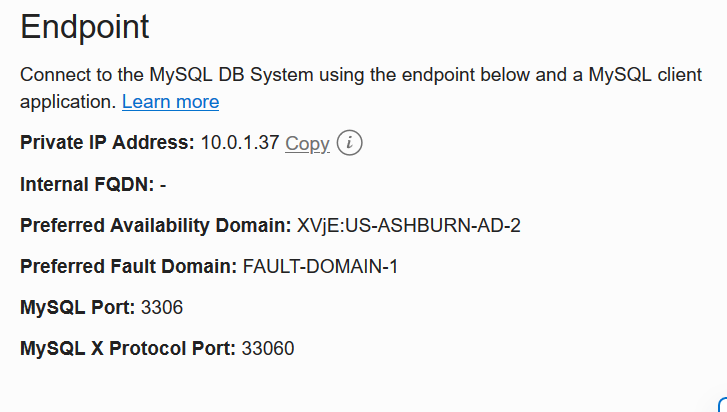
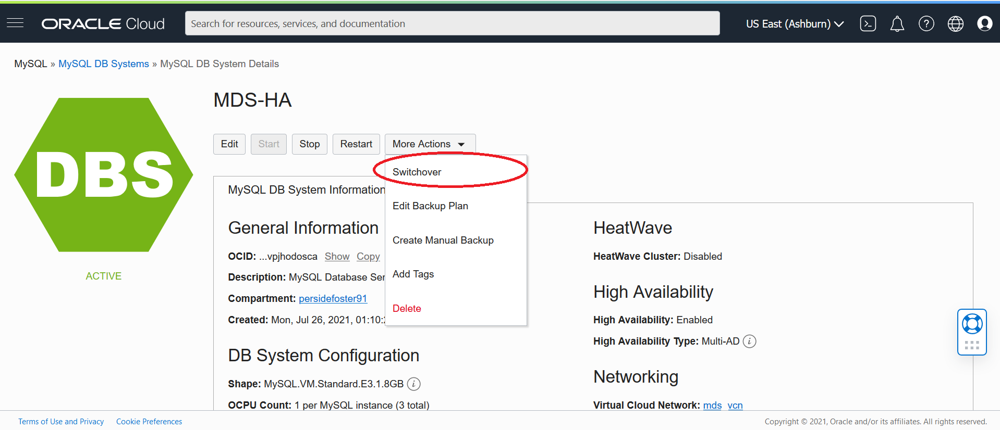

# Connect to Standalone and High Availability Db Systems

## Introduction

When working in the cloud, there are often times when your servers and services are not exposed to the public internet. The Oracle Cloud Infrastructure (OCI) MySQL HeatWave Dabase Service instances is an example of a service that is only accessible through private networks. Since the service is fully managed, we keep it siloed away from the internet to help protect your data from potential attacks and vulnerabilities. It’s a good practice to limit resource exposure as much as possible, but at some point, you’ll likely want to connect to those resources. That’s where Compute Instance, also known as a Bastion host, enters the picture. This Compute Instance Bastion Host is a resource that sits between the private resource and the endpoint which requires access to the private network and can act as a “jump box” to allow you to log in to the private resource through protocols like SSH.  This bastion host requires a Virtual Cloud Network and Compute Instance to connect with the MySQL DB Systems. 

Today, you will use the already created Compute Instance with MySQL Shell to connect to the DB Systems. 

_Estimated Lab Time:_ 30 minutes


### Objectives

In this lab, you will be guided through the following tasks:


- Setup Compute Instance with MySQL Shell
- Connect to MySQL Standalone DB System
- Connect to MySQL High Availability DB System

### Prerequisites

- An Oracle Trial or Paid Cloud Account
- Some Experience with MySQL Shell
- Must Complete Lab 3

## Task 1: Connect to MySQL Database - Standalone

MySQL Database Service Standalone has daily automatic backups and is resilient to failures because it leverages Block Volumes to store user data. Consequently, it offers the same durability, security, and performance guarantees. Automatic and manual backups are replicated to another availability domain and can be restored in the event of a disaster or user error. Data loss is limited by the last successful backup.

1. If not already connected with SSH, connect to Compute instance using Cloud Shell

(Example: ssh -i ~/.ssh/id_rsa opc@132.145.17….)

2. Use the following command to connect to MySQL using the MySQL Shell client tool. Be sure to add the MDS-SA private IP address at the end of the cammand. Also enter the admin user password

    (Example  **mysqlsh -uadmin -p -h10.0.1..**)

 **[opc@...]$**
    ````
    <copy>mysqlsh -uadmin -p -h 10.0.1....</copy>
    ````
    

3. On MySQL Shell, switch to SQL mode  to try out some SQL commands

 Enter the following command at the prompt:
     ````
    <copy>\sql</copy>
    ````
 To display a list of databases, Enter the following command at the prompt:
      ````
    <copy>SHOW DATABASES;</copy>
    ````  

 To display the database version, current_date, and user enter the following command at the prompt:
      ````
    <copy>SELECT VERSION(), CURRENT_DATE, USER();</copy>
    ````  
 To display MySQL user and host from user table enter the following command at the prompt:
       ````
    <copy>SELECT USER, HOST FROM mysql.user;</copy>
      ````
 Type the following command to exit MySQL:
      ````
    <copy>\q</copy>
    ````   

  **Final Sceen Shot**
    

## Task 2: Connect to MySQL Database and Switchover - High Availability

A highly available database system is one which guarantees if one instance fails, another takes over, with zero data loss and minimal downtime.
MySQL Database High Availability uses MySQL Group Replication to provide standby replicas to protect your data and provide business continuity. It is made up of three MySQL instances, a primary, and two secondaries. All data written to the primary instance is also written to the secondaries. In the event of failure of the primary, one of the secondaries is automatically promoted to primary, is set to read-write mode, and resumes availability to client applications with no data loss. This is called a failover. It is also possible to switch manually, and promote a secondary to primary. This is called a switchover.

1. If not already connected with SSH, connect to Compute instance using Cloud Shell

(Example: ssh -i ~/.ssh/id_rsa opc@132.145.17….)

2. From your Compute instance, connect to MDS-HA MySQL using the MySQL Shell client tool.

   The endpoint (IP Address) can be found in the MDS-HA MySQL DB System Details page, under the "Endpoint" "Private IP Address".

    

3.  Use the following command to connect to MySQL using the MySQL Shell client tool. Be sure to add the MDS-HA private IP address at the end of the cammand. Also enter the admin user password

    (Example  **mysqlsh -uadmin -p -h10.0.1..**)

 **[opc@...]$**

    ````
    <copy>mysqlsh -uadmin -p -h 10.0.1....</copy>
    ````
    

4. On MySQL Shell, switch to SQL mode  to try out some SQL commands

 Enter the following command at the prompt:
     ````
    <copy>\sql</copy>
    ````
 To display a list of databases, Enter the following command at the prompt:
      ````
    <copy>SHOW DATABASES;</copy>
    ````  

 To display the database version, current_date, and user enter the following command at the prompt:
      ````
    <copy>SELECT VERSION(), CURRENT_DATE, USER();</copy>
    ````  
 To display MySQL user and host from user table enter the following command at the prompt:
       ````
    <copy>SELECT USER, HOST FROM mysql.user;</copy>
      ````
 Type the following command to exit MySQL:
      ````
    <copy>\q</copy>
    ````   

  **Final Sceen Shot**
    

5. **Switchover** - To switch from the current primary instance to one of the secondary instances, do the following:

* Open the navigation menu  Database > MySQL > DB Systems
* Choose **(root)** Compartment.
* In the list of DB Systems, Click MDS-HA DB System to display the details page and do the following:
    * Save the current endpoint values for a before and after comparisson of the switch
      
    * Select Switchover from the More Actions menu. The Switchover dialog is displayed
        
    * Switch the PRimary from AD-2 to AD-3  
    * Click Switchover to begin the switch process.
      
    * The DB System's status changes to Updating, and the selected instance becomes the primary.
          

    
You may now proceed to the next lab.

## Learn More

* [Cloud Shell](https://www.oracle.com/devops/cloud-shell/?source=:so:ch:or:awr::::Sc)
* [Virtual Cloud Network](https://docs.oracle.com/en-us/iaas/Content/Network/Concepts/overview.htm)
* [OCI Bastion Service ](https://docs.public.oneportal.content.oci.oraclecloud.com/en-us/iaas/Content/Bastion/Tasks/connectingtosessions.htm)
## Acknowledgements
* **Author** - Perside Foster, MySQL Solution Engineering 
* **Contributor** - Frédéric Descamps, MySQL Community Manager 
* **Last Updated By/Date** - Perside Foster, February 2022
