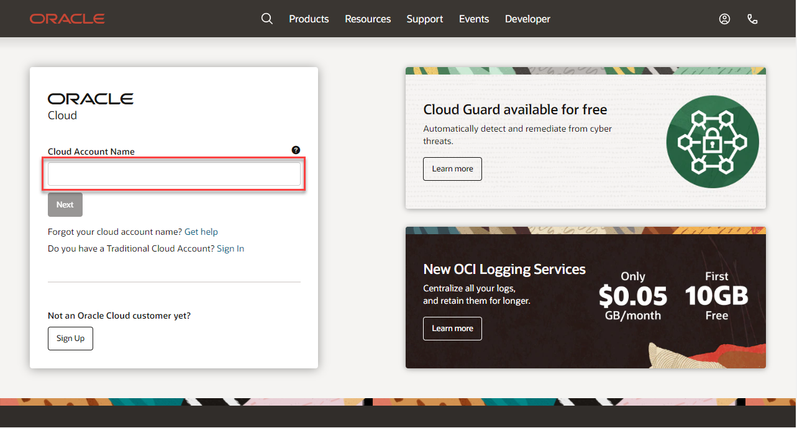
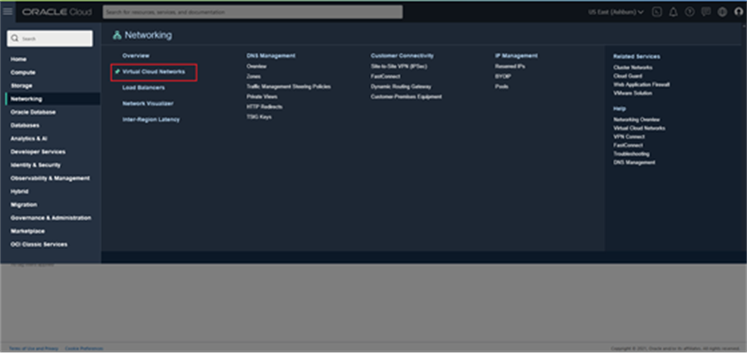
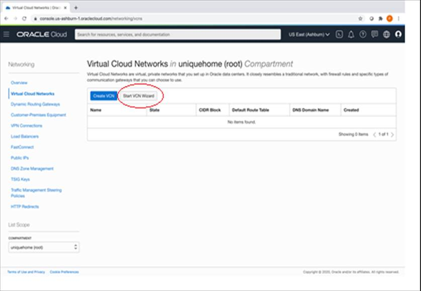
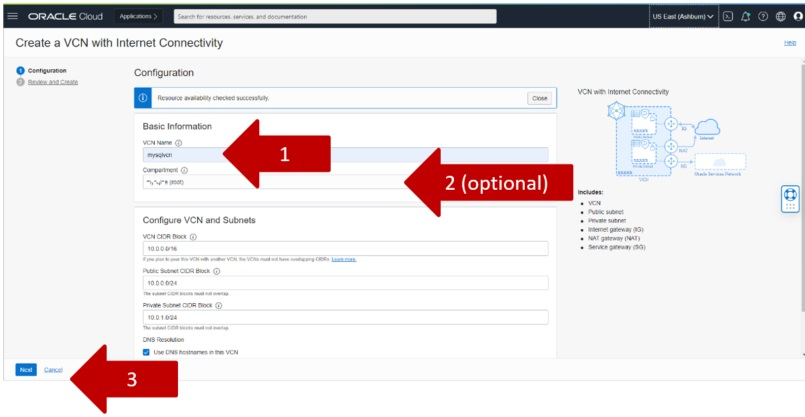
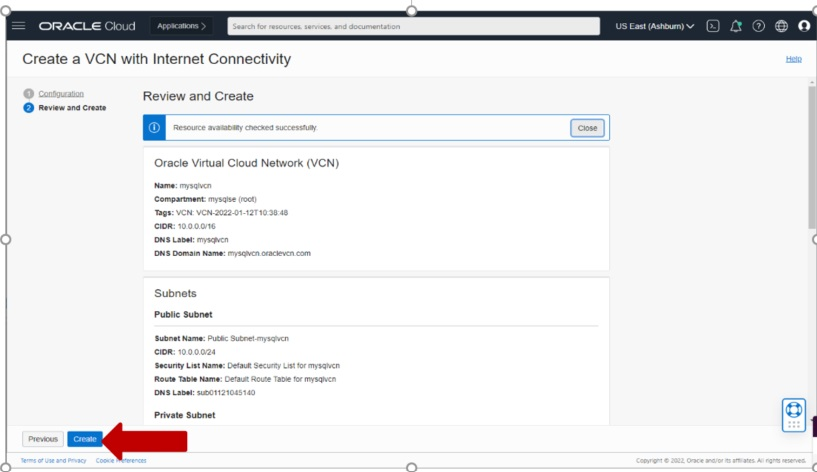

# Create a VCN (Virtual Cloud Network)


### Objective

Create a new VCN (Virtual Cloud Network) to connect our machines and services.

### Prerequisites

* You need an empty trial environment or a dedicated compartment inside Oracle Cloud Infrastructure (OCI) with user settings access
* To sign in to the Console, you need the following:
    - Cloud account name
    - User name and Password
* Oracle Cloud Infrastructure supports the latest versions of Google Chrome, Firefox and Internet Explorer 11. ***It does not support the Edge browser***.

## Task 1:  Login to Oracle Cloud
If you've signed out of the Oracle Cloud, use these steps to sign back in.

1. Go to [cloud.oracle.com](https://cloud.oracle.com) and enter your Cloud Account Name and click **Next**. This is the name you chose while creating your account in the previous section. It's NOT your email address. If you've forgotten the name, see the confirmation email.

    


2. On "Single Sign-On(SSO)" Click **Continue** 

    

3. Enter your Cloud Account credentials and click **Sign In**. Your username is your email address. The password is what you chose when you signed up for an account.

    

4. You are now signed in to Oracle Cloud!

    

## Task 2: Create Your VCN

To create a VCN on Oracle Cloud Infrastructure:

1. On the Oracle Cloud Infrastructure Console Home page, click  
Navigation Menu > Networking > Virtual Cloud Networks

    

2. Select **VCN with Internet Connectivity**, and then click **Start VCN Wizard**.

    

3. On Start VCN Wizard, select VCN with Internet Connectivity and click the button “Start VCN Wizard”.
If you don’t see the button, select in the left menu the Compartment “(root)”.

    

4. On Basic Information, enter then click Next
    - VCN Name:
    
        ```
    <copy>mysqlvcn</copy>
        ```
    - Compartment: (keep the root compartment or choose your own)
    - Keep the defaults for the section “Configure VCN and Subnets”
    - VCN CIDR Block: 10.0.0.0/16   (keep the default)  
    - Public Subnet CIDR Block: 10.0.0.0/24   (keep the default)
    - Private Subnet CIDR Block: 10.0.1.0/24  (keep the default)
    - DNS Resolution: enabled  (keep the default)

    

5. Review and click **Next**
    

6. Review the Oracle Virtual Cloud Network (VCN) and Subnets information. You can customize the VCN with route tables and security lists. Laterm we will show you how to modify the VCN after it’s created.
    

7. Press the **Create** button to create the VCN. It will take a moment to create the VCN and a progress screen will keep you apprised of the workflow.
    

8. Once you see that the creation is complete (see previous screenshot), click on the **View Virtual Cloud Network** button.

**You may now proceed to the next lab**

## Learn More

* [https://www.mysql.com/](https://www.mysql.com/)
* [https://docs.oracle.com/en-us/iaas/mysql-database/index.html](https://docs.oracle.com/en-us/iaas/mysql-database/index.html)

## Acknowledgements
* **Author** - Perside Foster, MySQL Engineering
* **Contributors** -  Marco Carlessi, MySQL Engineering
* **Last Updated By/Date** - Perside Foster, April, 2022
