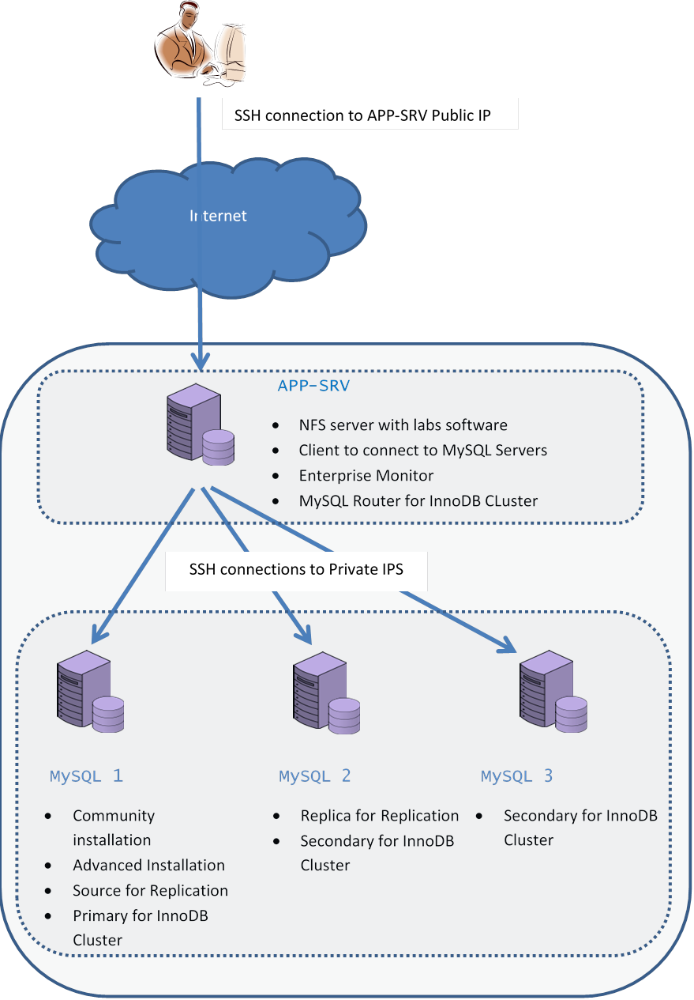

# Introduction

## About this Workshop

This introduction covers the complete "parent" workshop. Use this text to set up the story for the workshop. Be engaging - what will the learner get from spending their time on this workshop?

Estimated Workshop Time: -- hours -- minutes (This estimate is for the entire workshop - it is the sum of the estimates provided for each of the labs included in the workshop.)

### Environment description

   

### Objectives

In this workshop, you will learn how to work with 
- MySQL Community
- MySQL Enterprise Edition
- MySQL Shell
- Security - MySQL Users, Roles, Firewall, Audit and Masking
- Database Design - MySQL Tables, JSON, Document Store
- MySQL Enterprise Monitor - Manager, Agent
- MySQL Backup - Logical and Enterprise Backup
- High Availability - Replication and INNODB Cluster
- MySQL Database Service plus HeatWave Step

### Prerequisites

This lab assumes you have:
* An Oracle account
* All previous labs successfully completed

### Lab standard 

This lab uses color coding to identify input type
*  shell> the command must be executed in the Operating System shell
*  mysql> the command must be executed in a client like MySQL, MySQL Workbench
*  mysqlsh> the command must be executed in MySQL shell

### Software used in the labs
When all of the tasks in Lab1 are completed, the software will be located within each server in the “/workshop” directory 

 

## Learn More

* [URL text 1](https://www.mysql.com/)
* [URL text 2](https://docs.oracle.com/en-us/iaas/mysql-database/index.html)

## Acknowledgements
* **Author** - Perside Foster, MySQL Engineering
* **Contributors** -  Marco Carlessi, MySQL Engineering
* **Last Updated By/Date** - Perside Foster, October 2021
