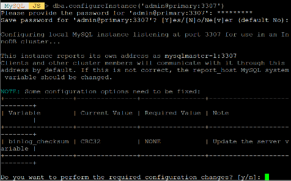
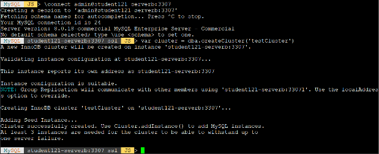
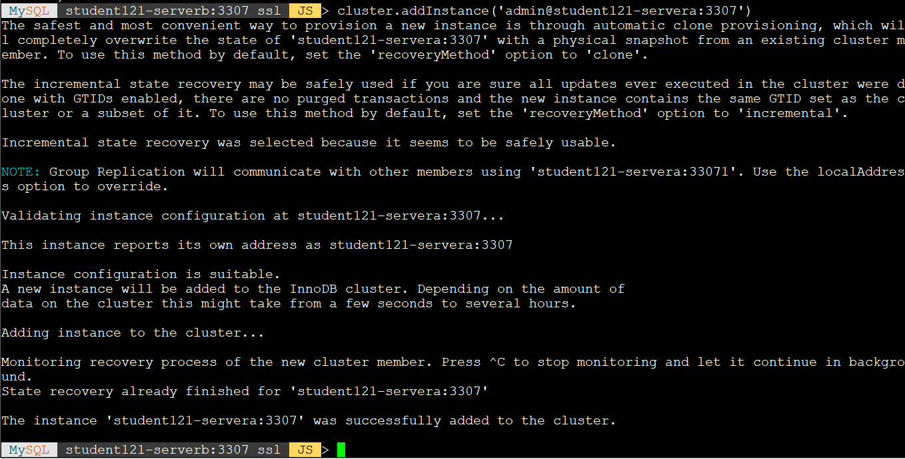
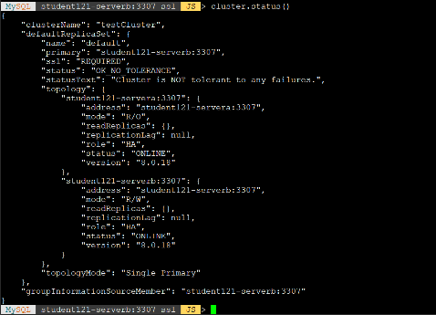
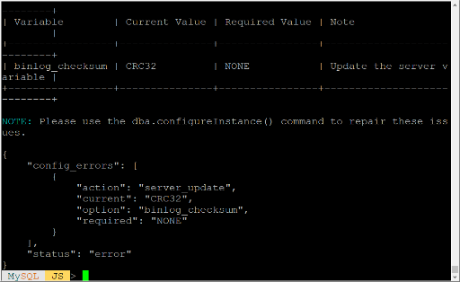

# HIGH AVAILABILITY - MYSQL INNODB CLUSTER

7c) MySQL InnoDB Cluster 
Objectives: To create a 3 nodes MySQL InnoDB Cluster as Single Primary and have a trial on the MySQL Shell to configure and operate.  Using MySQL Router to test for Server routing and test for Failover.
•	Configure InnoDB Cluster in single primary
•	Configure mysql router
•	Test client connection with MySQL Router, read/write and read only
•	Simulate a crash of primary instance
## Introduction

*Describe the lab in one or two sentences, for example:* This lab walks you through the steps to ...

Estimated Lab Time: -- minutes


### Objectives


In this lab, you will:
- Create InnoDB Cluster
- Create Cluster On ServerA
- Create Cluster On ServerB
- Add Clusters to ServerA
- Install MySQL Router on ServerB
- Test InnoDB Cluster

### Prerequisites 


This lab assumes you have:
* An Oracle account
* All previous labs successfully completed
* Lab standard  
    -  shell> the command must be executed in the Operating System shell
    -  mysql> the command must be executed in a client like MySQL, MySQL Workbench
    -  mysqlsh> the command must be executed in MySQL shell
    
**NOTE:** 
- MySQL InnoDB cluster require at least 3 instances (refer to schema in the first part of the lab guide)
- the source instance (on server) will be the primary
- the replicated instance (on server) will be first secondary
- the third instance (not yet installed) server will be installed on serverB
- Please remember that in production you need different servers to exclude single point of failures


## Task 1: Create InnoDB Cluster 


1.	Please remember that servers communication use full FQDN. To help you in later configuration, write here your environment. Be aware that subnets and domain names are different between instances
2. To find out FQDN on our lab machines you can use the following command

    **shell>** 
    ```
    <copy>hostname</copy>
    ```
    ServerA FQDN

    ServerB FQDN

3. This is for the LAB only.  Practically in production deployment, instances deployment should be on its own VM.  And the port number should be the same for easy configuration.
Production Recommended Deployment : Minimal 3 Instances 
Instance	FQDN	Port	Private IP
Primary
(prev. Source)	Student###-serverB	3307	10.0.0.___
Secondary-1
(prev. Replica)	Student###-serverA	3307	10.0.0.___
Secondary-2	Student###-serverB	3308	Same as primary

4.	Verify data model compatibility with Group replication requirements
On ServerB:
    a.	Connect to instance

    **shell-primary>** 
    ```
    <copy>mysql -uroot -p -h127.0.0.1 -P3307</copy>
    ```
    b.	Search non InnoDB tables and if there are you must change them. For this lab just drop them

    **mysql-primary>** 
    ```
    <copy>SELECT table_schema, table_name, engine, table_rows, (index_length+data_length)/1024/1024 AS sizeMB FROM information_schema.tables WHERE engine != 'innodb' AND table_schema NOT IN ('information_schema', 'mysql', 'performance_schema');</copy>
    ```
    c.	Search InnoDB tables without primary or unique key. In production you have to fix, here it's enough that you drop them

    **mysql-primary>** 
     ```
    <copy> select tables.table_schema, tables.table_name, tables.engine, tables.table_rows
    from information_schema.tables
    left join (
    select table_schema, table_name
    from information_schema.statistics
    group by table_schema, table_name, index_name
    having
    sum(
    case
    when non_unique = 0
    and nullable != 'YES' then 1
    else 0
    end
    ) = count(*)
    ) puks
    on tables.table_schema = puks.table_schema
    and tables.table_name = puks.table_name
    where puks.table_name is null
    and tables.table_type = 'BASE TABLE' and engine='InnoDB';</copy>
    ```
    mysql-primary> DROP TABLE world.jtest;

    ```
    <copy>DROP TABLE world.jtest;</copy>
    ```
    mysql-primary> 

    ```
    <copy>DROP TABLE world. city_part;</copy>
    ```
## Task 2: Create Cluster On ServerA
5.	On ServerA : To create a cluster we need 3 nodes. We use now source as PRIMARY and replication server as first SECONDARY (we call it now secondary-1). Thanks to replication, instance on secondary-1 it's ready for cluster. Now just stop replication on replica/secondary-1

    a.	Connect with administrative account

    **shell-secondary-1>** mysql -uroot -p -h127.0.0.1 -P3307

    ```
    <copy>mysql -uroot -p -h127.0.0.1 -P3307</copy>
    ```
    b.	Stop and remove the replication and the server is ready to be used

    **mysql-secondary-1>** 
    
    ```
    <copy>stop slave;</copy>
    ```
    mysql-secondary-1>
    
    ```
    <copy>reset slave;</copy>
    ```
6.	Now we need a third instance, we create a new one on serverB
Note : IN PRODUCTION USE THREE DIFFERENT SERVERS TO EXCLUDE SINGLE POINT OF FAILURES !

    On ServerB: Prepare an empty instance inside /mysql02/ that be used as a clone of the primary one. 

    Because it’s just a duplicate of the command that you already did in detailed installation, we provide you a script that do it for you. The script
    - Crate a copy of /mysql structure inside /mysql02
    - Create a symbolic link to binaries in /mysql/
    - Create a my.cnf customized for the new structure and on different port (3308)
    - Initialize the database
    - Start the new instance
    - Set root password
    - Create admin user
    - Install required plugins
    a. Please run the script (be careful with copy&paste)

    **shell>** 

    ```
    <copy>/workshop/support/lab7c-MySQL_InnoDB_Cluster___Prepare_secondary-2.sh</copy>
    ```
    b.	Please have a look of /mysql02/etc/my.cnf content. Because there are other, we need to change server-id, mysql ports and references to the new folders

    **shell>** 

    ```
    <copy>cat /mysql02/etc/my.cnf</copy>
    ```
    c.	Verify that new instance is up and running

    **shell-secondary2>** 

    ```
    <copy>netstat -an | grep 3308</copy>
    ```
    d.	Login to verify that the instance is accessible and empty

    **shell-secondary2>** 

    ```
    <copy>mysql -uadmin -p -h127.0.0.1 -P 3308</copy>
    ```
    **mysql-secondary2>** 

    ```
    <copy>SHOW DATABASES;</copy>
    ```
    **mysql-secondary2>**

    ```
    <copy>exit</copy>
    ```
## Task 3: Create Cluster On ServerB
7.	On serverB: Now we can create the cluster. We can do it from any server.
    a.	Connect with SSH on primary and open the MySQL Shell

    **shell-primary>** 

    ```
    <copy>mysqlsh</copy>
    ```
    b.	Check the instance configuration

    **MySQL JS >**

    ```
    <copy>
    dba.checkInstanceConfiguration('admin@student###-serverB:3307')
    If the check may return errors, we use MySQL Shell to fix with the command. e.g.
    {
        "config_errors": [
            {
                "action": "server_update",
                "current": "CRC32",
                "option": "binlog_checksum",
                "required": "NONE"
            }
        ],
        "status": "error"
    }</copy>
    ```
    **MySQL JS >** 
    
    ```
    <copy>dba.configureInstance('admin@student###-serverB:3307')</copy>
    ```
    

    c.	Just to be sure, re-check the instance configuration and verify that you receive an "ok" message

    **MySQL JS >** 
    
    ```
    <copy>dba.checkInstanceConfiguration('admin@student###-serverB:3307')</copy>
    ```
    The instance 'primary:3307' is valid for InnoDB cluster usage.

    {
        "status": "ok"
    }


    d.	Connect to the instance and create the cluster. 

    **MySQL JS >** 

    ```
    <copy>\connect admin@student###-serverB:3307</copy>
    ```
    **MySQL JS >** 

    ```
    <copy>var cluster = dba.createCluster('testCluster')</copy>
    ```
    
 
8.	Verify cluster status (why "Cluster is NOT tolerant to any failures" ?)

    **MySQL JS >** 

    ```
    <copy>cluster.status()</copy>
    ```
    

## Task 4: Add  Clusters to ServerA
9.	Add the second server to the cluster (running on “serverA”)
    a.	Check the instance configuration, and probably it produces the same error as the first ‘primary:3307’

    **MySQL JS >** 

    ```
    <copy>dba.checkInstanceConfiguration('admin@student###-serverA:3307')</copy>
    ```
    b.	Use MySQL Shell to fix issues

    **MySQL JS >** 
    
    ```
    <copy>dba.configureInstance('admin@student###-serverA:3307')</copy>
    ```
    c.	Add the instance to the cluster

    **MySQL JS >** 
    
    ```
    <copy>cluster.addInstance('admin@student###-serverA:3307')</copy>
    ```
    

    d.	Verify cluster status

    **MySQL JS >** 
    
    ```
    <copy>cluster.status()</copy>
    ```
    

10.	Now we add the third node to cluster

    a.	Check the instance configuration

    **MySQL JS >** 
    
    ```
    <copy>dba.checkInstanceConfiguration('admin@student###-serverB:3308')</copy>
    ```
    

    b.	If there are issues (we missed something…), read the messages and fix with

    **MySQL JS >** 
    
    ```
    <copy>dba.configureInstance('admin@student###-serverB:3308')</copy>
    ```
    c.	Add the last instance to the cluster

    **MySQL JS >** 
    
    ```
    <copy>cluster.addInstance('admin@student###-serverB:3308')</copy>
    ```
    d. Because the instance is empty, we receive an alert. We use now the clone plugin
    

    e. Type ‘C’ and confirm. This start the clone process
    

11.	Verify cluster status, now with all three servers

    **MySQL JS >** 
    
    ```
    <copy>cluster.status()</copy>
    ```
    

12.	Verify the new status. How do you recognize the Primary server?

## Task 5: Install MySQL Router on ServerB

13.	On serverB: Exit from MySQL Shell and install MySQL Router via rpm package (if you like mysqlrouter can be installed on serverA with the same steps)

14.	**MySQL JS >** 

    ```
    <copy>\q</copy>
    ```
    **shell>**  
    
    ```
    <copy>sudo yum -y install /workshop/linux/mysql-router-commercial-8.0.25-1.1.el7.x86_64.rpm</copy>
    ```
15.	On serverB: Configure MySQL Router

    **shell>** 

    ```
    <copy>sudo mysqlrouter --bootstrap admin@student###-serverB:3307 --user=mysqlrouter</copy>
    ```
16.	Have a look on the output. 

    Read/Write Connections port:  

    Read/Only Connections:  

17.	On serverB: Start MySQL Router 

    **shell>** 

    ```
    <copy>sudo mysqlrouter &</copy>
    ```
## Task 6: Test InnoDB Cluster

18.	Test the connection with a mysql client connect to 6446 port (read/write). 
    
    To which server are you currently connected? 

    Can you change the content

    a. **shell>**  

    ```
    <copy>mysql -uadmin -p -h127.0.0.1 -P6446</copy>
    ```
    b. **mysql>** 
    
    ```
    <copy>SELECT @@hostname, @@port;</copy>
    ```
    c. **mysql>** 
    
    ```
    <copy>use newdb;</copy>
    ```
    d. **mysql>** 
    
    ```
    <copy>SHOW TABLES;</copy>
    ```
    e. **mysql>** 
    
    ```
    <copy>CREATE TABLE newtable (c1 int primary key);</copy>
    ```
    f. **mysql>** 
    
    ```
    <copy>INSERT INTO newtable VALUES(1);</copy>
    ```
    g. **mysql>** 
    
    ```
    <copy>INSERT INTO newtable VALUES(2);</copy>
    ```
    h. **mysql>** 
    
    ```
    <copy>SELECT * from newtable;</copy>
    ```
    i. **mysql>** 
    
    ```
    <copy>exit</copy>
    ```

19.	The second port of MySQL Router is used for read only sessions. Close session and re open on port 6447 (read only port).
To which server are you currently connected? ______________________
Can you change the content? _____________________

    a. **shell>** 

    ```
    <copy>mysql -uadmin -p -h127.0.0.1 -P6447 </copy>
    ```

    b. **mysql>** 

    ```
    <copy>SELECT @@hostname, @@port;</copy>
    ```
    c. **mysql>** 

    ```
    <copy>use newdb;</copy>
    ```
    d. **mysql>** 

    ```
    <copy>SELECT * from newtable;</copy>
    ```
    
    e. **mysql>** 

    ```
    <copy>INSERT INTO newtable VALUES(3);</copy>
    ```
    f. **mysql>** 

    ```
    <copy>show variables like '%read_only';</copy>
    ```
20.	On ServerB: Now we test failover when a crash happens to primary node.

    a.	Connect to primary instance and keep this session open!!!

    **shell>** 

    ```
    <copy>mysql -uadmin -p -h127.0.0.1 -P6446 </copy>
    ```
    **mysql>** 

    ```
    <copy>SELECT @@hostname, @@port;</copy>
    ```
    b.	Open a second SSH connection and simulate a crash killing primary instance. To do so retrieve process ID with one of these commands

    **shell>**  

    ```
    <copy>cat /mysql/data/student*.pid</copy>
    ```
    c.	the kill the process of primary instance to simulate a crash

    **shell>** 

    ```
    <copy>sudo kill -9 <process id from previous step></copy>
    ```
    d.	Return to mysql connection previously opened and verify if it works (first command fails, second works, why?)

    **mysql>** 

    ```
    <copy>SELECT @@hostname, @@port;</copy>
    ```

    **mysql>** 

    ```
    <copy>SELECT @@hostname, @@port;</copy>
    ```
    **mysql>** 

    ```
    <copy>INSERT INTO newdb.newtable VALUES(30);</copy>
    ```
    **mysql>** SELECT * from newdb.newtable;
    
    ```
    <copy>SELECT * from newdb.newtable;</copy>
    ```
21.	From the shell where you killed the instance use MySQL Shell to verify cluster status (of course connect to a living instance)

    **shell>** 

    ```
    <copy>mysqlsh</copy>
    ```
    **MySQL JS >** 

    ```
    <copy>\c admin@student###-serverA:3307</copy>
    ```
    **MySQL JS >** 

    ```
    <copy>var cluster = dba.getCluster('testCluster')</copy>
    ```
    **MySQL JS >** 

    ```
    <copy>cluster.status()</copy>
    ```
22.	Optional: restart "crashed" instance and verify with MySQL Shell how it changes the status

    **MySQL JS >** 

    ```
    <copy>cluster.status()</copy>
    ```
## Learn More

*(optional - include links to docs, white papers, blogs, etc)*

* [URL text 1](http://docs.oracle.com)
* [URL text 2](http://docs.oracle.com)

## Acknowledgements
* **Author** - Perside Foster, MySQL Engineering
* **Contributors** -  Marco Carlessi, MySQL Engineering
* **Last Updated By/Date** - <Perside Foster, October 2021
