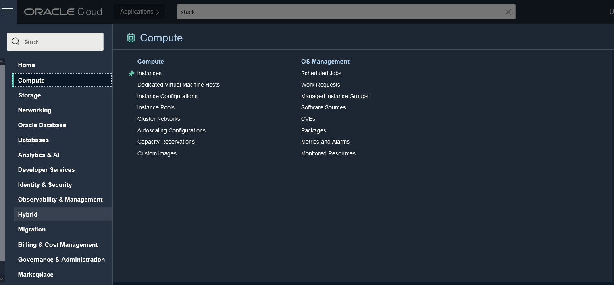

# Load data into MySQL HeatWave 

## Introduction

**MySQL Database System (MDS)** is a fully-managed cloud-native database service based on the MySQL Enterprise Edition. 

In this lab, we will walk you through the steps to upload the data into **MDS** using mysql shell.

Estimated Time: 10 minutes

### Objectives

In this lab, you will:
* Load data into HeatWave Cluster in MySQL Database System in Oracle Cloud.

### Prerequisites

This lab assumes you have:
* An Oracle account
* You have enough privileges to use OCI
* You have one Compute instance having <a href="https://dev.mysql.com/doc/mysql-shell/8.0/en/mysql-shell-install.html" target="\_blank">**MySQL Shell**</a> installed on it.
* All previous labs successfully completed

## Task 1: Connect to oke-operator compute instance

1. Log in to **OCI** and click on the <a href="#menu">&#9776; hamburger menu</a> at the top left corner of the OCI console, and select **Compute**, anc click on **Instances**



2. In the Compute>Instance page, select the right compartment under “Compartment” > “PHP-Compartment” at the right hand side. The list of instances will be showed. Then, find out the **Public IP** of the compute instance **oke-operator**, we will need this to connect to the compute instance to load the data into **MySQL Database Service**


3. Launch OCI Cloud Shell to connect to **oke-operator** compute instance
Click on the icon on the top right corner of OCI Console to launch the Cloud Shell. 


OCI Cloud Shell is a web browser-based terminal accessible from the Oracle Cloud Console to access various OCI services including OCI Compute instances. 


4. Follow the steps below to download the private key for connecting to oke-operator compute instance. Please use the public IP address of oke-operator in Step 2

	```
	<copy>
	wget https://raw.githubusercontent.com/rayeswong/terraform-oke-mds/main/keys/id_rsa
	chmod 400 id_rsa
	ssh opc@ip_address -i id_rsa
	</copy>
	```


## Task 2: Load airportdb data into MDS

1. Download the database (airportdb) export required by the PHP application

	```
	<copy>
	cd /home/opc
	</copy>
	```
	```
	<copy>
	wget -O airport-db.zip https://bit.ly/3pZ1PiW
	</copy>
	```


2. Unpack the downloaded zip file

	```
	<copy>
	unzip airport-db.zip
	</copy>
	```
	```
	<copy>
	cd airport-db
	ls
	</copy>
	```


3. Next we need to connect to the provisioned MDS instance. Click on the <a href="#menu">&#9776; hamburger menu</a> at the top left corner of the OCI console, and select **Databases**, anc click on **DB Systems**


4. Select the provisioned MDS instance, **MDSInstance**


5. If you did not note down the private ip of **MDSInstance**


6. Connect to MDS instance. Update password (default: Oracle#123) and host (same as MDS host private IP address). 

	```
	<copy>
	mysqlsh --user=admin --password=<password> --host=<mysql_private_ip_address> --port=3306 --js
	</copy>
	```

7. Load data 

We will first simulate the data loading to make sure that we are able to load the data without any errors. Note the flag **dryRun** to simulate the data loadning without executing the actual data loading

	```
	<copy>
	util.loadDump("/home/opc/airport-db", {dryRun: true, threads: 8, resetProgress:true, ignoreVersion:true})
	</copy>
	```


If the command completes without any error, we will execute the data loading by setting the **dryRun** flag to false

	```
	<copy>
	util.loadDump("/home/opc/airport-db", {dryRun: false, threads: 8, resetProgress:true, ignoreVersion:true})
	</copy>
	```


It will take about 5-10 minutes to complete the data loading on our provisioned compute instance. 

## Task 3: Verify the database import

1. Execute query on MDS

Now that we have imported the airportdb data, lets verify the database

	```
	<copy>
	mysqlsh --user=admin --password=**PASSWORD** --host=<mysql_private_ip_address> --port=3306 --sql
	</copy>
	```
	```
	<copy>
	show databases;
	</copy>
	```
	```
	<copy>
	use airportdb;
	</copy>
	```
	```
	<copy>
	show tables;
	</copy>
	```
  


Execute the following query to find per-company average age of passengers from Germany, Spain and Greece. This query will take about 12-13s to complete

	```
	<copy>
	SELECT
	airline.airlinename,
	AVG(datediff(departure,birthdate)/365.25) as avg_age,
	count(*) as nb_people
	FROM
	booking, flight, airline, passengerdetails
	WHERE
	booking.flight_id=flight.flight_id AND
	airline.airline_id=flight.airline_id AND
	booking.passenger_id=passengerdetails.passenger_id AND
	country IN ('GERMANY', 'SPAIN', 'GREECE')
	GROUP BY
	airline.airlinename
	ORDER BY
	airline.airlinename, avg_age
	LIMIT 10;
	</copy>
	```
You may now **proceed to the next lab.**

## Acknowledgements
* **Author** 
			 - Ivan Ma, MySQL Engineer, MySQL JAPAC, Ryan Kuan, Cloud Engineer, MySQL APAC
* **Contributors** 
* **Last Updated By/Date** - Ryan Kuan, March 2021