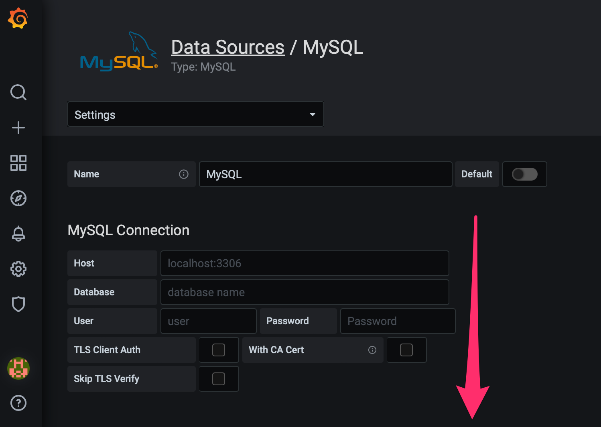
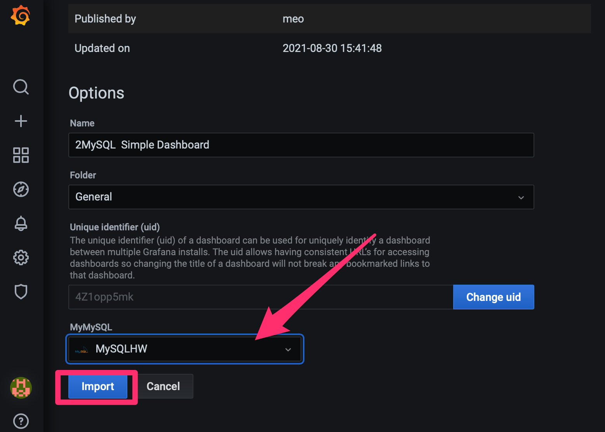
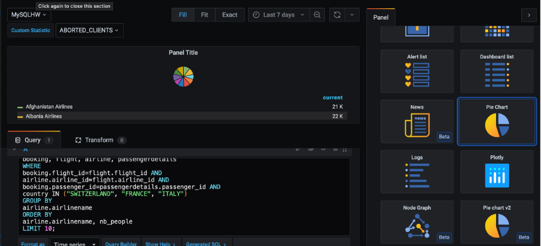
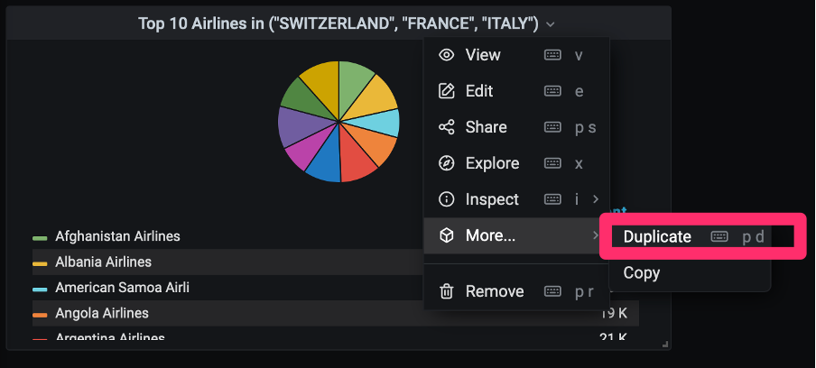
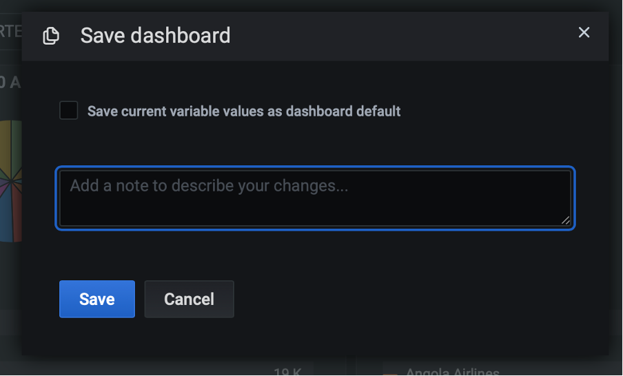
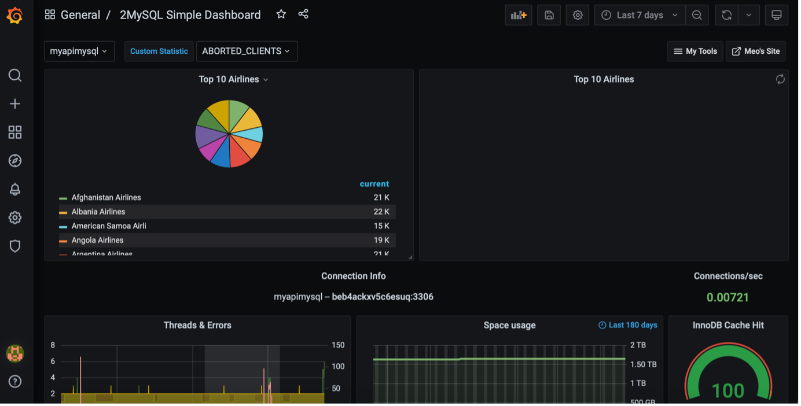

# Deploy Grafana dashboard

## Introduction

**Oracle Container Engine for Kubernetes (OKE)** is an Oracle-managed container orchestration service that can reduce the time and cost to build modern cloud native applications. Unlike most other vendors, Oracle Cloud Infrastructure provides Container Engine for Kubernetes as a free service that runs on higher-performance, lower-cost compute shapes.

In this lab, you will deploy the popular Grafana application to **OKE**, and connect it to **MySQL**.

Estimated Time: 15 minutes

### Objectives

In this lab, you will:

* Deploy Grafana application to OKE cluster
* Define MySQL Datasource
* Import MySQL Dashboard to Grafana
* Test the deployed Grafana applicationa against MySQL database

### Prerequisites

This lab assumes you have:

* An Oracle account
* You have enough privileges to use OCI
* OCI Resources required: HOL-compartment, OKE cluster, MySQL HeatWave

## Task 1: Verify OKE cluster

1. Click the **Hamburger Menu**  in the upper left, navigate to **Developer Services** and select **Kubernetes Cluster (OKE)**


2. Select the Compartment (e.g. HOL-Compartment) that you provisioned the OKE cluster, and verify that the status of OKE cluster **oke_cluster** is **Active**


## Task 2: Deploy Grafana to OKE

1. Connect to the **oke-operator** compute instance again using OCI Cloud Shell


2. Create 'grafana' namespace

```
<copy>
kubectl create ns grafana
</copy>
```


3. Deploy Grafana application with Load Balancer service

```
<copy>

cat << EOF | kubectl apply -n grafana -f -
---
apiVersion: v1
kind: PersistentVolumeClaim
metadata:
  name: grafana-pvc
spec:
  accessModes:
    - ReadWriteOnce
  resources:
    requests:
      storage: 1Gi
---
apiVersion: apps/v1
kind: Deployment
metadata:
  labels:
    app: grafana
  name: grafana
spec:
  selector:
    matchLabels:
      app: grafana
  template:
    metadata:
      labels:
        app: grafana
    spec:
      securityContext:
        fsGroup: 472
        supplementalGroups:
          - 0
      containers:
        - name: grafana
          image: grafana/grafana:7.5.2
          imagePullPolicy: IfNotPresent
          ports:
            - containerPort: 3000
              name: http-grafana
     protocol: TCP
          readinessProbe:
            failureThreshold: 3
            httpGet:
              path: /robots.txt
              port: 3000
              scheme: HTTP
            initialDelaySeconds: 10
            periodSeconds: 30
            successThreshold: 1
            timeoutSeconds: 2
          livenessProbe:
            failureThreshold: 3
            initialDelaySeconds: 30
            periodSeconds: 10
            successThreshold: 1
            tcpSocket:
              port: 3000
            timeoutSeconds: 1
          resources:
            requests:
              cpu: 250m
              memory: 750Mi
          volumeMounts:
            - mountPath: /var/lib/grafana
              name: grafana-pv
      volumes:
        - name: grafana-pv
          persistentVolumeClaim:
            claimName: grafana-pvc
---
apiVersion: v1
kind: Service
metadata:
  name: grafana
spec:
  ports:
    - port: 3000
      protocol: TCP
      targetPort: http-grafana
  selector:
    app: grafana
  sessionAffinity: None
  type: LoadBalancer
EOF
</copy>
```

4. Check the status of pods and wait until all the pods are up and running

```
<copy>
 kubectl get all -n grafana
</copy>
```

5. Get the external IP address of your load balancer. Wait 30 seconds if the external IP address is not ready

```
<copy>
kubectl get service -n grafana --watch
</copy>
```

  Once you have the External IP provisioned, you can press **CTL+C** to terminate the command

## Task 3: Access Grafana dashboard

1. Open a browser and access your PHP application using the external IP address. (e.g. <http://xxx.xxx.xxx.xxx:3000/>). Login using admin/admin as username/password

    

2. You can change the password accordingly

    

## Task 4: Add MySQL data source

1. Select **Data Sources** from the **Settings** on the left menu

    

2. Click "**Add data source**" button
    

3. Enter **mysql** in the filter textbox to search for MySQL data source. Click on **Select** button on **MySQL** datasource
    

4. Fill in the **MySQL Connection** details with MySQL's IP address, port, username and password details
    

## Task 5: Execute dashboard script

1. Connect to the **oke-operator** compute instance using OCI Cloud Shell

 

2. Create my2 database for dashboard using script

    ```
    <copy>
    curl https://raw.githubusercontent.com/meob/my2Collector/master/my2_80.sql | sed 's/^set global/-- set global/g; s/^set sql_log/-- set sql_log/g' > my2_80.sql
    </copy>
    ```

3. Execute the my2 database script

    ```
    <copy>
    mysqlsh --sql -uadmin -p<password> -h<MDS IP> < my2_80.sql
    </copy>
    ```

## Task 6: Import MySQL dashboard

1. Choose "Import" from "+" left menu and specify **7991**, one of the sample dashboard available from grafana.com, and hit the **Load** button
 

2. Choose the datasource you created in Step 4 of Task 4, and click "Import"
 

3. Once the dashboard is imported, you can view the imported dashboard
 

## Task 7: Add panel widget to MySQL dashboard

1. Click on the **Add panel** icon in the dashboard
 

2. Click on 'Add an empty panel'
 

3. Click on the **Edit SQL** button
 

4. Paste the SQL text to the query text field and change the format to **Table**

 

 ```
 <copy>
 select mytable.schema_name, mytable.name, mytable_load.load_status, nrows, load_progress, QUERY_COUNT
 from performance_schema.rpd_tables mytable_load, performance_schema.rpd_table_id  mytable
 where mytable_load.id = mytable.id
 </copy>
 ```

5. Change the visualization to **Table** as shown and specify the the Panel title as **Table loaded to Heatwave**
 

6. Click "Apply" and return to dashboard
 

7. Finally, click the "Disk" icon to save
 

  You may now **proceed to the next lab.**

--

# Bonus section

## This is to create 2 panels to compare the performance using and not using Heatwave Engine for the aiportdb which has loaded seondary engine data - for country IN ("SWITZERLAND", "FRANCE", "ITALY")

1. The following SQL is used with SQL Hints  /*+ SET_VAR(use_secondary_engine=off)*/ to turn off secondary engine.  This indicates the SQL execution for purely InnoDB engine SELECT.

-- The now() as time column is added to allow grafana to do charting with time series.

```
SELECT /*+ SET_VAR(use_secondary_engine=off) */
now() as time, airline.airlinename,
count(*) as nb_people
FROM
booking, flight, airline, passengerdetails
WHERE
booking.flight_id=flight.flight_id AND
airline.airline_id=flight.airline_id AND
booking.passenger_id=passengerdetails.passenger_id AND
country IN ("SWITZERLAND", "FRANCE", "ITALY")
GROUP BY
airline.airlinename
ORDER BY
airline.airlinename, nb_people
LIMIT 10;
```

2. The following SQL is used with SQL Hints  /*+ SET_VAR(use_secondary_engine=off)*/ to turn on secondary engine.  This indicates the SQL execution on Heatwave if it is possible.

-- The now() as time column is added to allow grafana to do charting with time series.

```
SELECT /*+ SET_VAR(use_secondary_engine=on) */
now() as time, airline.airlinename,
count(*) as nb_people
FROM
booking, flight, airline, passengerdetails
WHERE
booking.flight_id=flight.flight_id AND
airline.airline_id=flight.airline_id AND
booking.passenger_id=passengerdetails.passenger_id AND
country IN ("SWITZERLAND", "FRANCE", "ITALY")
GROUP BY
airline.airlinename
ORDER BY
airline.airlinename, nb_people
LIMIT 10;
```

## Adding Chart with the SQL to Grafana

1. Click on the **Add panel** icon in the dashboard
 

2. Click on 'Add an empty panel'
 

3. Click on the **Edit SQL** button
 

4. Paste the SQL text to the query text field

```
<copy>
SELECT /*+ SET_VAR(use_secondary_engine=on) */
now() as time, airline.airlinename,
count(*) as nb_people
FROM
booking, flight, airline, passengerdetails
WHERE
booking.flight_id=flight.flight_id AND
airline.airline_id=flight.airline_id AND
booking.passenger_id=passengerdetails.passenger_id AND
country IN ("SWITZERLAND", "FRANCE", "ITALY")
GROUP BY
airline.airlinename
ORDER BY
airline.airlinename, nb_people
LIMIT 10;
</copy>
```

  

5. Change the Visualization settings using Pie Chart as shown
 

6. Click 'Apply' button at the right top meu
 

7. Switch back to the dashboard and from click on the panel and choose Duplicate a new one
 

8. Edit the Panel to change the SQL Hint with /*+ SET_VAR(use_secondary_engine=off)*/
 

9. Apply and switching back to the dashboard; Click Save icon to save the dashboard.
 

10. Refresh the browser page and notice the execution time for the pie chart.  
 

## Acknowledgements

* **Author**
  * Ivan Ma, MySQL Solution Engineer, MySQL APAC
  * Ryan Kuan, MySQL Cloud Engineer, MySQL APAC
* **Contributors**
  * Perside Foster, MySQL Solution Engineering
  * Rayes Huang, OCI Solution Specialist, OCI APAC

* **Last Updated By/Date** - Ryan Kuan, March 2022
