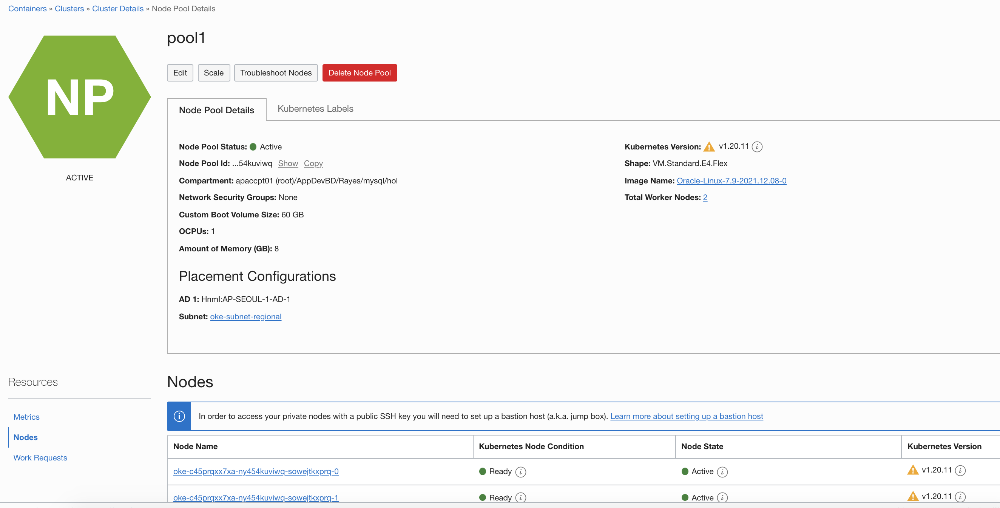
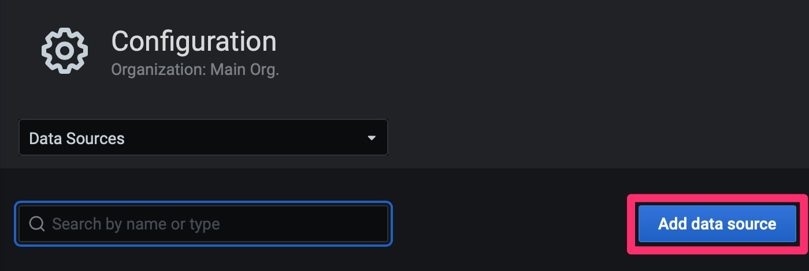

# Deploy PHP application to OCI Kubernetes

## Introduction

**Oracle Container Engine for Kubernetes (OKE)** is an Oracle-managed container orchestration service that can reduce the time and cost to build modern cloud native applications. Unlike most other vendors, Oracle Cloud Infrastructure provides Container Engine for Kubernetes as a free service that runs on higher-performance, lower-cost compute shapes. 

In this lab, you will deploy a Grafana application on **OKE**, and connect it to **MySQL**.

Estimated Time: 15 minutes

### Objectives

In this lab, you will:
* Deploy a Grafana application to the OKE cluster
* Define MySQL Datasource
* Import MySQL Dashboard to Grafana
* Test the deployed Grafana applicationa against MySQL database

### Prerequisites

This lab assumes you have:
* An Oracle account
* You have enough privileges to use OCI
* All previous labs successfully completed
* Resources Ready : HOL-compartment, OKE cluster, MySQL Database Service 


## Task 1: Verify OKE cluster

1. Click the **Navigation Menu** in the upper left, navigate to **Developer Services** and select **Kubernetes Cluster (OKE)**


2. Select the Compartment (e.g. HOL-Compartment) that you provisioned the OKE cluster, and verify that the status of OKE cluster 'oke_cluster' is Active


3. Click 'oke_cluster' to view the status of the OKE cluster and the worker nodes in your OKE cluster. You will deploy a PHP application to this OKE cluster soon.



## Task 2: Connect to **oke-operator** compute instance

1. Connect to the **oke-operator** compute instance again using OCI Cloud Shell

## Task 3: Deploy Application to OKE

1. Download yaml deployment file [grafana.yaml](grafana.yaml) to the operator VM.

```
<copy>
wget https://raw.githubusercontent.com/ivanxma/mysqlk8s/main/grafana/grafana.yaml
</copy>
```


3. Create Namespace and deploy grafna.yaml
	```
	<copy>
	kubectl create ns grafana
	kubectl apply -f grafana.yaml -n grafana
	</copy>
	```


4. Check the status of pods and wait until all pods are up and running

	```
	<copy>
	kubectl get all -n grafana
	</copy>
	```


5. Get the external IP address of your load balancer. Wait 30 seconds if the external IP address is not ready.

	```
	<copy>
	kubectl get service -n grafana --watch
	</copy>
	```

Once you have the External IP provisioned, you can execute CTL+C to kill the command


## Task 4: Access the Grafana Application 

1. Open a browser and access your PHP application using the external IP address. (e.g. http://xxx.xxx.xxx.xxx:3000/). 
You can login using admin/admin as username/password and change the password accordingly.

	

2. Add Datasource MySQL
* Select Datasource from Settings left menu


* Click "Add Data source" button


* Type in mysql in the filter textbox and click the MySQL Datasource


* Fill in the Datasource details based on the MDS ip/port and username/password details.


3. Import MySQL Dashboard
* Choose "Import" from "+" left menu and put in 7362 dashboard ID for import


* Choose the Datasource and click "Import"


4. Checking the Dashboard


You may now **proceed to the next lab.**

## Acknowledgements
* **Author** 
			 - Ivan Ma, MySQL Solution Engineer, MySQL APAC
			 - Ryan Kuan, Cloud Engineer, MySQL APAC
* **Contributors** 
			 - Perside Foster, MySQL Solution Engineering 
* **Last Updated By/Date** - Ivan Ma, March, 2022