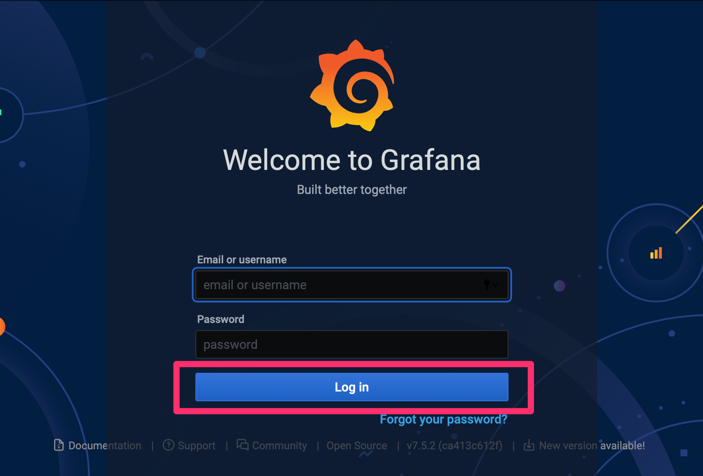
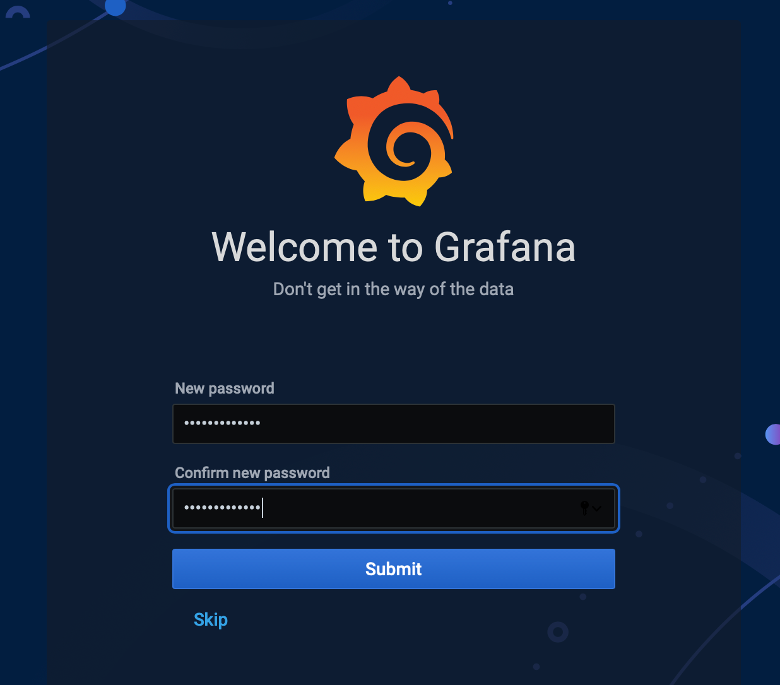
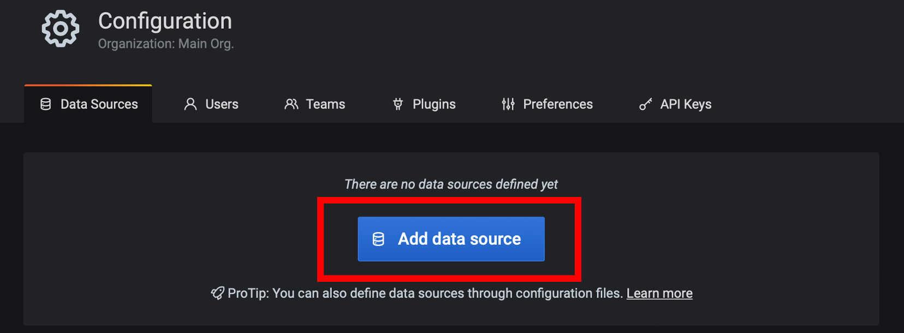
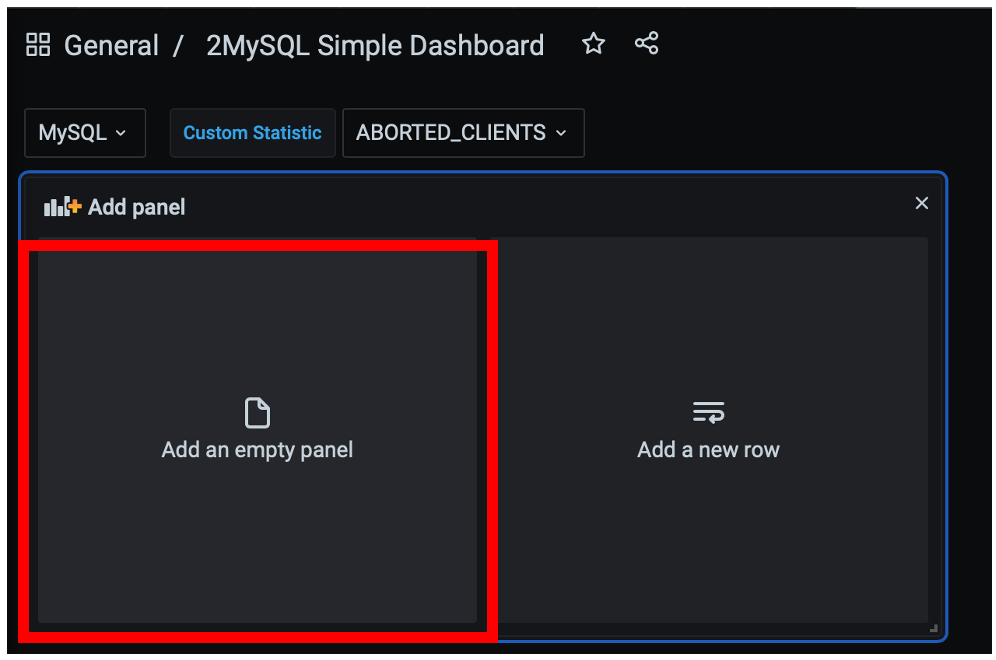
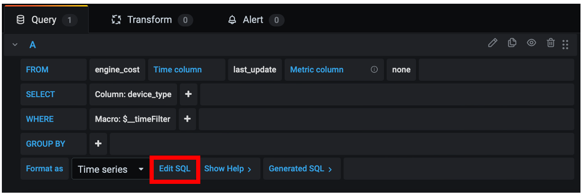

# Deploy Grafana Dashboard for MySQL to OCI Kubernetes

## Introduction

**Oracle Container Engine for Kubernetes (OKE)** is an Oracle-managed container orchestration service that can reduce the time and cost to build modern cloud native applications. Unlike most other vendors, Oracle Cloud Infrastructure provides Container Engine for Kubernetes as a free service that runs on higher-performance, lower-cost compute shapes. 

In this lab, you will deploy a Grafana application on **OKE**, and connect it to **MySQL**.

Estimated Time: 15 minutes

### Objectives

In this lab, you will:
* Deploy a Grafana application to the OKE cluster
* Define MySQL Datasource
* Import MySQL Dashboard to Grafana
* Test the deployed Grafana applicationa against MySQL database

### Prerequisites

This lab assumes you have:
* An Oracle account
* You have enough privileges to use OCI
* All previous labs successfully completed
* Resources Ready : HOL-compartment, OKE cluster, MySQL Database Service 


## Task 1: Verify OKE cluster

1. Click the **Navigation Menu** in the upper left, navigate to **Developer Services** and select **Kubernetes Cluster (OKE)**

    

2. Select the Compartment (e.g. HOL-Compartment) that you provisioned the OKE cluster, and verify that the status of OKE cluster 'oke_cluster' is Active

    

3. Click 'oke_cluster' to view the status of the OKE cluster and the worker nodes in your OKE cluster. You will deploy a PHP application to this OKE cluster soon.

    

## Task 2: Connect to **oke-operator** compute instance

1. Connect to the **oke-operator** compute instance again using OCI Cloud Shell

## Task 3: Deploy Application to OKE

1. Create Name Space 'grafana'

```
<copy>
kubectl create ns grafana
</copy>
```


3. Deploy grafna deployent with LoadBalancer service
```
<copy>
cat << EOF | kubectl apply -n grafana -f -

apiVersion: v1
kind: PersistentVolumeClaim
metadata:
  name: grafana-pvc
spec:
  accessModes:
    - ReadWriteOnce
  resources:
    requests:
      storage: 1Gi
---
apiVersion: apps/v1
kind: Deployment
metadata:
  labels:
    app: grafana
  name: grafana
spec:
  selector:
    matchLabels:
      app: grafana
  template:
    metadata:
      labels:
        app: grafana
    spec:
      securityContext:
        fsGroup: 472
        supplementalGroups:
          - 0
      containers:
        - name: grafana
          image: grafana/grafana:7.5.2
          imagePullPolicy: IfNotPresent
          ports:
            - containerPort: 3000
              name: http-grafana
              protocol: TCP
          readinessProbe:
            failureThreshold: 3
            httpGet:
              path: /robots.txt
              port: 3000
              scheme: HTTP
            initialDelaySeconds: 10
            periodSeconds: 30
            successThreshold: 1
            timeoutSeconds: 2
          livenessProbe:
            failureThreshold: 3
            initialDelaySeconds: 30
            periodSeconds: 10
            successThreshold: 1
            tcpSocket:
              port: 3000
            timeoutSeconds: 1
          resources:
            requests:
              cpu: 250m
              memory: 750Mi
          volumeMounts:
            - mountPath: /var/lib/grafana
              name: grafana-pv
      volumes:
        - name: grafana-pv
          persistentVolumeClaim:
            claimName: grafana-pvc
---
apiVersion: v1
kind: Service
metadata:
  name: grafana
spec:
  ports:
    - port: 3000
      protocol: TCP
      targetPort: http-grafana
  selector:
    app: grafana
  sessionAffinity: None
  type: LoadBalancer
EOF
</copy>
```


4. Check the status of pods and wait until all pods are up and running

```
<copy>
kubectl get all -n grafana
</copy>
```


5. Get the external IP address of your load balancer. Wait 30 seconds if the external IP address is not ready.

```
<copy>
kubectl get service -n grafana --watch
</copy>
```

Once you have the External IP provisioned, you can press **CTL+C** to terminate the command

## Task 4: Access the Grafana Application 

1. Open a browser and access your PHP application using the external IP address. (e.g. http://xxx.xxx.xxx.xxx:3000/). Login using admin/admin as username/password 

  

2. You can change the password accordingly
  
  
  
## Task 5: Add MySQL Datasource
1. Add Datasource MySQL
  - Select Datasource from Settings left menu 

  
  - and Click "Add Data source" button
  

  - Type in mysql in the filter textbox and click the MySQL Datasource
  

  - Fill in the Datasource details based on the MDS ip/port and username/password details.
  


## Task 6: MySQL Dashboard
1. Creating dashboard my2 database with script,  Login to the Cloud Shell and operator VM

  ```
  <copy>
  curl https://raw.githubusercontent.com/meob/my2Collector/master/my2_80.sql | sed 's/^set global/-- set global/g; s/^set sql_log/-- set sql_log/g' > my2_80.sql
  </copy>
  ```

2. Execute the creation my2 script
  ```
  <copy>
  mysqlsh --sql -uadmin -p<password> -h<MDS IP> < my2_80.sql
  </copy>
  ```

3. Import MySQL Dashboard
  - Choose "Import" from "+" left menu and put in 7991 dashboard ID for import
    

  - Choose the Datasource and click "Import"
    

2. Checking the Dashboard
    

## Task 7: Add heatwave table panel to MySQL Dashboard
1. Click on the add panel icon as shown
    

2. Click on 'Add Empty Panel' and the panel will show.  
    

Click on the **Edit SQL** button
    


3. Paste the SQL to the query text field and Change the format to **Table**.

```
<copy>
select mytable.schema_name, mytable.name, mytable_load.load_status, nrows, load_progress, QUERY_COUNT 
from performance_schema.rpd_tables mytable_load, performance_schema.rpd_table_id  mytable
where mytable_load.id = mytable.id
</copy>
```

  

4. Change the Visualization using Table as shown and putting the Panel title as "Table loaded to Heatwave"
  
    

5. Click "Apply" and return to dashboard
    

6. Finally click the "disk" icon to save
    


You may now **proceed to the next lab.**

## Acknowledgements
* **Author** 
      - Ivan Ma, MySQL Solution Engineer, MySQL APAC
      - Ryan Kuan, MySQL Cloud Engineer, MySQL APAC
* **Contributors** 

* **Last Updated By/Date** - Ivan Ma, March, 2022