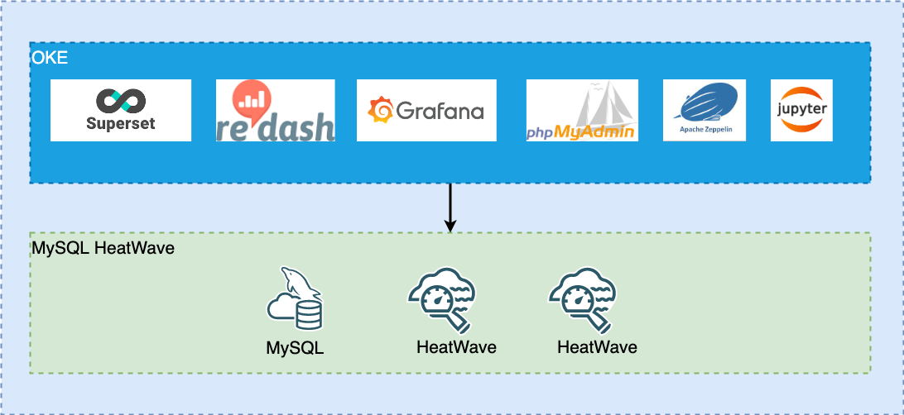

# Introduction

## About this Workshop

The main purpose of this workshop is to teach you how you can implement a cloud-native analytics solution using MySQL HeatWave and various popular open-source tools on Oracle Cloud Infrastructure (OCI). MySQL HeatWave is not only proven to accelerate your most complicated SQL queries with in-memory partitioning technology, but it is also enhanced with Oracle AutoML-based machine learning technology lately to add prediction capabilities to your applications.

We have selected a few popular open-source analytics tools such as Zeppelin, Jupyter, Superset, Redash and Grafana as part of this workshop to help you quickly experiment these tools with MySQL HeatWave on OCI, for example, building a sales performance dashboard with Superset, or exploring data with Zeppelin or Jupyter.

At the completion of this workshop, you will learn about

* how easy it is to use MySQL HeatWave to accelerate your analytics workloads without modifications to your SQL queries
* how quickly you can deploy and use your favorite open-source tools to work with MySQL HeatWave natively on OCI

Estimated Time: 90 minutes

### About Oracle MySQL Database Service

**Oracle MySQL Database Service** is a fully managed database service that lets developers quickly develop and deploy secure, cloud native applications using the world’s most popular open source database. MySQL Database Service is the only MySQL cloud service with an integrated, high performance, in-memory query accelerator—
**HeatWave**. It enables customers to run sophisticated analytics directly against their operational MySQL databases—eliminating the need for complex, time-consuming, and expensive data movement and integration with a separate analytics database. **HeatWave** accelerates MySQL performance by orders of magnitude for analytics and mixed workloads. Optimized for Oracle Cloud Infrastructure (OCI), MySQL Database Service is 100% built, managed, and supported by the OCI and MySQL engineering teams.

### About HeatWave

HeatWave is a distributed, scalable, shared-nothing, in-memory, hybrid columnar, query processing engine designed for extreme performance. It is enabled when you add a HeatWave cluster to a MySQL DB System. To know more about HeatWave Cluster <a href="https://dev.mysql.com/doc/heatwave/en/heatwave-introduction.html" target="\_blank">**Click Here**</a>

### Objectives

In this workshop, you will learn how to:

* Create Oracle Kubernetes Engine and MySQL HeatWave
* Load data into MySQL HeatWave
* Deploy selected analytics tools (Zeppelin, Jupyter, Superset, Redash, Grafana) to analyze data and build prediction model in MySQL HeatWave
* (Optional) Deploy phpMyAdmin tool to manage MySQL HeatWave

The following diagram illustrates all the components deployed on OCI when you completed the workshop

### Prerequisites (Optional)

* You have an Oracle account
* You have enough privileges to use OCI

## Acknowledgements

* **Author**
	* Ivan Ma, MySQL Solutions Engineer, MySQL Asia Pacific
	* Ryan Kuan, MySQL Cloud Engineer, MySQL Asia Pacific
* **Contributors**
	* Perside Foster, MySQL Solution Engineering North America
	* Rayes Huang, OCI Solution Specialist, OCI Asia Pacific

* **Last Updated By/Date** - Ryan Kuan, May 2022
