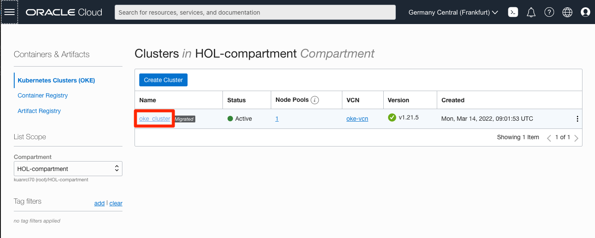
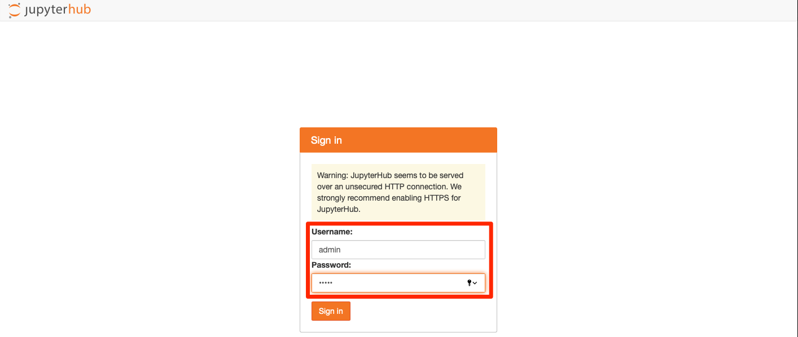
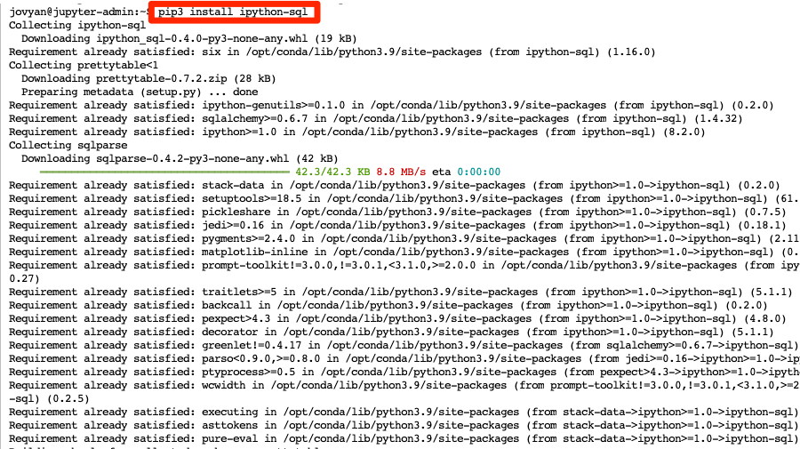
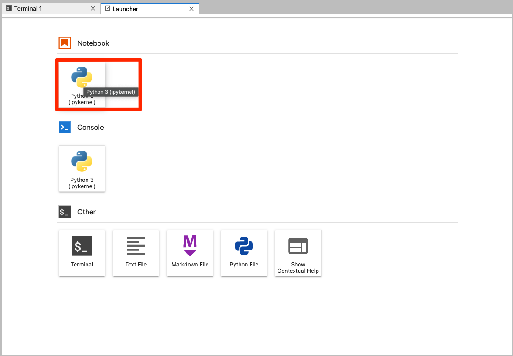
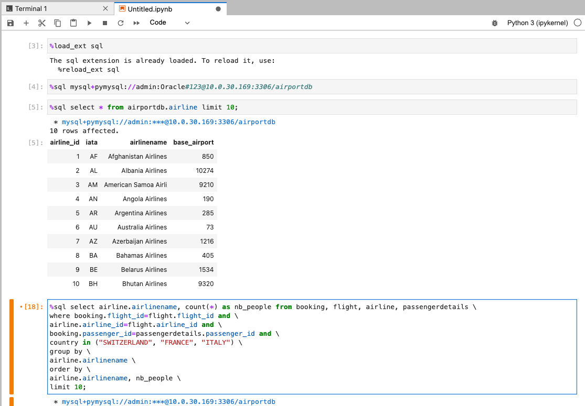

# Deploy Jupyter notebook

## Introduction

In this lab, we will deploy a very popular open-source tool, <a href="https://www.jubyterlab.org/", target="\_blank">Jupyter notebook</a> to OKE to analyze data in MySQL HeatWave

Estimated Time: 15 minutes

### Objectives

In this lab, you will:

* Create a Kubernetes namespace for phpMyAdmin
* Deploy Jupyter notebook to OKE
* Analyze data in MySQL HeatWave

### Prerequisites (Optional)

* You have an Oracle account
* You have enough privileges to use OCI
* OCI Resource required: HOL-compartment, OKE Cluster, MySQL HeatWave

## Task 1: Verify OKE cluster

1. Click the **Hamburger Menu**  in the upper left, navigate to **Developer Services** and select **Kubernetes Cluster (OKE)**

    

2. Select the Compartment (e.g. HOL-Compartment) that you provisioned the OKE cluster, and verify the status of **oke_cluster** is **Active**

    

## Task 2: Deploy Jupyter to OKE

1. Connect to the **oke-operator** compute instance using OCI Cloud Shell

	

2. Install the helm client

	>**Note** Skip this step if you have installed helm client
	
	```
<copy>
curl -fsSL https://raw.githubusercontent.com/helm/helm/main/scripts/get-helm-3 |bash -
</copy>
```

3. Create the namespace in OKE

	```
<copy>
kubectl create ns jhub
</copy>
```

4. Add Jupyter repository using helm

	```
<copy>
helm repo add jupyterhub https://jupyterhub.github.io/helm-chart/
</copy>
```
	```
<copy>
helm repo update
</copy>
```

5. Install Jupyter using helm

	```
<copy>
helm upgrade --install jhub jupyterhub/jupyterhub --namespace jhub
</copy>
```

	> **Note** JupyterHub is multi-user environment to host Jupyter notebook. By default, helm will the latest stable version of JupyterHub with the classic Jupyter notebook UI. If you want to try out the latest JupyterLab notebook, specify the development release of JupyterHub using the specifiy <a href="https://jupyterhub.github.io/helm-chart/", target="\_black">helm version</a> as shown in the following example:
	```
	<copy>
	helm upgrade --install jhub jupyterhub/jupyterhub --namespace jhub --version=1.1.3-n410.hd8ae7348
	</copy>
	```

6. Retrieve the public IP of the deployed Jupyter notebook

	```
<copy>
kubectl -n jhub get svc proxy-public -o jsonpath='{.status.loadBalancer.ingress[].ip}'
</copy>
```

7. Access the deployed Jupyter application using your browser, http:://&lt;Jupyter&#95;Proxy&#95;PUBLIC&#95;IP&gt;/.

	Enter **admin/admin** to log into Jupyter notebook

	

	>Note: When you login to Jupyter for the first time, you will need to wait for Jupyter to complete a few setup task before you can start using it

## Task 3: Connect Jupyter to MySQL HeatWave

1. Open a new terminal in Jupyter

	

2. Install mysql connector using pip

	```
<copy>
pip3 install mysql-connector-python
</copy>
```
	

3. Install sql modules

	```
<copy>
pip3 install ipython-sql
</copy>
```
	

4. Install mysql modules

	```
<copy>
pip3 install pymysql
</copy>
```
	

	Click on the top left corner **jupyterhub** to go back to home page

5. Create a new notebook

	Click on File, New Launcher

	

	Click on Notebook

	

6. Execute SQL codes

	```sql
<copy>
%load_ext sql
</copy>
```
	
	```sql
<copy>
%sql mysql+pysql://admin:Oracle#123@<mysql_private_ip>/airportdb
</copy>
```

	```sql
<copy>
%sql select * from airport limit 10
</copy>
```

	```sql
<copy>
%sql select airline.airlinename, count(*) as nb_people from booking, flight, airline, passengerdetails \
where booking.flight_id=flight.flight_id and \
airline.airline_id=flight.airline_id and \
booking.passenger_id=passengerdetails.passenger_id and \
country in ("SWITZERLAND", "FRANCE", "ITALY") \
group by \
airline.airlinename \
order by \
airline.airlinename, nb_people \
limit 10;
</copy>
```
	

6. [Optional] Another way to access MySQL HeatWave using python

	```
<copy>
db = mysql.connector.connect(
   host="10.0.30.97",
   user="admin",
   passwd="Oracle#123"
)
print(db)
</copy>
```

	You may now **proceed to the next lab.**

## Acknowledgements

* **Author**
  * Ivan Ma, MySQL Solution Engineer, MySQL APAC
  * Ryan Kuan, MySQL Cloud Engineer, MySQL APAC
* **Contributors**
  * Perside Foster, MySQL Solution Engineering
  * Rayes Huang, OCI Solution Specialist, OCI APAC

* **Last Updated By/Date** - Ryan Kuan, March 2022
