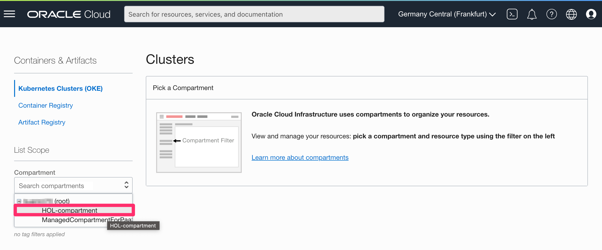
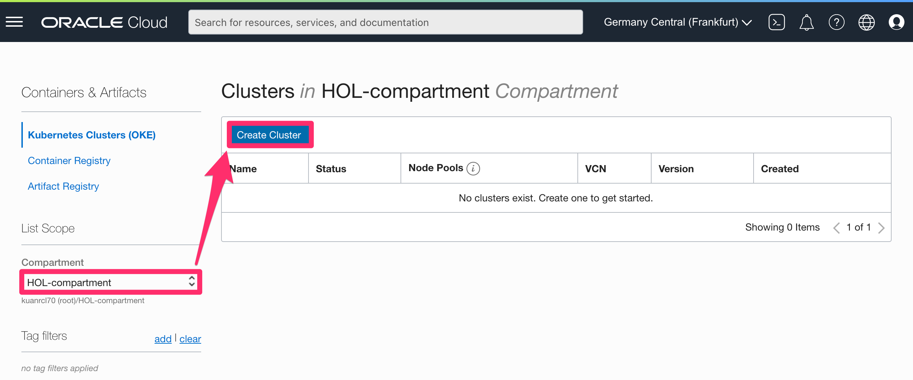
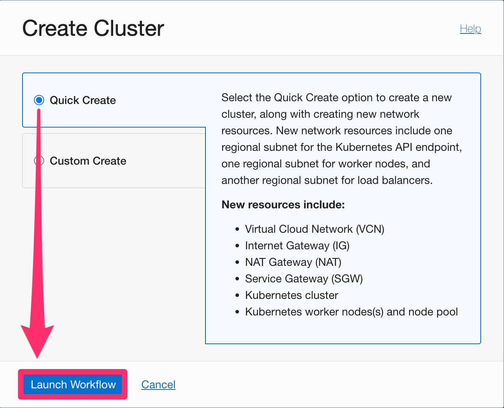
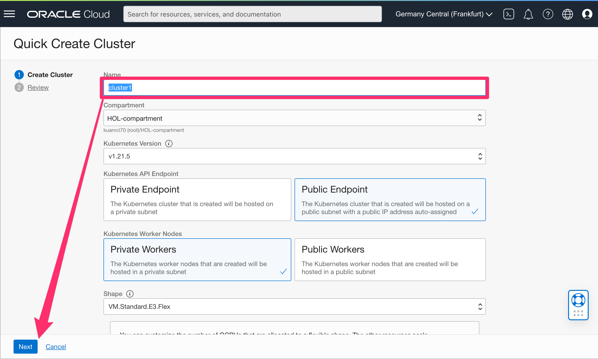
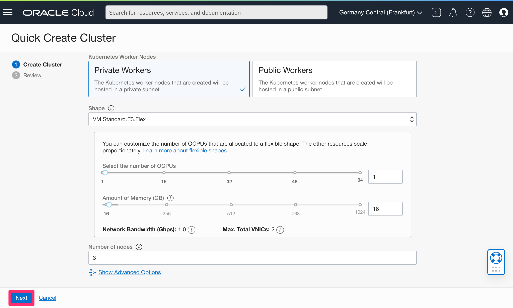

# Create Oracle Kubernetes Engine

## Introduction

**Oracle Container Engine for Kubernetes (OKE)** is an Oracle-managed container orchestration service that can reduce the time and cost to build modern cloud native applications. Unlike most other vendors, Oracle Cloud Infrastructure provides Container Engine for Kubernetes as a free service that runs on higher-performance, lower-cost compute shapes. 

In this lab, we will create a compartment for all the OCI resources required to host the various open-source tools, and create an OKE cluster

Estimated Time: 2 minutes

### Objectives

In this lab, you will:
* Create a compartment 
* Create an OKE cluster 

### Prerequisites

This lab assumes you have:
* An Oracle account
* You have enough privileges to use OCI
* All previous labs successfully completed

## Task 1: Create Compartment

1. Log in to **OCI** and click on the <a href="#menu">&#9776; hamburger menu</a> at the top left corner of the OCI console, and type **compartment** in the search box. Click on the **Compartments** in the search result

2. Specify the name of the compartment such as **HOL-Compartment** with a description, click on **Create Compartment**

## Task 2: Create OKE cluster

1. Log in to **OCI** and click on the <a href="#menu">&#9776; hamburger menu</a> at the top left corner of the OCI console, select **Developer Services**, and **Kubernetes Clusters (OKE)**

2. Select the **HOL-compartment** you created earlier

3. Make sure the **HOL-compartment** is selected, and click on **Create Cluster**

4. Select **Quick Create** to create OKE cluster. Please note that the **Quick Create** wizard will create a Virtual Cloud Network and an OKE cluster node pool with 3 compute instances

5. Specify a name for OKE cluster, for example, **cluster1**. Review the rest of the details, you can leave the defaults

6. You can review all the details of the OKE cluster

7. Once you have reviewed all the details, click on **Create** to start creating the OKE cluster

8. On the next screen, wait for all the tasks completed and click on **Close**

9. You should be redirected to the OKE page showing the creation prgroess of OKE cluster

10. You can also scroll down to the bottom of the page to check the progress details by selecting the "Work Request"

11. Select the **Work Request** to monitor the OKE creation progress. Once the cluster creation completes, you will see the completed status

You may now **proceed to the next lab.**

## Acknowledgements
* **Author** 
			 - Ivan Ma, MySQL Engineer, MySQL JAPAC, Ryan Kuan, Cloud Engineer, MySQL APAC
* **Contributors** 
* **Last Updated By/Date** - Ryan Kuan, March 2021